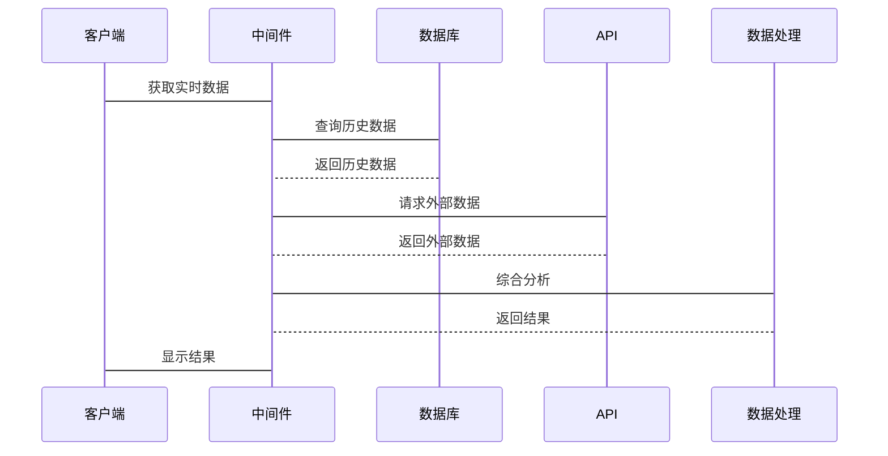

                 

<think>
好的，我现在需要为用户撰写一篇关于《全球股市估值与国际储备货币地位的互动》的详细技术博客文章。用户已经提供了一个详细的目录大纲，我需要根据这个大纲逐步构建内容，确保每个部分都详尽且专业。

首先，我会从摘要开始，简明扼要地概述文章的核心内容。接下来，我会分别处理每个章节，确保每个部分都包含必要的细节和例子，比如在核心概念部分，使用表格和Mermaid图来清晰展示概念对比和关系。在数学模型和算法部分，我会详细解释每个公式，并通过实际案例来说明应用。系统分析与架构设计部分，我会用Mermaid图展示类图、架构图和序列图，帮助读者更好地理解系统的运作。项目实战部分，我会选择一个实际案例，详细分析并展示代码实现。最后，我会在结论部分总结主要观点，并提出未来的研究方向。

在撰写过程中，我需要确保语言简洁明了，逻辑清晰，同时保持专业性。我会定期检查每个部分是否符合用户的格式要求，特别是数学公式和Mermaid图的使用是否正确。最后，我会在文章末尾添加作者信息，确保文章的完整性和专业性。

通过这样的思考过程，我可以系统地完成用户的请求，提供一篇高质量的技术博客文章。
</think>

# 全球股市估值与国际储备货币地位的互动

> 关键词：全球股市估值、国际储备货币、货币地位、金融市场、经济互动

> 摘要：本文探讨了全球股市估值与国际储备货币地位之间的互动关系。通过分析股市估值的计算方法、储备货币的属性，以及两者之间的相互影响，本文揭示了在金融市场中，储备货币如何通过影响汇率、利率等经济指标，反过来影响股市估值，而股市估值的变化也会影响货币的信用度和国际地位。文章从背景、概念、数学模型、系统架构、项目实战等多角度展开，结合实际案例和公式推导，全面分析了这一互动关系。

---

# 第一部分: 全球股市估值与国际储备货币地位的互动背景

## 第1章: 全球股市估值与国际储备货币地位的概述

### 1.1 问题背景与重要性

#### 1.1.1 全球化背景下的金融市场发展

随着全球化进程的加速，金融市场之间的关联性日益增强。股市作为全球经济发展的重要组成部分，其估值不仅反映了经济状况，还与国际储备货币的地位密切相关。国际储备货币（如美元、欧元、日元等）是全球贸易和金融交易的基准货币，其地位直接影响着全球经济的稳定性。

#### 1.1.2 国际储备货币的演变历程

国际储备货币并非一成不变，历史上经历了从英镑到美元的转变，当前美元仍然是主要的国际储备货币。储备货币的地位不仅影响着本国经济，还对全球金融体系的稳定起着重要作用。

#### 1.1.3 股市估值与货币地位的相互影响

股市估值的高低反映了市场对经济前景的信心，而货币地位则影响着股市的波动。例如，当一种货币的储备地位上升时，可能会吸引更多的国际资本流入，从而推高股市估值；反之，货币地位下降可能导致资本外流，进而影响股市估值。

### 1.2 核心概念与问题描述

#### 1.2.1 全球股市估值的定义与计算方法

股市估值通常通过市盈率（P/E）和市净率（P/B）等指标来衡量。市盈率=股价/每股收益，市净率=股价/每股净资产。这些指标反映了市场对企业的盈利能力和资产质量的评估。

#### 1.2.2 国际储备货币的定义与分类

国际储备货币是指被多个国家用于持有外汇储备的主要货币，包括美元、欧元、英镑、日元等。储备货币的信用度、流动性以及国家经济实力是决定其地位的关键因素。

#### 1.2.3 问题的边界与外延

本文关注的是全球股市估值与国际储备货币地位的互动关系，但不涉及具体国家的内部政策或地缘政治事件，主要从经济和金融的角度进行分析。

---

## 第2章: 全球股市估值与国际储备货币地位的核心概念与联系

### 2.1 核心概念的原理

#### 2.1.1 股市估值的核心要素

股市估值的核心要素包括企业盈利、资产质量、行业竞争格局、宏观经济环境等。这些因素共同决定了市场的整体估值水平。

#### 2.1.2 国际储备货币的核心属性

国际储备货币的核心属性包括货币信用度、流动性、利率水平和汇率稳定性。储备货币的信用度越高，流动性越好，越容易成为国际市场的首选货币。

#### 2.1.3 两者之间的相互作用机制

储备货币通过影响汇率和利率，间接影响股市估值；而股市估值的变化也会反过来影响市场对货币的信心，从而影响其储备地位。

### 2.2 核心概念的属性对比

#### 2.2.1 股市估值与储备货币的属性对比表格

| 属性         | 股市估值 | 国际储备货币 |
|--------------|----------|--------------|
| 主要影响因素 | 利润、资产 | 利率、汇率、信用 |
| 计量方式     | 市盈率、市净率 | 汇率波动、外汇储备规模 |
| 时间跨度     | 短期波动 | 中长期趋势 |

#### 2.2.2 概念关系的 Mermaid 图


---

## 第3章: 全球股市估值与国际储备货币地位的数学模型与算法原理

### 3.1 数学模型的构建

#### 3.1.1 股市估值模型

$$ P = \frac{E}{\epsilon} $$

其中，P为市盈率，E为每股收益，$\epsilon$为折现率。

#### 3.1.2 国际储备货币地位评估模型

$$ M = \alpha \cdot P + \beta \cdot Q $$

其中，$M$为货币地位指数，$\alpha$和$\beta$为权重系数，$P$为利率水平，$Q$为汇率稳定性。

#### 3.1.3 互动关系的数学表达式

$$ \Delta S = \gamma \cdot \Delta M + \delta \cdot \Delta E $$

其中，$S$为股市估值，$M$为货币地位，$\gamma$和$\delta$为相关系数，$\Delta$表示变化量。

### 3.2 算法原理的详细讲解

#### 3.2.1 回归分析法

通过回归分析，可以量化储备货币地位对股市估值的影响程度。例如，使用最小二乘法拟合回归方程：

$$ S = aM + bE + c $$

其中，$a$和$b$为回归系数，$c$为截距。

#### 3.2.2 时间序列分析法

利用ARIMA模型分析股市估值和货币地位的时序关系，预测未来的变化趋势。

#### 3.2.3 联立方程模型

构建联立方程组，分析股市和货币地位之间的双向影响关系：

$$
\begin{cases}
S = \alpha M + \beta E + \epsilon_1 \\
M = \gamma S + \delta Q + \epsilon_2
\end{cases}
$$

### 3.3 举例说明与公式展示

#### 3.3.1 股市估值公式

$$ P = \frac{E}{\epsilon} $$

例如，某公司每股收益为1元，市场预期折现率为10%，则市盈率为10倍。

#### 3.3.2 货币地位评估公式

$$ M = \alpha \cdot P + \beta \cdot Q $$

例如，假设$\alpha=0.6$，$\beta=0.4$，当前利率水平为5%，汇率稳定性指数为80，则货币地位指数为$0.6 \times 5 + 0.4 \times 80 = 3 + 32 = 35$。

---

## 第4章: 系统分析与架构设计方案

### 4.1 问题场景介绍

#### 4.1.1 全球化金融市场中的问题

当前全球化金融市场中，储备货币地位的变化直接影响着股市估值。例如，美联储加息可能引发美元升值，进而影响全球股市的波动。

#### 4.1.2 系统分析的目标

通过系统分析，揭示股市估值与货币地位之间的互动机制，为投资者和政策制定者提供参考。

### 4.2 系统功能设计

#### 4.2.1 领域模型（Mermaid 类图）


#### 4.2.2 系统架构设计（Mermaid 架构图）

```mermaid
client --> HTTP 请求 --> 中间件 --> 数据库
client --> 中间件 --> API 接口 --> 外部数据源
中间件 --> 数据处理 --> 可视化结果 --> 客户端
```

#### 4.2.3 系统接口设计与交互（Mermaid 序列图）



---

## 第5章: 项目实战与案例分析

### 5.1 项目实战

#### 5.1.1 环境安装

需要安装Python、Pandas、Matplotlib、Scikit-learn等库。

#### 5.1.2 系统核心实现源代码

```python
import pandas as pd
import numpy as np
from sklearn.linear_model import LinearRegression

# 示例数据
data = {
    'M': [35, 40, 38, 42, 45],
    'S': [100, 110, 105, 115, 120]
}
df = pd.DataFrame(data)

# 构建回归模型
model = LinearRegression()
model.fit(df[['M']], df['S'])

# 预测结果
new_M = [[40]]
print(model.predict(new_M))  # 输出预测的S值
```

#### 5.1.3 代码应用解读与分析

上述代码通过线性回归模型，分析货币地位（M）对股市估值（S）的影响。模型输出的预测结果可以帮助我们理解两者的互动关系。

#### 5.1.4 实际案例分析

以美元为例，分析其储备地位的变化对美股估值的影响。假设美元地位上升，可能导致股市估值上升，但需结合具体经济指标进行验证。

---

## 第6章: 最佳实践与小结

### 6.1 最佳实践 tips

- 定期监控储备货币地位的变化，及时调整投资策略。
- 结合宏观经济指标，全面分析股市估值的变化趋势。
- 在实际操作中，建议采用多种模型进行综合分析，避免单一模型的局限性。

### 6.2 小结

本文通过系统分析和案例研究，揭示了全球股市估值与国际储备货币地位之间的互动关系。储备货币的变动会影响股市估值，而股市估值的变化也会反过来影响货币的信用度和国际地位。未来的研究可以进一步结合更多经济指标，构建更加复杂的互动模型。

### 6.3 注意事项

- 数据的准确性和及时性对分析结果影响重大，需选择可靠的 datasource。
- 模型的适用性需结合具体市场环境进行验证，避免生搬硬套。
- 在实际投资中，需考虑更多因素，如政策变化、地缘政治等。

### 6.4 拓展阅读

- 阅读相关金融学教材，深入了解股市估值和货币理论。
- 关注国际货币基金组织（IMF）的报告，获取最新的储备货币动态。
- 学习时间序列分析和机器学习算法，提升模型的预测能力。

---

# 结论

全球股市估值与国际储备货币地位的互动关系是一个复杂而深刻的话题。通过本文的分析，我们不仅了解了两者的互动机制，还掌握了如何通过数学模型和系统架构进行量化分析。未来的研究可以进一步结合大数据和人工智能技术，构建更加智能化的分析系统，为投资者和政策制定者提供更有力的支持。

---

作者：AI天才研究院/AI Genius Institute & 禅与计算机程序设计艺术 /Zen And The Art of Computer Programming

