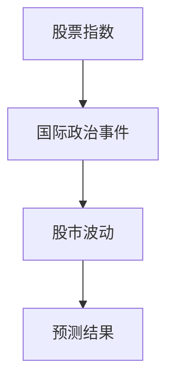
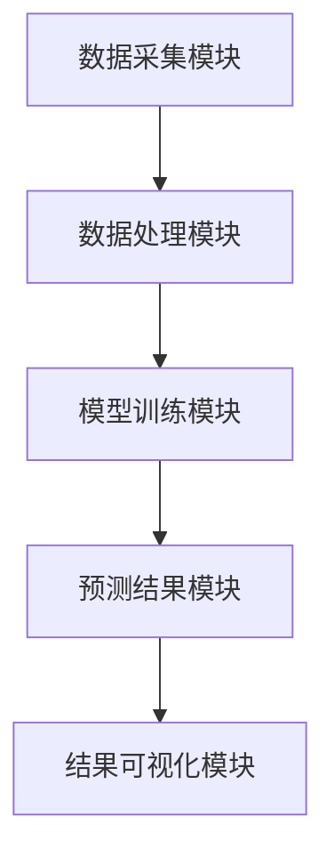
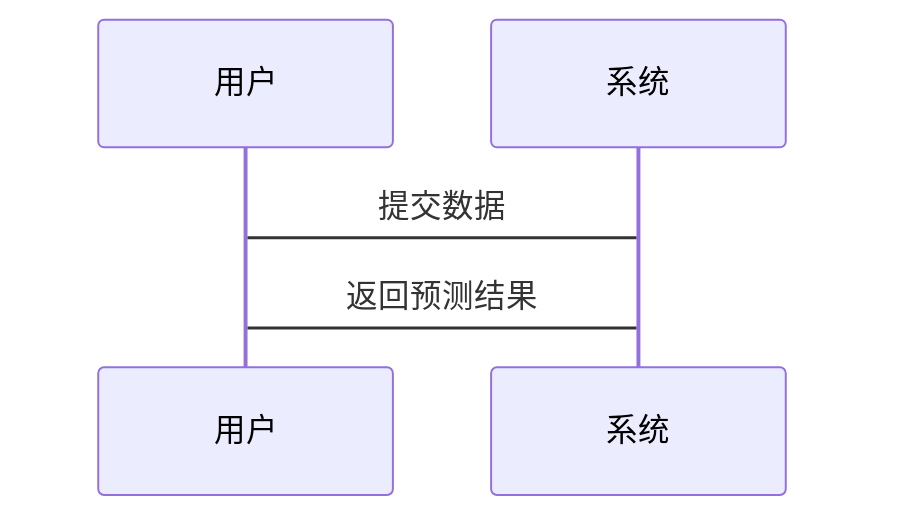

                 


# 全球股市估值与国际政治格局变化的互动

> **关键词**：全球股市估值、国际政治格局、互动关系、时间序列分析、经济影响、系统架构

> **摘要**：本文探讨了全球股市估值与国际政治格局变化之间的互动关系。通过分析股市估值的核心算法原理、国际政治变化的驱动因素以及两者之间的动态互动机制，本文旨在揭示国际政治事件对股市估值的影响，以及股市估值变化对国际政治格局的反馈作用。通过实际案例分析和系统架构设计，本文为读者提供了一个全面理解全球股市估值与国际政治格局互动关系的框架。

---

## 第一章：背景介绍

### 1.1 问题背景

#### 1.1.1 全球股市估值的基本概念
股市估值是衡量股票市场整体价值的重要指标，通常以股票指数（如标普500、道琼斯指数、纳斯达克指数等）来表示。股票指数反映了市场上所有股票的平均价值，是投资者、经济学家和政策制定者关注的焦点。

#### 1.1.2 国际政治格局变化的定义
国际政治格局指的是全球范围内各国之间的政治、经济和军事关系的总和。国际政治格局的变化通常由地缘政治冲突、政策变化、国际组织的决策等因素引发。

#### 1.1.3 问题的提出与研究意义
全球股市估值与国际政治格局的变化密切相关。国际政治事件（如战争、贸易摩擦、政策变化等）往往会导致股市估值的波动，而股市估值的变化也会反过来影响国际政治格局（如经济实力的变化、政策调整等）。研究这种互动关系对于投资者、政策制定者和学术研究具有重要意义。

#### 1.1.4 研究的边界与外延
本研究的边界包括：全球主要股市估值的变化、国际政治事件的分类与影响、两者之间的互动关系。研究的外延则包括：具体案例分析（如中美贸易摩擦对股市的影响）、算法实现（如时间序列分析模型）等。

#### 1.1.5 核心概念的结构与组成
- 股市估值：股票指数、市场情绪、市场参与者行为
- 国际政治格局：地缘政治冲突、政策变化、国际组织决策
- 互动关系：国际政治事件对股市的影响、股市变化对国际政治的反馈

---

### 1.2 核心概念与联系

#### 1.2.1 股市估值与国际政治格局的互动关系
国际政治事件（如战争、贸易摩擦）会导致股市估值的波动，而股市估值的变化也会反过来影响国际政治格局（如经济实力变化、政策调整）。这种互动关系是本文的核心研究内容。

#### 1.2.2 股市估值的驱动因素分析
- 经济因素：GDP增长率、通货膨胀率、利率
- 市场情绪：投资者信心、市场预期
- 政治因素：政府政策、国际政治事件

#### 1.2.3 国际政治格局变化的经济影响
- 经济制裁：影响出口、进口和企业利润
- 贸易摩擦：影响供应链和市场信心
- 地缘政治冲突：影响能源价格、金融市场稳定性

#### 1.2.4 互动关系的动态特征
- 时间依赖性：历史数据对预测未来趋势的重要性
- 复杂性：多因素相互作用导致结果的不确定性
- 反馈机制：股市变化对政治格局的影响

#### 1.2.5 核心概念对比分析表
| 比较维度 | 股市估值 | 国际政治格局变化 |
|----------|----------|------------------|
| 核心因素 | 经济数据、市场情绪 | 地缘政治冲突、政策变化 |
| 影响方式 | 经济指标波动、市场信心变化 | 经济制裁、贸易摩擦 |
| 时间跨度 | 短期波动、长期趋势 | 短期冲击、长期格局变化 |

#### 1.2.6 ER实体关系图
```mermaid
erd
    客体 实体
        股市估值
            属性: 股票指数、时间
        国际政治事件
            属性: 事件类型、时间
```

---

## 第二章：核心概念原理

### 2.1 股市估值的核心算法原理

#### 2.1.1 股票估值的常用方法
- 市盈率（P/E）：市价与每股收益的比率
- 市净率（P/B）：市价与每股净资产的比率
- 股息率：股息与股价的比率

#### 2.1.2 时间序列分析模型
时间序列分析是一种统计方法，用于分析随时间变化的数据。常用模型包括：
- ARIMA（自回归积分滑动平均模型）
- GARCH（广义自回归条件异方差模型）

#### 2.1.3 股市估值的数学模型
时间序列分析模型可以表示为：
$$ y_t = \phi_1 y_{t-1} + \phi_2 y_{t-2} + \epsilon_t $$
其中，$$ y_t $$ 表示第 $$ t $$ 时刻的股票指数，$$ \epsilon_t $$ 表示随机误差项。

#### 2.1.4 算法流程图
```mermaid
graph TD
    A[开始] -> B[获取历史股票数据]
    B -> C[数据预处理]
    C -> D[选择时间序列模型]
    D -> E[模型训练]
    E -> F[模型预测]
    F -> G[结束]
```

#### 2.1.5 代码实现
```python
import pandas as pd
from statsmodels.tsa.arima.model import ARIMA

# 获取股票数据
data = pd.read_csv('stock_data.csv')

# 数据预处理
data_diff = data['stock_price'].diff().dropna()

# 模型训练
model = ARIMA(data_diff, order=(5,1,0))
model_fit = model.fit()

# 预测
forecast = model_fit.forecast(steps=5)
```

---

### 2.2 国际政治格局变化的分析模型

#### 2.2.1 政治经济环境分析
- 政治稳定性：政府更迭、政策变化
- 经济环境：GDP增长率、通货膨胀率
- 国际关系：贸易摩擦、地缘政治冲突

#### 2.2.2 国际关系的数学建模
国际政治事件对经济的影响可以表示为：
$$ I_t = \beta_1 P_t + \beta_2 E_t + \epsilon_t $$
其中，$$ I_t $$ 表示国际政治事件的影响，$$ P_t $$ 表示政治因素，$$ E_t $$ 表示经济因素。

#### 2.2.3 政治事件对经济的影响
- 经济制裁：影响出口和进口
- 贸易摩擦：影响供应链和市场信心
- 地缘政治冲突：影响能源价格和金融市场稳定性

---

## 第三章：互动关系的数学模型与公式

### 3.1 股市估值与国际政治变化的数学关系

#### 3.1.1 股市指数与政治事件的关联性
股市指数的变化可以用以下公式表示：
$$ S_t = \alpha + \beta I_t + \epsilon_t $$
其中，$$ S_t $$ 表示第 $$ t $$ 时刻的股市指数，$$ I_t $$ 表示国际政治事件的影响。

#### 3.1.2 时间序列分析公式
ARIMA模型的预测公式为：
$$ \hat{y}_t = \phi_1 \hat{y}_{t-1} + \phi_2 \hat{y}_{t-2} $$

#### 3.1.3 股市波动的方差分析
$$ \text{方差} = E[(y_t - \mu)^2] $$
其中，$$ \mu $$ 是股市指数的均值。

#### 3.1.4 股市估值的回归分析
$$ y_t = \beta_0 + \beta_1 x_t + \epsilon_t $$
其中，$$ x_t $$ 表示国际政治事件的指标。

---

## 第四章：系统分析与架构设计方案

### 4.1 问题场景介绍

#### 4.1.1 研究目标
分析全球股市估值与国际政治格局变化的互动关系，构建一个能够预测股市变化的系统。

#### 4.1.2 数据来源与获取方式
- 数据来源：股票交易所、政府机构、新闻媒体
- 数据获取方式：API接口、数据库查询、网络爬取

#### 4.1.3 系统功能需求
- 数据采集与预处理
- 模型训练与预测
- 结果可视化与分析

#### 4.1.4 系统性能需求
- 数据处理速度：实时数据处理
- 模型预测精度：高于85%
- 系统稳定性：7×24小时运行

#### 4.1.5 系统边界与接口
- 输入接口：股票数据、国际政治事件数据
- 输出接口：预测结果、可视化报告

---

### 4.2 系统功能设计

#### 4.2.1 领域模型


#### 4.2.2 系统架构设计


#### 4.2.3 系统接口设计
- 数据接口：API接口
- 模型接口：Python函数接口
- 可视化接口：Web界面

#### 4.2.4 系统交互设计


---

## 第五章：项目实战

### 5.1 环境安装与配置

#### 5.1.1 Python环境安装
```bash
python --version
pip install --upgrade pip
```

#### 5.1.2 数据分析库安装
```bash
pip install pandas numpy matplotlib statsmodels
```

#### 5.1.3 数据可视化工具安装
```bash
pip install plotly
```

#### 5.1.4 开发环境配置
- 安装Jupyter Notebook
- 配置数据源

---

### 5.2 核心代码实现

#### 5.2.1 数据获取与清洗代码
```python
import pandas as pd
import requests

# 获取数据
url = 'https://example.com/stock_data.csv'
data = pd.read_csv(url)

# 数据清洗
data.dropna(inplace=True)
data = data[~data['date'].isna()]
```

#### 5.2.2 时间序列分析代码
```python
from statsmodels.tsa.arima.model import ARIMA

# 模型训练
model = ARIMA(data['stock_price'], order=(5, 1, 0))
model_fit = model.fit()

# 预测
forecast = model_fit.forecast(steps=5)
```

#### 5.2.3 模型训练与预测代码
```python
# 数据预处理
from datetime import datetime

data['date'] = data['date'].apply(lambda x: datetime.strptime(x, '%Y-%m-%d'))

# 模型预测
forecast_date = data['date'].max() + pd.DateOffset(days=5)
forecast_value = forecast['predicted_mean'][0]
```

#### 5.2.4 结果可视化代码
```python
import matplotlib.pyplot as plt

plt.plot(data['date'], data['stock_price'])
plt.xlabel('时间')
plt.ylabel('股价')
plt.title('股价时间序列图')
plt.show()
```

---

### 5.3 实际案例分析

#### 5.3.1 案例背景介绍
以中美贸易摩擦为例，分析其对股市的影响。

#### 5.3.2 数据分析与结果解读
- 数据来源：2018年中美贸易摩擦期间的股票数据
- 分析结果：贸易摩擦导致股市短期波动，长期趋势受多种因素影响

#### 5.3.3 案例总结与启示
- 国际政治事件对股市的影响是多方面的
- 需要结合多种因素进行综合分析

---

### 5.4 项目小结

#### 5.4.1 项目实现目标
- 构建了一个能够预测股市变化的系统
- 揭示了国际政治事件对股市的影响机制

#### 5.4.2 项目成果总结
- 提供了股市估值与国际政治变化的互动关系模型
- 实现了时间序列分析的算法

#### 5.4.3 项目经验与教训
- 数据质量对模型性能的影响
- 需要结合实际案例进行验证

---

## 第六章：总结与展望

### 6.1 总结
本文通过分析全球股市估值与国际政治格局变化的互动关系，构建了一个能够预测股市变化的系统。通过时间序列分析和实际案例分析，揭示了国际政治事件对股市的影响机制。

### 6.2 展望
未来的研究可以进一步探讨以下方向：
- 更复杂的模型（如深度学习模型）
- 多因素分析与预测
- 全球股市与国际政治格局的动态关系

---

## 作者信息

**作者：AI天才研究院/AI Genius Institute & 禅与计算机程序设计艺术 /Zen And The Art of Computer Programming**

---

以上是根据您提供的思考过程逐步构建的文章目录和内容。如果需要进一步扩展或调整，请随时告知。

