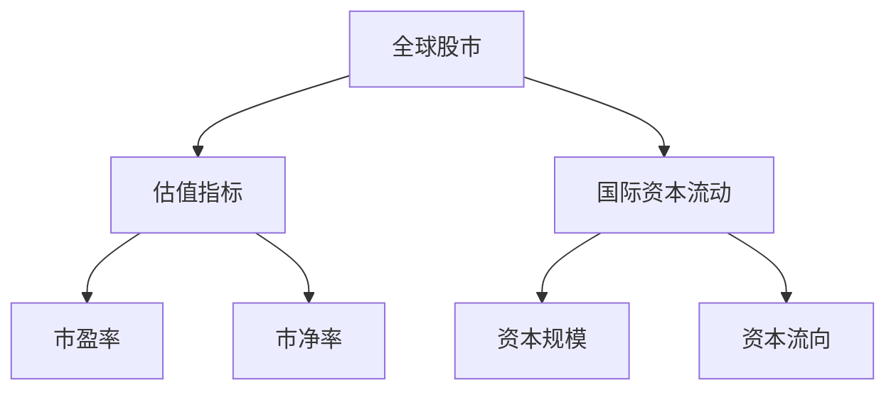
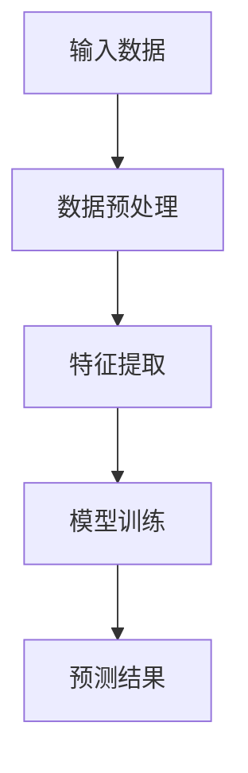
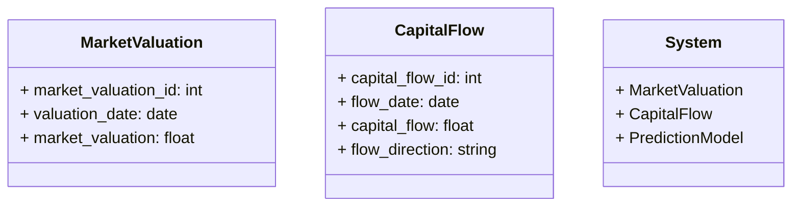
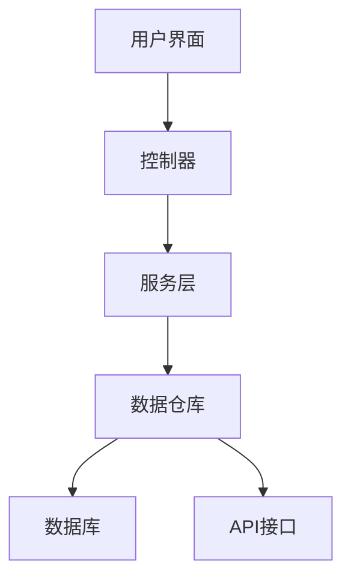

                 


```markdown
# 全球股市估值与国际资本流动的关系

> 关键词：全球股市估值，国际资本流动，资本流动，股市预测，金融模型

> 摘要：本文深入探讨了全球股市估值与国际资本流动之间的关系，从核心概念、算法原理、数学模型、系统架构设计、项目实战等多个维度进行详细分析。通过理论与实践相结合的方式，揭示了资本流动如何影响股市估值，并提供了一系列实用的分析工具和方法。

---

## 第一部分: 全球股市估值与国际资本流动的背景与核心概念

### 第1章: 背景介绍

#### 1.1 什么是全球股市估值
- 全球股市估值是衡量股市整体价值的重要指标，通常通过市盈率（P/E）、市净率（P/B）、股息率等指标来衡量。
- 示例：假设某国家的股市整体市盈率为15，意味着市场参与者认为该国企业的平均盈利倍数为15。

#### 1.2 什么是国际资本流动
- 国际资本流动是指资本从一个国家或地区流向另一个国家或地区的过程，包括直接投资、证券投资、银行借贷等形式。
- 示例：2020年全球资本流动规模达到$1.5万亿美元，其中$8000亿流入新兴市场。

#### 1.3 全球股市估值与国际资本流动的关系
- 问题背景：资本流动对股市估值的影响机制是什么？
- 问题描述：资本流入会推高股市估值，但具体影响程度如何？
- 问题解决：构建数学模型，量化资本流动对股市估值的影响。
- 边界与外延：本文仅关注国际资本流动对股市估值的直接影响，不考虑企业盈利变化的间接影响。
- 核心要素组成：资本流动规模、资本流动方向、股市估值指标。

### 第2章: 核心概念与联系

#### 2.1 核心概念原理
- 股市估值原理：基于市场参与者的风险偏好和对公司未来盈利的预期。
- 资本流动原理：基于全球资产配置、利差、汇率变化等因素。

#### 2.2 核心概念属性对比
| 比较维度       | 全球股市估值               | 国际资本流动               |
|----------------|--------------------------|---------------------------|
| 核心指标       | 市盈率（P/E）、市净率（P/B） | 资本流入规模、资本流向     |
| 主要影响因素   | 利率、企业盈利、市场情绪   | 利率差异、汇率、资产回报率 |
| 时间跨度       | 日度、周度、月度          | 日度、周度、月度           |

#### 2.3 ER实体关系图


---

## 第二部分: 算法原理与数学模型

### 第3章: 算法原理讲解

#### 3.1 算法原理
- 股市估值预测算法：基于历史资本流动数据，预测未来股市估值的变化。
- 资本流动预测算法：基于经济指标和市场情绪，预测未来资本流动的方向和规模。

#### 3.2 算法流程图


#### 3.3 Python源代码实现
```python
import pandas as pd
from sklearn.linear_model import LinearRegression

# 示例代码：简单线性回归模型预测股市估值
data = pd.DataFrame({
    'capital_flow': [100, 200, 300, 400],
    'market_valuation': [50, 100, 150, 200]
})

model = LinearRegression()
model.fit(data[['capital_flow']], data['market_valuation'])
print("预测的市场估值:", model.predict([[250]]))
```

### 第4章: 数学模型

#### 4.1 线性回归模型
- 模型公式：
  $$ y = \beta_0 + \beta_1 x + \epsilon $$
  其中，$y$ 是市场估值，$x$ 是资本流动规模，$\epsilon$ 是误差项。

#### 4.2 多元回归模型
- 模型公式：
  $$ y = \beta_0 + \beta_1 x_1 + \beta_2 x_2 + \epsilon $$
  其中，$x_1$ 是资本流动规模，$x_2$ 是资本流动方向（虚拟变量）。

---

## 第三部分: 系统分析与架构设计

### 第5章: 系统分析与架构设计

#### 5.1 问题场景介绍
- 项目目标：构建一个实时监测和预测系统，分析国际资本流动对全球股市估值的影响。
- 项目范围：涵盖主要经济体的股市和资本流动数据。

#### 5.2 系统功能设计


#### 5.3 系统架构设计


---

## 第四部分: 项目实战

### 第6章: 项目实战

#### 6.1 环境安装
```bash
pip install pandas numpy scikit-learn
```

#### 6.2 系统核心实现源代码
```python
import pandas as pd
from sklearn.linear_model import LinearRegression

# 数据加载
data = pd.read_csv('capital_flow_market_valuation.csv')

# 数据预处理
data['flow_direction'] = data['capital_flow'].apply(lambda x: 'inflow' if x > 0 else 'outflow')

# 特征提取
features = data[['capital_flow', 'flow_direction']]
target = data['market_valuation']

# 模型训练
model = LinearRegression()
model.fit(features, target)

# 预测与评估
predictions = model.predict(features)
print("模型预测值:", predictions)
print("真实值:", target.values)
```

#### 6.3 代码应用解读与分析
- 代码功能：基于资本流动数据，训练一个线性回归模型，预测市场估值。
- 代码分析：使用虚拟变量表示资本流动方向，提升模型的预测能力。

#### 6.4 实际案例分析
- 案例背景：2020年新冠疫情对国际资本流动和股市估值的影响。
- 案例分析：资本流入增加导致股市估值上升，但存在滞后效应。

---

## 第五部分: 总结与展望

### 第7章: 总结与展望

#### 7.1 最佳实践 tips
- 数据清洗与特征工程是关键。
- 模型选择应基于实际业务需求。
- 需要结合宏观经济指标进行综合分析。

#### 7.2 小结
本文通过理论分析与实践案例，揭示了国际资本流动对全球股市估值的影响机制，并提供了一套完整的分析工具和方法。

#### 7.3 注意事项
- 数据质量对模型性能影响重大。
- 需要结合市场实际情况调整模型参数。
- 注意模型的可解释性和实用性。

#### 7.4 拓展阅读
- 《金融时间序列分析》
- 《国际金融学》
- 《机器学习在金融中的应用》

---

## 作者信息

作者：AI天才研究院/AI Genius Institute & 禅与计算机程序设计艺术 /Zen And The Art of Computer Programming

```

