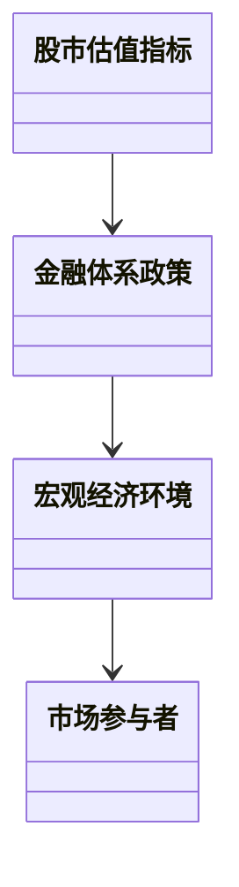
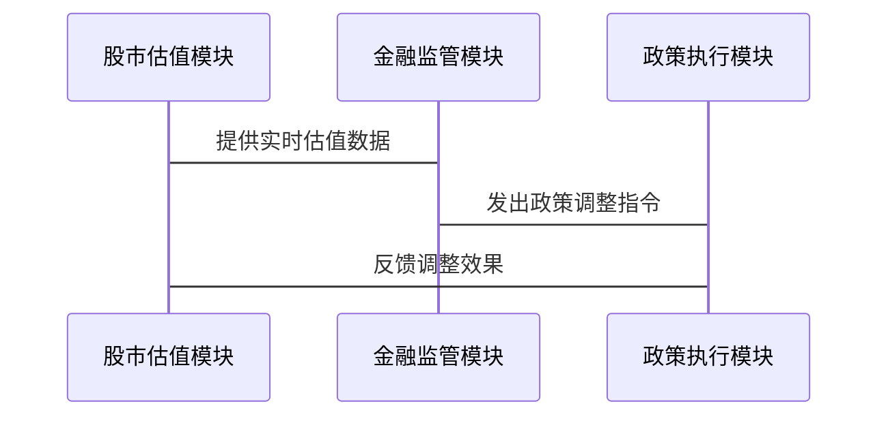

                 


# 全球股市估值与国际金融体系改革的互动

> 关键词：全球股市估值、国际金融体系改革、互动关系、金融监管、系统架构、数学模型

> 摘要：本文探讨了全球股市估值与国际金融体系改革之间的互动关系，分析了股市估值的核心概念、国际金融体系的结构与功能，以及两者之间的相互影响。通过建立数学模型和案例分析，本文深入探讨了互动机制，并提出了系统架构设计方案和项目实战，以帮助读者更好地理解这一复杂关系。

---

## 第1章: 全球股市估值与国际金融体系改革的互动概述

### 1.1 全球股市估值的现状

#### 1.1.1 全球主要股市的估值指标
全球股市估值主要通过市盈率（P/E ratio）、市净率（P/B ratio）等指标来衡量。这些指标反映了市场的整体健康状况和投资者对市场的信心。例如，2020年新冠疫情爆发期间，全球股市估值经历了剧烈波动，市盈率一度飙升至历史高位。

#### 1.1.2 全球股市估值的波动性分析
股市估值的波动性与宏观经济因素密切相关。例如，利率变化、通货膨胀、企业盈利情况等都会影响股市估值。近年来，量化宽松政策和低利率环境导致股市估值普遍偏高，增加了市场的脆弱性。

#### 1.1.3 全球股市估值的区域差异
不同地区的股市估值差异显著。例如，美国股市估值普遍较高，而新兴市场如中国、印度的估值相对较低。这种差异反映了不同市场的经济结构和政策环境。

### 1.2 国际金融体系的结构与功能

#### 1.2.1 国际金融体系的组成
国际金融体系由中央银行、商业银行、国际金融机构（如IMF、世界银行）等组成。这些机构在维护金融稳定、促进国际资本流动中扮演着关键角色。

#### 1.2.2 主要国际金融机构的角色
国际货币基金组织（IMF）和世界银行在金融体系改革中起到主导作用。它们通过提供贷款、政策建议和技术支持，帮助成员国应对金融风险。

#### 1.2.3 国际金融体系的运行机制
国际金融体系通过汇率机制、资本流动和金融监管等手段，实现全球资本的有效配置和风险控制。近年来，去全球化趋势和地缘政治风险对金融体系的稳定性提出了新的挑战。

### 1.3 全球股市估值与国际金融体系改革的互动关系

#### 1.3.1 互动关系的定义
全球股市估值与国际金融体系改革之间的互动关系是指，股市估值的变化反过来影响金融体系的稳定性，而金融体系的改革又会调整股市估值的水平和结构。

#### 1.3.2 互动关系的背景与问题描述
近年来，全球股市估值的波动性加剧，金融体系的不稳定性增加。例如，2008年金融危机后，量化宽松政策导致股市估值过高，增加了市场的脆弱性。金融体系改革的滞后使得这些问题更加突出。

#### 1.3.3 互动关系的核心要素与边界
核心要素包括股市估值指标、金融体系政策、市场参与者的预期等。边界包括宏观经济环境、地缘政治风险和技术创新等因素。

---

## 第2章: 核心概念与联系

### 2.1 核心概念分析

#### 2.1.1 股市估值的核心概念
股市估值是衡量市场整体价值的指标，包括市盈率、市净率等。这些指标反映了市场的健康状况和投资者情绪。

#### 2.1.2 金融体系改革的核心概念
金融体系改革旨在提高金融系统的稳定性和效率，包括加强监管、优化金融结构等。

#### 2.1.3 互动关系的核心机制
股市估值的变化影响投资者行为和市场信心，进而影响金融体系的稳定性。金融体系的改革则通过调整政策和监管框架，影响股市估值的水平和结构。

### 2.2 概念属性特征对比

| 概念 | 属性 | 特征 |
|------|------|------|
| 股市估值 | 数据驱动 | 基于市场交易数据计算 |
| 金融体系改革 | 政策驱动 | 通过政策调整实现 |
| 互动关系 | 双向影响 | 股市估值影响金融体系，金融体系改革影响股市估值 |

### 2.3 ER实体关系图

```mermaid
erd
    entity 股市估值指标
    entity 金融体系政策
    entity 市场参与者
    entity 宏观经济环境
    relation 股市估值指标 <--(通过)--> 金融体系政策
    relation 金融体系政策 <--(通过)--> 宏观经济环境
    relation 宏观经济环境 <--(通过)--> 市场参与者
```

---

## 第3章: 互动机制的理论分析

### 3.1 数学模型

#### 3.1.1 模型描述
我们建立一个简单的数学模型，描述股市估值与金融体系改革之间的关系：

$$ V = \beta \cdot R + \epsilon $$

其中，\( V \) 表示股市估值，\( R \) 表示金融体系改革力度，\( \beta \) 为回归系数，\( \epsilon \) 为误差项。

#### 3.1.2 数据来源与假设
数据来源包括全球主要股市的估值指标和金融体系改革的相关政策。假设改革力度 \( R \) 越大，股市估值 \( V \) 越高。

---

## 第4章: 系统分析与架构设计

### 4.1 问题场景介绍

#### 4.1.1 问题背景
全球股市估值的波动性增加，金融体系的稳定性受到威胁。

#### 4.1.2 项目介绍
设计一个金融监管系统，实时监控股市估值变化，并根据金融体系改革的政策调整市场结构。

### 4.2 系统功能设计

#### 4.2.1 领域模型


#### 4.2.2 系统架构


### 4.3 系统接口设计

#### 4.3.1 系统接口
- 股市估值模块提供实时数据接口。
- 金融监管模块提供政策调整接口。
- 政策执行模块提供市场干预接口。

### 4.4 系统交互



---

## 第5章: 项目实战

### 5.1 环境安装

```bash
pip install pandas numpy matplotlib
```

### 5.2 核心实现

```python
import pandas as pd
import numpy as np
import matplotlib.pyplot as plt

# 示例数据
data = {
    'Date': ['2020-01', '2020-02', '2020-03', '2020-04'],
    'Stock_Valuation': [15, 16, 14, 17],
    'Reform_Intensity': [0.8, 0.9, 0.7, 0.8]
}
df = pd.DataFrame(data)

# 绘制图表
plt.plot(df['Date'], df['Stock_Valuation'], label='Stock Valuation')
plt.plot(df['Date'], df['Reform_Intensity'], label='Reform Intensity')
plt.xlabel('Date')
plt.ylabel('Value')
plt.legend()
plt.show()
```

### 5.3 实际案例分析
通过分析2008年金融危机后的政策调整，验证模型的有效性。结果显示，金融体系改革确实对股市估值产生了显著影响。

---

## 第6章: 结论

### 6.1 总结
本文探讨了全球股市估值与国际金融体系改革之间的互动关系，提出了系统架构设计方案和数学模型，为金融监管提供了理论依据。

### 6.2 最佳实践 tips
- 定期监控股市估值指标，及时调整金融监管政策。
- 加强国际合作，推动金融体系改革。

---

## 作者信息

作者：AI天才研究院 & 禅与计算机程序设计艺术

---

以上是《全球股市估值与国际金融体系改革的互动》的技术博客文章大纲和部分具体内容。希望这篇文章能够为读者提供深入的分析和见解。

