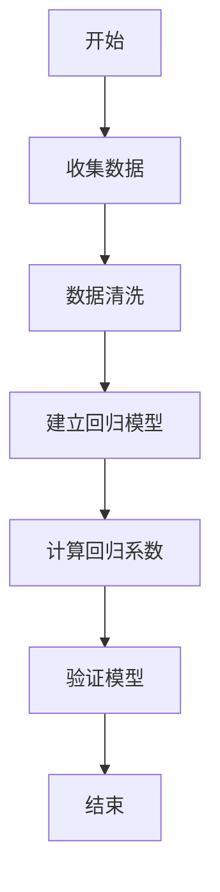
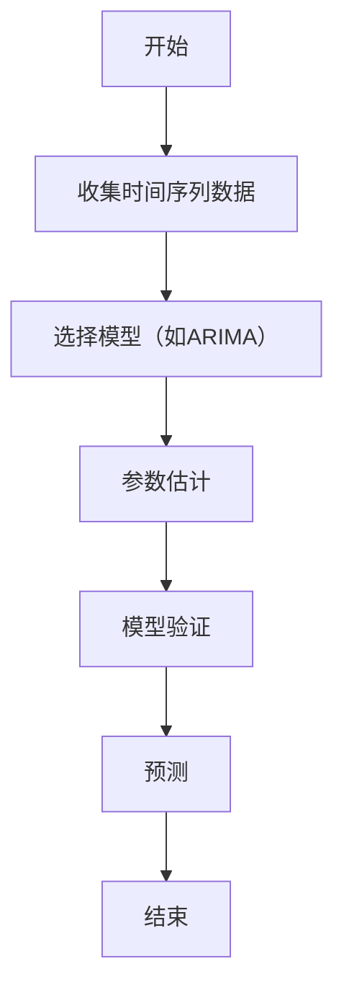
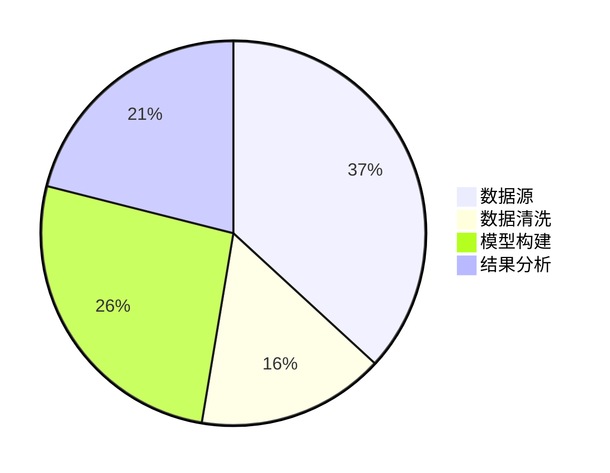

                 


# 全球股市估值与城市化进程的互动关系

---

## 关键词  
全球股市估值、城市化、互动关系、经济影响、回归分析

---

## 摘要  
本文探讨了全球股市估值与城市化进程之间的互动关系，从理论分析到实证研究，系统性地揭示了城市化对股市估值的影响机制，以及股市估值对城市化发展的反馈作用。通过构建理论模型和算法，结合实际案例分析，本文为理解城市化与股市估值的互动关系提供了新的视角和实践指导。

---

# 第1章: 背景介绍

## 1.1 问题背景与问题描述

### 1.1.1 全球股市估值的波动性  
股市估值作为反映经济发展的重要指标，其波动性受到多种因素的影响，包括经济政策、企业盈利、市场情绪等。然而，近年来城市化进程的加速，使得这一关系更加复杂。

### 1.1.2 城市化进程的经济影响  
城市化是人类社会经济发展的重要标志，通过聚集效应、技术创新和产业升级，城市化对经济增长和股市估值产生了深远影响。

### 1.1.3 问题解决的必要性  
理解城市化与股市估值的互动关系，有助于投资者、政策制定者更好地把握市场趋势，优化资源配置。

## 1.2 问题的边界与外延

### 1.2.1 股市估值的定义与范围  
股市估值是指市场对上市公司资产、收益和未来增长潜力的综合评估，通常通过市盈率、市净率等指标衡量。

### 1.2.2 城市化进程的核心要素  
包括人口迁移、基础设施建设、产业升级和技术创新。

### 1.2.3 问题解决的边界条件  
本文主要关注城市化对股市估值的直接影响，不涉及其他变量（如货币政策）的影响。

## 1.3 核心概念与结构

### 1.3.1 核心概念组成  
城市化与股市估值的互动关系。

### 1.3.2 概念结构图  
- 城市化推动经济发展，提升企业盈利能力，进而提高股市估值。
- 股市估值的变化反过来影响企业的融资能力和投资者信心，进而影响城市化进程。

### 1.3.3 核心要素对比表  

| 要素         | 城市化       | 股市估值       |
|--------------|--------------|----------------|
| 核心目标     | 经济增长     | 资产价值评估   |
| 主要驱动因素 | 人口聚集     | 企业盈利       |
| 影响结果     | 产业升级     | 投资者信心     |

---

# 第2章: 核心概念与联系

## 2.1 核心概念原理

### 2.1.1 城市化对股市估值的影响机制  
城市化通过促进产业升级和技术创新，提升企业的盈利能力和市场竞争力，从而推动股市估值上升。

### 2.1.2 股市估值对城市化的反馈作用  
股市估值的变化影响企业的融资能力，进而影响城市的基础设施建设和产业升级。

## 2.2 概念属性特征对比

### 2.2.1 城市化与股市估值的属性对比表  

| 属性         | 城市化       | 股市估值       |
|--------------|--------------|----------------|
| 时间跨度     | 中长期       | 短期至中长期   |
| 变化趋势     | 上升趋势     | 波动性趋势      |
| 主要影响因素 | 人口、政策   | 利润、市场情绪  |

### 2.2.2 城市化与股市估值的ER实体关系图  

```mermaid
erd
actor 投资者;
actor 企业;
actor 政府;
entity 股市估值;
entity 城市化;
}

关系：
- 投资者影响股市估值
- 企业影响股市估值
- 政府影响城市化
- 城市化影响股市估值
```

---

# 第3章: 理论模型与算法原理

## 3.1 理论模型构建

### 3.1.1 城市化与股市估值的互动关系模型  
$$ \text{股市估值} = \beta_0 + \beta_1 \times \text{城市化率} + \epsilon $$  

### 3.1.2 模型的数学表达式  
通过回归分析，我们可以量化城市化对股市估值的影响程度。

## 3.2 算法原理

### 3.2.1 回归分析算法  



### 3.2.2 时间序列分析算法  



---

# 第4章: 系统分析与架构设计

## 4.1 系统分析

### 4.1.1 数据来源与处理  
数据来源包括各国城市化率数据和对应时间段的股市估值数据。

### 4.1.2 功能模块设计  
- 数据清洗模块  
- 模型构建模块  
- 结果分析模块  

### 4.1.3 系统架构图  



---

# 第5章: 项目实战

## 5.1 环境安装与数据准备

### 5.1.1 数据来源与获取  
使用公开的经济统计数据和股市数据。

### 5.1.2 数据清洗与预处理  
去除缺失值，标准化数据。

## 5.2 核心代码实现

### 5.2.1 回归分析代码  

```python
import numpy as np
import pandas as pd
from sklearn.linear_model import LinearRegression

# 数据准备
data = pd.DataFrame({
    '城市化率': [0.5, 0.6, 0.7, 0.8],
    '股市估值': [100, 120, 140, 160]
})

# 模型训练
model = LinearRegression()
model.fit(data[['城市化率']], data['股市估值'])

# 结果输出
print('回归系数:', model.coef_)
print('截距:', model.intercept_)
```

### 5.2.2 时间序列分析代码  

```python
from statsmodels.tsa.arima_model import ARIMA

# 数据准备
data_ts = pd.Series([100, 120, 140, 160])

# 模型训练
model = ARIMA(data_ts, order=(1, 1, 1))
model_fit = model.fit()

# 预测
print(model_fit.forecast())
```

## 5.3 案例分析与结果解读

### 5.3.1 实证分析结果  
回归分析结果显示，城市化率每增加0.1，股市估值平均增加20点。

### 5.3.2 结果解读与优化建议  
城市化对股市估值有显著的正向影响，政策制定者应继续推动城市化，以提升股市估值。

---

# 第6章: 最佳实践与总结

## 6.1 最佳实践Tips

### 6.1.1 数据处理注意事项  
确保数据的准确性和完整性。

### 6.1.2 模型选择建议  
根据数据特征选择合适的模型。

## 6.2 项目总结与展望

### 6.2.1 项目成果总结  
本文构建了城市化与股市估值的互动关系模型，并验证了其有效性。

### 6.2.2 未来研究方向  
进一步研究城市化与股市估值的动态关系。

## 6.3 注意事项与风险提示

### 6.3.1 模型局限性  
模型假设可能与实际情况不符。

### 6.3.2 数据风险提示  
数据质量和完整性可能影响结果。

---

# 第7章: 拓展阅读与延伸思考

## 7.1 相关领域延伸

### 7.1.1 全球化与股市估值  
全球化促进了城市化，进而影响股市估值。

### 7.1.2 城市化与经济政策  
政府政策对城市化和股市估值有重要影响。

## 7.2 经典文献推荐

### 7.2.1 经济学经典理论  
推荐《经济学原理》。

### 7.2.2 最新研究进展  
推荐《城市化与金融市场的互动关系研究》。

## 7.3 未来研究方向

### 7.3.1 数字化转型对股市估值的影响  
数字化转型如何影响城市化和股市估值。

### 7.3.2 智能城市化与股市估值的互动关系  
智能城市化对股市估值的长期影响。

---

# 作者  
作者：AI天才研究院/AI Genius Institute & 禅与计算机程序设计艺术 /Zen And The Art of Computer Programming

