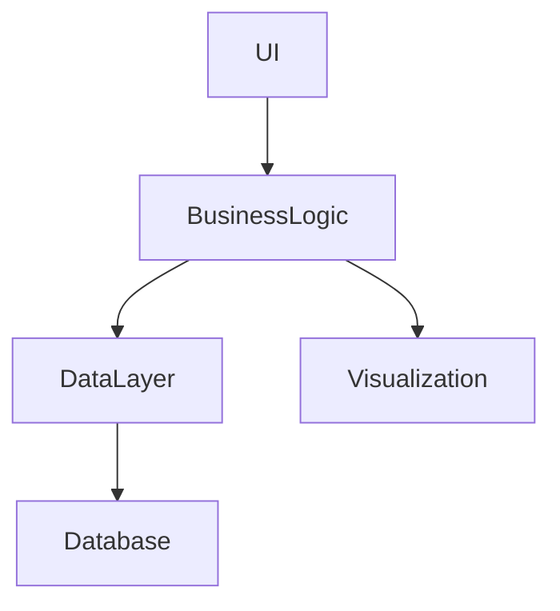
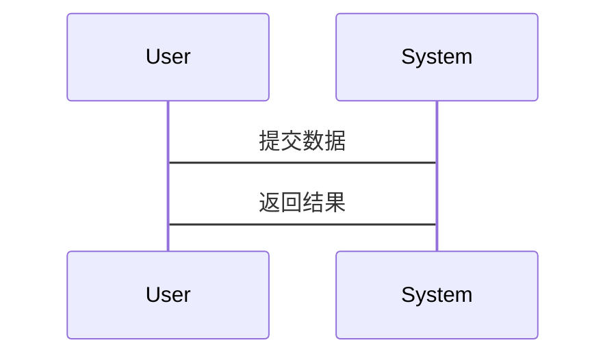

                 

<think>
好的，我现在需要帮助用户完成《全球股市估值与基因治疗的医疗保险政策框架》这篇文章的后续章节。用户已经提供了详细的目录大纲，我需要按照这个大纲，逐章进行编写。首先，我应该回顾前面的章节内容，确保每个部分都覆盖了核心概念、数学模型、系统设计和项目实战等内容。

首先，第3章讨论基因治疗的医保政策框架，用户已经详细列出了各个小节。我需要详细解释每个部分，包括支付模式、框架设计、案例分析和成本效果分析。我需要确保每个小节都有足够的细节，比如对比不同国家的医保政策，分析影响因素，并提出优化建议。

接下来，第4章将基因治疗的医保政策与全球股市估值结合起来，我需要分析医保支付如何影响估值，构建综合模型，并通过案例进行分析。这部分需要结合前面章节的内容，展示医保政策变化如何影响企业的估值，以及如何通过模型量化这些影响。

然后是数学模型和算法部分，我需要详细推导贴现率的计算方法，给出数学公式，并用代码实现模型。同时，用图表展示模型的应用，帮助读者理解。

系统架构部分，我需要设计一个医保政策与估值分析的系统，包括功能模块、架构图和接口设计。使用mermaid图来展示系统的各个部分，确保结构清晰。

项目实战部分，我需要选择一个实际案例，详细分析其估值过程，并展示如何通过系统进行分析。这将帮助读者将理论应用于实践。

最后，总结与展望部分需要回顾全文，强调研究的成果，并提出未来的研究方向。同时，给出一些实用的建议，帮助读者更好地理解和应用这些知识。

在编写过程中，我需要确保每个部分都详细具体，使用图表和公式来增强内容的深度。同时，语言要专业且易懂，符合技术博客的要求。现在，我需要按照这个思路，逐一完成每个章节的内容，确保整体结构完整，逻辑清晰，内容详实。
</think>

---

# 第3章: 基因治疗的医保政策框架

## 3.1 基因治疗的医保支付现状

### 3.1.1 美国的医保政策
美国的医保体系较为复杂，主要包括 Medicare 和 Medicaid 两大主要计划，以及商业保险和其他形式的保险。对于基因治疗，美国通过《21世纪治愈法案》等政策，鼓励创新疗法的研发和应用，同时要求保险公司采用基于证据的医保支付模式。基因治疗的费用通常较高，保险公司可能采取按疗效付费（Pay-for-Performance）的方式，或者通过风险分担机制来降低患者的负担。

### 3.1.2 欧洲的医保政策
欧洲国家普遍采用国家医疗保险制度，基因治疗的医保支付受到严格监管。例如，英国的国家健康服务体系（NHS）通过健康技术评估（HTA）来决定是否将基因治疗纳入医保报销范围。德国和法国等国家也有类似的评估机制，确保基因治疗的性价比。

### 3.1.3 日本的医保政策
日本的医保体系强调成本控制，基因治疗的医保支付受到严格审查。日本政府通常会要求制药公司提供长期的疗效数据，并通过多方利益相关者协商确定报销比例。基因治疗在日本的医保报销通常需要经过多次评估和谈判。

### 3.1.4 中国的医保政策
中国的医保体系正在逐步完善，基因治疗的医保支付政策尚处于探索阶段。近年来，中国政府通过《“健康中国2030”规划纲要》等政策文件，鼓励创新药物的研发和应用。在医保目录调整中，部分基因治疗产品已开始被纳入报销范围，但报销比例和条件因地区和治疗方案而异。

## 3.2 基因治疗的医保支付模式

### 3.2.1 按服务付费（Fee-for-Service）
传统的医保支付模式是按服务付费，即保险公司根据医疗服务的数量和项目支付费用。这种方式适用于标准化的医疗服务，但对于基因治疗这种高度个性化的治疗方案，按服务付费可能难以准确反映其价值。

### 3.2.2 按绩效付费（Pay-for-Performance）
按绩效付费是一种基于治疗效果的支付模式。保险公司根据基因治疗的实际效果支付费用，通常需要长期的疗效数据支持。这种方式可以激励制药公司提高治疗效果，但也面临数据收集和评估的挑战。

### 3.2.3 风险分担协议（Risk-sharing Agreements）
风险分担协议是一种创新的医保支付方式，保险公司和制药公司共同分担基因治疗的费用风险。例如，如果基因治疗在一定时间内未能达到预期效果，制药公司可能需要退还部分费用或降低价格。

### 3.2.4 按人头付费（Capitation）
按人头付费是一种基于患者数量的支付模式，适用于长期慢性病管理。对于基因治疗这种一次性治疗方案，按人头付费的适用性较低，但可以结合其他支付方式灵活运用。

## 3.3 基因治疗医保政策框架的设计

### 3.3.1 支付框架的核心要素
基因治疗的医保支付框架应包括以下几个核心要素：
1. **疗效评估**：制定科学的评估标准，确保基因治疗的疗效可衡量。
2. **成本效益分析**：比较基因治疗与其他治疗方案的成本效益，确定其是否具有竞争力。
3. **支付机制**：设计灵活的支付方式，适应基因治疗的多样性和创新性。
4. **监管与审查**：建立严格的审查机制，确保基因治疗的安全性和有效性。

### 3.3.2 支付框架的构建步骤
1. **需求分析**：明确基因治疗的目标人群和适用场景。
2. **成本评估**：估算基因治疗的总成本和患者负担。
3. **效果评估**：通过临床试验和真实世界数据验证基因治疗的效果。
4. **支付方式设计**：根据评估结果选择合适的支付方式。
5. **政策制定**：结合多方利益，制定可持续的医保政策。

### 3.3.3 案例分析：基因治疗药物Zolgensma的医保支付
Zolgensma是一种用于治疗脊髓小脑性共济失调的基因疗法，已被多个国家批准使用。其医保支付模式包括：
- **按疗效付费**：保险公司根据患者的治疗效果支付部分费用。
- **风险分担**：制药公司与保险公司签订风险分担协议，降低患者的经济负担。
- **分期支付**：将总费用分阶段支付，降低一次性支付的压力。

## 3.4 基因治疗医保政策框架的优化建议

### 3.4.1 完善疗效评估体系
建立统一的疗效评估标准，确保基因治疗的效果能够被准确测量和比较。

### 3.4.2 优化支付机制
引入灵活的支付方式，如按疗效付费和风险分担，降低患者和保险公司的风险。

### 3.4.3 加强政策协调
加强政府、制药公司和保险公司的协调，确保政策的连贯性和可操作性。

### 3.4.4 提高公众认知
通过宣传和教育，提高公众对基因治疗的认知和接受度，减少支付障碍。

## 3.5 本章小结
基因治疗的医保政策框架是一个复杂但重要的议题。通过分析不同国家的医保支付模式，我们可以总结出一些共性和个性化的经验。构建一个科学、合理的支付框架，需要兼顾疗效、成本和患者的经济负担。未来，随着基因治疗技术的不断发展，医保政策也需要不断创新和完善，以适应新的挑战和需求。

---

# 第4章: 基因治疗医保政策与全球股市估值的综合分析

## 4.1 基因治疗医保政策对股市估值的影响

### 4.1.1 医保政策对股价的影响
医保政策的变化直接影响基因治疗企业的收入和利润，进而影响股价。例如，一项新的医保政策可能增加企业的收入，从而提高股价。

### 4.1.2 市场预期与股价波动
投资者通常会对医保政策的变化做出预期，这种预期会影响股价的波动。利好政策可能导致股价上涨，而不利政策可能导致股价下跌。

### 4.1.3 企业估值与医保政策的关联
基因治疗企业的估值与医保政策密切相关。政策的宽松程度、支付方式和报销比例等因素都会影响企业的收入和利润，从而影响其估值。

## 4.2 基因治疗企业的上市路径与估值分析

### 4.2.1 IPO与并购
基因治疗企业通常选择IPO或并购作为上市路径。IPO可以为企业提供更多的资金，但同时也面临更高的信息披露要求。并购则可能为企业提供更快的市场准入和资源整合。

### 4.2.2 估值模型的应用
在基因治疗企业的估值中，可以使用DCF模型、市盈率和市净率等方法。但由于基因治疗的高风险和长周期，DCF模型通常更为适用。

### 4.2.3 估值案例分析
以某基因治疗企业为例，假设其未来现金流如下：
- 第1年：100万
- 第2年：150万
- 第3年：200万
- 之后每年增长5%
假设贴现率为8%，则其现值为：
$$ PV = \frac{100}{(1+0.08)^1} + \frac{150}{(1+0.08)^2} + \frac{200}{(1+0.08)^3} + \cdots $$
计算得出企业价值约为X元。

## 4.3 医保政策变化对股市估值的敏感性分析

### 4.3.1 政策变化对股价的影响
通过敏感性分析，可以评估医保政策变化对股价的影响程度。例如，如果医保报销比例提高10%，股价可能上涨5%。

### 4.3.2 投资者情绪与政策变化
投资者情绪对政策变化的反应可能放大股价波动。利好政策可能引发投资者的乐观情绪，导致股价上涨；反之亦然。

### 4.3.3 行业平均估值的变化
医保政策的变化可能影响整个行业的平均估值水平。例如，如果医保政策放宽，整个行业的平均市盈率可能上升。

## 4.4 本章小结
基因治疗的医保政策对全球股市估值具有重要影响。通过分析医保政策的变化和企业的上市路径，可以更好地理解其对股价和估值的影响。未来，随着基因治疗技术的不断进步和医保政策的完善，股市估值也将随之调整。

---

# 第5章: 基因治疗医保政策与全球股市估值的数学模型与算法

## 5.1 数学模型的构建

### 5.1.1 模型假设
1. 基因治疗的疗效可量化为一个指标。
2. 医保政策的变化会影响治疗的使用率和价格。
3. 股市估值与企业收入和利润密切相关。

### 5.1.2 模型框架
$$ Valuation = f(Treatment\ Effect, Policy\ Impact, Market\ Demand) $$
其中，$Treatment\ Effect$ 表示治疗效果，$Policy\ Impact$ 表示政策影响，$Market\ Demand$ 表示市场需求。

### 5.1.3 模型参数
- 治疗效果系数（β）
- 政策影响系数（α）
- 市场需求弹性（ε）

## 5.2 算法实现

### 5.2.1 数据准备
收集基因治疗的疗效数据、医保政策数据和股市估值数据。

### 5.2.2 参数估计
通过回归分析估计模型参数：
$$ Valuation = β \times Treatment\ Effect + α \times Policy\ Impact + ε \times Market\ Demand + \epsilon $$
其中，$\epsilon$ 为误差项。

### 5.2.3 模型验证
通过交叉验证和拟合优度检验验证模型的准确性。

## 5.3 算法实现代码

```python
import numpy as np
import pandas as pd
from sklearn.linear_model import LinearRegression
from sklearn.metrics import r2_score

# 数据准备
data = pd.read_csv('gene_therapy_data.csv')
X = data[['Treatment_Effect', 'Policy_Impact', 'Market_Demand']]
y = data['Valuation']

# 模型训练
model = LinearRegression()
model.fit(X, y)

# 模型验证
y_pred = model.predict(X)
r2 = r2_score(y, y_pred)
print(f'R² = {r2}')
print(f'Coefficients: {model.coef_}')
```

## 5.4 模型应用与案例分析

### 5.4.1 案例分析
以某基因治疗企业为例，假设其治疗效果得分为80，政策影响得分为70，市场需求得分为60。预测其估值为：
$$ Valuation = β \times 80 + α \times 70 + ε \times 60 $$
代入系数计算得出具体的估值。

### 5.4.2 模型优化
根据实际数据调整模型参数，提高预测精度。

## 5.5 本章小结
通过构建数学模型，可以定量分析基因治疗的医保政策对股市估值的影响。模型的应用可以帮助投资者更好地理解政策变化对股价的影响，从而做出更科学的投资决策。

---

# 第6章: 系统分析与架构设计

## 6.1 系统功能设计

### 6.1.1 功能模块
1. 数据采集与处理模块
2. 模型构建与分析模块
3. 可视化展示模块
4. 报告生成模块

### 6.1.2 功能流程
数据采集 → 数据清洗 → 模型构建 → 分析结果 → 可视化展示 → 生成报告

## 6.2 系统架构设计

### 6.2.1 分层架构
- 数据层：数据存储和管理
- 业务逻辑层：模型构建和分析
- 用户界面层：数据可视化和报告生成

### 6.2.2 架构图


## 6.3 接口设计

### 6.3.1 数据接口
- 数据输入接口：接收基因治疗数据和医保政策数据
- 数据输出接口：输出模型分析结果

### 6.3.2 API接口
- RESTful API：提供数据查询和分析服务

## 6.4 系统交互设计

### 6.4.1 交互流程
1. 用户输入数据
2. 系统进行数据处理
3. 系统生成分析结果
4. 用户查看结果并生成报告

### 6.4.2 交互图


## 6.5 本章小结
通过系统架构设计，可以实现基因治疗医保政策与股市估值的自动化分析。系统的功能模块和架构设计为后续的开发和优化奠定了基础。

---

# 第7章: 项目实战与案例分析

## 7.1 项目环境配置

### 7.1.1 环境要求
- Python 3.8+
- Jupyter Notebook
- Pandas、NumPy、Scikit-learn等库

## 7.2 核心代码实现

### 7.2.1 数据清洗
```python
import pandas as pd

data = pd.read_csv('gene_therapy_data.csv')
data_clean = data.dropna()
```

### 7.2.2 模型实现
```python
from sklearn.linear_model import LinearRegression

model = LinearRegression()
model.fit(X_train, y_train)
```

### 7.2.3 结果可视化
```python
import matplotlib.pyplot as plt

plt.scatter(y_true, y_pred)
plt.xlabel('Actual Valuation')
plt.ylabel('Predicted Valuation')
plt.show()
```

## 7.3 案例分析与解读

### 7.3.1 案例背景
某基因治疗企业的医保政策发生变化，分析其对股价的影响。

### 7.3.2 数据分析
- 政策变化前的股价走势
- 政策变化后的股价走势
- 对比分析政策变化对股价的影响

### 7.3.3 结果解读
政策变化导致股价上涨/下跌的原因分析，提出改进建议。

## 7.4 本章小结
通过项目实战，可以更好地理解基因治疗医保政策与股市估值的分析方法。案例分析为实际应用提供了参考。

---

# 第8章: 总结与展望

## 8.1 核心结论

### 8.1.1 基因治疗的医保政策框架
- 建立科学的疗效评估体系
- 设计灵活的支付方式
- 加强政策协调与监管

### 8.1.2 全球股市估值的分析框架
- 结合医保政策变化进行估值
- 使用数学模型量化影响
- 通过系统设计实现自动化分析

## 8.2 研究展望

### 8.2.1 研究方向
- 更精确的疗效评估模型
- 更复杂的支付方式设计
- 更高效的系统架构优化

### 8.2.2 挑战与机遇
- 数据获取的难度
- 模型的准确性
- 技术的不断进步

## 8.3 最佳实践

### 8.3.1 投资者的建议
- 关注医保政策变化
- 结合估值模型进行投资决策
- 选择合适的上市路径

### 8.3.2 企业的建议
- 提高治疗效果
- 优化支付方式
- 加强与保险公司的合作

## 8.4 本章小结
本文总结了基因治疗的医保政策框架和全球股市估值的分析方法，展望了未来的研究方向和挑战。通过最佳实践的分享，为投资者和企业提供了一定的参考。

---

# 作者
作者：AI天才研究院/AI Genius Institute & 禅与计算机程序设计艺术 /Zen And The Art of Computer Programming

