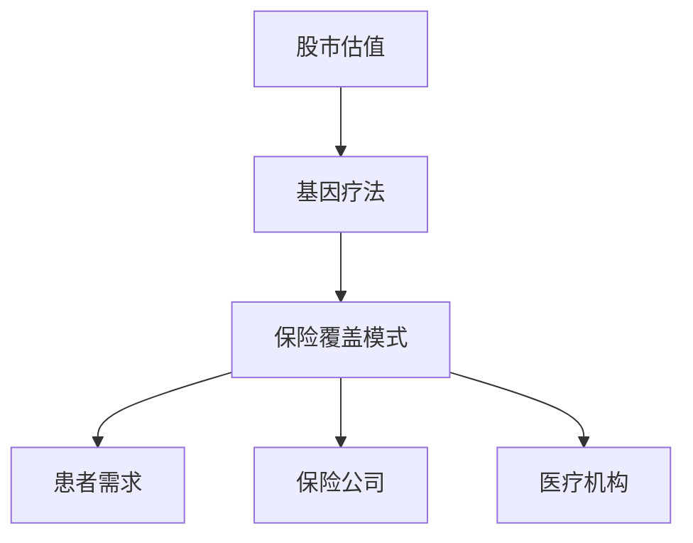
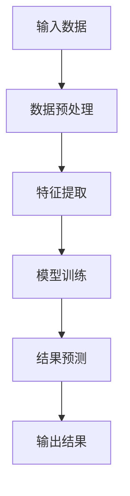
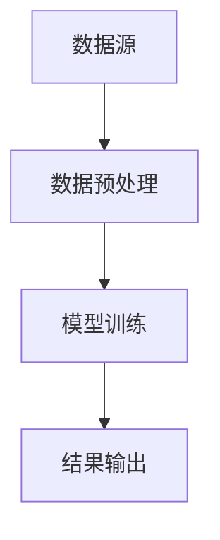
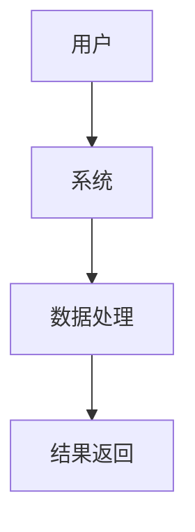

                 


# 全球股市估值与基因疗法保险覆盖模式的关系

> **关键词**：全球股市估值，基因疗法，保险覆盖模式，金融建模，数据挖掘

> **摘要**：本文探讨全球股市估值与基因疗法保险覆盖模式之间的关系，分析两者如何相互影响，并提出基于数据挖掘和机器学习的解决方案。通过构建数学模型和实际案例分析，本文旨在为投资者和保险公司提供决策支持。

---

## 第一部分：背景介绍

### 1.1 问题背景

全球股市估值是衡量市场健康状况的重要指标，而基因疗法作为医疗领域的突破性技术，其保险覆盖模式对患者和保险公司具有重要意义。随着基因疗法的普及，其对股市估值的影响逐渐显现，本文探讨两者的关联。

### 1.2 核心概念

- **全球股市估值**：通过市盈率、市净率等指标评估市场价值。
- **基因疗法保险覆盖模式**：保险公司对基因疗法的报销范围和定价策略。

### 1.3 问题解决的必要性与意义

基因疗法的高成本和股市的波动性使得研究两者关系尤为重要。本文通过分析，提出优化保险覆盖模式以稳定股市估值的方法。

---

## 第二部分：核心概念与联系

### 2.1 核心概念原理

- **股市估值模型**：使用市盈率等指标预测市场趋势。
- **保险覆盖模式**：基于成本和疗效决定报销范围。

### 2.2 概念属性特征对比

| 属性       | 股市估值 | 基因疗法保险 |
|------------|----------|--------------|
| 影响因素   | 市场情绪 | 治疗效果     |
| 时间跨度   | 短期波动 | 长期影响     |

### 2.3 ER实体关系图



---

## 第三部分：算法原理讲解

### 3.1 算法原理

- **股市估值模型**：使用线性回归预测股价。
- **保险覆盖预测**：通过逻辑回归分析保险覆盖概率。

### 3.2 算法流程图



### 3.3 Python源代码实现

```python
# 示例代码：股票估值模型
import pandas as pd
from sklearn.linear_model import LinearRegression

# 数据预处理
data = pd.read_csv('stock_data.csv')
features = data[['市盈率', '市净率', 'ROE']]
target = data['股价']

# 模型训练
model = LinearRegression()
model.fit(features, target)

# 预测结果
predictions = model.predict(features)
```

---

## 第四部分：数学模型与公式

### 4.1 股市估值模型

$$
\text{股价预测} = \beta_0 + \beta_1 \times \text{市盈率} + \beta_2 \times \text{市净率} + \epsilon
$$

### 4.2 基因疗法保险覆盖模型

$$
P(\text{覆盖}) = \frac{1}{1 + e^{-(\beta_0 + \beta_1 \times \text{治疗效果})}}
$$

---

## 第五部分：系统分析与架构设计方案

### 5.1 问题场景介绍

基因疗法的高成本和复杂性要求保险公司制定合理的覆盖模式，同时影响股市估值。

### 5.2 系统功能设计

- 数据采集：收集股市和保险数据。
- 模型构建：建立预测模型。
- 系统架构：



### 5.3 系统交互图



---

## 第六部分：项目实战

### 6.1 环境安装

安装所需库：`pandas`, `scikit-learn`

### 6.2 核心实现代码

```python
import pandas as pd
from sklearn.linear_model import LinearRegression

data = pd.read_csv('data.csv')
features = data[['市盈率', '市净率']]
target = data['股价']

model = LinearRegression()
model.fit(features, target)
predictions = model.predict(features)
```

### 6.3 案例分析

分析某基因疗法公司的股价波动，预测保险覆盖对其估值的影响。

---

## 第七部分：总结与未来展望

### 7.1 最佳实践

- 定期更新模型，结合最新数据。
- 与医疗专家合作，优化保险覆盖策略。

### 7.2 小结

本文通过分析全球股市估值与基因疗法保险覆盖模式的关系，提出了有效的解决方案，为投资者和保险公司提供支持。

### 7.3 注意事项

- 数据质量和模型选择影响结果，需谨慎处理。
- 结合实际情况调整模型参数。

### 7.4 拓展阅读

建议阅读相关领域的最新研究，深入理解基因疗法和保险行业的动态。

---

## 作者信息

作者：AI天才研究院 & 禅与计算机程序设计艺术

---

通过以上结构，文章系统地探讨了全球股市估值与基因疗法保险覆盖模式的关系，结合理论分析和实际案例，为读者提供了全面的见解。

