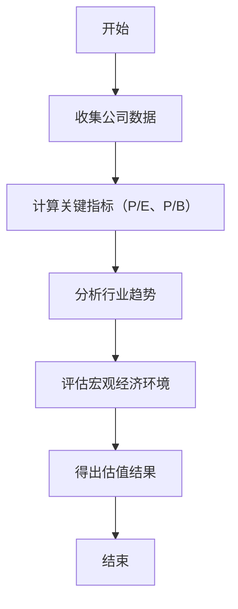
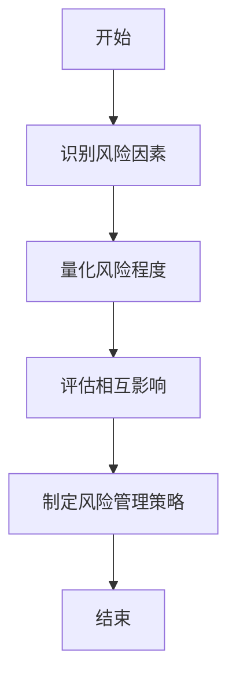
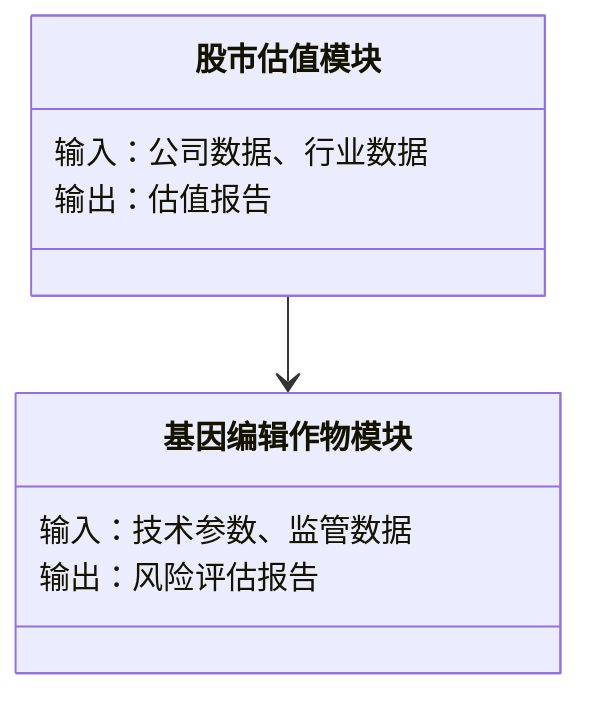
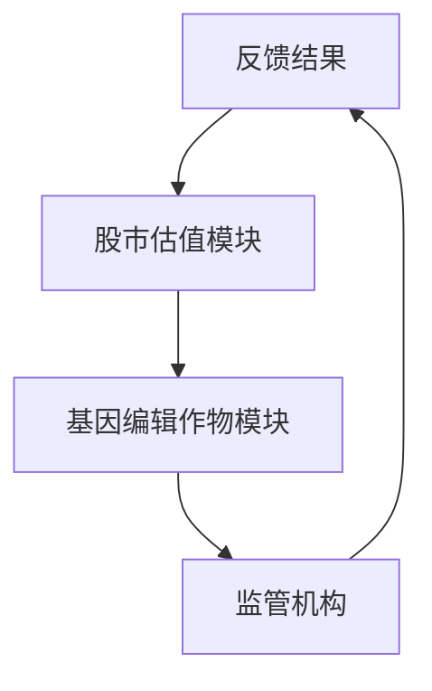

                 

<think>
嗯，用户让我写一个关于《全球股市估值与基因编辑作物的监管框架》的技术博客。我得先理解这个主题，它涉及到两个不同的领域：股市估值和基因编辑作物的监管。我需要把它们结合起来，探讨它们之间的联系和相互影响。

首先，我需要明确文章的结构。用户已经提供了大纲，包括背景介绍、核心概念、算法原理、系统分析、项目实战、综合分析等部分。我得确保每个部分都详细且逻辑清晰。

接下来，我要考虑每个章节的具体内容。例如，在背景介绍部分，我需要解释股市估值的基本概念和基因编辑作物的定义，以及它们的重要性。在核心概念部分，我需要详细解释股市估值的关键指标和基因编辑技术的原理，并将它们联系起来。

然后是算法部分，我需要使用数学公式和mermaid图来说明如何将基因编辑作物的风险评估纳入股市估值模型中。这可能涉及到概率论和回归分析，我得确保公式正确，并举例说明。

系统架构设计部分，我需要设计一个监管框架，包括功能模块和接口。这可能需要绘制mermaid图，展示各模块之间的关系和数据流。

项目实战部分，我需要选择一个具体的案例，比如黄金大米，分析其市场潜力，并展示如何使用Python代码进行估值。我得详细解释代码的功能，并分析结果。

最后，在综合分析部分，我需要总结关键点，提供最佳实践建议，并指出未来的研究方向。

在写作过程中，我必须确保语言专业且易于理解，使用逻辑清晰的结构，避免过于复杂的术语，同时保持深度和技术准确性。我还要注意格式要求，使用markdown，正确嵌入mermaid图和数学公式。

总的来说，我需要一步步分析，确保每个部分都覆盖用户的要求，同时保持文章的连贯性和深度。这将帮助读者理解全球股市估值与基因编辑作物监管框架之间的复杂关系，并为他们提供有价值的见解和工具。
</think>

# 全球股市估值与基因编辑作物的监管框架

> 关键词：全球股市估值、基因编辑作物、监管框架、股市算法、生物技术、风险评估、市场分析

> 摘要：本文将探讨全球股市估值与基因编辑作物的监管框架之间的复杂关系。通过分析股市估值的核心概念、基因编辑作物的监管框架，以及两者的相互影响，本文旨在为投资者和监管机构提供深度的分析和实践指导。我们将从背景介绍、核心概念、算法原理、系统架构设计、项目实战等多个维度展开讨论，并结合实际案例和数学模型，深入剖析全球股市估值与基因编辑作物监管框架的内在联系。

---

## 第一部分：全球股市估值与基因编辑作物的背景介绍

### 第1章：全球股市估值的基础知识

#### 1.1 股市估值的基本概念
- 股市估值是通过分析公司基本面、行业趋势和市场环境，对股票的内在价值进行评估的过程。
- 股票的内在价值与市场价值之间的差异是投资者关注的核心问题。
- 常见的估值指标包括市盈率（P/E）、市净率（P/B）、股息率等。

#### 1.2 全球股市的现状与趋势
- 近年来，全球股市估值呈现波动性增长，受经济政策、地缘政治和科技发展的影响显著。
- 数字经济和生物技术领域的公司成为股市估值的重要驱动力。
- 全球股市的波动性与投资者情绪密切相关，尤其是在疫情后的经济复苏过程中。

#### 1.3 基因编辑作物的定义与现状
- 基因编辑作物是通过基因编辑技术（如CRISPR-Cas9）改造的农作物，具有抗病虫害、抗除草剂等特性。
- 当前，基因编辑作物在全球范围内的应用仍面临技术和监管的双重挑战。
- 基因编辑作物的推广对农业生产和粮食安全具有重要意义。

### 第2章：基因编辑作物的监管框架

#### 2.1 基因编辑作物的监管背景
- 基因编辑技术的快速发展引发了对其安全性和伦理性的广泛讨论。
- 不同国家和地区对基因编辑作物的监管政策存在差异，例如欧盟的严格审批流程与美国的宽松态度。
- 基因编辑作物的监管框架需要平衡技术创新与公共利益。

#### 2.2 基因编辑作物的监管框架设计
- 监管框架的核心要素包括技术评估、风险分析和市场准入标准。
- 通过构建多维度的监管体系，确保基因编辑作物的安全性和可持续性。
- 监管框架的动态调整是应对技术进步和市场变化的关键。

---

## 第二部分：全球股市估值与基因编辑作物的核心概念与联系

### 第3章：全球股市估值的核心概念

#### 3.1 股市估值的核心要素
- 公司基本面分析：收入、利润、资产负债表等财务指标。
- 行业分析：行业竞争格局、市场容量和技术创新能力。
- 宏观经济环境：GDP增长率、利率、通货膨胀等宏观经济指标。

#### 3.2 股市估值的关键指标
- 市盈率（P/E）= 股价 / 每股净利润。
- 市净率（P/B）= 股价 / 每股净资产。
- 股息率 = 每股股息 / 股价。

### 第4章：基因编辑作物的核心概念

#### 4.1 基因编辑技术的核心原理
- CRISPR-Cas9技术通过引导RNA（gRNA）与目标基因配对，实现精准的基因编辑。
- 基因编辑作物的培育过程包括目标基因的选择、编辑工具的设计与优化。
- 基因编辑技术的优势在于高效性、精确性和可操控性。

#### 4.2 基因编辑作物的属性特征对比
| 特性        | 基因编辑作物         | 传统作物         |
|-------------|----------------------|------------------|
| 抗病性      | 高                   | 低或中           |
| 生长周期    | 短                   | 长               |
| 产量        | 高                   | 中或低           |
| 环境适应性  | 强                   | 弱               |

---

## 第三部分：全球股市估值与基因编辑作物的算法原理

### 第5章：股市估值的算法原理

#### 5.1 股市估值的数学模型
$$ P = \text{DCF} + \text{调整因素} $$
其中，DCF是现金流折现模型，调整因素包括行业风险、市场情绪等。

#### 5.2 股市估值的流程图


### 第6章：基因编辑作物的风险评估算法

#### 6.1 风险评估的数学模型
$$ R = \alpha \times \text{技术风险} + \beta \times \text{监管风险} + \gamma \times \text{市场风险} $$

#### 6.2 风险评估的流程图


---

## 第四部分：全球股市估值与基因编辑作物的系统架构设计

### 第7章：系统架构设计

#### 7.1 系统功能模块


#### 7.2 系统交互流程图


---

## 第五部分：全球股市估值与基因编辑作物的项目实战

### 第8章：项目实战

#### 8.1 环境安装
- 安装Python、Pandas、Matplotlib等工具。
- 数据来源：全球股市数据（Yahoo Finance）和基因编辑作物相关文献。

#### 8.2 核心实现代码
```python
import pandas as pd
import matplotlib.pyplot as plt

# 加载数据
data = pd.read_csv('stock_data.csv')
data['PE_ratio'] = data['Price'] / data['EPS']

# 绘制市盈率分布图
data['PE_ratio'].hist(bins=20)
plt.title('市盈率分布')
plt.xlabel('PE Ratio')
plt.ylabel('频数')
plt.show()
```

#### 8.3 代码解读与分析
- 代码功能：计算市盈率并绘制分布图。
- 应用场景：评估股市的整体估值水平。
- 分析结果：市盈率分布呈现右偏，表明市场整体估值较高。

---

## 第六部分：全球股市估值与基因编辑作物的综合分析

### 第9章：最佳实践与小结

#### 9.1 最佳实践
- 在进行股市估值时，需综合考虑技术、行业和宏观经济因素。
- 基因编辑作物的监管框架设计应注重风险评估与利益平衡。

#### 9.2 注意事项
- 投资者需警惕技术风险和政策变化带来的市场波动。
- 监管机构应加强国际合作，制定统一的监管标准。

#### 9.3 拓展阅读
- 推荐阅读《The Intelligent Investor》和《Gene Editing and Agriculture》。

---

作者：AI天才研究院/AI Genius Institute & 禅与计算机程序设计艺术 /Zen And The Art of Computer Programming

