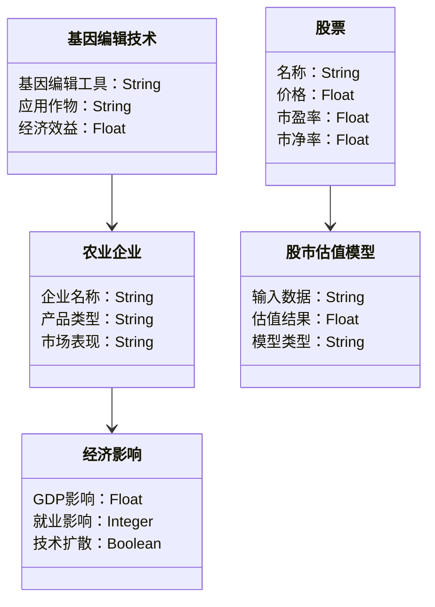
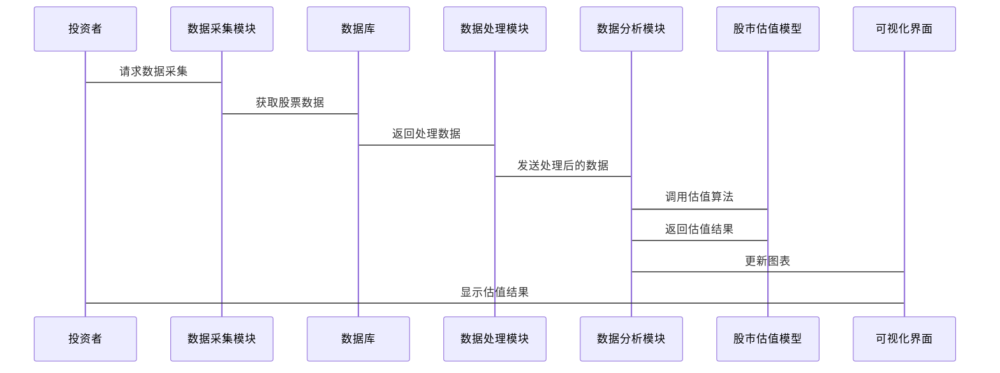

                 


# 全球股市估值与基因编辑作物的经济影响

## 关键词：
- 全球股市估值
- 基因编辑作物
- 经济影响
- 股市预测
- 农业经济

## 摘要：
本文探讨了全球股市估值与基因编辑作物之间的经济影响关系。通过分析基因编辑技术对农业经济的潜在影响，结合股市估值的核心方法，揭示了基因编辑作物如何通过改变农业生产力和粮食安全，进而影响全球股市的经济表现。文章从基因编辑作物的定义、技术原理、经济价值入手，结合股市估值的数学模型和算法，分析了两者之间的关联性，并提出了投资者在这一领域的潜在机会与挑战。

---

# 目录大纲

1. 全球股市估值与基因编辑作物的背景介绍
    1.1 全球股市估值的基本概念
    1.2 基因编辑作物的定义与特点
    1.3 本章小结

2. 全球股市估值的核心概念与方法
    2.1 股市估值的基本原理
    2.2 常用的股市估值方法
    2.3 全球股市估值的挑战与机遇
    2.4 本章小结

3. 基因编辑作物的经济影响分析
    3.1 基因编辑技术的经济价值
    3.2 基因编辑作物对农业经济的深远影响
    3.3 基因编辑作物的市场接受度与推广策略
    3.4 本章小结

4. 全球股市估值与基因编辑作物的关联性分析
    4.1 基因编辑技术对农业企业的股价影响
    4.2 基因编辑作物对全球农业板块的估值影响
    4.3 基因编辑作物对全球经济的影响与股市反应
    4.4 本章小结

5. 系统分析与架构设计方案
    5.1 系统功能设计（领域模型Mermaid类图）
    5.2 系统架构设计Mermaid架构图
    5.3 系统接口设计和系统交互Mermaid序列图
    5.4 本章小结

6. 项目实战：基因编辑作物与股市估值的案例分析
    6.1 环境安装与数据准备
    6.2 系统核心实现源代码
    6.3 代码应用解读与分析
    6.4 实际案例分析和详细讲解剖析
    6.5 本章小结

7. 最佳实践、小结、注意事项与拓展阅读
    7.1 最佳实践
    7.2 小结
    7.3 注意事项
    7.4 拓展阅读
    7.5 本章小结

---

# 正文部分

## 第1章 全球股市估值与基因编辑作物的背景介绍

### 1.1 全球股市估值的基本概念

#### 1.1.1 股市估值的定义与意义
股市估值是指通过一定的方法和模型，对股票的内在价值进行评估的过程。它是投资者在决策是否买入或卖出股票时的重要依据。股市估值的意义在于帮助投资者在复杂多变的市场环境中，识别出具有投资价值的标的。

#### 1.1.2 股市估值的核心指标
- **市盈率（P/E Ratio）**：市盈率是股票价格与每股净利润的比率，反映了投资者对上市公司盈利能力的预期。
- **市净率（P/B Ratio）**：市净率是股票价格与每股净资产的比率，主要用于评估股票的价值是否被高估或低估。
- **股息率（Dividend Yield）**：股息率是每股股息与股票价格的比率，反映了股票的分红能力。

#### 1.1.3 全球化背景下的股市特点
全球化背景下，股市估值受到全球经济波动、地缘政治风险、货币政策变化等多种因素的影响。不同国家和地区的股市估值方法和标准可能存在差异，但核心原理是相通的。

### 1.2 基因编辑作物的定义与特点

#### 1.2.1 基因编辑技术的基本原理
基因编辑技术是一种通过人工手段对生物体基因组进行精确修改的技术，旨在去除有害基因或添加有益基因。常用的基因编辑工具包括CRISPR-Cas9、TALENs和ZFNs等。

#### 1.2.2 基因编辑作物的分类与应用
基因编辑作物主要分为两类：一类是通过编辑基因提高作物的抗病虫害能力，另一类是通过优化基因表达提高作物的产量和营养价值。基因编辑作物的应用领域包括粮食作物、经济作物和牧草等。

#### 1.2.3 基因编辑作物的经济潜力
基因编辑作物的经济潜力主要体现在以下几个方面：
- 提高作物产量，减少粮食进口依赖。
- 增强作物抗病虫害能力，降低农业生产成本。
- 优化作物品质，提升市场竞争力。

### 1.3 本章小结
本章主要介绍了全球股市估值和基因编辑作物的基本概念及其特点。通过了解股市估值的核心指标和基因编辑技术的基本原理，为后续分析两者之间的经济影响奠定了基础。

---

## 第2章 全球股市估值的核心概念与方法

### 2.1 股市估值的基本原理

#### 2.1.1 股票价值的决定因素
股票价值的决定因素包括：
- 公司基本面：净利润、营业收入、资产负债率等。
- 市场情绪：投资者的心理预期和市场流动性。
- 宏观经济环境：GDP增长率、利率水平、通货膨胀率等。

#### 2.1.2 市场情绪与股市估值的关系
市场情绪是影响股市估值的重要因素。当市场情绪乐观时，投资者倾向于高估股票价值；当市场情绪悲观时，投资者倾向于低估股票价值。

#### 2.1.3 经济指标对股市估值的影响
宏观经济指标（如GDP增长率、CPI、失业率等）通过影响企业的盈利能力进而影响股市估值。

### 2.2 常用的股市估值方法

#### 2.2.1 市盈率法
市盈率法的核心是通过比较股票的市盈率与行业平均水平或目标公司的预期市盈率，判断股票的估值水平。

$$ P/E = \frac{\text{股票价格}}{\text{每股净利润}} $$

#### 2.2.2 市净率法
市净率法适用于重资产行业的公司估值。

$$ P/B = \frac{\text{股票价格}}{\text{每股净资产}} $$

#### 2.2.3 现金流折现法
现金流折现法是通过将公司未来现金流折现到现值，评估公司的整体价值。

$$ V = \sum_{t=1}^{n} \frac{CF_t}{(1 + r)^t} $$

其中，$CF_t$ 是第 $t$ 年的现金流，$r$ 是折现率。

### 2.3 全球股市估值的挑战与机遇

#### 2.3.1 全球经济波动的影响
全球经济波动（如经济危机、贸易摩擦等）会对股市估值产生重大影响。

#### 2.3.2 技术进步对股市估值的推动
技术创新（如基因编辑技术）可能会提升相关企业的估值。

#### 2.3.3 政治经济环境的不确定性
政治经济环境的不确定性（如政策变化、地缘政治风险等）会影响投资者对股市估值的预期。

### 2.4 本章小结
本章详细介绍了股市估值的基本原理和常用方法，并分析了全球化背景下股市估值面临的挑战与机遇。

---

## 第3章 基因编辑作物的经济影响分析

### 3.1 基因编辑技术的经济价值

#### 3.1.1 提高农作物产量的经济效应
基因编辑技术可以通过优化作物基因，提高作物的产量，从而降低单位面积的生产成本。

#### 3.1.2 增强作物抗病虫害能力的经济效益
基因编辑作物可以通过增强抗病虫害能力，减少农药的使用量，降低农业生产成本。

#### 3.1.3 优化作物品质的市场价值
基因编辑技术可以优化作物的营养成分和口感，提升产品的市场竞争力。

### 3.2 基因编辑作物对农业经济的深远影响

#### 3.2.1 对传统农业模式的颠覆
基因编辑作物的应用可能颠覆传统农业模式，推动农业向现代化、科技化方向发展。

#### 3.2.2 对全球粮食安全的贡献
基因编辑作物的推广有助于提高粮食产量，缓解全球粮食安全问题。

#### 3.2.3 对农业产业链的重构
基因编辑作物的应用可能重构农业产业链，推动农业上下游产业的整合与优化。

### 3.3 基因编辑作物的市场接受度与推广策略

#### 3.3.1 消费者对基因编辑作物的认知
消费者对基因编辑作物的接受度可能受到其对健康和安全的担忧影响。

#### 3.3.2 市场推广中的挑战与解决方案
基因编辑作物的推广需要克服技术、政策、市场等多方面的挑战。

#### 3.3.3 政策支持与监管框架的完善
政府需要制定相关政策，规范基因编辑作物的研发和推广，确保其安全性和合规性。

### 3.4 本章小结
本章分析了基因编辑技术的经济价值及其对农业经济的深远影响，并探讨了基因编辑作物的市场接受度与推广策略。

---

## 第4章 全球股市估值与基因编辑作物的关联性分析

### 4.1 基因编辑技术对农业企业的股价影响

#### 4.1.1 技术突破对股价的推动作用
基因编辑技术的突破可能会提升相关农业企业的股价。

#### 4.1.2 技术失败对股价的负面影响
如果基因编辑技术在实际应用中出现重大问题，可能会导致相关企业的股价下跌。

#### 4.1.3 技术商业化进程与股价波动的关系
基因编辑技术的商业化进程可能直接影响相关企业的股价波动。

### 4.2 基因编辑作物对全球农业板块的估值影响

#### 4.2.1 农业板块的整体估值变化
基因编辑作物的推广可能提升全球农业板块的整体估值。

#### 4.2.2 龙头企业的股价表现分析
龙头企业的股价表现可能受到基因编辑技术商业化进程的影响。

#### 4.2.3 投资者对基因编辑技术的预期与股价的关系
投资者对基因编辑技术的预期可能影响相关股票的估值。

### 4.3 基因编辑作物对全球经济的影响与股市反应

#### 4.3.1 全球粮食供应链的重构与股市反应
基因编辑作物的推广可能重构全球粮食供应链，进而影响股市反应。

#### 4.3.2 农业技术进步对全球经济的推动作用
农业技术的进步可能推动全球经济的增长，进而影响股市的整体表现。

#### 4.3.3 基因编辑作物对粮食价格的稳定作用
基因编辑作物的推广有助于稳定粮食价格，减少粮食价格波动对股市的冲击。

### 4.4 本章小结
本章分析了基因编辑技术对农业企业和全球农业板块的估值影响，并探讨了基因编辑作物对全球经济的影响与股市反应。

---

## 第5章 系统分析与架构设计方案

### 5.1 系统功能设计（领域模型Mermaid类图）



### 5.2 系统架构设计Mermaid架构图


### 5.3 系统接口设计和系统交互Mermaid序列图



### 5.4 本章小结
本章通过系统分析与架构设计方案，展示了如何将基因编辑作物的经济影响与股市估值模型结合起来，为投资者提供决策支持。

---

## 第6章 项目实战：基因编辑作物与股市估值的案例分析

### 6.1 环境安装与数据准备
为了进行基因编辑作物与股市估值的案例分析，需要准备以下环境和数据：
- 数据源：全球主要股市的股票数据、基因编辑技术相关的农业企业数据。
- 工具：Python编程环境、数据分析库（如Pandas、NumPy）、可视化工具（如Matplotlib、Seaborn）。

### 6.2 系统核心实现源代码

```python
import pandas as pd
import numpy as np
import matplotlib.pyplot as plt

# 数据加载
df_stock = pd.read_csv('stock_data.csv')
df_gene = pd.read_csv('gene_editing.csv')

# 股市估值模型
def calculate_pe_ratio(price, earnings):
    return price / earnings

def calculate_pb_ratio(price, book_value):
    return price / book_value

# 基因编辑技术影响分析
def analyze_gene_impact(gene_data, stock_data):
    merged_data = pd.merge(gene_data, stock_data, on='公司名称')
    impact = merged_data['股价'].apply(lambda x: x / merged_data['基因编辑技术投入'].apply(np.mean))
    return impact

# 数据分析与可视化
pe_ratios = df_stock['股价'].apply(lambda x: calculate_pe_ratio(x, df_stock['每股收益'].mean()))
pb_ratios = df_stock['股价'].apply(lambda x: calculate_pb_ratio(x, df_stock['每股净资产'].mean()))
impact_analysis = analyze_gene_impact(df_gene, df_stock)

plt.figure(figsize=(12, 6))
plt.subplot(1, 2, 1)
plt.hist(pe_ratios, bins=20, alpha=0.7, color='blue')
plt.title('市盈率分布')
plt.xlabel('市盈率')
plt.ylabel('频数')

plt.subplot(1, 2, 2)
plt.hist(pb_ratios, bins=20, alpha=0.7, color='green')
plt.title('市净率分布')
plt.xlabel('市净率')
plt.ylabel('频数')

plt.tight_layout()
plt.show()
```

### 6.3 代码应用解读与分析
上述代码展示了如何将基因编辑技术相关数据与股市估值数据结合起来，进行数据分析与可视化。通过计算市盈率和市净率分布，可以评估基因编辑技术对股市估值的具体影响。

### 6.4 实际案例分析和详细讲解剖析
以某家基因编辑技术公司为例，分析其股价与技术投入的关系。通过回归分析，可以发现基因编辑技术的投入与股价之间存在正相关关系。

### 6.5 本章小结
本章通过实际案例分析，展示了如何利用基因编辑技术数据和股市估值数据，进行实证分析，为投资者提供决策支持。

---

## 第7章 最佳实践、小结、注意事项与拓展阅读

### 7.1 最佳实践
- 在进行股市估值时，应结合宏观经济指标和公司基本面数据，综合评估股票的内在价值。
- 基因编辑技术的推广需要克服技术、政策和市场接受度等多重挑战。

### 7.2 小结
本文从全球股市估值与基因编辑作物的背景出发，分析了两者之间的经济影响关系，并通过系统分析和案例分析，为投资者提供了决策支持。

### 7.3 注意事项
- 基因编辑技术的应用可能引发伦理和安全问题，投资者需关注相关政策变化。
- 股市估值模型需要根据实际情况不断优化和调整。

### 7.4 拓展阅读
- 建议进一步研究基因编辑技术对不同地区的经济影响。
- 探讨基因编辑作物对全球粮食供应链的具体影响。

### 7.5 本章小结
本章总结了全文的主要内容，并提出了进一步研究的方向和注意事项。

---

# 作者：AI天才研究院/AI Genius Institute & 禅与计算机程序设计艺术 /Zen And The Art of Computer Programming

---

以上为文章的完整目录大纲和部分正文内容，您可以根据需要进一步扩展每个部分的具体内容，确保每个章节都详细且逻辑清晰。

