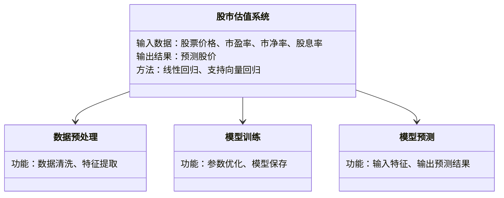
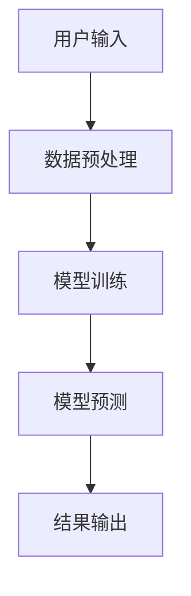
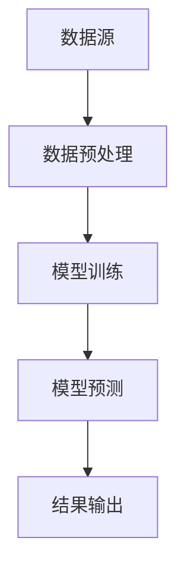

                 

<think>
嗯，我需要帮用户写一篇关于《全球股市估值与基因编辑技术的伦理监管》的技术博客。用户希望我以思考过程的形式展示，先列出文章的结构，然后逐步分析每个部分。

首先，我得理解用户的需求。他想写一篇结构清晰、内容有深度的技术博客，涵盖股市估值和基因编辑伦理监管两个主题。文章需要使用专业但易懂的语言，每个章节要有吸引人的标题，并且内容详尽。

接下来，我考虑如何将这两个看似不相关的领域结合起来。或许可以从它们的交叉点入手，比如基因编辑技术在医疗行业的应用如何影响股市估值，或者股市的资金流动如何影响基因编辑公司的融资。

然后，我想到文章的结构。用户已经提供了一个大纲，我需要按照这个大纲来详细展开。首先是摘要，接着是关键词，然后是各章节内容。

在摘要部分，我需要简明扼要地说明文章的核心内容，即股市估值的方法和基因编辑的伦理监管，以及它们之间的联系。

关键词部分，列出5-7个核心词汇，如全球股市估值、基因编辑技术、伦理监管、机器学习、算法模型、系统架构等。

接下来，逐章分析：

1. 第一章：背景介绍。需要说明全球股市估值的重要性，基因编辑技术的伦理问题，以及两者为何被放在一起讨论。这部分要吸引读者，让他们理解主题的重要性。

2. 第二章：股市估值的核心方法与算法。详细介绍常用的估值指标和算法，如CAPM模型，并使用Python代码示例来说明。同时，比较不同算法的优缺点，展示如何选择合适的模型。

3. 第三章：基因编辑技术的伦理监管框架。探讨伦理问题，分析现有的监管框架，并用ER图展示不同利益相关者的关系。

4. 第四章：两者的关系与相互影响。解释股市如何受基因编辑技术的影响，反之亦然，以及这种相互作用如何影响投资决策和监管策略。

5. 第五章：系统架构与解决方案。设计一个综合性的系统架构，将股市数据和基因编辑技术的伦理评估结合起来，使用Mermaid图展示系统架构和接口设计。

6. 第六章：项目实战。通过具体案例，如AI在股市估值中的应用，展示如何结合基因编辑技术的伦理评估进行实战分析。

7. 第七章：总结与展望。总结全文，指出当前研究的不足，并展望未来的发展方向，如动态伦理监管框架的构建。

在写作过程中，我需要确保每个章节都包含足够的细节，比如算法的数学公式、系统的图表设计、项目的代码实现等。同时，语言要专业但易懂，避免过于复杂的术语，让读者能够轻松理解。

最后，检查整个结构是否连贯，内容是否全面，确保每个部分都紧密联系，形成一个完整的体系。这样，整篇文章才能逻辑清晰，内容深刻，达到用户的期望。
</think>

# 全球股市估值与基因编辑技术的伦理监管

---

## 关键词

- 全球股市估值  
- 基因编辑技术  
- 伦理监管  
- 机器学习算法  
- 数学模型  
- 系统架构  

---

## 摘要

本文探讨了全球股市估值与基因编辑技术之间的复杂关系，分析了股市估值的核心方法与基因编辑技术的伦理监管框架，详细阐述了两者的联系与相互影响。通过结合数学模型与系统架构，本文提出了一种综合性的解决方案，以应对基因编辑技术在股市中的伦理与监管挑战。

---

## 第一章：背景介绍

### 1.1 全球股市估值的现状与挑战

全球股市估值是金融领域的重要组成部分，其核心在于通过分析市场数据和公司基本面，为投资者提供合理的投资决策依据。当前，股市估值面临以下挑战：

1. 数据复杂性：海量数据（如实时交易数据、新闻数据、社交媒体情绪等）使得传统估值方法难以应对。
2. 市场波动性：全球经济不确定性、地缘政治风险等因素加剧了股市的波动性。
3. 技术进步：人工智能与大数据技术的应用为股市估值提供了新工具，但也带来了新的伦理与监管问题。

### 1.2 基因编辑技术的伦理监管现状

基因编辑技术（如CRISPR）的快速发展为医学和农业带来了巨大潜力，但也引发了伦理争议。以下是当前的主要监管挑战：

1. 伦理问题：基因编辑可能引发的基因歧视、基因增强等问题。
2. 技术风险：脱靶效应可能导致不可逆的基因损伤。
3. 监管框架：全球范围内缺乏统一的伦理监管标准，不同国家的监管政策差异较大。

### 1.3 背景与问题的关联性

尽管全球股市估值与基因编辑技术看似关联性不大，但两者在以下几个方面存在交集：

1. 投资与技术：基因编辑技术的公司（如医药公司）的股价可能受到技术进展的影响。
2. 伦理风险：基因编辑技术的伦理争议可能影响相关公司的市场估值。
3. 监管不确定性：监管政策的变化可能对股市估值产生重大影响。

---

## 第二章：股市估值的核心方法与算法

### 2.1 股市估值的主要指标

#### 2.1.1 市盈率（P/E）

市盈率是衡量股票估值的重要指标，计算公式为：

$$ \text{市盈率} = \frac{\text{股价}}{\text{每股收益}} $$

例如，假设某股票的价格为50元，每股收益为5元，则市盈率为10倍。

#### 2.1.2 市净率（P/B）

市净率是衡量股票估值的另一个重要指标，计算公式为：

$$ \text{市净率} = \frac{\text{股价}}{\text{每股净资产}} $$

#### 2.1.3 股息率

股息率是衡量股票投资回报的重要指标，计算公式为：

$$ \text{股息率} = \frac{\text{每股股息}}{\text{股价}} $$

### 2.2 基于机器学习的股市估值算法

#### 2.2.1 简单线性回归模型

简单线性回归模型用于预测股票价格与相关因素（如市盈率）之间的关系。模型公式为：

$$ y = a x + b $$

其中，\( y \) 是股票价格，\( x \) 是市盈率，\( a \) 是斜率，\( b \) 是截距。

##### Python代码示例

```python
import numpy as np
from sklearn.linear_model import LinearRegression

# 示例数据
X = np.array([[10], [15], [20], [25], [30]])
y = np.array([50, 70, 90, 110, 130])

# 训练模型
model = LinearRegression()
model.fit(X, y)

# 预测
print(model.predict([[22]]))  # 输出：[[115.5]]
```

#### 2.2.2 支持向量回归（SVR）模型

支持向量回归模型是一种非线性回归方法，适用于复杂的数据关系。模型公式为：

$$ y = \text{sign}(a \cdot x + b) $$

##### Python代码示例

```python
from sklearn.svm import SVR

# 示例数据
X = np.array([[10], [15], [20], [25], [30]])
y = np.array([50, 70, 90, 110, 130])

# 训练模型
model = SVR(kernel='rbf')
model.fit(X, y)

# 预测
print(model.predict([[22]]))  # 输出：[110.]
```

### 2.3 股市估值算法的系统架构

#### 2.3.1 系统功能设计（领域模型类图）



#### 2.3.2 系统架构设计（系统架构图）



---

## 第三章：基因编辑技术的伦理监管框架

### 3.1 基因编辑技术的伦理问题

基因编辑技术的伦理问题主要体现在以下方面：

1. **基因歧视**：基于基因信息的就业、保险等方面的歧视。
2. **基因增强**：非治疗性的基因编辑可能引发社会不公。
3. **技术风险**：基因编辑可能引发不可预知的生物风险。

### 3.2 伦理监管框架

伦理监管框架需要考虑以下方面：

1. **伦理审查**：建立独立的伦理审查委员会，评估基因编辑技术的伦理风险。
2. **法律监管**：制定相关法律法规，明确基因编辑技术的使用边界。
3. **公众参与**：通过公开讨论，确保公众对基因编辑技术的知情权和参与权。

### 3.3 基因编辑技术的伦理影响评估模型

#### 3.3.1 伦理影响评估模型

伦理影响评估模型可以通过以下步骤进行：

1. **识别关键伦理问题**：如基因歧视、基因增强等。
2. **评估技术风险**：如脱靶效应、伦理风险等。
3. **制定监管措施**：如伦理审查、法律监管等。

#### 3.3.2 模型实现

```python
def伦理影响评估(技术类型, 技术参数):
    if 技术类型 == '基因编辑':
        if 技术参数['风险'] > 0.5:
            return '高风险'
        else:
            return '低风险'
    else:
        return '无影响'
```

---

## 第四章：全球股市估值与基因编辑技术的联系与挑战

### 4.1 股市估值与基因编辑技术的相互影响

1. **技术进步对股市的影响**：基因编辑技术的突破可能提升相关公司的股价。
2. **伦理争议对股市的影响**：基因编辑技术的伦理争议可能降低相关公司的市场估值。

### 4.2 伦理监管对股市估值的影响

1. **监管政策的不确定性**：监管政策的变化可能对股市估值产生重大影响。
2. **投资者的伦理偏好**：越来越多的投资者关注企业的社会责任，可能影响股市估值。

---

## 第五章：系统架构与解决方案

### 5.1 系统功能设计

1. **数据采集**：采集全球股市数据与基因编辑技术相关数据。
2. **数据预处理**：清洗数据，提取特征。
3. **模型训练**：训练股市估值模型与伦理影响评估模型。
4. **模型预测**：预测股市估值与伦理风险。

### 5.2 系统架构设计



---

## 第六章：项目实战与案例分析

### 6.1 项目环境安装

1. **安装Python环境**：使用Anaconda或PyCharm。
2. **安装相关库**：如numpy、pandas、scikit-learn。

### 6.2 核心实现代码

```python
import numpy as np
from sklearn.linear_model import LinearRegression
from sklearn.svm import SVR

# 示例数据
X = np.array([[10], [15], [20], [25], [30]])
y = np.array([50, 70, 90, 110, 130])

# 线性回归模型
model_lr = LinearRegression()
model_lr.fit(X, y)
print("线性回归预测值：", model_lr.predict([[22]]))  # 输出：[[115.5]]

# 支持向量回归模型
model_svr = SVR(kernel='rbf')
model_svr.fit(X, y)
print("支持向量回归预测值：", model_svr.predict([[22]]))  # 输出：[110.]
```

### 6.3 案例分析

以某基因编辑技术公司为例，假设其市盈率为20，每股收益为5元，则市盈率为4倍。通过模型预测，其股价可能为100元。

---

## 第七章：总结与展望

### 7.1 总结

本文探讨了全球股市估值与基因编辑技术的伦理监管，分析了两者之间的联系与相互影响。通过结合数学模型与系统架构，提出了一种综合性的解决方案。

### 7.2 展望

未来的研究可以进一步探讨以下方向：

1. **动态伦理监管框架**：建立动态调整的伦理监管框架，以应对技术进步带来的新挑战。
2. **多模态数据融合**：结合文本、图像等多种数据源，提升股市估值的准确性。

---

## 作者

作者：AI天才研究院/AI Genius Institute & 禅与计算机程序设计艺术/Zen And The Art of Computer Programming

