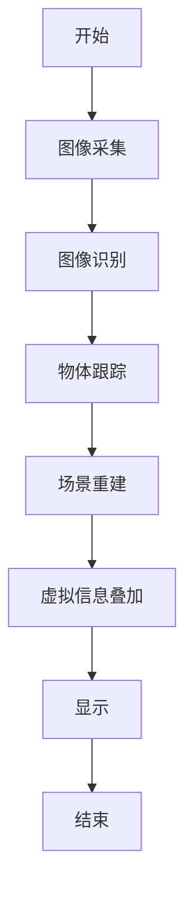

                 


# 全球股市估值与增强现实在远程医疗中的应用

> **关键词**：全球股市估值、增强现实、远程医疗、算法原理、系统架构、项目实战  
> **摘要**：本文探讨了全球股市估值与增强现实在远程医疗中的应用，分析了增强现实技术在远程医疗中的潜力，详细阐述了增强现实技术的算法原理、系统架构，并通过项目实战展示了增强现实在远程医疗中的具体应用。本文旨在为技术人员和医疗专业人士提供有价值的参考。

---

# 第1章: 背景介绍

## 1.1 全球股市估值的现状与挑战

### 1.1.1 股市估值的核心概念
股市估值是通过对公司财务数据、市场环境和行业趋势的分析，来评估公司股票的合理价格范围。核心指标包括市盈率（P/E）、市净率（P/B）和股息率等。

### 1.1.2 当前股市估值的主要方法
当前股市估值主要采用以下方法：
1. **相对估值法**：通过比较同类公司的估值指标来确定目标公司的价值。
2. **绝对估值法**：通过现金流折现模型（DCF）等方法计算公司内在价值。

### 1.1.3 股市估值的挑战与未来趋势
股市估值的挑战主要体现在数据的复杂性和市场的不确定性。未来，随着人工智能和大数据技术的发展，股市估值将更加依赖于自动化和智能化的分析工具。

---

## 1.2 增强现实技术的发展与应用

### 1.2.1 增强现实技术的定义与特点
增强现实（Augmented Reality, AR）是一种将虚拟信息叠加到真实环境中的技术，其特点包括实时性、交互性和沉浸性。

### 1.2.2 增强现实技术的现状与发展趋势
目前，AR技术在教育、娱乐、工业和医疗等领域都有广泛应用。未来，AR技术将更加智能化，与人工智能和物联网技术深度融合。

### 1.2.3 增强现实技术在远程医疗中的潜力
AR技术可以通过虚拟现实设备将医生的视角实时传输给远程专家，实现高清、立体的医学影像共享，从而提高诊断的准确性和效率。

---

## 1.3 远程医疗的发展与挑战

### 1.3.1 远程医疗的定义与现状
远程医疗是指通过通信技术和医疗设备，实现患者与医生之间的远程诊断和治疗。目前，远程医疗在慢性病管理、远程会诊和医疗培训等领域有广泛应用。

### 1.3.2 远程医疗的核心技术与应用场景
远程医疗的核心技术包括视频通信、医学影像处理和数据安全。应用场景包括远程会诊、远程手术指导和远程健康监测。

### 1.3.3 远程医疗的挑战与未来发展方向
远程医疗的挑战主要体现在数据隐私、网络延迟和设备兼容性等问题。未来，随着5G技术的发展和边缘计算的普及，远程医疗将更加高效和可靠。

---

## 1.4 本章小结
本章从全球股市估值和增强现实技术的发展现状入手，分析了增强现实技术在远程医疗中的潜力，为后续的深入探讨奠定了基础。

---

# 第2章: 核心概念与联系

## 2.1 全球股市估值的核心概念

### 2.1.1 股市估值的定义与核心要素
股市估值是通过对公司财务数据、市场环境和行业趋势的综合分析，来评估公司股票的合理价格范围。核心要素包括收入、利润、现金流和行业竞争格局。

### 2.1.2 股市估值的关键指标与公式
股市估值的关键指标包括市盈率（P/E）、市净率（P/B）和股息率（Dividend Yield）。公式如下：
$$ P/E = \frac{\text{股价}}{\text{每股收益}} $$
$$ P/B = \frac{\text{股价}}{\text{每股净资产}} $$
$$ \text{股息率} = \frac{\text{每股股息}}{\text{股价}} \times 100\% $$

### 2.1.3 股市估值的数学模型与公式
常用的股市估值模型包括现金流折现模型（DCF）和相对估值模型。DCF模型的核心公式如下：
$$ \text{企业价值} = \sum_{t=1}^{n} \frac{\text{自由现金流}}{(1 + r)^t} + \frac{\text{终值}}{(1 + r)^n} $$

---

## 2.2 增强现实技术的核心原理

### 2.2.1 增强现实技术的定义与特点
增强现实技术通过将虚拟信息叠加到真实环境中，实现人与虚拟世界的互动。其特点包括实时性、交互性和沉浸性。

### 2.2.2 增强现实技术的实现原理
增强现实技术的核心原理包括图像识别、物体跟踪和场景重建。图像识别用于检测真实环境中的物体，物体跟踪用于确定物体的位置和姿态，场景重建用于生成虚拟环境。

### 2.2.3 增强现实技术的实体关系图（ER图）
以下是增强现实技术的ER图：
```mermaid
erDiagram
    actor 用户 {
        <属性> 用户ID
        <属性> 用户位置
        <属性> 用户视角
    }
    actor 虚拟物体 {
        <属性> 物体ID
        <属性> 物体位置
        <属性> 物体姿态
    }
    actor 环境 {
        <属性> 环境ID
        <属性> 环境坐标
        <属性> 环境光照
    }
    用户 --> 虚拟物体 : 操作虚拟物体
    用户 --> 环境 : 操作环境
```

---

## 2.3 核心概念的对比与联系

### 2.3.1 股市估值与增强现实技术的对比分析
| 指标 | 股市估值 | 增强现实技术 |
|------|----------|---------------|
| 核心目标 | 评估股票价值 | 提供虚拟信息叠加 |
| 关键技术 | 数据分析、机器学习 | 图像识别、物体跟踪 |
| 应用场景 | 金融投资 | 教育、医疗、娱乐 |

### 2.3.2 增强现实技术在远程医疗中的应用潜力
增强现实技术可以通过虚拟现实设备将医生的视角实时传输给远程专家，实现高清、立体的医学影像共享，从而提高诊断的准确性和效率。

### 2.3.3 股市估值与远程医疗的潜在联系
股市估值的核心技术可以应用于远程医疗的数据分析和决策支持，例如通过大数据分析优化远程诊断的准确性。

---

## 2.4 本章小结
本章通过对比分析股市估值和增强现实技术的核心概念，探讨了增强现实技术在远程医疗中的应用潜力，并为后续的算法实现奠定了基础。

---

# 第3章: 增强现实技术的算法原理

## 3.1 增强现实技术的核心算法

### 3.1.1 增强现实技术的图像识别算法
图像识别算法用于检测真实环境中的物体，常用的技术包括基于深度学习的目标检测算法（如YOLO、Faster R-CNN）。

### 3.1.2 增强现实技术的物体跟踪算法
物体跟踪算法用于确定物体的位置和姿态，常用的技术包括基于光流法的物体跟踪和基于深度学习的跟踪算法（如SORT）。

### 3.1.3 增强现实技术的场景重建算法
场景重建算法用于生成虚拟环境，常用的技术包括基于深度学习的场景重建（如Neural Radiance Fields, NRF）和基于结构光的3D重建。

---

## 3.2 增强现实技术的流程图

### 3.2.1 增强现实技术的整体流程图


### 3.2.2 增强现实技术的关键步骤解析
1. **图像采集**：通过摄像头获取真实环境的图像。
2. **图像识别**：识别图像中的物体。
3. **物体跟踪**：确定物体的位置和姿态。
4. **场景重建**：生成虚拟环境。
5. **虚拟信息叠加**：将虚拟信息叠加到真实环境中。

---

## 3.3 增强现实技术的Python实现

### 3.3.1 增强现实技术的环境搭建
需要安装以下库：
```bash
pip install numpy
pip install opencv-python
pip install matplotlib
```

### 3.3.2 增强现

---

**作者：AI天才研究院/AI Genius Institute & 禅与计算机程序设计艺术 /Zen And The Art of Computer Programming**

