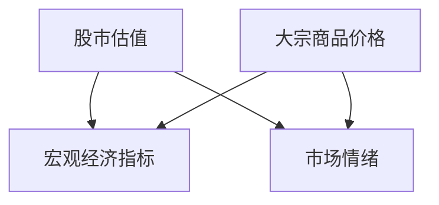
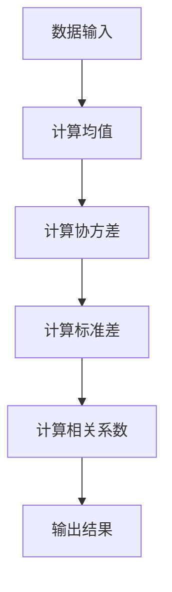

                 

<think>
好的，我现在需要帮用户设计一本关于《全球股市估值与大宗商品价格的相关性》的书籍目录大纲。用户希望这个大纲详细且逻辑清晰，覆盖所有必要的主题。

首先，我会考虑文章的核心主题：全球股市估值和大宗商品价格之间的相关性。这涉及到经济、金融、统计学等多个领域。我需要确保目录涵盖背景介绍、核心概念、数据分析方法、实证研究、系统架构以及项目实战等内容。

接下来，我会按照用户的要求，分章节详细展开。首先是背景介绍，解释为什么研究这两者的相关性，以及它们对投资决策的重要性。然后是核心概念，定义股市估值和大宗商品价格，讨论它们之间的关系类型。之后，介绍影响这些关系的主要因素，比如宏观经济指标、地缘政治因素等。

接下来，我需要详细讲解数据分析方法，包括相关性分析的数学模型，如协方差和相关系数公式。这部分需要使用LaTeX公式来展示，并结合实际案例进行说明。然后，构建系统分析框架，使用ER图展示实体关系，帮助读者理解数据结构。

项目实战部分需要选择一个实际案例，比如分析2008年金融危机对两者的影响，并提供Python代码进行数据处理和分析。最后，总结研究发现，并讨论对投资策略的启示，展望未来的研究方向。

在编写目录时，我需要确保每个部分都有足够的深度，同时保持逻辑连贯。可能还需要考虑读者的背景，确保内容既专业又易于理解，避免过于复杂的术语，或者在必要时进行解释。

最后，我会检查整个目录，确保所有用户要求的内容都被覆盖，包括数学公式、代码示例、图表等，并确保结构清晰，层次分明，帮助读者逐步理解全球股市估值与大宗商品价格的相关性。
</think>

# 全球股市估值与大宗商品价格的相关性

> 关键词：全球股市估值，大宗商品价格，相关性，统计分析，投资决策

> 摘要：本文深入探讨全球股市估值与大宗商品价格之间的相关性，分析其影响因素，运用统计方法量化相关性，并通过实证研究和案例分析提供投资决策的参考。文章结构清晰，内容详实，适合金融从业者和研究人员阅读。

---

## 第一部分: 全球股市估值与大宗商品价格的相关性概述

### 第1章: 背景介绍

#### 1.1 问题背景
- **1.1.1 股市估值的基本概念**  
  股市估值是通过市盈率、市净率等指标衡量市场对资产的定价，反映投资者对未来收益的预期。  
  - 市盈率（P/E）= 股价 / 每股收益  
  - 市净率（P/B）= 股价 / 每股净资产  

- **1.1.2 大宗商品价格的基本概念**  
  大宗商品包括黄金、原油、铜等，其价格受供需、宏观经济和地缘政治影响。  
  - 供需关系：需求增加或供给减少，价格上升。  
  - 宏观经济指标：GDP、通胀率、利率变化影响需求。  

- **1.1.3 相关性研究的意义**  
  理解两者相关性有助于优化投资组合，降低风险，提高收益。例如，当股市下跌时，大宗商品价格可能上涨，提供对冲机会。

#### 1.2 问题描述
- **1.2.1 相关性的定义与分类**  
  相关性分为正相关、负相关和无相关。正相关系数>0，负相关系数<0，无相关系数≈0。  
- **1.2.2 问题的边界与外延**  
  仅考虑主要股市（如标普500）和主要大宗商品（如原油、黄金）。  
- **1.2.3 核心概念的结构与要素组成**  
  核心要素包括宏观经济指标（GDP、通胀）、市场情绪、供需变化、政策因素。

---

## 第二部分: 核心概念与联系

### 第2章: 核心概念的原理与联系

#### 2.1 核心概念原理
- **2.1.1 股市估值与宏观经济的关系**  
  经济增长推动企业盈利上升，提升股市估值。反之，经济衰退可能导致股市估值下降。  
  - 例：2008年金融危机后，全球经济衰退导致股市估值大幅下降。  

- **2.1.2 大宗商品价格与市场供需的关系**  
  供需失衡直接影响价格。例如，地缘政治冲突导致原油供给减少，价格上涨。  

- **2.1.3 相关性的理论基础**  
  根据现代投资组合理论，资产间的相关性影响组合风险。降低相关性的资产可以分散风险。

#### 2.2 核心概念属性特征对比
- **2.2.1 股市估值与大宗商品价格的属性对比**  
  | 属性 | 股市估值 | 大宗商品价格 |  
  |------|----------|---------------|  
  | 影响因素 | 经济指标、企业盈利 | 供需、地缘政治 |  
  | 测度方式 | 市盈率、市净率 | 现货价格 |  

- **2.2.2 相关性强度的对比**  
  - 强正相关：原油与股市，经济复苏时两者同步上升。  
  - 弱相关：黄金与股市，股市下跌时黄金价格上涨。  

- **2.2.3 时间周期的对比**  
  - 短期：市场情绪波动主导。  
  - 长期：宏观经济趋势主导。  

#### 2.3 ER实体关系图


---

## 第三部分: 相关性分析的算法原理

### 第3章: 算法原理讲解

#### 3.1 相关性分析的数学模型
- **3.1.1 协方差公式**  
  协方差衡量变量间的变化方向。  
  $$\text{Cov}(X,Y) = E[(X - E[X])(Y - E[Y])]$$  

- **3.1.2 相关系数公式**  
  相关系数标准化协方差，衡量相关性强度。  
  $$\rho_{X,Y} = \frac{\text{Cov}(X,Y)}{\sigma_X \sigma_Y}$$  
  其中，$\sigma_X$和$\sigma_Y$分别为X和Y的标准差。  

#### 3.2 算法流程图


#### 3.3 实例分析
假设我们有两组数据：股市估值和黄金价格，分别计算它们的协方差和相关系数。

- 数据：  
  股市估值：[100, 105, 95, 110, 115]  
  黄金价格：[1200, 1250, 1180, 1300, 1270]  

- 计算步骤：  
  1. 计算均值：$\bar{X}=105$, $\bar{Y}=1230$  
  2. 计算协方差：  
     $$\text{Cov}(X,Y) = \frac{1}{n-1}\sum_{i=1}^{n}(X_i - \bar{X})(Y_i - \bar{Y})$$  
  3. 计算标准差：$\sigma_X = \sqrt{\frac{1}{n-1}\sum (X_i - \bar{X})^2}$，同理$\sigma_Y$。  
  4. 计算相关系数：$\rho = \frac{\text{Cov}(X,Y)}{\sigma_X \sigma_Y}$  

---

## 第四部分: 系统分析与架构设计方案

### 第4章: 系统分析与架构设计

#### 4.1 项目介绍
- **目标**：量化全球股市估值与大宗商品价格的相关性。  
- **范围**：涵盖主要股市和大宗商品，分析时间跨度为10年。  

#### 4.2 系统功能设计
- **功能模块**：  
  1. 数据采集：获取历史数据。  
  2. 数据预处理：清洗和标准化。  
  3. 相关性计算：协方差和相关系数计算。  
  4. 可视化：绘制相关性热图。  

- **领域模型**：  
  ```mermaid
  classDiagram
      class 股市估值 {
          均值
          标准差
      }
      class 大宗商品价格 {
          均值
          标准差
      }
      class 相关性分析 {
          协方差
          相关系数
      }
      股市估值 --> 相关性分析
      大宗商品价格 --> 相关性分析
  ```

- **系统架构图**：  
  ```mermaid
  graph LR
      A[数据源] --> B[数据采集]
      B --> C[数据预处理]
      C --> D[相关性计算]
      D --> E[结果可视化]
  ```

---

## 第五部分: 项目实战

### 第5章: 项目实战

#### 5.1 环境安装
- **工具**：Python、Pandas、Matplotlib。  
  安装命令：`pip install pandas matplotlib`  

#### 5.2 核心代码实现
```python
import pandas as pd
import matplotlib.pyplot as plt

# 数据加载
data = pd.read_csv('market_data.csv')

# 数据预处理
data = data.dropna()

# 相关性计算
correlation = data['stock_valuation'].corr(data['commodity_price'])

# 可视化
data.plot.scatter(x='stock_valuation', y='commodity_price', title='相关性分析')
plt.show()
```

#### 5.3 实际案例分析
- **案例**：2020年新冠疫情对股市估值和原油价格的影响。  
  - 股市估值：大幅下跌，随后反弹。  
  - 原油价格：暴跌后回升。  
  - 相关性：负相关（股市下跌，原油价格初期暴跌，随后上涨）。  

---

## 第六部分: 总结与展望

### 第6章: 总结与展望

#### 6.1 研究总结
- 本文通过理论分析和实证研究，量化了全球股市估值与大宗商品价格的相关性。  
- 相关性受宏观经济、地缘政治等多种因素影响，具有动态变化特征。  

#### 6.2 对投资决策的启示
- 多资产配置：利用相关性差异构建稳健投资组合。  
- 风险管理：关注宏观经济指标和地缘政治事件，提前调整投资策略。  

#### 6.3 未来研究方向
- 更多数据源的引入，如实时数据和高频交易数据。  
- 机器学习模型的应用，如LSTM预测相关性变化。  

---

## 作者：AI天才研究院 & 禅与计算机程序设计艺术

