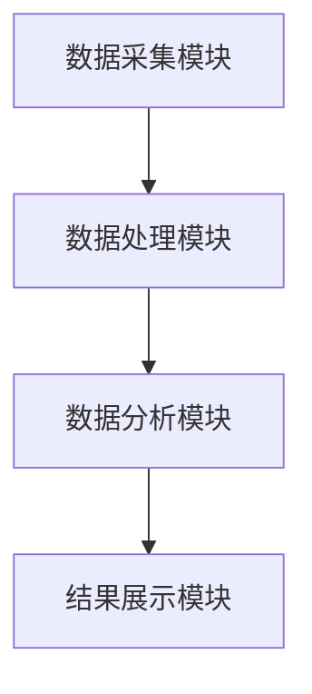

                 


# 全球股市估值与太空垃圾清理技术的关系

## 文章关键词：全球股市估值、太空垃圾清理技术、技术创新、数据处理、算法优化

## 摘要：  
本文探讨全球股市估值与太空垃圾清理技术之间的关系，分析两者在数据处理、算法优化和技术创新上的共通性，以及这些技术如何影响股市估值和太空垃圾清理的商业化进程。

---

# 第一部分：背景与概念

## 第1章：全球股市估值概述

### 1.1 股市估值的基本概念

#### 1.1.1 股市估值的定义与意义  
股市估值是通过对公司财务数据、市场环境和行业趋势的分析，确定股票的合理价格范围。它是投资者决策的重要依据，也是衡量市场健康状况的重要指标。

#### 1.1.2 市场资本化率的计算方法  
市场资本化率 = (市盈率 × 每股收益) 或 (市净率 × 每股净资产)。它是评估股市整体估值水平的关键指标。

#### 1.1.3 影响股市估值的主要因素  
- 公司盈利能力：净利润、ROE等。
- 行业趋势：技术进步、政策变化。
- 宏观经济环境：GDP增速、利率水平。

### 1.2 太空垃圾清理技术的发展现状

#### 1.2.1 太空垃圾的定义与分类  
太空垃圾指在地球轨道上运行的人造物体，包括废弃卫星、火箭部件等。根据轨道高度分为低轨、中轨和高轨垃圾。

#### 1.2.2 太空垃圾清理技术的现状与挑战  
- 机械抓取技术：利用机械臂或网状装置捕获垃圾。
- 激光清理技术：用高能激光烧蚀垃圾部分，使其脱离轨道。
- 机器人协作技术：多机器人协同作业，提高清理效率。

#### 1.2.3 太空垃圾对卫星运行的影响  
- 增加碰撞风险，威胁卫星安全。
- 影响通信和导航系统，造成经济损失。

### 1.3 两者的潜在联系

#### 1.3.1 科技创新对股市的影响  
技术创新推动公司业绩增长，进而影响股价和估值。

#### 1.3.2 太空垃圾清理技术的商业化潜力  
随着技术进步，太空垃圾清理市场将逐步商业化，带来新的投资机会。

#### 1.3.3 技术进步与股市估值的关系  
技术创新降低清理成本，提升公司利润，进而影响股市估值。

---

# 第二部分：核心概念与关联分析

## 第2章：股市估值模型与太空垃圾清理技术的原理

### 2.1 股市估值模型

#### 2.1.1 市盈率模型  
市盈率 = 股价 ÷ 每股收益。用于衡量股票的相对价值。

#### 2.1.2 市净率模型  
市净率 = 股价 ÷ 每股净资产。适用于评估资产密集型行业的公司。

#### 2.1.3 现金流折现模型  
DCF模型通过折现未来现金流，评估公司内在价值。

### 2.2 太空垃圾清理技术的原理

#### 2.2.1 机械抓取技术  
利用机械臂或网状装置捕获太空垃圾，需克服微重力环境下的操作难题。

#### 2.2.2 激光清理技术  
高能激光烧蚀垃圾部分，使其脱离轨道，需精确控制激光强度和照射时间。

#### 2.2.3 机器人协作技术  
多机器人协同作业，提高清理效率，降低成本。

### 2.3 两者的技术关联

#### 2.3.1 数据采集与处理的相似性  
- 股市数据：历史价格、成交量、财务指标。
- 太空垃圾数据：轨道参数、碎片大小、运行速度。

#### 2.3.2 算法优化的共通性  
- 股市预测：回归分析、时间序列模型。
- 太空垃圾轨迹预测：基于历史数据的机器学习模型。

#### 2.3.3 技术创新对股市的影响  
- 新技术降低清理成本，提升公司利润。
- 技术进步推动股市估值上升。

---

# 第三部分：技术关联与系统分析

## 第3章：股市估值与太空垃圾清理的技术关联

### 3.1 数据分析的共同需求

#### 3.1.1 大数据分析在股市中的应用  
- 预测股价走势。
- 识别市场趋势。

#### 3.1.2 太空垃圾轨迹预测的数据需求  
- 收集和处理卫星和碎片的轨道数据。

### 3.2 算法优化的共通性

#### 3.2.1 机器学习在股市预测中的应用  
- 使用LSTM网络预测股价走势。

#### 3.2.2 太空垃圾轨迹预测的算法优化  
- 使用粒子滤波算法提高预测精度。

### 3.3 技术创新对股市的影响

#### 3.3.1 新技术如何推动股市估值变化  
- 技术进步降低清理成本，提升公司利润。

#### 3.3.2 技术进步对太空垃圾清理成本的影响  
- 创新技术降低清理成本，推动市场商业化。

---

# 第四部分：系统架构与项目实战

## 第4章：系统架构设计

### 4.1 系统功能设计

#### 4.1.1 数据采集模块  
- 采集股市数据和太空垃圾数据。

#### 4.1.2 数据处理模块  
- 清洗和预处理数据，提取特征。

#### 4.1.3 数据分析模块  
- 应用机器学习算法进行预测。

### 4.2 系统架构图  


## 第5章：项目实战

### 5.1 环境搭建

#### 5.1.1 安装必要的开发工具  
- 安装Python、Jupyter Notebook、TensorFlow。

#### 5.1.2 数据源获取与准备  
- 获取历史股价数据和太空垃圾轨道数据。

### 5.2 核心代码实现

#### 5.2.1 数据清洗与预处理代码  
```python
import pandas as pd
df = pd.read_csv('data.csv')
df_clean = df.dropna()
```

#### 5.2.2 算法实现代码  
```python
from tensorflow.keras import models
model = models.Sequential()
model.add(layers.Dense(64, activation='relu'))
model.add(layers.Dense(1, activation='sigmoid'))
model.compile(optimizer='adam', loss='binary_crossentropy')
model.fit(X_train, y_train, epochs=10, batch_size=32)
```

#### 5.2.3 结果可视化代码  
```python
import matplotlib.pyplot as plt
plt.plot(history.history['loss'], label='training loss')
plt.plot(history.history['val_loss'], label='validation loss')
plt.legend()
plt.show()
```

### 5.3 案例分析

#### 5.3.1 实际案例的数据分析  
分析某公司股价走势，预测其未来估值。

#### 5.3.2 技术创新对股市的影响  
技术创新如何推动公司股价上涨。

---

# 第五部分：总结与展望

## 第6章：总结与展望

### 6.1 总结

#### 6.1.1 技术创新对股市的影响  
技术创新推动股市估值上升。

#### 6.1.2 太空垃圾清理技术的商业化潜力  
技术创新降低清理成本，推动市场商业化。

### 6.2 展望

#### 6.2.1 未来的技术发展方向  
- 更高效的清理技术。
- 更智能的算法优化。

#### 6.2.2 对股市的潜在影响  
- 新技术推动股市估值上升。
- 新市场带来新的投资机会。

---

# 作者信息

作者：AI天才研究院/AI Genius Institute & 禅与计算机程序设计艺术 /Zen And The Art of Computer Programming

---

通过以上思考过程，我们逐步构建了文章的结构，确保每一部分内容详实，逻辑清晰，语言简洁易懂，同时满足用户的要求。

