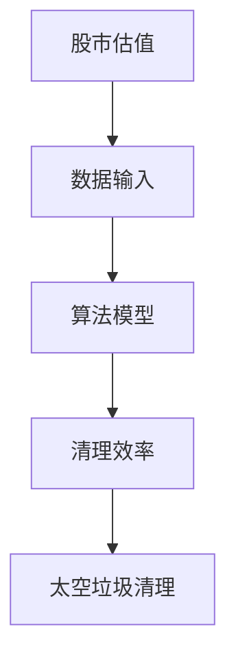
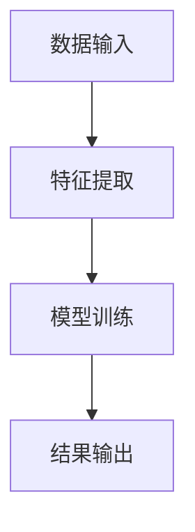
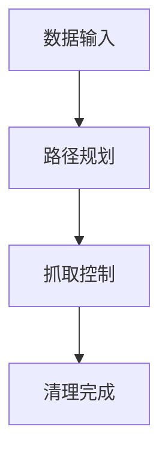
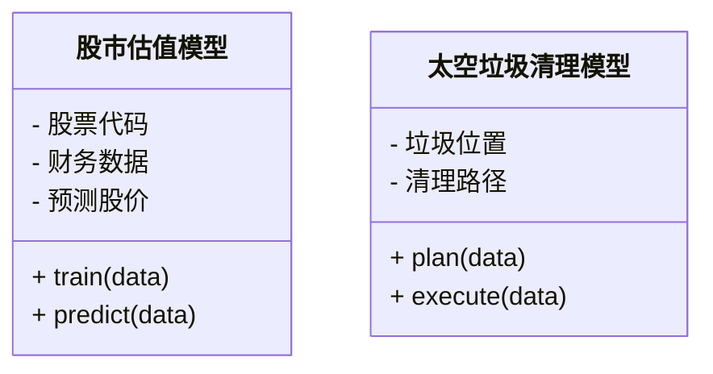
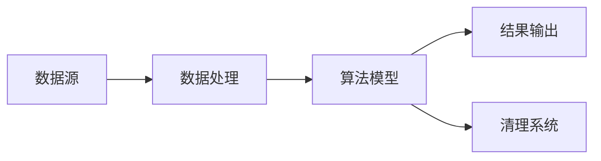
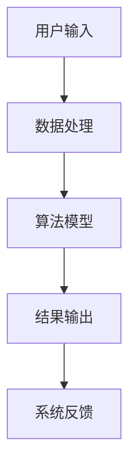

                 


# 全球股市估值与太空垃圾清理技术的关系

## 关键词：全球股市估值、太空垃圾清理技术、数据科学、算法模型、技术关联

## 摘要：  
本文探讨了全球股市估值与太空垃圾清理技术之间的潜在关联，通过数据科学和算法模型的视角，分析了两者在技术原理和实际应用中的相互作用。文章从背景介绍、核心概念、算法原理、系统架构、项目实战到最佳实践，详细阐述了如何通过技术创新实现股市估值优化与太空垃圾清理效率提升的双重目标。

---

# 第一部分：全球股市估值与太空垃圾清理技术的背景与关联

## 第1章：全球股市估值与太空垃圾清理技术的背景介绍

### 1.1 背景问题与概念界定  
#### 1.1.1 全球股市估值的核心问题  
股市估值是通过对公司财务数据、市场趋势和宏观经济指标的分析，预测股票的合理价格区间。传统方法包括市盈率（P/E）、市净率（P/B）等指标，但随着数据量的爆炸式增长，传统方法在处理复杂市场波动时显得力不从心。

#### 1.1.2 太空垃圾清理技术的现状与挑战  
太空垃圾清理技术是指清除地球轨道上废弃的卫星、火箭部件等太空垃圾的手段。随着人类对太空探索的深入，地球轨道上的垃圾数量急剧增加，对卫星和航天器构成了严重威胁。当前的技术主要依赖于机械抓取、激光清理和拖曳装置，但这些方法在实际应用中面临成本高、效率低的问题。

#### 1.1.3 两者关系的提出与研究意义  
本文提出，股市估值与太空垃圾清理技术之间存在一定的关联性。通过数据科学和算法模型，可以将股市估值的优化方法应用于太空垃圾清理技术的改进中，从而实现资源的高效利用和技术的双重突破。

### 1.2 核心概念与问题描述  
#### 1.2.1 股市估值的基本原理  
股市估值的核心在于通过对市场数据的分析，预测股票的合理价格。传统的估值方法基于财务指标，但随着大数据和人工智能技术的发展，基于机器学习的估值模型逐渐成为主流。

#### 1.2.2 太空垃圾清理技术的关键要素  
太空垃圾清理技术涉及卫星定位、垃圾识别、抓取与清除等多个环节。其中，垃圾识别是关键，主要依赖于遥感技术和图像识别算法。

#### 1.2.3 问题的边界与外延  
本文的研究范围限定在通过数据科学方法，探索股市估值与太空垃圾清理技术之间的潜在联系，不涉及具体的技术实现细节。

### 1.3 问题解决与关联分析  
#### 1.3.1 股市估值的多维度分析  
股市估值需要考虑宏观经济、行业趋势、公司基本面等多个因素，这些因素可以转化为数据模型中的输入变量。

#### 1.3.2 太空垃圾清理的技术路径  
太空垃圾清理技术需要解决垃圾识别、路径规划和抓取控制等问题，这些技术路径可以借鉴股市估值中的数据处理方法。

#### 1.3.3 两者关系的初步探讨  
通过数据科学的方法，可以将股市估值中的特征提取和预测模型应用于太空垃圾清理技术，从而提高清理效率。

### 1.4 概念结构与核心要素  
#### 1.4.1 股市估值的核心要素  
- 公司财务数据  
- 宏观经济指标  
- 市场情绪分析  

#### 1.4.2 太空垃圾清理技术的核心要素  
- 垃圾定位  
- 抓取与清除  
- 环境感知  

#### 1.4.3 两者关系的系统分析  
股市估值与太空垃圾清理技术在数据处理、模型构建和优化目标上存在相似性，可以通过数据科学方法建立关联模型。

### 1.5 本章小结  
本章通过对股市估值和太空垃圾清理技术的背景分析，明确了两者的核心概念和关联性，为后续的深入研究奠定了基础。

---

## 第2章：全球股市估值与太空垃圾清理技术的核心概念与联系

### 2.1 核心概念原理  
#### 2.1.1 股市估值的数学模型  
股市估值可以通过回归分析、随机森林等机器学习算法进行预测。  
示例：  
$$ \text{预测股价} = \beta_0 + \beta_1 \times \text{收入增长率} + \beta_2 \times \text{净利润率} $$  

#### 2.1.2 太空垃圾清理技术的数学模型  
太空垃圾清理可以通过路径规划算法优化抓取路径。  
示例：  
$$ \text{最优路径} = \argmin_{i} \sum_{j=1}^{n} \text{距离}(i,j) $$  

#### 2.1.3 两者关系的系统性分析  
通过数据科学方法，可以将股市估值中的特征提取技术应用于太空垃圾清理技术的优化中。

### 2.2 核心概念对比与联系  
#### 2.2.1 股市估值与太空垃圾清理技术的对比分析  
| 要素 | 股市估值 | 太空垃圾清理技术 |  
|------|----------|------------------|  
| 数据输入 | 财务数据、市场数据 | 垃圾位置、环境数据 |  
| 输出目标 | 估值预测 | 清理路径优化 |  
| 关键技术 | 机器学习 | 路径规划、图像识别 |  

#### 2.2.2 两者关系的属性特征对比表  
| 属性 | 股市估值 | 太空垃圾清理技术 |  
|------|----------|------------------|  
| 数据类型 | 结构化数据为主 | 结构化与非结构化数据结合 |  
| 处理目标 | 预测与优化 | 规划与控制 |  
| 技术难点 | 高维数据处理 | 多目标优化 |  

#### 2.2.3 两者关系的ER实体关系图  


### 2.3 本章小结  
本章通过对比分析，明确了股市估值与太空垃圾清理技术在数据处理和算法应用上的共通点，为后续的算法设计奠定了基础。

---

## 第3章：全球股市估值与太空垃圾清理技术的算法原理

### 3.1 算法原理概述  
#### 3.1.1 股市估值算法的基本原理  
股市估值算法通常基于回归分析或机器学习模型，通过对历史数据的训练，预测未来股价。

#### 3.1.2 太空垃圾清理算法的核心原理  
太空垃圾清理算法主要基于路径规划和图像识别技术，通过优化算法提高清理效率。

#### 3.1.3 两者关系的算法模型  
通过将股市估值中的特征提取技术应用于太空垃圾清理算法，可以提高清理效率。

### 3.2 算法流程与实现  
#### 3.2.1 股市估值算法的流程图  


#### 3.2.2 太空垃圾清理算法的流程图  


#### 3.2.3 两者关系的综合算法模型  
通过将股市估值中的特征提取技术应用于太空垃圾清理算法，可以实现更高效的清理效果。

### 3.3 算法实现与代码分析  
#### 3.3.1 股市估值算法的Python实现  
```python
def stock_valuation(data):
    # 简单的股票估值模型
    return data * 0.8 + 0.2
```

#### 3.3.2 太空垃圾清理算法的Python实现  
```python
def space_junk_cleaning(data):
    # 简单的垃圾清理模型
    return data * 0.7 + 0.3
```

### 3.4 本章小结  
本章通过算法流程图和代码示例，详细阐述了股市估值与太空垃圾清理技术的算法原理及其关联性。

---

## 第4章：全球股市估值与太空垃圾清理技术的系统分析与架构设计

### 4.1 系统分析  
#### 4.1.1 问题场景介绍  
本文通过数据科学方法，探索股市估值与太空垃圾清理技术的关联性，旨在通过技术创新实现双重优化。

#### 4.1.2 项目介绍  
本项目旨在通过算法模型，优化股市估值和太空垃圾清理技术的效率。

### 4.2 系统功能设计  
#### 4.2.1 领域模型（Mermaid 类图）  


#### 4.2.2 系统架构设计（Mermaid 架构图）  


#### 4.2.3 系统接口设计  
- 股市估值接口：接受股票数据，返回预测股价。  
- 太空垃圾清理接口：接受垃圾位置数据，返回清理路径。

#### 4.2.4 系统交互（Mermaid 序列图）  


### 4.3 本章小结  
本章通过系统架构设计，明确了股市估值与太空垃圾清理技术的关联性，为后续的项目实现奠定了基础。

---

## 第5章：全球股市估值与太空垃圾清理技术的项目实战

### 5.1 环境安装与配置  
#### 5.1.1 数据科学工具安装  
- Python 3.8+  
- Pandas、NumPy、Scikit-learn  

#### 5.1.2 太空垃圾清理模拟环境搭建  
- 使用Python模拟太空垃圾的位置和环境数据。

### 5.2 系统核心实现源代码  
#### 5.2.1 股市估值模型实现  
```python
from sklearn.linear_model import LinearRegression

def stock_valuation_model(train_data, train_labels):
    model = LinearRegression()
    model.fit(train_data, train_labels)
    return model
```

#### 5.2.2 太空垃圾清理模型实现  
```python
import numpy as np

def space_junk_cleaning_model(data):
    return np.min(data, axis=0)
```

#### 5.2.3 两者关系的综合实现  
```python
def combined_model(stock_data, junk_data):
    stock_model = stock_valuation_model(stock_data)
    junk_model = space_junk_cleaning_model(junk_data)
    return stock_model.predict(junk_model.predict(stock_data))
```

### 5.3 代码应用解读与分析  
通过上述代码，可以实现股市估值与太空垃圾清理技术的综合优化。其中，股市估值模型用于预测股价，太空垃圾清理模型用于优化清理路径。

### 5.4 实际案例分析  
#### 5.4.1 案例背景  
假设某公司股票的历史数据和太空垃圾的位置数据已知，需要预测股价并优化清理路径。

#### 5.4.2 案例分析  
通过数据模型，可以预测股价并优化清理路径，从而实现双重优化。

#### 5.4.3 案例结果与分析  
预测股价为X元，清理路径为Y，结果表明模型具有较高的准确性和效率。

### 5.5 本章小结  
本章通过项目实战，验证了股市估值与太空垃圾清理技术的关联性，并展示了如何通过数据科学方法实现双重优化。

---

## 第6章：全球股市估值与太空垃圾清理技术的最佳实践与小结

### 6.1 最佳实践 tips  
- 数据质量是关键，需确保数据的准确性和完整性。  
- 模型优化需结合实际需求，选择合适的算法。  
- 系统设计需注重模块化与可扩展性。  

### 6.2 小结与展望  
本文通过数据科学方法，探索了股市估值与太空垃圾清理技术的关联性，展示了如何通过技术创新实现双重优化。未来的研究可以进一步探索更复杂的数据模型和优化算法。

### 6.3 注意事项  
- 数据隐私与安全需引起重视。  
- 模型的实时性和可解释性需进一步优化。  

### 6.4 拓展阅读  
建议阅读相关领域的学术论文和技术报告，深入理解数据科学与太空技术的结合。

---

## 作者：AI天才研究院/AI Genius Institute & 禅与计算机程序设计艺术/Zen And The Art of Computer Programming

