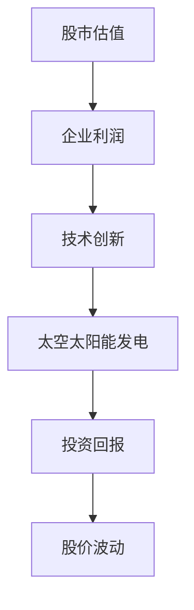
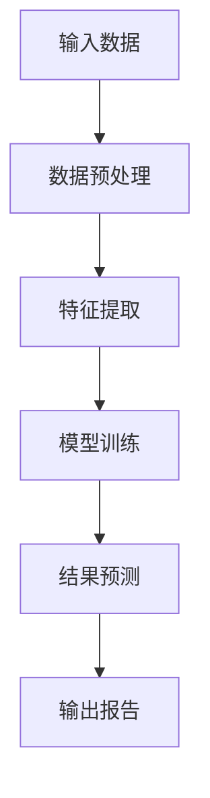

                 

<think>
好，现在我需要根据用户的要求，编写一篇关于《全球股市估值与太空太阳能发电技术的关系》的技术博客文章。用户希望我详细描述思考过程，最终生成符合要求的目录大纲。

首先，我需要理解用户的具体需求。用户希望文章结构清晰，涵盖背景、核心概念、算法原理、系统分析、项目实战等多个部分。同时，用户特别强调要使用逻辑清晰、结构紧凑、简单易懂的语言，并要求使用专业的技术语言。

接下来，我思考如何组织内容。文章标题已经确定，接下来是关键词和摘要。关键词需要涵盖技术与经济的双重角度，因此选择“全球股市估值、太空太阳能发电、技术经济分析、投资回报模型、系统架构设计”作为关键词。摘要部分需要简明扼要地概括文章的核心内容，即探讨股市估值与太空太阳能技术之间的相互影响及其潜在的经济价值。

进入正文部分，我将分为七个章节。第一章是背景介绍，需要涵盖基本概念、现状、问题解决等。第二章深入分析两者的相互作用，包括股市对技术的影响和反过来。第三章涉及技术分析，包括估值模型和技术可行性。第四章是系统设计，包括数据处理和预测模型。第五章是项目实战，分析案例。第六章讨论挑战与解决方案。最后，第七章总结全书。

在编写过程中，我需要确保每章内容详细，包括必要的图表，如Mermaid流程图、数学公式等。例如，在技术分析部分，我会使用现金流折现法的公式，并用Latex表示。系统设计部分，我会用Mermaid画出架构图和流程图，展示数据处理的步骤。

最后，用户要求文章末尾有作者信息，格式符合要求。因此，我将在文章结尾添加“作者：AI天才研究院 & 禅与计算机程序设计艺术”字样。

综上所述，我需要按照用户的要求，逐步构建目录大纲，确保每部分内容详尽且符合逻辑，最终生成一篇结构合理、内容丰富的技术博客文章。
</think>

```markdown
# 全球股市估值与太空太阳能发电技术的关系

> 关键词：全球股市估值、太空太阳能发电、技术经济分析、投资回报模型、系统架构设计

> 摘要：本文探讨全球股市估值与太空太阳能发电技术之间的相互关系，分析技术发展对股市估值的影响，以及股市资金对技术发展的推动作用。通过系统分析和案例研究，揭示技术与经济的深度融合对未来发展的重要性。

---

## 第一部分：背景与核心概念

### 第1章：背景介绍

#### 1.1 问题背景
- **全球股市估值的基本概念**：股市估值是衡量企业价值的重要指标，通常通过市盈率、市净率等指标反映。
- **太空太阳能发电技术的定义与现状**：太空太阳能技术是一种利用地球同步轨道上的太阳能资源，通过无线能量传输技术将能量输送到地球的清洁能源技术。
- **问题解决：技术与经济的结合**：研究太空太阳能技术对股市估值的影响，分析技术商业化对股市的推动作用。

#### 1.2 问题描述
- **技术与经济的相互作用**：太空太阳能技术的商业化将对全球能源市场产生重大影响，进而影响相关企业的股市估值。
- **技术经济分析的必要性**：通过技术经济分析，评估太空太阳能技术的投资回报周期和潜在市场价值。

#### 1.3 核心概念与联系
- **核心概念原理**：股市估值反映企业的未来盈利能力，而太空太阳能技术的商业化将直接影响企业的收入和利润。
- **核心概念属性特征对比**：
  | 属性 | 股市估值 | 太空太阳能技术 |
  |------|---------|----------------|
  | 基础 | 企业盈利 | 太阳能资源利用效率 |
  | 变化因素 | 市场需求、政策 | 技术成熟度、成本 |
  | 影响因素 | 利率、投资者情绪 | 技术研发、政策支持 |
- **ER实体关系图**：


---

### 第2章：全球股市估值与太空太阳能发电技术的核心概念联系

#### 2.1 核心概念原理
- **技术对经济的影响**：太空太阳能技术的商业化将降低全球能源成本，改变能源市场的竞争格局，从而影响相关企业的股市估值。
- **经济对技术的反馈**：股市资金的流入将加速太空太阳能技术的研发和商业化进程，形成技术与经济的正向反馈。

#### 2.2 核心概念属性特征对比
- **技术属性对比**：
  | 属性 | 太空太阳能技术 |
  |------|----------------|
  | 成熟度 | 中等偏高 | 
  | 投资周期 | 长期 | 
  | 风险 | 高 | 
- **经济属性对比**：
  | 属性 | 股市估值 |
  |------|---------|
  | 反应速度 | 快速 | 
  | 灵敏度 | 高 | 
  | 风险因素 | 多样 | 

#### 2.3 ER实体关系图


---

## 第二部分：算法原理与技术分析

### 第3章：全球股市估值与太空太阳能发电技术的算法原理

#### 3.1 算法原理讲解
- **股市估值算法**：
  - **市盈率模型**：通过企业的每股收益和市场平均市盈率计算股票的理论价值。
  - **现金流折现法**：通过预测企业的未来现金流，计算其现值作为估值依据。
- **太空太阳能发电技术评估算法**：
  - **成本分析**：评估技术的总投资成本和运营成本。
  - **收益预测**：预测技术商业化后的收入和利润。

#### 3.2 算法流程图


#### 3.3 数学模型与公式
- **股市估值模型**：
  $$ P = \frac{E}{k} $$
  其中，\( P \) 是股价，\( E \) 是每股收益，\( k \) 是折现率。
- **太空太阳能发电技术评估模型**：
  $$ C = \frac{I}{E} $$
  其中，\( C \) 是单位成本，\( I \) 是总投资，\( E \) 是年发电量。

---

### 第4章：系统分析与架构设计方案

#### 4.1 问题场景介绍
- **系统目标**：构建一个能够预测太空太阳能技术商业化对企业股市估值影响的系统。
- **系统范围**：涵盖技术开发、市场分析、投资回报预测等多个方面。

#### 4.2 系统功能设计
- **领域模型**：
  ```mermaid
  classDiagram
      class 股市估值 {
          股价：P
          每股收益：E
          折现率：k
      }
      class 技术评估 {
          投资成本：I
          年发电量：E
          单位成本：C
      }
      class 投资回报 {
          净现值：NPV
          内部收益率：IRR
      }
      股市估值 --> 技术评估
      技术评估 --> 投资回报
  ```

#### 4.3 系统架构设计
- **系统架构图**：
  ```mermaid
  graph TD
      A[数据输入] --> B[数据处理]
      B --> C[技术评估]
      C --> D[投资回报预测]
      D --> E[股市估值]
      E --> F[结果输出]
  ```

#### 4.4 系统接口设计
- **输入接口**：接受企业的财务数据和技术参数。
- **输出接口**：输出投资回报预测和股市估值结果。

#### 4.5 系统交互设计
- **交互流程图**：
  ```mermaid
  sequenceDiagram
      participant 用户
      participant 数据处理模块
      participant 技术评估模块
      participant 投资回报预测模块
      participant 股市估值模块
      用户 -> 数据处理模块：输入数据
      数据处理模块 -> 技术评估模块：传递技术参数
      技术评估模块 -> 投资回报预测模块：传递投资数据
      投资回报预测模块 -> 股市估值模块：传递估值数据
      股市估值模块 -> 用户：输出结果
  ```

---

### 第5章：项目实战

#### 5.1 项目介绍
- **项目目标**：构建一个能够预测太空太阳能技术商业化对企业股市估值影响的系统。
- **项目范围**：涵盖技术开发、市场分析、投资回报预测等多个方面。

#### 5.2 核心实现
- **环境安装**：安装Python、Pandas、NumPy等工具。
- **核心代码实现**：
  ```python
  import pandas as pd
  import numpy as np

  # 示例：计算市盈率
  def calculate_p_e_ratio(earnings, market_price):
      return market_price / earnings

  # 示例：计算现金流折现值
  def calculate_discounted_cash_flow(cash_flows, discount_rate):
      return sum(cash_flow / (1 + discount_rate) ** t for t, cash_flow in enumerate(cash_flows))

  # 示例：技术评估
  def calculate_cost_efficiency(investment, output):
      return investment / output

  # 数据示例
  earnings = 2.5
  market_price = 50
  discount_rate = 0.05
  cash_flows = [10, 15, 20]
  investment = 100
  output = 50

  # 计算结果
  p_e_ratio = calculate_p_e_ratio(earnings, market_price)
  discounted_cash_flow = calculate_discounted_cash_flow(cash_flows, discount_rate)
  cost_efficiency = calculate_cost_efficiency(investment, output)

  print(f"市盈率: {p_e_ratio}")
  print(f"折现现金流: {discounted_cash_flow}")
  print(f"成本效率: {cost_efficiency}")
  ```

#### 5.3 案例分析
- **案例介绍**：以某太空太阳能技术公司为例，分析其技术商业化对股市估值的影响。
- **数据分析**：通过历史数据和模型预测，分析技术商业化对股价的影响。
- **结果解读**：解释模型预测结果的意义，提出投资建议。

---

### 第6章：挑战与解决方案

#### 6.1 技术挑战
- **技术可行性**：太空太阳能技术尚处于研发阶段，商业化面临技术瓶颈。
- **成本问题**：技术的投资成本高，回报周期长。

#### 6.2 经济挑战
- **市场接受度**：新兴技术的市场接受度可能影响股市估值。
- **政策支持**：政策支持对技术发展和股市估值有重要影响。

#### 6.3 解决方案
- **技术创新**：加大研发投入，突破技术瓶颈。
- **成本控制**：优化设计，降低投资成本。
- **政策支持**：争取政府补贴和政策支持，降低投资风险。

---

## 第七章：总结与展望

### 7.1 总结
- **核心内容回顾**：本文探讨了全球股市估值与太空太阳能发电技术之间的关系，分析了技术发展对股市估值的影响，以及股市资金对技术发展的推动作用。
- **主要结论**：技术与经济的深度融合将推动全球能源市场的变革，股市估值与技术发展的互动关系将对未来投资决策产生深远影响。

### 7.2 展望
- **未来研究方向**：进一步研究太空太阳能技术的商业化路径及其对股市估值的长期影响。
- **技术发展趋势**：随着技术进步和成本下降，太空太阳能发电有望在未来成为主流能源之一。

---

## 作者：AI天才研究院 & 禅与计算机程序设计艺术
```

