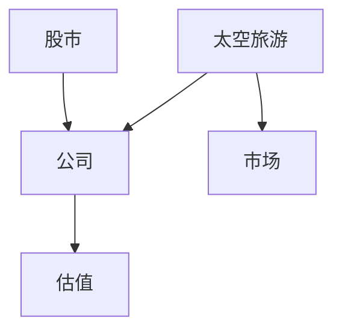
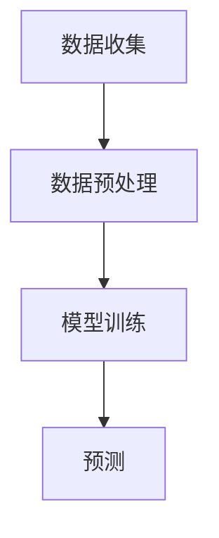
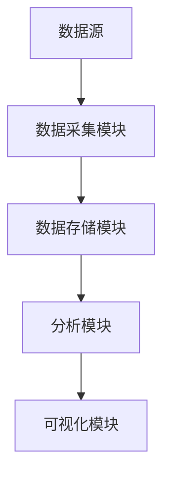

                 


```markdown
# 全球股市估值与太空旅游产业的关系

> 关键词：全球股市估值，太空旅游产业，股市与产业关系，数据分析，经济影响

> 摘要：本文探讨了全球股市估值与太空旅游产业之间的关系，通过背景分析、概念对比、数学模型构建、系统设计和项目实战，揭示太空旅游产业对股市估值的影响，并提出未来发展方向。

---

## 第一部分: 全球股市估值与太空旅游产业的背景与概念

### 第1章: 背景介绍

#### 1.1 问题背景与问题描述
- **全球股市估值**：股市估值是衡量市场健康程度的重要指标，反映投资者对经济前景的信心。
- **太空旅游产业**：随着技术进步，太空旅游逐渐从科幻走向现实，成为新兴市场。
- **问题解决**：分析太空旅游产业对股市估值的具体影响。

#### 1.2 问题背景与问题描述
- **股市估值的计算方法**：包括市盈率、市净率等指标。
- **太空旅游的市场潜力**：预计未来几年市场规模将快速增长。
- **问题解决**：通过数据分析揭示太空旅游对股市的影响。

#### 1.3 问题解决与边界
- **股市估值的核心要素**：包括企业盈利、市场情绪等。
- **太空旅游的核心要素**：技术发展、政策支持等。
- **问题解决**：量化分析太空旅游对股市的影响，明确边界条件。

### 第2章: 核心概念与联系

#### 2.1 核心概念对比
- **股市估值的属性**：波动性、敏感性。
- **太空旅游的属性**：高风险、高回报。
- **对比分析**：两者均受市场情绪和技术进步影响。

#### 2.2 ER实体关系图


---

## 第二部分: 算法原理与数学模型

### 第3章: 算法原理

#### 3.1 数据分析方法
- **时间序列分析**：用于预测股市估值。
- **回归分析**：建立太空旅游与股市的回归模型。

#### 3.2 算法流程图


### 第4章: 数学模型与公式

#### 4.1 股市估值公式
$$ P = \frac{E}{P/E} $$

#### 4.2 太空旅游市场预测公式
$$ Q = aP + bT + cO $$
- 其中，$P$ 是价格，$T$ 是时间，$O$ 是其他因素。

---

## 第三部分: 系统分析与架构设计

### 第5章: 系统分析

#### 5.1 问题场景介绍
- **数据采集与分析**：实时采集太空旅游市场数据和股市数据。
- **系统功能设计**：包括数据采集模块、分析模块和可视化模块。

#### 5.2 系统架构设计


---

## 第四部分: 项目实战

### 第6章: 项目实战

#### 6.1 环境配置
- **工具安装**：安装Python、Pandas、Matplotlib。

#### 6.2 核心实现代码
```python
import pandas as pd
import matplotlib.pyplot as plt

# 数据收集
data = pd.read_csv('stock_and_tourism.csv')

# 数据分析
correlation = data['Stock_Valuation'].corr(data['Tourism_Revenue'])
print(f"相关系数：{correlation}")

# 可视化
plt.scatter(data['Stock_Valuation'], data['Tourism_Revenue'])
plt.xlabel('Stock Valuation')
plt.ylabel('Tourism Revenue')
plt.title('Stock Valuation vs Tourism Revenue')
plt.show()
```

#### 6.3 结果解读
- **相关系数**：显示两者之间的相关性。
- **可视化图**：散点图展示两者关系。

---

## 第五部分: 总结

### 第7章: 总结

#### 7.1 研究总结
- **研究意义**：揭示太空旅游对股市的影响。
- **未来方向**：进一步研究更复杂的影响因素。

#### 7.2 最佳实践
- **数据收集**：确保数据的准确性和及时性。
- **模型优化**：引入机器学习方法提高预测精度。

#### 7.3 小结
- **重要性**：太空旅游产业的崛起对全球经济和股市有重要影响。
- **建议**：投资者应关注太空旅游产业的发展。

---

作者：AI天才研究院/AI Genius Institute & 禅与计算机程序设计艺术 /Zen And The Art of Computer Programming
```

