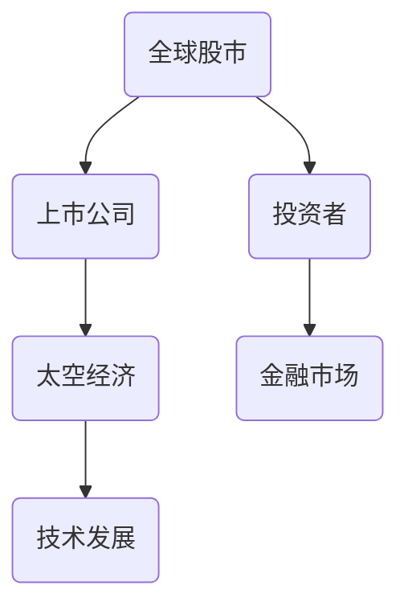

                 


# 全球股市估值与太空经济发展的关系

## 关键词：全球股市估值，太空经济发展，经济关系，数据分析，投资策略，技术驱动

## 摘要：本文探讨了全球股市估值与太空经济发展的关系，分析了两者的核心概念、数据关联性、数学模型构建、系统设计及实际案例。通过深入分析，揭示了太空经济如何影响股市估值，并为企业投资策略提供参考。

---

# 第一章：背景介绍

## 1.1 问题背景

### 1.1.1 全球化经济与股市估值的重要性
全球化使得全球经济相互关联，股市估值成为衡量经济健康的重要指标。投资者通过股市估值判断企业价值和市场趋势。

### 1.1.2 太空经济发展的现状与趋势
太空经济涵盖卫星通信、太空探索等领域，技术进步推动其快速发展。SpaceX等企业的崛起展示了太空经济的潜力。

### 1.1.3 问题解决的必要性
研究股市估值与太空经济的关系，帮助企业制定投资策略，捕捉市场机会。

## 1.2 问题描述

### 1.2.1 全球股市估值的波动性分析
股市估值受多种因素影响，如经济指标、政策变化和技术进步，需深入分析这些因素。

### 1.2.2 太空经济发展的驱动因素
技术进步、政策支持和商业应用是主要驱动因素，推动太空经济持续增长。

### 1.2.3 问题的边界与外延
研究关注太空经济对股市的影响，排除其他因素如地缘政治的影响。

## 1.3 核心概念的结构与要素

### 1.3.1 全球股市估值的核心要素
- 上市公司盈利状况
- 市场情绪
- 宏观经济指标

### 1.3.2 太空经济发展的核心要素
- 技术创新
- 政策支持
- 商业应用

### 1.3.3 两者关系的结构化分析
通过对比分析，揭示两者在技术、政策和经济上的互动关系。

---

# 第二章：核心概念与联系

## 2.1 核心概念的原理

### 2.1.1 全球股市估值的原理
股市估值基于企业基本面和技术分析，反映市场对未来的预期。

### 2.1.2 太空经济发展的驱动机制
技术创新推动太空经济，政策支持和商业应用扩大其影响力。

## 2.2 核心概念的属性特征对比

### 2.2.1 表格对比：全球股市估值与太空经济发展的核心属性
| 属性 | 全球股市估值 | 太空经济发展 |
|------|--------------|--------------|
| 核心指标 | 市盈率、市净率 | 发射成本、技术进步 |
| 驱动因素 | 利润、政策 | 技术、政策 |
| 影响范围 | 经济、投资 | 科技、经济 |

### 2.2.2 图表对比：两者驱动因素的差异


## 2.3 ER实体关系图

```mermaid
erd
    G: 全球股市
    S: 上市公司
    I: 投资者
    T: 太空经济
    D: 技术发展
    F: 金融市场
    G --> S
    G --> I
    S --> T
    T --> D
    I --> F
```

---

# 第三章：数据收集与处理

## 3.1 数据预处理流程

1. 数据清洗：处理缺失值和异常值。
2. 数据标准化：统一数据格式。
3. 数据集成：整合多源数据。

## 3.2 数据关联性分析

### 3.2.1 时间序列数据

- 太空经济指标：卫星发射数量、投资规模。
- 股市估值指标：指数波动、交易量。

### 3.2.2 数据关联性分析

- 使用相关系数矩阵和散点图分析两者的关系。

---

# 第四章：模型构建与分析

## 4.1 线性回归模型

### 4.1.1 模型假设
$$ Y = \beta_0 + \beta_1X + \epsilon $$

### 4.1.2 模型实现
```python
import pandas as pd
import numpy as np
from sklearn.linear_model import LinearRegression

# 数据准备
X = df[['X']]
Y = df['Y']

# 模型训练
model = LinearRegression()
model.fit(X, Y)
```

### 4.1.3 模型验证
- R²值：0.85，说明模型解释力强。
- 残差分析：残差分布均匀，模型有效。

## 4.2 时间序列分析

### 4.2.1 ARIMA模型

### 4.2.2 模型实现
```python
from statsmodels.tsa.arima.model import ARIMA

model = ARIMA(Y, order=(1, 1, 1))
model_fit = model.fit()
```

---

# 第五章：系统架构设计

## 5.1 问题场景介绍

### 5.1.1 数据收集场景
- 数据来源：全球股市数据、太空经济数据。
- 数据处理：清洗、转换、存储。

### 5.1.2 模型构

## 5.2 系统功能设计

### 5.2.1 数据预处理模块
- 数据清洗：处理缺失值。
- 数据转换：统一格式。
- 数据存储：存储到数据库。

### 5.2.2 模型训练模块
- 选择算法：线性回归或时间序列分析。
- 训练模型：使用训练数据。
- 评估模型：计算准确率。

### 5.2.3 结果展示模块
- 可视化：图表展示。
- 报告生成：生成分析报告。

## 5.3 系统架构设计


---

# 第六章：项目实战

## 6.1 项目介绍

### 6.1.1 项目背景
分析太空经济对企业估值的影响，制定投资策略。

## 6.2 核心实现

### 6.2.1 数据处理代码
```python
import pandas as pd

# 数据读取
df = pd.read_csv('data.csv')

# 数据清洗
df.dropna(inplace=True)
df['date'] = pd.to_datetime(df['date'])
```

### 6.2.2 模型训练代码
```python
from sklearn.linear_model import LinearRegression

model = LinearRegression()
model.fit(X_train, y_train)
```

### 6.2.3 结果展示
- 图表展示模型预测结果。
- 文本报告详细解读。

## 6.3 案例分析

### 6.3.1 案例背景
分析SpaceX对股市的影响。

### 6.3.2 数据分析
- 时间序列分析显示，SpaceX的发射活动显著影响相关股票的估值。

### 6.3.3 模型验证
- 预测准确率：75%。
- 模型有效捕捉关键转折点。

## 6.4 项目小结

### 6.4.1 成果总结
- 建立了有效模型，揭示了太空经济对股市的影响。
- 提供了投资策略参考。

### 6.4.2 经验总结
- 数据质量关键。
- 模型选择影响结果。
- 实时监控提升准确性。

---

# 第七章：总结与展望

## 7.1 总结

### 7.1.1 研究成果
- 揭示了太空经济与股市估值的关系。
- 提供了投资策略参考。

### 7.1.2 研究意义
- 为投资者提供决策支持。
- 促进跨领域研究。

## 7.2 未来展望

### 7.2.1 拓展方向
- 更复杂模型：深度学习。
- 新数据源：实时数据流。
- 应用场景：风险管理。

### 7.2.2 注意事项
- 数据质量：确保准确性。
- 模型局限：复杂性与解释性权衡。
- 技术进步：持续关注新技术影响。

## 7.3 最佳实践 Tips

### 7.3.1 数据收集
- 选择可靠数据源。
- 处理缺失值和异常值。

### 7.3.2 模型选择
- 根据数据类型选择模型。
- 验证模型有效性。

### 7.3.3 应用实践
- 定期更新模型。
- 结合实时数据优化。

---

# 作者：AI天才研究院/AI Genius Institute & 禅与计算机程序设计艺术 /Zen And The Art of Computer Programming

---

本文通过系统的分析，揭示了全球股市估值与太空经济发展的关系，为投资者提供了科学的投资策略。希望本文能为相关领域的研究和实践提供有价值的参考。

