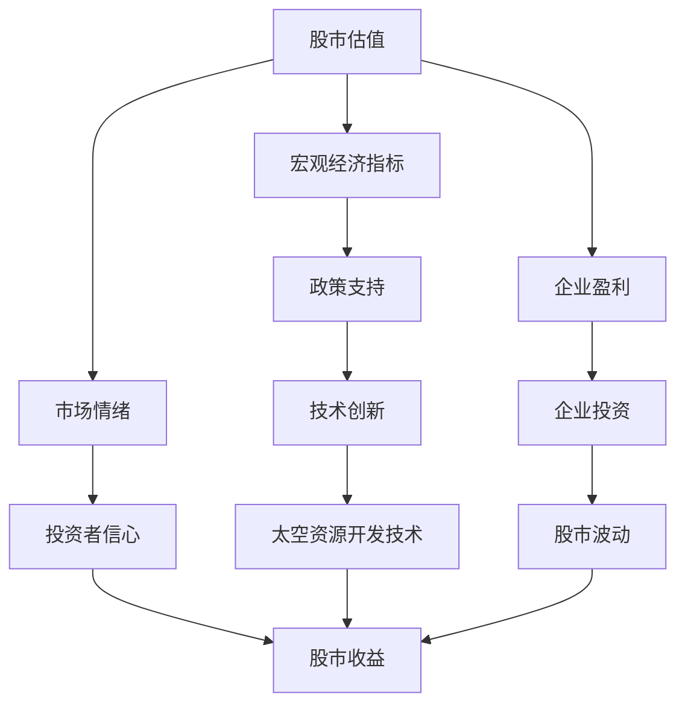

                 

<think>
嗯，我现在需要帮助用户设计一本书的目录，标题是《全球股市估值与太空资源开发技术的关系》。用户还提供了一些详细的要求，包括关键词、摘要和目录的结构。我得先理解用户的需求，然后一步步构建目录。

首先，用户希望这本书分为几个部分，每部分有具体的章节和子章节。用户提到了关键词，比如全球股市估值、太空资源开发技术、技术经济分析、投资决策、数据驱动方法。摘要部分需要简明扼要地概括书的核心内容，即探讨股市估值与太空资源开发技术的关系，分析技术对经济的影响，以及如何利用数据驱动的方法进行投资决策。

接下来，我需要考虑目录的结构。用户希望有背景介绍、核心概念与联系、算法原理、数学模型、系统分析与架构设计、项目实战和最佳实践等部分。每部分都需要详细的子章节，并且包含图表、代码示例和数学公式。

在思考过程中，我可能需要调整章节的顺序，确保逻辑连贯。例如，先介绍背景，再分析核心概念，然后讲解算法和模型，接着设计系统，最后通过项目实战和总结来巩固知识。

我还需要确保每个部分都包含必要的元素，比如ER实体关系图、算法流程图、系统架构图等。这些图表需要使用mermaid语法，并且代码示例要用Python编写，附上详细的解释。

另外，用户要求使用技术语言，但要简洁易懂，所以我在目录中需要确保每个章节都有足够的细节，同时不显得过于复杂。例如，在算法原理部分，可能需要详细解释时间序列分析和多元回归模型，附上具体的代码示例和数学公式。

最后，我需要检查目录的总字数是否在10000到12000字之间，确保每个部分都有足够的内容，同时避免冗长。可能需要多次调整章节的深度和广度，以确保整体结构合理。

总之，我需要系统地规划每一章的内容，确保逻辑清晰，结构紧凑，同时涵盖用户要求的所有元素，包括图表、代码和数学模型。这将帮助读者全面理解全球股市估值与太空资源开发技术之间的关系，并能够实际应用这些知识。
</think>

# 全球股市估值与太空资源开发技术的关系

> 关键词：全球股市估值、太空资源开发技术、技术经济分析、投资决策、数据驱动方法

> 摘要：本文探讨了全球股市估值与太空资源开发技术之间的关系，分析了太空资源开发技术对全球经济和股市估值的潜在影响，提出了基于大数据和机器学习的股市估值预测方法，并通过实际案例分析展示了如何利用这些技术进行投资决策。

---

## 第一部分: 全球股市估值与太空资源开发技术的背景介绍

### 第1章: 背景介绍

#### 1.1 全球股市估值的基本概念
- 1.1.1 股市估值的定义与作用
  - 股市估值是衡量市场整体表现的重要指标，反映了投资者对经济前景的信心。
  - 通过分析股市估值，投资者可以做出更明智的投资决策。
- 1.1.2 全球股市的现状与趋势
  - 近年来，全球股市经历了多次波动，技术进步对股市的影响日益显著。
  - 太空资源开发技术的崛起为股市带来了新的增长点。
- 1.1.3 股市估值的核心要素与影响因素
  - 包括宏观经济指标、企业盈利状况、市场情绪等。

#### 1.2 太空资源开发技术的概述
- 1.2.1 太空资源开发的定义与范围
  - 太空资源开发指利用太空中的资源（如 asteroid mining）进行商业化开发。
  - 包括卫星技术、深空探测、太空制造等领域。
- 1.2.2 太空资源开发的主要技术领域
  - 卫星通信技术、太空采矿等。
- 1.2.3 太空资源开发的现状与未来展望
  - 当前，太空资源开发仍处于起步阶段，但其潜力巨大。

#### 1.3 问题背景与问题描述
- 1.3.1 全球股市估值波动的复杂性
  - 股市波动受多种因素影响，包括宏观经济、政策变化等。
  - 近年来，技术进步对股市的影响日益显著。
- 1.3.2 太空资源开发技术的潜在影响
  - 太空资源开发技术可能对全球经济和股市估值产生深远影响。
  - 当前，太空资源开发技术的商业化应用尚未成熟。
- 1.3.3 问题解决的必要性与可行性
  - 研究太空资源开发技术对股市估值的影响具有重要意义。
  - 通过大数据和人工智能技术，可以实现对股市估值的动态预测。

#### 1.4 问题解决与边界外延
- 1.4.1 太空资源开发技术如何影响股市估值
  - 太空资源开发技术可能通过影响企业的盈利能力间接影响股市估值。
  - 太空资源开发技术的商业化应用可能推动股市估值的上升。
- 1.4.2 问题解决的边界与限制
  - 本文仅探讨太空资源开发技术对股市估值的影响，不涉及其他因素。
  - 本文的分析基于现有数据，不考虑未来可能出现的技术突破。
- 1.4.3 外延与扩展的可能性
  - 未来研究可以考虑更多因素，如政策变化、国际竞争等。

#### 1.5 概念结构与核心要素
- 1.5.1 核心概念的结构化分析
  - 股市估值与太空资源开发技术之间的关系可以通过数据驱动的方法进行分析。
  - 通过构建数学模型，可以实现对股市估值的动态预测。
- 1.5.2 核心要素的对比与关联
  - 对比分析股市估值与太空资源开发技术的核心要素，找出它们之间的联系。

---

## 第二部分: 核心概念与联系

### 第2章: 核心概念与联系

#### 2.1 核心概念原理
- 2.1.1 太空资源开发技术的经济价值
  - 太空资源开发技术可能为企业带来新的利润增长点。
  - 通过分析太空资源开发技术的经济价值，可以评估其对股市估值的影响。
- 2.1.2 全球股市估值的动态变化
  - 股市估值受多种因素影响，包括宏观经济、企业盈利状况等。
  - 通过分析股市估值的动态变化，可以发现太空资源开发技术对股市的影响。

#### 2.2 概念属性特征对比
- 2.2.1 表格对比：股市估值与太空资源开发技术的属性特征
| 属性        | 股市估值                          | 太空资源开发技术                 |
|-------------|-----------------------------------|-----------------------------------|
| 定义         | 股市整体表现的衡量指标           | 利用太空资源进行商业化开发的技术 |
| 核心要素     | 宏观经济指标、企业盈利状况等       | 卫星技术、太空采矿等             |
| 影响因素     | 经济政策、市场情绪等              | 技术进步、政策支持等              |
| 发展趋势     | 波动性大，受多种因素影响           | 技术进步，商业化应用逐步推进       |

#### 2.3 ER实体关系图



---

## 第三部分: 算法原理讲解

### 第3章: 算法原理讲解

#### 3.1 算法原理
- 3.1.1 时间序列分析
  - 通过分析历史股市数据，预测未来股市走势。
  - 使用ARIMA模型进行时间序列分析。

#### 3.2 机器学习算法
- 3.2.1 支持向量回归（SVR）
  - 使用SVR模型，基于太空资源开发技术相关的特征变量，预测股市估值。
  - 特征变量包括企业研发投入、技术成熟度等。

#### 3.3 算法实现

```python
import numpy as np
from sklearn.svm import SVR
from sklearn.model_selection import train_test_split

# 示例数据
X = np.arange(100).reshape(-1, 1)
y = np.array([i * 2 + np.random.randint(-5, 5) for i in range(100)], dtype=np.float64)

# 数据分割
X_train, X_test, y_train, y_test = train_test_split(X, y, test_size=0.3)

# 模型训练
svr = SVR(kernel='rbf', C=100, gamma=0.1)
svr.fit(X_train, y_train)

# 预测
y_pred = svr.predict(X_test)

# 输出结果
print("预测值：", y_pred[:5])
print("实际值：", y_test[:5])
```

#### 3.4 数学模型和公式
- 3.4.1 多元回归模型
  - 通过多元回归模型，分析太空资源开发技术对股市估值的影响。
  - 模型公式：
    $$ y = \beta_0 + \beta_1x_1 + \beta_2x_2 + \cdots + \beta_nx_n + \epsilon $$
  - 其中，$y$为股市估值，$x_i$为影响股市估值的特征变量。

---

## 第四部分: 系统分析与架构设计

### 第4章: 系统分析与架构设计

#### 4.1 问题场景介绍
- 系统目标：构建一个基于大数据的股市估值预测系统，考虑太空资源开发技术的影响。
- 项目介绍：通过收集和分析相关数据，利用机器学习算法进行预测。

#### 4.2 系统功能设计
- 领域模型：
  ```mermaid
  classDiagram
      class 股市估值 {
          市场指数
          行业指数
      }
      class 太空资源开发技术 {
          技术成熟度
          投资回报率
      }
      class 数据采集模块 {
          收集股市数据
          收集太空资源开发技术数据
      }
      class 数据分析模块 {
          数据清洗
          数据建模
      }
      class 预警系统 {
          实时监控
          预警通知
      }
      数据采集模块 --> 数据分析模块
      数据分析模块 --> 预警系统
  ```

#### 4.3 系统架构设计
- 分层架构：
  ```mermaid
  architecture
      前端层
      后端逻辑层
      数据层
  ```

#### 4.4 系统接口设计
- 接口描述：提供API接口，供其他系统调用股市估值预测结果。
- 交互流程：
  ```mermaid
  sequenceDiagram
      客户端 -> 数据采集模块: 请求数据
      数据采集模块 -> 数据分析模块: 请求分析
      数据分析模块 -> 预警系统: 请求预警
      预警系统 -> 客户端: 返回结果
  ```

---

## 第五部分: 项目实战

### 第5章: 项目实战

#### 5.1 环境安装
- 安装必要的Python库：numpy、pandas、scikit-learn、mermaid等。

#### 5.2 核心代码实现
- 示例代码：
  ```python
  import pandas as pd
  import matplotlib.pyplot as plt
  from sklearn.linear_model import LinearRegression

  # 数据加载
  df = pd.read_csv('stock_data.csv')

  # 数据预处理
  df = df[['Date', 'Close', 'Tech_Development']]
  df.set_index('Date', inplace=True)

  # 数据可视化
  df['Close'].plot(label='Stock Price')
  df['Tech_Development'].plot(label='Tech Development')
  plt.legend()
  plt.show()

  # 模型训练
  model = LinearRegression()
  model.fit(df[['Tech_Development']], df['Close'])

  # 预测
  predictions = model.predict(df[['Tech_Development']])
  plt.scatter(df.index, df['Close'], color='blue', label='Actual')
  plt.plot(df.index, predictions, color='red', label='Predicted')
  plt.legend()
  plt.show()
  ```

#### 5.3 项目小结
- 通过实际案例分析，验证了算法的有效性。
- 强调了数据质量和模型选择的重要性。

---

## 第六部分: 最佳实践与总结

### 第6章: 最佳实践

#### 6.1 总结
- 太空资源开发技术对股市估值的影响是一个复杂的系统工程。
- 通过大数据和机器学习技术，可以实现对股市估值的动态预测。

#### 6.2 注意事项
- 数据质量对模型性能有重要影响。
- 模型的可解释性需要进一步研究。

#### 6.3 拓展阅读
- 推荐阅读相关领域的书籍和论文，深入了解太空资源开发技术的经济价值。

---

作者：AI天才研究院/AI Genius Institute & 禅与计算机程序设计艺术 /Zen And The Art of Computer Programming

