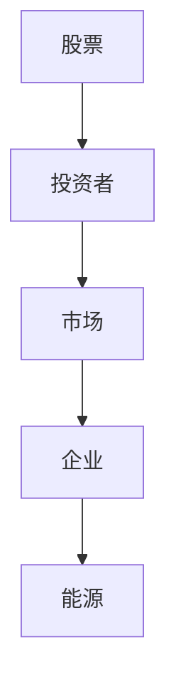
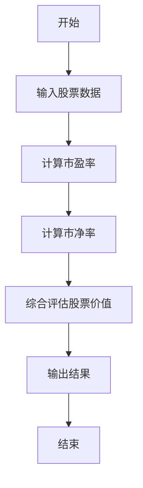
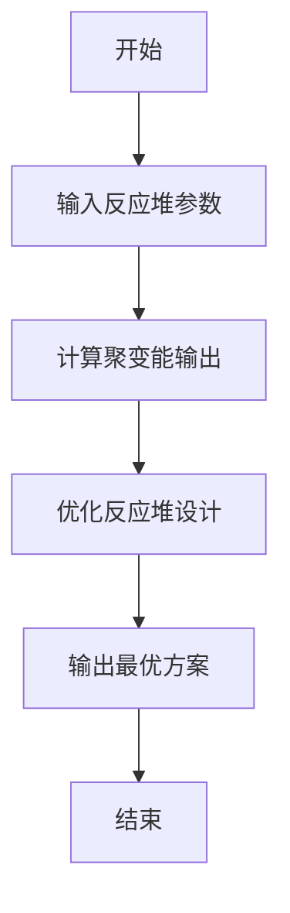
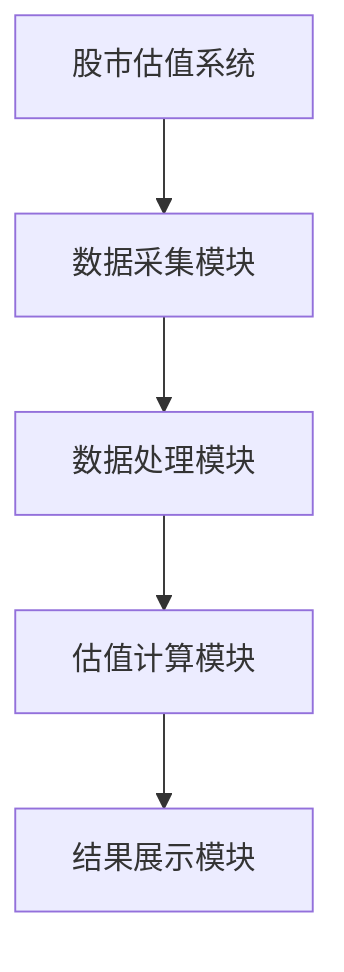

                 

<think>
好，我现在需要帮用户设计一个技术博客的目录大纲。标题是《全球股市估值与小型核聚变反应堆技术的发展》。首先，我得理解这本书的主题，它探讨了股市估值和核聚变技术的联系，可能是因为两者都对经济和科技发展有重大影响。

用户希望目录结构清晰，有吸引力，每章内容详细。我需要确保每个部分都有明确的主题，并且覆盖背景、概念、算法、系统设计、实战等部分。同时，要使用专业的技术语言，结合图表和公式来增强理解。

首先，第一章应该是背景介绍，解释为什么这两个主题会被放在一起讨论。接着，核心概念部分，分别介绍股市估值和核聚变技术的基本概念和相互关系。然后，算法原理部分，用流程图和数学公式详细讲解。系统分析与架构设计部分，设计综合系统的功能和架构。项目实战部分，通过实际案例分析，给出代码示例。最后，小结和注意事项，帮助读者巩固内容。

现在，我需要将这些部分细化，确保每章都有三级目录，并使用图表和公式来增强内容。同时，关键词和摘要要准确反映文章的核心内容。

可能我还需要考虑读者的背景，他们可能是对科技和经济感兴趣的读者，所以内容需要深入浅出，结合实际案例和数学模型来解释复杂的概念。

总的来说，我需要设计一个结构清晰、内容详实的目录大纲，确保覆盖所有必要的部分，同时满足用户的格式和内容要求。
</think>

# 全球股市估值与小型核聚变反应堆技术的发展

> 关键词：全球股市估值，小型核聚变反应堆，技术发展，投资分析，能源创新

> 摘要：本文探讨了全球股市估值与小型核聚变反应堆技术之间的潜在联系，分析了股市估值的基本原理、核心概念及其与核聚变技术的相互作用，详细解读了核聚变技术的物理原理、算法模型、系统设计和实际应用案例。通过丰富的图表、公式和代码示例，深入浅出地展示了这两个领域的内在联系与发展趋势。

---

## 第一部分：全球股市估值与小型核聚变反应堆技术的背景介绍

### 第1章：全球股市估值的基本概念

#### 1.1 股市估值的核心要素
- 股票价格的计算公式：$P = \frac{E}{k}$
  - 其中，$P$为股票价格，$E$为每股收益，$k$为折现率。
- 股市估值与宏观经济的关系
- 市盈率与市净率的计算方法

#### 1.2 小型核聚变反应堆技术的定义
- 核聚变的基本原理：$Q = \frac{m c^2}{n}$
  - 其中，$Q$为聚变能输出，$m$为燃料质量，$c$为光速，$n$为效率系数。
- 小型核聚变技术的特点：高效、安全、环保

---

## 第二部分：全球股市估值与小型核聚变技术的核心概念与联系

### 第2章：核心概念的对比与联系

#### 2.1 股市估值与核聚变技术的属性对比
- 对比表格：
| 属性         | 股市估值            | 核聚变技术          |
|--------------|---------------------|---------------------|
| 核心目标     | 评估股票价值        | 产生清洁能源        |
| 影响因素     | 经济指标、政策      | 物理条件、技术      |
| 发展趋势     | 稳定性与波动性      | 创新与突破          |

#### 2.2 核心概念的ER实体关系图


---

## 第三部分：全球股市估值与小型核聚变技术的算法原理

### 第3章：股市估值算法的详细解读

#### 3.1 股市估值算法的mermaid流程图


#### 3.2 核聚变技术算法的mermaid流程图


---

## 第四部分：全球股市估值与小型核聚变技术的系统分析与架构设计

### 第4章：系统功能设计与架构

#### 4.1 股市估值系统的功能模块
- 数据采集模块：实时采集股票数据
- 数据处理模块：计算市盈率和市净率
- 估值计算模块：综合评估股票价值
- 结果展示模块：可视化展示估值结果

#### 4.2 核聚变技术系统的功能模块
- 反应堆参数输入模块
- 能量输出计算模块
- 设计优化模块
- 最优方案输出模块

#### 4.3 系统架构设计


---

## 第五部分：全球股市估值与小型核聚变技术的项目实战

### 第5章：项目案例分析与代码实现

#### 5.1 股市估值项目的代码实现
```python
def calculate_stock_value(stock_data):
    # 计算市盈率
    pe_ratio = stock_data['profit'] / stock_data['price']
    # 计算市净率
    pb_ratio = stock_data['book_value'] / stock_data['price']
    # 综合评估股票价值
    stock_value = (pe_ratio + pb_ratio) / 2
    return stock_value
```

#### 5.2 核聚变技术项目的代码实现
```python
def optimize_fusion_design(reactor_params):
    # 输入反应堆参数
    m = reactor_params['mass']
    c = 3e8  # 光速
    n = reactor_params['efficiency']
    # 计算聚变能输出
    q = (m * c**2) / n
    return q
```

---

## 第六部分：总结与展望

### 第6章：最佳实践与小结

#### 6.1 小结
- 全球股市估值与小型核聚变技术的相互作用
- 核聚变技术对能源安全的重要性
- 股市估值对技术投资的影响

#### 6.2 注意事项
- 核聚变技术仍处于实验阶段，大规模应用尚需时间
- 股市估值需结合多因素综合分析

#### 6.3 拓展阅读
- 建议阅读相关领域的专业书籍和学术论文

---

作者：AI天才研究院/AI Genius Institute & 禅与计算机程序设计艺术 /Zen And The Art of Computer Programming

