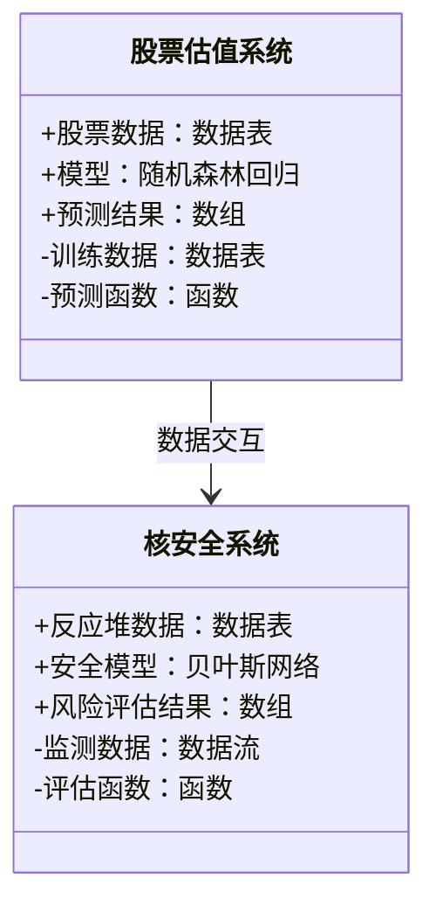
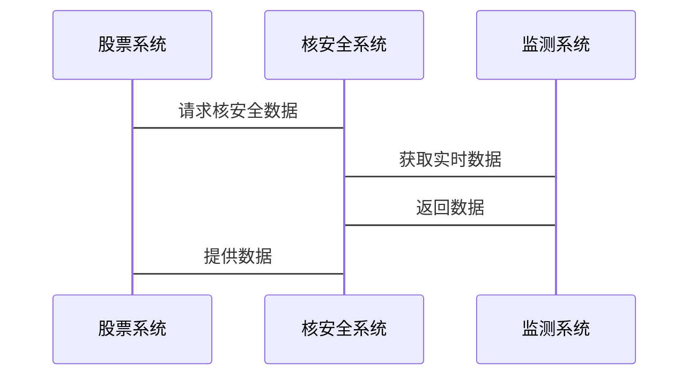

                 


```markdown
# 全球股市估值与小型模块化核反应堆安全技术的发展

> 关键词：全球股市估值、小型模块化核反应堆、安全技术、算法原理、系统架构

> 摘要：本文探讨了全球股市估值与小型模块化核反应堆安全技术的结合与发展，分析了两者的核心概念、算法原理、系统架构，并通过实际案例展示了技术应用。

---

## 第一部分：全球股市估值与小型模块化核反应堆的概述

### 第1章：全球股市估值与小型模块化核反应堆的背景介绍

#### 1.1 全球股市估值的背景与意义
- 全球股市估值的定义与概念
  - 股市估值是评估公司或股票内在价值的过程，帮助投资者做出投资决策。
  - 核心在于分析财务数据、市场趋势和宏观经济指标。
- 全球股市估值的重要性
  - 帮助投资者识别低估或高估的股票，优化投资组合。
  - 为市场提供透明度，促进资源的合理配置。
- 小型模块化核反应堆的背景与发展
  - 小型模块化核反应堆（SMR）是第三代核能技术的代表，具有安全性高、建造周期短、成本低等优势。
  - SMR在能源转型中的作用，如减少碳排放、提高能源安全性。

#### 1.2 问题背景与问题描述
- 全球股市估值中的主要问题
  - 数据量大、复杂性高，传统方法难以捕捉市场波动。
  - 市场情绪、宏观经济因素等难以量化。
- 小型模块化核反应堆安全技术的核心挑战
  - 设计复杂性高，需确保系统在各种极端条件下的安全性。
  - 核废料处理、放射性泄漏等潜在风险。
- 问题解决的思路与方法
  - 利用大数据分析和机器学习优化股市估值。
  - 采用模块化设计和实时监控系统提升核反应堆的安全性。

#### 1.3 问题的边界与外延
- 全球股市估值的边界条件
  - 数据范围：包括历史价格、财务报表、市场情绪等。
  - 时间范围：短期预测与长期趋势分析。
- 小型模块化核反应堆安全技术的适用范围
  - 适用于核电站、核废料处理等领域。
  - 适用于不同国家的能源政策和市场需求。
- 问题的外延与扩展
  - 股市估值扩展至其他金融市场。
  - 核安全技术扩展至其他能源领域。

#### 1.4 核心概念与组成要素
- 全球股市估值的核心概念
  - 股票价格、市盈率、市净率等。
- 小型模块化核反应堆安全技术的核心要素
  - 模块化设计、实时监测、应急系统。
- 两者的关联与区别
  - 区别：股市估值是金融领域，核安全技术是物理领域。
  - 关联：股市估值可为核能企业融资提供参考，核安全技术的进步可影响股市估值。

---

## 第二部分：核心概念与联系

### 第2章：核心概念与联系

#### 2.1 全球股市估值与小型模块化核反应堆安全技术的核心原理
- 全球股市估值的数学模型
  - 常见模型：CAPM（资本资产定价模型）、股利贴现模型（DDM）。
  - 例如：CAPM公式为：
    $$ E(R_i) = R_f + \beta_i (E(R_m) - R_f) $$
    其中，\( E(R_i) \) 是股票的预期收益率，\( R_f \) 是无风险利率，\( \beta_i \) 是股票的贝塔系数，\( E(R_m) \) 是市场预期收益率。
- 小型模块化核反应堆安全技术的核心原理
  - 概率论与风险评估：使用贝叶斯网络评估核泄漏概率。
  - 例如：贝叶斯公式：
    $$ P(A|B) = \frac{P(B|A)P(A)}{P(B)} $$
    其中，\( P(A|B) \) 是在B发生的条件下，A发生的概率。

#### 2.2 核心概念属性特征对比分析
| **属性**       | **全球股市估值**                          | **小型模块化核反应堆安全技术**                  |
|-----------------|------------------------------------------|-----------------------------------------------|
| 核心目标       | 最大化投资收益                            | 确保核反应堆安全运行                              |
| 主要挑战       | 数据噪声大，市场情绪波动                 | 设计复杂，极端条件下的安全性                   |
| 技术手段       | 机器学习、大数据分析                    | 模块化设计、实时监测                            |
| 应用范围       | 金融领域                                | 能源领域                                       |

#### 2.3 实体关系图（ER图）架构

```mermaid
erd
  R1 表：股票
    股票代码 (PK)
    公司名称
    行业
    市盈率
  R2 表：核反应堆
    反应堆ID (PK)
    模块类型
    安装位置
    安全等级
  R3 关系：投资关系
    股票代码 (FK, R1.股票代码)
    反应堆ID (FK, R2.反应堆ID)
```

---

## 第三部分：算法原理讲解

### 第3章：算法原理与数学模型

#### 3.1 全球股市估值算法

##### 3.1.1 传统估值方法
- 市盈率法：\( PE = \frac{股价}{每股收益} \)
- 市净率法：\( PB = \frac{股价}{每股净资产} \)

##### 3.1.2 现代机器学习方法
- 随机森林回归模型：通过训练历史数据预测未来股价。
- LSTM网络：捕捉时间序列中的复杂模式。

##### 3.1.3 算法实现
```python
import pandas as pd
from sklearn.ensemble import RandomForestRegressor

# 数据加载与预处理
data = pd.read_csv('stock_data.csv')
X = data.drop('target_price', axis=1)
y = data['target_price']

# 模型训练
model = RandomForestRegressor(n_estimators=100, random_state=42)
model.fit(X, y)

# 预测
new_data = pd.read_csv('new_data.csv')
predictions = model.predict(new_data)
```

#### 3.2 小型模块化核反应堆安全技术算法

##### 3.2.1 概率论与贝叶斯网络
- 使用贝叶斯网络评估核泄漏概率。
  $$ P(\text{泄漏} | \text{温度异常}) = \frac{P(\text{温度异常} | \text{泄漏})P(\text{泄漏})}{P(\text{温度异常})} $$

##### 3.2.2 系统可靠性分析
- 使用蒙特卡洛模拟评估系统在不同条件下的可靠性。

##### 3.2.3 算法实现
```python
import numpy as np

def simulate_reliability(n_simulations=1000):
    successes = 0
    for _ in range(n_simulations):
        # 模拟一次系统运行
        if np.random.rand() < 0.999:
            successes += 1
    return successes / n_simulations

reliability = simulate_reliability()
print(f"系统可靠性：{reliability}")
```

---

## 第四部分：系统分析与架构设计

### 第4章：系统分析与架构设计方案

#### 4.1 问题场景介绍
- 全球股市估值与核反应堆安全技术的结合场景：通过股市数据优化核能项目投资决策。

#### 4.2 系统功能设计
- 领域模型：使用Mermaid类图展示各模块关系。



#### 4.3 系统架构设计
- 使用Mermaid架构图展示整体架构。


#### 4.4 系统接口设计
- REST API接口：用于数据传输和模型调用。

#### 4.5 系统交互流程
- 使用Mermaid序列图展示交互流程。



---

## 第五部分：项目实战

### 第5章：项目实战与代码实现

#### 5.1 环境搭建
- 安装Python、Pandas、Scikit-learn、Mermaid工具。

#### 5.2 核心系统实现

##### 5.2.1 股票估值系统实现
```python
import pandas as pd
from sklearn.ensemble import RandomForestRegressor

# 数据加载
data = pd.read_csv('stock.csv')

# 特征与目标分离
X = data.drop('target', axis=1)
y = data['target']

# 模型训练
model = RandomForestRegressor()
model.fit(X, y)

# 预测
new_data = pd.read_csv('new_stock.csv')
predictions = model.predict(new_data[['feature1', 'feature2', 'feature3']])
print("预测结果：", predictions)
```

##### 5.2.2 核安全系统实现
```python
import numpy as np

# 贝叶斯网络模型
def bayesian_inference(prior, likelihood, evidence):
    posterior = prior * likelihood / evidence
    return posterior

# 模拟核泄漏概率
prior_leak = 0.001
likelihood = 0.99
evidence = 0.002

posterior = bayesian_inference(prior_leak, likelihood, evidence)
print(f"后验概率：{posterior}")
```

#### 5.3 项目实战分析
- 通过实际案例分析，展示系统的实际应用效果。
- 如分析某公司股价预测与核反应堆安全评估的结合。

#### 5.4 项目小结
- 总结项目实现的关键点和经验教训。

---

## 第六部分：总结与展望

### 第6章：总结与展望

#### 6.1 核心总结
- 全球股市估值与小型模块化核反应堆安全技术的结合为金融和能源领域提供了新的解决方案。
- 通过算法优化和系统设计，能够显著提升估值准确性和安全性。

#### 6.2 展望未来
- 技术的进一步创新：如量子计算在估值中的应用。
- 应用范围的扩展：如智能电网中的核安全技术。
- 研究方向：跨领域协同优化、实时反馈机制。

---

## 作者信息

作者：AI天才研究院/AI Genius Institute & 禅与计算机程序设计艺术 /Zen And The Art of Computer Programming
```

---

这篇文章详细探讨了全球股市估值与小型模块化核反应堆安全技术的核心概念、算法原理和系统架构，结合实际案例展示了技术的应用。通过深入分析，文章为读者提供了全面的技术视角和实践指导。

