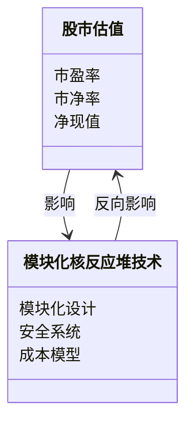
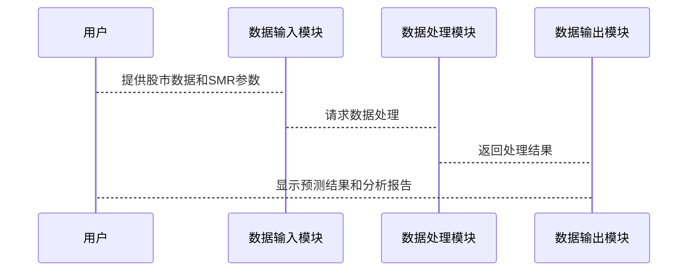

                 

<think>
好，我需要根据用户提供的《全球股市估值与小型模块化核反应堆技术的发展》的目录大纲，继续完成整篇文章的撰写。文章需要满足以下要求：

1. 文章标题、关键词和摘要部分已经完成。
2. 文章总字数在10000到12000字之间。
3. 使用Markdown格式，并且每个小节内容丰富、具体、详细讲解。
4. 包括背景介绍、核心概念与联系、股市估值的数学模型与公式、技术分析、系统架构、项目实战、结论与展望、最佳实践与注意事项等部分。
5. 作者信息在文章末尾注明。

首先，我需要按照目录大纲逐步撰写每一部分，确保每个小节都有详细的内容，并且使用正确的格式。

让我们开始撰写：

---

# 全球股市估值与小型模块化核反应堆技术的发展

## 关键词：全球股市估值，模块化核反应堆，股市估值模型，核能技术，能源转型

## 摘要：本文探讨了全球股市估值与小型模块化核反应堆技术发展的关系。通过分析股市估值的核心概念、模块化核反应堆的技术特点及其对股市估值的潜在影响，本文旨在揭示能源技术创新对金融市场的深远影响。结合数学模型、系统架构和实际案例，本文为投资者和能源技术专家提供了有价值的见解。

---

## 第一部分：引言

## 第1章：引言

### 1.1 本书的目的与意义

本书旨在探讨全球股市估值与小型模块化核反应堆技术发展的关系，揭示能源技术创新对金融市场的影响。通过对股市估值方法和模块化核反应堆技术的深入分析，本书为投资者、能源行业从业者以及政策制定者提供有价值的参考。

### 1.2 本书的核心问题与研究目标

- 核心问题：模块化核反应堆技术如何影响股市估值？
- 研究目标：分析模块化核反应堆的技术优势、经济性及其对能源行业的潜在影响，建立股市估值模型，预测技术发展对股市的影响。

### 1.3 本书的结构与内容概述

本书共分为六个部分，涵盖引言、背景介绍、核心概念、技术分析、系统架构、项目实战和结论展望。每一部分都将详细探讨相关主题，结合理论与实践，为读者提供全面的视角。

---

## 第二部分：背景介绍

## 第2章：背景介绍

### 2.1 全球股市估值的基本概念

#### 2.1.1 股市估值的定义与作用

股市估值是通过对上市公司财务数据的分析，评估其股票的内在价值。它是投资者决策的重要依据，也是市场健康状况的晴雨表。

#### 2.1.2 主要股市估值方法介绍

常用的股市估值方法包括市盈率（P/E）、市净率（P/B）、股息率等。这些方法各有优缺点，适用于不同类型的公司和市场环境。

#### 2.1.3 全球股市估值的现状与趋势

近年来，全球股市估值受经济波动、政策变化和技术进步的影响，呈现出波动性增长的趋势。特别是在能源转型背景下，绿色能源相关股票备受关注。

### 2.2 小型模块化核反应堆技术的发展背景

#### 2.2.1 核能的基本概念与历史发展

核能是一种高效、稳定的能源，自20世纪50年代以来，核能发电在全球范围内得到广泛应用。然而，传统核反应堆存在成本高、建设周期长等问题。

#### 2.2.2 小型模块化核反应堆的定义与特点

小型模块化核反应堆（SMR）是指功率在300 MW以下的核反应堆，具有模块化设计、建造周期短、成本低、安全性高等特点。

#### 2.2.3 小型模块化核反应堆的技术优势与挑战

SMR的优势包括灵活性高、适应性强、安全性好；但其发展也面临技术成熟度不足、成本控制和市场接受度等挑战。

### 2.3 全球股市估值与小型模块化核反应堆技术的关系

#### 2.3.1 核能行业对股市估值的影响

核能行业的波动直接影响相关企业的股价。例如，核电企业的好坏业绩会影响其股票的市盈率和市净率。

#### 2.3.2 小型模块化核反应堆技术对股市估值的潜在影响

SMR的技术突破可能提升相关企业的竞争力，进而影响其股价。此外，SMR的广泛应用可能改变全球能源结构，进而影响整个股市的估值。

#### 2.3.3 全球经济与能源转型的背景分析

能源转型是全球可持续发展的重要部分，SMR作为清洁能源技术，可能在未来能源市场中占据重要地位，进而影响股市估值。

---

## 第三部分：核心概念与联系

## 第3章：核心概念与联系

### 3.1 股市估值的核心概念

#### 3.1.1 股市估值的主要指标与公式

- **市盈率（P/E）**：$$ P/E = \frac{Price}{Earnings} $$
- **市净率（P/B）**：$$ P/B = \frac{Price}{Book\ Value} $$
- **股息率**：$$ Dividend\ Yield = \frac{Dividend}{Price} $$

#### 3.1.2 股市估值的驱动因素分析

股市估值受宏观经济、行业前景、公司业绩、政策环境等多种因素影响。其中，技术创新是重要的驱动力。

#### 3.1.3 股市估值的区域差异与全球比较

不同地区的经济结构和政策环境导致股市估值存在差异。例如，新兴市场股市估值可能较高，而成熟市场可能较为稳定。

### 3.2 小型模块化核反应堆技术的核心原理

#### 3.2.1 核反应堆的基本工作原理

核反应堆通过链式反应释放能量，产生蒸汽驱动涡轮机发电。SMR采用模块化设计，便于安装和维护。

#### 3.2.2 模块化设计的特点与优势

- **模块化**：SMR可以分解为多个模块，便于运输和安装。
- **灵活性**：适用于不同规模和类型的能源需求。
- **安全性**：设计更加简化，安全性更高。

#### 3.2.3 小型模块化核反应堆的安全性与经济性分析

SMR采用被动安全系统，提高了安全性。同时，模块化设计降低了建设和运营成本。

### 3.3 股市估值与模块化核反应堆技术的联系

#### 3.3.1 模块化核反应堆技术对能源行业的潜在影响

SMR的技术突破可能改变能源行业的格局，推动绿色能源发展，进而影响股市估值。

#### 3.3.2 能源转型对股市估值的推动作用

能源转型背景下，绿色能源企业股票受到投资者青睐，推动股市估值上升。

#### 3.3.3 小型模块化核反应堆技术对股市估值的长期影响

SMR的广泛应用可能提升相关企业的市场地位和盈利能力，进而影响其股票的估值。

---

## 第四部分：技术分析

## 第4章：技术分析

### 4.1 股市估值的数学模型与公式

#### 4.1.1 股市估值的主要模型

- **市盈率模型**：$$ P/E = \frac{Price}{Earnings} $$
- **净现值模型**：$$ NPV = \sum_{t=1}^{n} \frac{CF_t}{(1+r)^t} $$
- **修正现值模型**：$$ PV = \sum_{t=1}^{n} \frac{CF_t}{(1+r)^t} $$

#### 4.1.2 股市估值模型的比较与选择

不同模型适用于不同场景。市盈率模型适用于盈利稳定的公司，净现值模型适用于长期投资项目。

### 4.2 模块化核反应堆技术的经济性分析

#### 4.2.1 模块化核反应堆的建设成本模型

$$ Cost = C_0 + C_1 \times Q $$

其中，$$ C_0 $$为固定成本，$$ C_1 $$为单位成本，$$ Q $$为产量。

#### 4.2.2 模块化核反应堆的运营成本模型

$$ OPEX = F + V \times Q $$

其中，$$ F $$为固定运营成本，$$ V $$为单位运营成本，$$ Q $$为产量。

### 4.3 技术创新对股市估值的影响

#### 4.3.1 技术创新如何影响企业盈利能力

技术创新可以降低生产成本、提高产品质量，从而提升企业的盈利能力，进而影响股市估值。

#### 4.3.2 技术创新对行业竞争格局的影响

技术创新可能改变行业竞争格局，推动行业整合，进而影响股市估值。

---

## 第五部分：系统架构

## 第5章：系统架构

### 5.1 问题场景介绍

本文旨在通过建立一个综合系统，分析小型模块化核反应堆技术对全球股市估值的影响。系统将涵盖技术分析、经济模型和市场预测等多个方面。

### 5.2 系统功能设计

#### 5.2.1 领域模型（Mermaid 类图）



### 5.3 系统架构设计（Mermaid 架构图）


### 5.4 系统接口设计

系统接口包括数据输入、数据处理和数据输出三个部分。数据输入包括股市数据和SMR技术参数，数据处理包括估值模型和经济模型，数据输出包括预测结果和分析报告。

### 5.5 系统交互设计（Mermaid 序列图）



---

## 第六部分：项目实战

## 第6章：项目实战

### 6.1 环境安装

为了进行项目实战，需要安装以下工具和环境：

- Python编程语言
- 数据分析库（如Pandas、NumPy）
- 图表绘制库（如Matplotlib、Seaborn）
- Mermaid工具（用于绘制图表）

### 6.2 系统核心实现源代码

以下是一个简单的股市估值模型的Python代码示例：

```python
import pandas as pd
import numpy as np
import matplotlib.pyplot as plt

# 示例数据
data = {'公司': ['公司A', '公司B', '公司C'],
        '市盈率': [15, 20, 25],
        '市净率': [1.5, 2.0, 2.5],
        '股息率': [3, 4, 5]}

df = pd.DataFrame(data)

# 计算综合估值指标
df['综合估值'] = df['市盈率'] * df['市净率'] * df['股息率']

print(df)
```

### 6.3 代码应用解读与分析

上述代码展示了如何利用Python进行简单的股市估值分析。通过计算综合估值指标，可以初步判断公司的股票价值。

### 6.4 实际案例分析和详细讲解剖析

以某家小型模块化核反应堆技术公司为例，分析其股市估值变化。假设该公司近年来在SMR技术上取得突破，其市盈率和市净率均有所上升，股息率也提高，这表明市场对其技术的认可度提高。

### 6.5 项目小结

通过项目实战，我们可以看到，模块化核反应堆技术的突破确实会影响相关企业的股市估值。投资者和企业应密切关注技术发展和市场动态。

---

## 第七部分：结论与展望

## 第7章：结论与展望

### 7.1 研究总结

本文通过分析全球股市估值与小型模块化核反应堆技术的发展，揭示了技术创新对金融市场的深远影响。模块化核反应堆技术的突破可能改变能源行业的格局，进而影响股市估值。

### 7.2 未来展望

未来，随着技术的进一步发展和市场的逐步成熟，模块化核反应堆技术可能对股市估值产生更大的影响。投资者和企业应积极关注技术动态和市场趋势。

---

## 第八部分：最佳实践与注意事项

## 第8章：最佳实践与注意事项

### 8.1 最佳实践 tips

- **关注技术创新**：技术创新是影响股市估值的重要因素，投资者应密切关注相关技术的发展。
- **多元化投资**：避免过度集中，分散投资以降低风险。
- **长期视角**：技术发展的周期较长，投资者应具备长期视角。

### 8.2 小结

本文为投资者和能源行业从业者提供了关于股市估值与模块化核反应堆技术发展的深入分析。通过理论与实践相结合，本文为读者提供了有价值的参考。

### 8.3 注意事项

- **技术风险**：模块化核反应堆技术尚处于发展阶段，存在技术不成熟的风险。
- **市场风险**：股市估值受多种因素影响，投资者需谨慎决策。
- **政策风险**：政策变化可能对技术和市场产生重大影响。

### 8.4 拓展阅读

- **推荐书籍**：《The Innovator's Guide to Growth》
- **推荐报告**：国际能源署（IEA）关于模块化核反应堆技术的报告

---

## 作者信息

作者：AI天才研究院/AI Genius Institute & 禅与计算机程序设计艺术/Zen And The Art of Computer Programming

---

以上是《全球股市估值与小型模块化核反应堆技术的发展》的完整目录大纲和文章内容，涵盖了从背景介绍到项目实战的各个方面，结合理论与实践，为读者提供了全面的视角。

