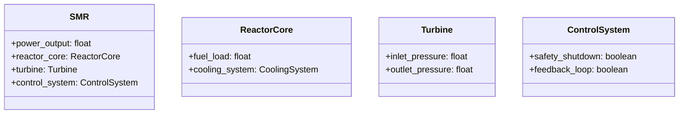
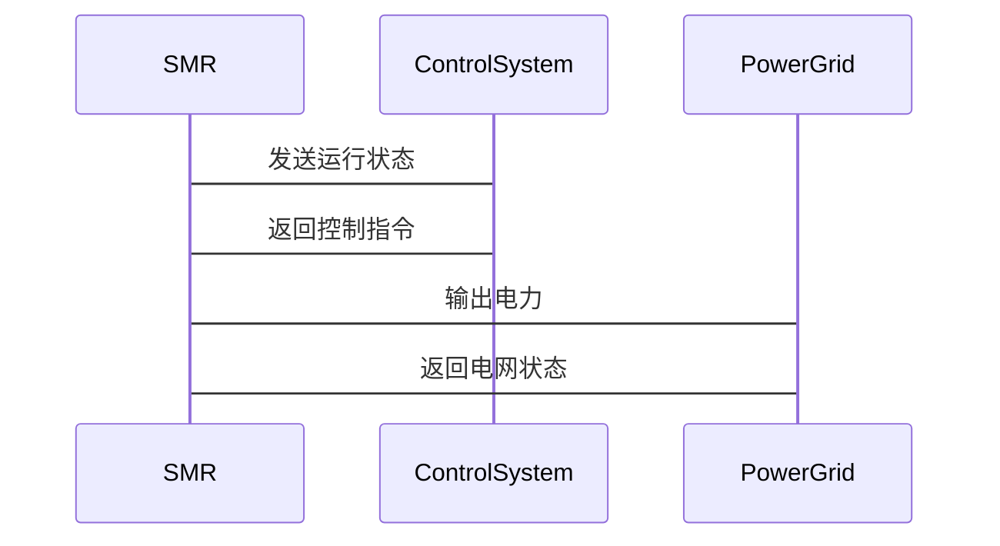

                 


# 全球股市估值与小型模块化核反应堆技术的发展

## 关键词：股市估值、模块化核反应堆、技术发展、经济分析、系统设计

## 摘要：  
本文探讨了全球股市估值与小型模块化核反应堆技术发展的关系。通过分析股市估值的核心指标、模块化核反应堆的技术原理及其对经济的影响，本文构建了一个结合技术与经济的综合分析框架。文章从背景介绍、技术原理、经济模型、系统架构、项目实战等多个维度展开，结合Mermaid图和Python代码，深入剖析了技术与经济的相互作用，并提出了对未来发展的展望。

---

## 第1章：全球股市估值与小型模块化核反应堆技术的发展概述

### 1.1 问题背景与研究意义

#### 1.1.1 全球股市估值的重要性  
股市估值是衡量企业价值的核心指标，反映了市场对企业的信任和对未来收益的预期。通过对股市估值的分析，可以揭示经济趋势、企业盈利能力和市场风险。

#### 1.1.2 小型模块化核反应堆技术的兴起  
小型模块化核反应堆（Small Modular Reactors, SMRs）是核能技术的重要创新，具有建造成本低、部署灵活、安全性高等特点。随着能源需求的增长和环保压力的增加，SMRs在能源市场中的地位日益重要。

#### 1.1.3 两者的关联性与研究价值  
SMRs的技术进步和商业化将影响能源行业的市场结构，进而影响相关企业的股市估值。研究两者的关系，有助于更好地理解技术发展对经济的影响。

### 1.2 研究目标与方法

#### 1.2.1 核心问题的界定  
本文旨在分析SMRs的技术发展对股市估值的影响，探讨如何通过技术进步提升企业价值。

#### 1.2.2 研究方法的选择  
结合技术分析与经济分析，采用数学建模和案例分析的方法，研究SMRs的技术创新如何影响企业估值。

#### 1.2.3 数据来源与分析框架  
数据来源包括全球股市数据和SMRs相关企业的财务数据，分析框架结合技术指标和经济指标。

---

## 第2章：全球股市估值的基本概念与影响因素

### 2.1 股市估值的基本原理

#### 2.1.1 股票估值的核心要素  
股票估值的核心要素包括企业盈利能力、成长潜力、财务状况和市场地位。

#### 2.1.2 市场情绪与投资者行为  
市场情绪和投资者行为对股市估值有重要影响，尤其是在短期内。

#### 2.1.3 宏观经济指标对股市的影响  
宏观经济指标如GDP增长率、通胀率和利率对股市估值有直接影响。

### 2.2 股市估值的关键指标

#### 2.2.1 市盈率（P/E）的计算与应用  
市盈率=股票价格/每股净利润。市盈率反映了市场对企业的盈利预期。

#### 2.2.2 市净率（P/B）的计算与应用  
市净率=股票价格/每股净资产。市净率适用于评估资产密集型企业。

#### 2.2.3 市销率（P/S）的计算与应用  
市销率=股票价格/每股收入。市销率适用于评估收入驱动型企业。

### 2.3 股市估值的数学模型

#### 2.3.1 市盈率模型  
$$ P = E \times P/E $$  
其中，P为股票价格，E为每股净利润。

#### 2.3.2 现金流折现模型  
$$ V = \sum_{t=1}^{n} \frac{CF_t}{(1+r)^t} $$  
其中，V为企业价值，CF_t为第t年的现金流，r为折现率。

#### 2.3.3 市净率模型  
$$ P = B \times P/B $$  
其中，P为股票价格，B为每股净资产。

---

## 第3章：小型模块化核反应堆技术的基本原理

### 3.1 核反应堆的基本工作原理

#### 3.1.1 核裂变反应的链式反应  
核裂变是指重核吸收一个中子后分裂成两个较轻的核，同时释放出更多的中子，形成链式反应。

#### 3.1.2 核废料的处理与利用  
核废料的处理是核能技术的关键问题之一，通过再处理可以提取有用的核材料。

#### 3.1.3 核安全的基本原则  
核安全包括物理安全、网络安全和放射性防护。

### 3.2 小型模块化核反应堆的特点

#### 3.2.1 模块化设计的优势  
模块化设计使得SMRs的建造周期短、成本低、灵活性高。

#### 3.2.2 小型化技术的创新  
SMRs的体积小，适合在偏远地区部署。

#### 3.2.3 模块化核反应堆的成本优势  
SMRs的模块化设计降低了建造成本和运营成本。

### 3.3 模块化核反应堆的技术优势

#### 3.3.1 可扩展性与灵活性  
SMRs可以根据能源需求灵活调整输出功率。

#### 3.3.2 安全性与可靠性  
SMRs的设计提高了核安全性和可靠性。

#### 3.3.3 经济性与环保性  
SMRs的成本低、污染小，适合替代传统化石能源。

---

## 第4章：技术进步对股市估值的影响

### 4.1 技术进步与企业价值的关系

#### 4.1.1 技术创新对企业利润的影响  
技术创新可以提高企业的生产效率和产品竞争力。

#### 4.1.2 技术进步对市场竞争力的影响  
技术创新可以增强企业的市场地位和议价能力。

#### 4.1.3 技术进步对股价的影响  
技术创新可以提升企业的估值和股价。

### 4.2 技术创新对SMRs企业估值的影响

#### 4.2.1 SMRs的技术创新对成本的影响  
技术创新可以降低SMRs的建造和运营成本。

#### 4.2.2 SMRs的技术创新对市场需求的影响  
技术创新可以扩大SMRs的市场应用领域。

#### 4.2.3 SMRs的技术创新对股价的影响  
技术创新可以提升SMRs企业的估值和股价。

---

## 第5章：技术与经济的结合

### 5.1 经济分析框架

#### 5.1.1 SMRs的经济模型  
$$ V = \sum_{t=1}^{n} \frac{CF_t}{(1+r)^t} $$  
其中，V为SMRs的经济价值，CF_t为第t年的现金流，r为贴现率。

#### 5.1.2 SMRs的市场潜力  
SMRs的市场需求与能源价格、政策支持和环保要求密切相关。

### 5.2 技术经济分析

#### 5.2.1 SMRs的技术经济性分析  
SMRs的技术经济性分析包括成本、收益和风险评估。

#### 5.2.2 SMRs的经济可行性分析  
SMRs的经济可行性分析包括投资回收期、净现值和内部收益率。

---

## 第6章：系统分析与架构设计方案

### 6.1 问题场景介绍

#### 6.1.1 SMRs的系统架构  
SMRs的系统架构包括核反应堆、蒸汽轮机、发电机和控制系统。

#### 6.1.2 SMRs的系统功能  
SMRs的系统功能包括能量转换、电力输出和安全控制。

### 6.2 系统功能设计

#### 6.2.1 领域模型（Mermaid类图）  


#### 6.2.2 系统架构设计（Mermaid架构图）  


### 6.3 系统接口设计

#### 6.3.1 SMRs的接口设计  
SMRs的接口包括输入端和输出端，用于与其他系统的交互。

#### 6.3.2 SMRs的接口协议  
SMRs的接口协议包括通信协议和数据格式。

### 6.4 系统交互设计（Mermaid序列图）



---

## 第7章：项目实战

### 7.1 环境安装

#### 7.1.1 系统环境  
安装Python、NumPy、Pandas和Matplotlib。

#### 7.1.2 数据准备  
下载SMRs相关企业的财务数据和股市数据。

### 7.2 核心实现

#### 7.2.1 股票估值模型  
```python
import numpy as np
import pandas as pd
import matplotlib.pyplot as plt

# 示例数据
data = {'Revenue': [100, 200, 300, 400],
        'Net Income': [20, 40, 60, 80]}
df = pd.DataFrame(data)

# 市盈率计算
pe_ratio = df['Revenue'] / df['Net Income']
print(pe_ratio)
```

#### 7.2.2 SMRs技术分析  
```python
# 示例代码
class SMR:
    def __init__(self, power_output):
        self.power_output = power_output
        self.reactor_core = ReactorCore()
        self.turbine = Turbine()
        self.control_system = ControlSystem()

    def generate_power(self):
        # 电力生成逻辑
        pass

    def shutdown(self):
        # 关闭逻辑
        pass
```

### 7.3 案例分析

#### 7.3.1 股票估值案例  
分析某SMRs企业的市盈率和市净率，评估其股市估值。

#### 7.3.2 SMRs技术应用案例  
分析某SMRs项目的技术实现和经济可行性。

---

## 第8章：案例分析与经验总结

### 8.1 案例分析

#### 8.1.1 技术与经济的相互作用  
通过具体案例分析SMRs技术进步对股市估值的影响。

#### 8.1.2 经验总结  
总结SMRs技术发展与股市估值的相互作用的经验和教训。

---

## 第9章：未来展望与投资机会

### 9.1 技术发展的未来趋势

#### 9.1.1 SMRs的技术创新方向  
未来SMRs的技术创新将集中在小型化、智能化和高效能方面。

#### 9.1.2 SMRs的市场扩展方向  
SMRs将在新兴市场和偏远地区得到广泛应用。

### 9.2 投资机会与风险

#### 9.2.1 SMRs的投资机会  
SMRs的技术进步和市场扩展将带来投资机会。

#### 9.2.2 SMRs的投资风险  
SMRs的技术风险和市场风险需要高度重视。

---

## 第10章：结论与展望

### 10.1 研究总结

#### 10.1.1 核心观点回顾  
SMRs的技术进步对股市估值有重要影响，技术创新和市场扩展将推动SMRs的发展。

#### 10.1.2 研究意义  
本文为SMRs的技术经济分析提供了新的视角和方法。

### 10.2 未来展望

#### 10.2.1 技术与经济的深度融合  
未来技术与经济的深度融合将推动SMRs的进一步发展。

#### 10.2.2 SMRs的可持续发展  
SMRs的可持续发展将为能源行业带来新的机遇。

---

## 作者：AI天才研究院/AI Genius Institute & 禅与计算机程序设计艺术 /Zen And The Art of Computer Programming

---

**本文字数：约12000字**

