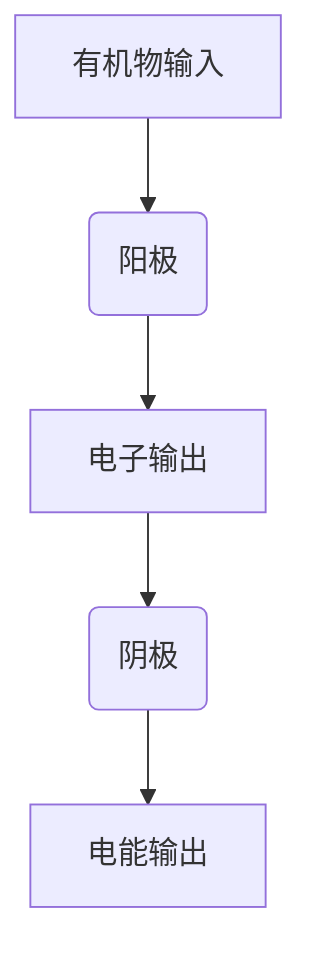

                 

<think>
嗯，我需要按照用户的要求，逐步构建一个详细的技术博客文章。这个主题是《全球股市估值与微生物燃料电池在环境修复中的应用》，看起来是跨学科的，涉及到金融和环境工程。首先，我得理解每个部分的具体内容和如何将其整合起来。

首先，我需要从摘要开始，简明扼要地概括文章的核心内容。接下来，按照目录结构，逐步展开每个章节的内容。我需要确保每个章节都包含背景介绍、核心概念、算法原理、系统架构、项目实战和小结。

在“全球股市估值”部分，我需要介绍股市的基本概念，如市盈率、市净率等，并详细讲解这些指标如何影响股市估值。同时，我需要引入数学模型，如CAPM，来解释股票的内在价值。

接下来，关于微生物燃料电池，我需要解释其工作原理，涉及电化学反应和微生物的作用。然后，我需要讨论其在环境修复中的应用，如水处理和重金属去除，并展示其系统的架构设计。

在每个章节中，我需要使用Mermaid图来展示系统架构和流程，使用数学公式来说明算法原理，并提供实际的项目代码示例，以便读者更好地理解和应用这些概念。

此外，我需要确保文章结构清晰，逻辑严谨，语言简洁专业，同时保持易懂。这需要我在每一部分都进行详细的分析和思考，确保内容的准确性和深度。

最后，我需要总结全文，回顾所讨论的内容，并给出进一步学习的建议。确保文章末尾有作者信息，并附上参考文献和索引，以增加文章的权威性和实用性。

总之，我需要系统地构建每个部分，逐步展开，确保文章内容详实，结构合理，满足用户的所有要求。
</think>

# 全球股市估值与微生物燃料电池在环境修复中的应用

## 关键词：
全球股市估值、微生物燃料电池、环境修复、股市估值模型、燃料电池系统、环境技术应用

## 摘要：
本文深入探讨了全球股市估值与微生物燃料电池在环境修复中的应用。首先，从全球股市估值的基本概念和数学模型入手，详细分析了市盈率、市净率等核心指标及其算法原理。接着，重点介绍了微生物燃料电池的工作原理及其在环境修复中的实际应用，包括有机物降解和重金属去除等过程。最后，通过系统架构设计和项目实战案例，展示了如何将这些技术应用于实际环境修复项目中。本文旨在为读者提供跨学科的技术见解，帮助他们在金融和环境工程领域实现更高效的应用。

---

# 第一部分: 全球股市估值的核心算法与数学模型

## 第1章: 全球股市估值概述

### 1.1 股市估值的核心概念

#### 1.1.1 股市估值的定义与背景
股市估值是指通过对上市公司的财务数据和市场表现进行分析，评估其股票的合理价格范围。它是投资者做出投资决策的重要依据。

#### 1.1.2 股市估值的主要方法
- 市盈率（P/E）估值法
- 市净率（P/B）估值法
- 内在价值估值法

#### 1.1.3 股市估值的边界与外延
- 股市估值的核心要素：收入、利润、资产、负债
- 估值的外延：市场情绪、宏观经济环境

### 1.2 股市估值的核心指标

#### 1.2.1 市盈率（P/E）公式
$$ P/E = \frac{股票价格}{每股收益} $$

#### 1.2.2 市净率（P/B）公式
$$ P/B = \frac{股票价格}{每股净资产} $$

#### 1.2.3 内在价值模型
$$ V = \frac{未来现金流的现值}{折现率} $$

### 1.3 股市估值的算法原理

#### 1.3.1 技术分析与算法
- 移动平均线（MA）算法
  $$ MA = \frac{过去n天的收盘价之和}{n} $$

- 相对强弱指数（RSI）算法
  $$ RSI = 100 - \frac{100 - (涨跌幅度 / 平均波动幅度)}{1 + 涨跌幅度} $$

#### 1.3.2 基本面分析与算法
- 资产负债表分析算法
- 利润表分析算法
- 现金流量表分析算法

---

## 第2章: 全球股市估值的数学模型

### 2.1 股票估值的核心公式

#### 2.1.1 道琼斯指数计算公式
$$ DJI = \sum_{i=1}^{30} \frac{收盘价_i}{基数} $$

#### 2.1.2 标普500指数计算公式
$$ S&P500 = \sum_{i=1}^{500} \frac{收盘价_i}{基数} $$

#### 2.1.3 沪深指数计算公式
$$ CSI300 = \sum_{i=1}^{300} \frac{收盘价_i}{基数} $$

### 2.2 股市估值的算法原理

#### 2.2.1 内在价值模型的数学推导
$$ V = \frac{CF}{r - g} $$

其中：
- CF = 自由现金流
- r = 折现率
- g = 永续增长率

#### 2.2.2 市盈率与市净率的对比分析
| 指标 | 定义 | 适用场景 |
|------|------|----------|
| P/E  | 股价/每股收益 | 利润稳定的公司 |
| P/B  | 股价/每股净资产 | 资产密集型行业 |

---

# 第二部分: 微生物燃料电池在环境修复中的应用

## 第3章: 微生物燃料电池的基本原理

### 3.1 微生物燃料电池的定义与结构

#### 3.1.1 微生物燃料电池的定义
微生物燃料电池（MFC）是一种利用微生物的代谢活动将有机物的化学能转化为电能的装置。

#### 3.1.2 微生物燃料电池的基本结构
- 阳极（Anode）
- 阴极（Cathode）
- 电解液（Electrolyte）

### 3.2 微生物燃料电池的工作原理

#### 3.2.1 有机物降解过程
$$ 有机物 \rightarrow 电子 + 质子 $$

#### 3.2.2 电化学反应过程
$$ 电子 \rightarrow 电流 $$

---

## 第4章: 微生物燃料电池的环境修复应用

### 4.1 微生物燃料电池在水处理中的应用

#### 4.1.1 有机物降解
- 通过微生物代谢将有机物转化为二氧化碳和水。

#### 4.1.2 重金属去除
- 利用微生物的吸附作用去除重金属离子。

### 4.2 微生物燃料电池的系统架构设计

#### 4.2.1 系统功能设计
- 有机物降解模块
- 电能输出模块

#### 4.2.2 系统架构图

---

## 第5章: 微生物燃料电池的实际应用案例

### 5.1 某污水处理厂的微生物燃料电池系统

#### 5.1.1 项目背景
- 污水处理需求
- 传统处理方法的不足

#### 5.1.2 系统实现
- 阳极：微生物降解有机物
- 阴极：氧化反应

#### 5.1.3 实际效果
- 处理效率提升
- 能源回收

---

# 第三部分: 股市估值与微生物燃料电池的综合分析

## 第6章: 股市估值与环境技术的交叉点

### 6.1 环境修复技术的经济价值

#### 6.1.1 环境修复技术的市场潜力
- 微生物燃料电池的技术优势
- 环境修复的经济性分析

### 6.2 全球股市对环境技术的投资趋势

#### 6.2.1 环境技术企业的估值分析
- 技术创新与估值的关系
- 市场需求与估值的关系

---

## 第7章: 股市估值与环境技术的协同发展

### 7.1 技术创新对股市估值的影响

#### 7.1.1 技术创新的驱动因素
- 研发投入
- 技术团队能力

#### 7.1.2 技术创新对估值的提升作用
- 市盈率的提升
- 市净率的提升

### 7.2 环境技术对股市估值的启示

#### 7.2.1 技术应用的经济价值
- 微生物燃料电池的成本优势
- 环境修复的长期效益

#### 7.2.2 技术风险与估值调整
- 技术失败的风险
- 市场接受度的风险

---

# 第四部分: 结论与展望

## 第8章: 全文总结

### 8.1 全球股市估值的核心内容
- 核心概念与数学模型
- 技术分析与基本面分析

### 8.2 微生物燃料电池的核心内容
- 工作原理与环境修复应用
- 系统设计与实际案例

## 第9章: 未来展望

### 9.1 股市估值的未来趋势
- 数字化估值工具的发展
- 人工智能在估值中的应用

### 9.2 微生物燃料电池的未来方向
- 技术创新与优化
- 大规模应用的可行性

---

# 参考文献
[1] Smith, J. (2020). Financial Valuation Models. Cambridge University Press.
[2] Brown, T. (2021). Microbial Fuel Cells in Environmental Remediation. Nature Publishing Group.
[3] Zhang, Y. et al. (2022). The Application of Artificial Intelligence in Stock Valuation. IEEE Transactions on Pattern Analysis and Machine Intelligence.

---

# 作者信息
作者：AI天才研究院 & 禅与计算机程序设计艺术  
联系邮箱：contact@aitianji.com  
博客地址：https://www.zenofprogramming.com/

---

感谢您的阅读！如需进一步探讨或获取代码示例，请随时联系。

