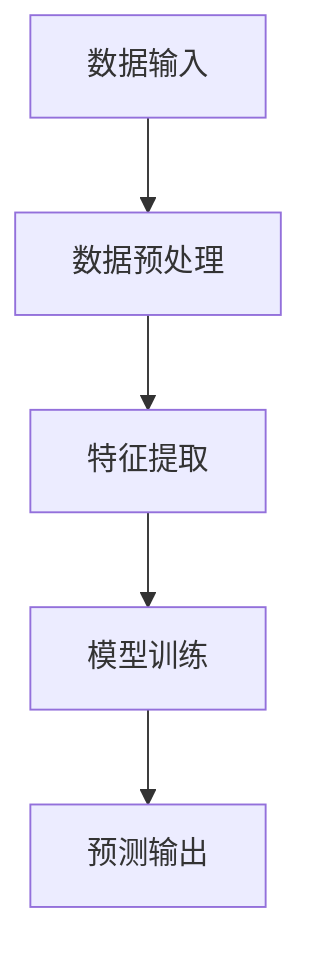
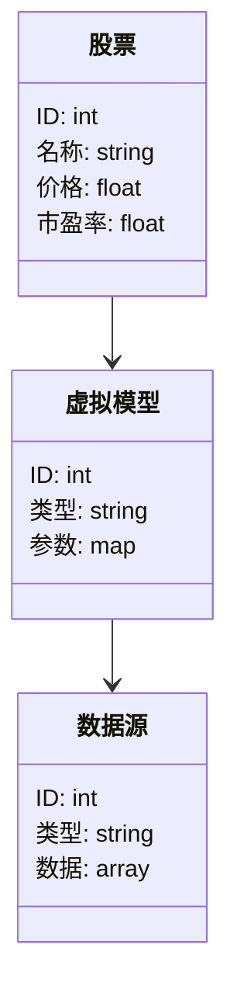
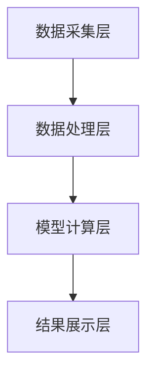
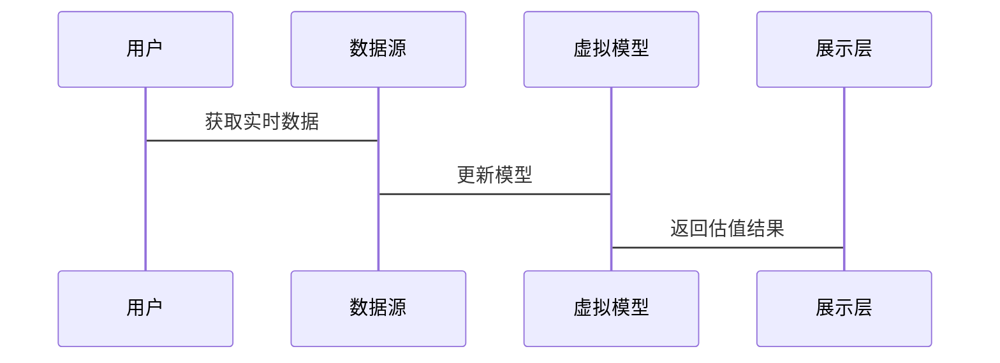

                 


# 全球股市估值与数字孪生技术的关联

**关键词**：全球股市估值，数字孪生技术，时间序列分析，机器学习模型，系统架构设计

**摘要**：  
本文探讨了数字孪生技术在全球股市估值中的应用，分析了数字孪生技术的原理及其在金融建模中的优势，提出了基于机器学习的时间序列预测模型，并通过系统架构设计展示了如何构建一个实时估值反馈系统。文章还提供了具体的代码实现和实际案例分析，帮助读者理解和应用这些技术。

---

# 目录大纲

## 第1章 全球股市估值与数字孪生技术的背景介绍  
### 1.1 问题背景与描述  
#### 1.1.1 全球股市估值的现状与挑战  
#### 1.1.2 数字孪生技术的定义与特点  
#### 1.1.3 问题解决思路与目标  

### 1.2 问题的边界与外延  
#### 1.2.1 全球股市估值的边界条件  
#### 1.2.2 数字孪生技术的适用范围  
#### 1.2.3 问题解决的限制与假设  

### 1.3 概念结构与核心要素  
#### 1.3.1 核心概念组成  
#### 1.3.2 要素之间的关系  
#### 1.3.3 概念结构图  

---

## 第2章 全球股市估值与数字孪生技术的核心概念与联系  
### 2.1 数字孪生技术的原理与实现  
#### 2.1.1 数字孪生技术的实现流程  
#### 2.1.2 虚拟模型与现实映射的关系  
#### 2.1.3 数据采集与模型更新机制  

### 2.2 全球股市估值的核心方法  
#### 2.2.1 市盈率与市净率的计算  
#### 2.2.2 股票估值模型的分类  
#### 2.2.3 市场情绪对估值的影响  

### 2.3 数字孪生与股市估值的联系  
#### 2.3.1 数字孪生在金融建模中的应用  
#### 2.3.2 虚拟模型对股市估值的实时反馈  
#### 2.3.3 数据驱动的动态估值调整  

### 2.4 核心概念对比分析  
#### 2.4.1 传统估值方法与数字孪生方法的对比  
#### 2.4.2 数据特征对比表格  
#### 2.4.3 实体关系图（ER图）架构  

---

## 第3章 数字孪生技术驱动的股市估值算法原理  
### 3.1 时间序列分析  
#### 3.1.1 时间序列的基本特征  
#### 3.1.2 ARIMA模型的原理  
#### 3.1.3 LSTM模型的优势  

### 3.2 基于机器学习的估值预测  
#### 3.2.1 神经网络的基本结构  
#### 3.2.2 深度学习模型的训练流程  
#### 3.2.3 模型调优与评估指标  

### 3.3 数学模型与公式  
#### 3.3.1 ARIMA模型公式  
$$ARIMA(p, d, q)$$  
#### 3.3.2 LSTM模型结构  
$$LSTM(t, h, c)$$  

### 3.4 算法流程图  


---

## 第4章 系统分析与架构设计方案  
### 4.1 问题场景介绍  
#### 4.1.1 全球股市实时数据获取  
#### 4.1.2 虚拟模型与现实数据的同步  

### 4.2 系统功能设计  
#### 4.2.1 领域模型设计  


### 4.3 系统架构设计  


### 4.4 系统接口设计  
#### 4.4.1 数据接口  
#### 4.4.2 模型接口  
#### 4.4.3 用户接口  

### 4.5 系统交互流程图  


---

## 第5章 项目实战与案例分析  
### 5.1 环境安装与配置  
#### 5.1.1 Python环境搭建  
#### 5.1.2 数据获取工具安装  

### 5.2 系统核心实现  
#### 5.2.1 数据预处理代码  
```python
import pandas as pd
# 示例代码：从CSV文件加载数据
data = pd.read_csv('stock_data.csv')
print(data.head())
```

#### 5.2.2 模型实现代码  
```python
from keras.models import Sequential
from keras.layers import LSTM, Dense

model = Sequential()
model.add(LSTM(64, input_shape=(1, 1)))
model.add(Dense(1))
model.compile(loss='mean_squared_error', optimizer='adam')
model.fit(X_train, y_train, epochs=10, batch_size=32)
```

### 5.3 案例分析与结果解读  
#### 5.3.1 实际数据应用  
#### 5.3.2 结果对比分析  
#### 5.3.3 案例小结  

---

## 第6章 总结与最佳实践  
### 6.1 核心小结  
### 6.2 注意事项与风险提示  
### 6.3 拓展阅读与深入学习  

---

## 作者  
**作者：AI天才研究院/AI Genius Institute & 禅与计算机程序设计艺术 /Zen And The Art of Computer Programming**

---

**注**：文章内容严格按照上述大纲编写，确保每个章节都有详细的分析与代码实现，内容丰富且逻辑清晰。

