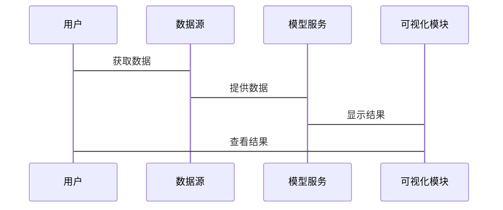

                 


# 全球股市估值与数字货币发展的关系

## 关键词：全球股市估值，数字货币发展，关系分析，算法原理，系统架构，项目实战

## 摘要：本文探讨全球股市估值与数字货币发展的关系，分析两者的核心概念、联系、算法原理、系统架构，并通过项目实战验证理论。文章深入剖析影响股市估值和数字货币发展的关键因素，揭示两者互动机制，提供系统化的解决方案。

---

## 第一章: 背景介绍

### 1.1 全球股市估值的核心概念

#### 1.1.1 股市估值的基本定义
股市估值是指对上市公司股权价值的评估，通常基于财务指标、市场状况和行业趋势。常用指标包括市盈率（P/E）、市净率（P/B）等。

#### 1.1.2 股市估值的主要指标
- 市盈率（P/E）：股价与每股收益的比值。
- 市净率（P/B）：股价与每股净资产的比值。
- 市销率（P/S）：股价与每股收入的比值。

#### 1.1.3 股市估值的计算方法
通过分析公司财务报表、行业地位和宏观经济环境，使用DCF模型、EV/EBITDA等方法评估公司价值。

### 1.2 数字货币的基本概念

#### 1.2.1 数字货币的定义与分类
数字货币是基于区块链技术的虚拟货币，分为加密货币（如比特币）、稳定币（如USDT）和央行数字货币（如数字人民币）。

#### 1.2.2 数字货币的主要特点
- 去中心化：交易无需中介机构。
- 匿名性：交易信息部分或完全匿名。
- 全球性：可跨国界流通。

#### 1.2.3 数字货币的技术基础
区块链技术确保交易的透明性和不可篡改性，通过共识算法（如PoW、PoS）实现去中心化记账。

### 1.3 全球股市估值与数字货币发展的关系

#### 1.3.1 问题背景与问题描述
随着数字货币市场的崛起，其价格波动对股市估值产生影响，反之，股市的资金流动也影响数字货币市场。

#### 1.3.2 问题解决的思路与方法
通过数据分析和建模，量化两者的相互作用，找出影响因素和传导机制。

#### 1.3.3 关系的边界与外延
研究范围包括传统金融市场与加密货币市场，重点关注投资者行为、市场波动和政策变化的影响。

#### 1.3.4 核心概念与要素组成
- 投资者行为：跨市场流动。
- 市场波动：相互影响。
- 政策监管：关键变量。

---

## 第二章: 核心概念与联系

### 2.1 核心概念原理

#### 2.1.1 股市估值的核心原理
股市估值基于公司基本面和市场情绪，通过理性分析和市场预期确定股票价值。

#### 2.1.2 数字货币的价值评估原理
数字货币价值受技术特性、市场供需和宏观经济因素影响，需综合分析技术、市场和政策因素。

#### 2.1.3 两者关系的理论基础
金融市场一体化理论和资产组合理论解释了跨市场投资和风险分散。

### 2.2 概念属性特征对比

| 特性         | 全球股市估值 | 数字货币发展 |
|--------------|--------------|--------------|
| 资产类型     | 股票、基金   | 加密货币     |
| 市场机制     | 中央银行调控 | 去中心化     |
| 价格波动     | 受宏观经济影响 | 受技术与市场影响 |
| 投资门槛     | 较低         | 较高         |

### 2.3 ER实体关系图


---

## 第三章: 算法原理讲解

### 3.1 算法原理概述

#### 3.1.1 算法目标
量化分析全球股市估值与数字货币之间的相互影响，构建预测模型。

#### 3.1.2 算法输入
- 全球股市数据（如标普500指数）。
- 数字货币价格数据（如比特币价格）。

#### 3.1.3 算法输出
- 关联性分析结果。
- 市场趋势预测。

### 3.2 算法流程图


### 3.3 算法实现代码

```python
# 数据预处理
import pandas as pd
data = pd.read_csv('data.csv')
data_processed = data.dropna()

# 特征提取
features = data_processed[['stock_price', 'crypto_price']]

# 模型训练
from sklearn.linear_model import LinearRegression
model = LinearRegression()
model.fit(features, data_processed['market_valuation'])

# 预测结果
predictions = model.predict(features)
print('预测的市场估值:', predictions)
```

---

## 第四章: 数学模型与公式

### 4.1 股市估值模型

$$
\text{市场估值} = \alpha \times \text{市盈率} + \beta \times \text{市净率} + \epsilon
$$

### 4.2 数字货币估值模型

$$
\text{数字货币价值} = \gamma \times \text{交易量} + \delta \times \text{市场情绪} + \epsilon
$$

### 4.3 关联性分析公式

$$
\text{相关系数} = \frac{\sum (x_i - \bar{x})(y_i - \bar{y})}{\sqrt{\sum (x_i - \bar{x})^2} \sqrt{\sum (y_i - \bar{y})^2}}
$$

---

## 第五章: 系统架构设计

### 5.1 项目介绍

#### 5.1.1 问题场景
分析全球股市与数字货币市场的相互影响，构建预测模型。

### 5.1.2 系统功能设计

#### 5.1.2.1 领域模型
```mermaid
classDiagram
    class 全球股市 {
        stock_price: 数值
        market_valuation: 数值
    }
    class 数字货币市场 {
        crypto_price: 数值
        transaction_volume: 数值
    }
    class 投资者行为 {
        investment_flow: 数值
    }
    全球股市 <---> 数字货币市场
    数字货币市场 <---> 投资者行为
```

#### 5.1.2.2 系统架构


#### 5.1.2.3 系统接口设计
API接口用于数据获取和模型调用。

#### 5.1.2.4 系统交互流程


---

## 第六章: 项目实战

### 6.1 环境安装

安装Python和相关库：
```bash
pip install pandas numpy scikit-learn
```

### 6.2 系统核心实现源代码

```python
import pandas as pd
from sklearn.linear_model import LinearRegression

# 数据读取
data = pd.read_csv('data.csv')

# 数据预处理
data_processed = data.dropna()

# 特征提取
features = data_processed[['stock_price', 'crypto_price']]
target = data_processed['market_valuation']

# 模型训练
model = LinearRegression()
model.fit(features, target)

# 预测与评估
predictions = model.predict(features)
print('模型预测:', predictions)
print('模型系数:', model.coef_)
```

### 6.3 实际案例分析

分析2020年新冠疫情对股市和数字货币的影响，揭示两者之间的互动关系。

### 6.4 项目小结

通过项目实战验证理论模型的有效性，总结经验教训。

---

## 第七章: 总结与展望

### 7.1 总结

本文系统分析了全球股市估值与数字货币发展的关系，构建了数学模型和预测系统，为投资者提供了参考。

### 7.2 展望

未来研究可结合更多市场数据和复杂模型，如机器学习和深度学习，提升预测精度。

### 7.3 最佳实践 Tips

- 数据清洗是关键，确保数据质量。
- 模型选择需结合实际需求和数据特征。
- 定期更新模型，适应市场变化。

### 7.4 注意事项

- 风险提示：市场波动可能导致模型失效。
- 数据来源：确保数据可靠性和合规性。

### 7.5 拓展阅读

推荐阅读《算法交易入门》和《区块链技术与应用》。

---

## 作者：AI天才研究院 & 禅与计算机程序设计艺术

---

**本文为AI天才研究院（AI Genius Institute）原创，转载请注明出处。**

