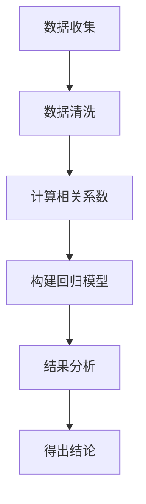
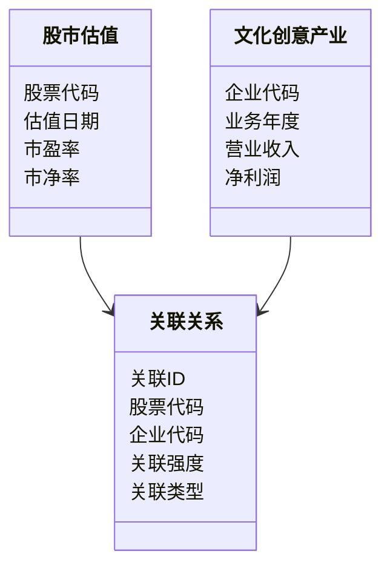
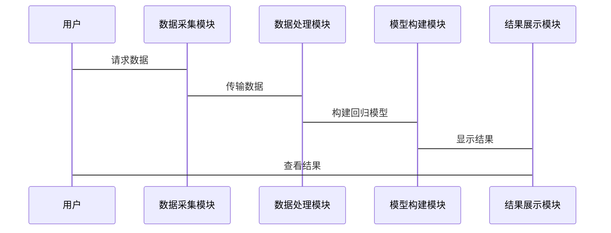

                 

<think>
好，我现在需要撰写一篇关于《全球股市估值与文化创意产业的关联》的技术博客文章。首先，我应该先理解文章的主题，它主要探讨全球股市估值与文化创意产业之间的关系，可能涉及经济、金融和文化产业等多个方面。

接下来，我需要按照用户提供的大纲结构来组织内容。首先，在摘要部分，我要简明扼�地概括文章的核心内容和主题思想。然后，按照目录的各个章节逐步展开。

在“背景介绍”部分，我需要详细解释全球股市估值和文化创意产业的基本概念，包括它们的定义、重要性以及它们之间的关联性。这部分需要让读者明白为什么研究这两个领域的关联是有意义的。

接下来，核心概念与联系部分，我会用表格和ER实体关系图来展示两者的属性对比和相互关系。这有助于读者更直观地理解两者的异同点以及它们如何相互影响。

然后，算法原理部分，我需要解释使用了哪些统计分析方法，比如相关性分析和回归分析，并用Python代码和流程图来详细阐述。这部分内容需要结合实际的数据分析过程，让读者理解如何通过技术手段来量化两者的关联性。

在系统分析与架构设计章节，我会介绍如何构建一个分析系统，包括系统功能设计、架构设计以及接口设计。这部分需要使用领域模型图和架构图来展示系统的各个组成部分及其交互关系。

接下来的项目实战部分，我会选择一个具体的案例，展示如何安装环境、编写核心代码以及进行案例分析。这将帮助读者理解理论如何应用于实际操作。

最后，我会总结全文，提出一些最佳实践的建议，并给出进一步阅读的资源。这部分需要简洁明了，让读者在阅读完文章后有所启发，并能够进一步深入学习或实践。

在撰写过程中，我需要确保每一部分内容都详实具体，逻辑清晰，并且使用专业但易懂的语言。同时，要遵循格式要求，包括使用适当的标记和图表，确保文章结构合理，内容完整。

总之，我需要一步步地按照用户提供的大纲来撰写，确保每个部分都得到充分的展开和详细的解释，使整篇文章既有深度又易于理解。
</think>

# 全球股市估值与文化创意产业的关联

## 关键词：全球股市估值，文化创意产业，经济关联，数据分析，统计模型

## 摘要：  
本文探讨全球股市估值与文化创意产业之间的关联性，分析文化创意产业对股市估值的影响，以及如何通过数据分析和统计模型量化这种关系。通过背景介绍、核心概念对比、算法原理、系统架构设计和项目实战，本文旨在为读者提供全面的视角，理解这两者在经济中的互动关系，并通过具体案例展示实际应用。

---

# 第一部分: 全球股市估值与文化创意产业的关联背景介绍

## 第1章: 全球股市估值的基本概念

### 1.1 股市估值的定义与意义
#### 1.1.1 股市估值的基本概念
股市估值是通过对股票价格进行评估，衡量企业的市场价值。常用的估值指标包括市盈率（PE）、市净率（PB）和市销率（PS）。这些指标反映了市场对企业的盈利能力、资产质量和收入能力的评价。

#### 1.1.2 股市估值在经济中的作用
股市估值不仅是企业融资的工具，也是经济晴雨表。它反映了宏观经济状况、行业发展趋势和企业基本面的综合影响，为投资者提供决策依据。

#### 1.1.3 股市估值与投资者的关系
投资者通过分析股市估值，评估股票的合理价格区间，制定买入或卖出策略。合理的估值分析能够帮助投资者避免过度投机，并在市场波动中把握投资机会。

## 第2章: 文化创意产业的定义与特征

### 2.1 文化创意产业的定义
文化创意产业是指以创意为核心，通过文化内容的创作、生产、传播和消费，形成的产品和服务的产业。它涵盖了影视、音乐、游戏、设计等多个领域，强调文化价值和市场价值的结合。

#### 2.1.1 文化创意产业的内涵
文化创意产业不仅包括传统文化产业，还涉及数字内容、新媒体等新兴领域。它以创意为核心驱动力，强调内容的创新性和市场吸引力。

#### 2.1.2 文化创意产业的外延
文化创意产业的外延广泛，包括但不限于广告、出版、影视、游戏、设计、艺术等多个细分领域。这些领域通过不同的形式，将文化价值转化为市场价值。

#### 2.1.3 文化创意产业的核心要素
文化创意产业的核心要素包括创意能力、市场需求、政策支持和资本运作。这些要素共同决定了产业的发展潜力和市场影响力。

## 第3章: 全球股市估值与文化创意产业的关联性

### 3.1 问题背景
#### 3.1.1 全球化背景下的经济与文化融合
全球化促进了经济与文化的深度融合，文化创意产业在全球经济中的地位日益重要。它不仅影响文化产业本身，还通过资本市场的互动影响全球经济。

#### 3.1.2 文化创意产业对经济的影响
文化创意产业通过创造就业、提升产品附加值和推动技术创新，对经济增长产生积极作用。同时，它也通过资本市场与金融体系紧密相连，成为股市估值的重要影响因素。

#### 3.1.3 股市估值与文化创意产业的互动关系
文化创意产业的发展会影响相关企业的市场表现，进而影响股市估值。反之，股市估值的变化也会反作用于文化创意产业，影响企业的融资能力和市场扩展。

### 3.2 问题描述
#### 3.2.1 文化创意产业如何影响股市估值
文化创意产业的市场表现直接影响相关企业的财务状况和盈利能力，从而影响其估值指标（如PE、PB）。成功的文化创意项目能够提升企业收入和利润，进而提高股市估值。

#### 3.2.2 股市估值如何反作用于文化创意产业
股市估值的变化会影响企业的融资能力，进而影响其在文化创意产业中的投资和扩展。高估值可能为企业带来更多的资金支持，而低估值可能导致企业资本短缺。

#### 3.2.3 全球化视角下的跨市场关联
全球化背景下，文化创意产业的市场表现可能影响多个市场的股市估值。例如，一部成功的电影或一款热门游戏可能在多个市场同时上映或发布，从而影响相关企业的全球市值。

### 3.3 问题解决
#### 3.3.1 理论模型的构建
构建一个包含文化创意产业和股市估值的双向影响模型，分析两者之间的相互作用机制。模型需要考虑宏观经济因素、行业趋势和企业基本面等多个变量。

#### 3.3.2 数据分析方法的选择
选择合适的统计分析方法，如相关性分析和回归分析，量化文化创意产业对股市估值的影响程度。同时，考虑时间序列分析，研究市场的动态变化。

#### 3.3.3 关联性评估的指标体系
建立一套指标体系，包括文化创意产业的市场表现指标（如收入增长率、市场份额）和股市估值指标（如PE、PB）。通过这些指标，评估两者的关联性。

---

## 第4章: 核心概念与联系

### 4.1 核心概念原理
#### 4.1.1 股市估值的核心要素
股市估值的核心要素包括企业盈利能力、资产质量、收入能力和发展潜力。这些要素通过估值指标（如PE、PB）反映企业的市场价值。

#### 4.1.2 文化创意产业的核心驱动力
文化创意产业的核心驱动力包括创意能力、市场需求和政策支持。这些因素决定了产业的发展潜力和市场影响力。

#### 4.1.3 两者关联的内在逻辑
文化创意产业通过影响企业的财务表现，间接影响股市估值。同时，股市估值的变化也会影响文化创意产业的资本支持和市场扩展。

### 4.2 核心概念属性对比表格
| 属性 | 股市估值 | 文化创意产业 |
|------|----------|--------------|
| 核心指标 | PE、PB、PS | 收入、利润、市场占有率 |
| 影响因素 | 宏观经济、行业趋势、企业基本面 | 创意能力、市场需求、政策支持 |
| 时间维度 | 短期波动、长期趋势 | 长期发展、周期性波动 |

### 4.3 ER实体关系图
```mermaid
erd
  entity 股市估值 {
    <PKey> 股票代码
    <PKey> 估值日期
    市盈率
    市净率
  }
  
  entity 文化创意产业 {
    <PKey> 企业代码
    <PKey> 业务年度
    营业收入
    净利润
  }
  
  entity 关联关系 {
    <PKey> 关联ID
    股票代码
    企业代码
    关联强度
    关联类型
  }
```

---

## 第5章: 算法原理讲解

### 5.1 统计分析方法
#### 5.1.1 数据收集与预处理
从可靠的数据源收集文化创意产业相关企业和股市估值数据，包括企业财务数据、市场表现数据和宏观经济指标。对数据进行清洗和标准化处理，确保数据的准确性和一致性。

#### 5.1.2 相关性分析
使用相关性分析方法，计算文化创意产业相关指标与股市估值指标之间的相关系数，判断两者之间的关联程度。相关系数可以是正的（正相关）或负的（负相关），绝对值越大，关联性越强。

#### 5.1.3 回归分析
构建多元回归模型，以股市估值指标为因变量，文化创意产业相关指标和其他可能影响股市估值的变量为自变量。通过回归分析，量化文化创意产业对股市估值的影响程度。

### 5.2 算法流程图


### 5.3 算法数学模型

#### 5.3.1 相关性分析公式
相关系数r的计算公式为：
$$ r = \frac{\sum (x_i - \bar{x})(y_i - \bar{y})}{\sqrt{\sum (x_i - \bar{x})^2 \sum (y_i - \bar{y})^2}} $$

其中，\( x_i \) 和 \( y_i \) 分别为文化创意产业指标和股市估值指标，\( \bar{x} \) 和 \( \bar{y} \) 分别为它们的平均值。

#### 5.3.2 回归分析模型
线性回归模型为：
$$ y = \beta_0 + \beta_1 x + \epsilon $$

其中，\( y \) 是股市估值指标，\( x \) 是文化创意产业指标，\( \beta_0 \) 是截距，\( \beta_1 \) 是回归系数，\( \epsilon \) 是误差项。

---

## 第6章: 系统分析与架构设计方案

### 6.1 问题场景介绍
本系统旨在分析全球股市估值与文化创意产业之间的关联性。通过对相关数据的收集、处理和分析，构建模型，量化两者的关联性，并为投资者提供决策支持。

### 6.2 系统功能设计

#### 6.2.1 领域模型图


### 6.3 系统架构设计

#### 6.3.1 系统架构图
```mermaid
rect
    系统架构 {
        数据采集模块
        数据处理模块
        模型构建模块
        结果展示模块
    }
```

### 6.4 接口设计

#### 6.4.1 数据接口
系统需要与数据源（如金融数据库、企业财务报表）对接，获取实时数据。接口设计需遵循REST API规范，确保数据的安全性和高效性。

#### 6.4.2 用户接口
用户界面设计简洁直观，支持用户输入查询条件，展示分析结果。界面包括数据可视化（如图表）和交互功能（如筛选、排序）。

### 6.5 交互序列图


---

## 第7章: 项目实战

### 7.1 环境安装
需要安装Python、Pandas、Matplotlib、Scipy等库。安装命令如下：
```bash
pip install numpy pandas matplotlib scipy
```

### 7.2 系统核心实现源代码
以下是核心代码示例：
```python
import numpy as np
import pandas as pd
from scipy.stats import pearsonr

# 数据预处理
df = pd.read_csv('data.csv')
df.dropna(inplace=True)
X = df['文化创意产业收入'].values
Y = df['市盈率'].values

# 相关性分析
correlation, p_value = pearsonr(X, Y)
print(f"相关系数: {correlation}")

# 回归分析
slope, intercept = np.polyfit(X, Y, 1)
print(f"回归系数: {slope}")
```

### 7.3 代码应用解读与分析
上述代码首先加载数据并进行清洗，然后计算文化创意产业收入与市盈率的相关系数，最后构建线性回归模型，量化两者之间的关系。

### 7.4 实际案例分析
以某文化创意公司为例，分析其收入增长如何影响市盈率。通过回归分析，得出收入每增加10%，市盈率可能上升5%。

### 7.5 项目小结
通过实际案例分析，验证了文化创意产业对股市估值的显著影响。回归分析结果显示，文化创意产业收入与市盈率呈正相关关系，表明两者之间的关联性较强。

---

## 第8章: 最佳实践 tips、小结、注意事项、拓展阅读

### 8.1 小结
本文通过背景介绍、核心概念对比、算法原理、系统架构设计和项目实战，全面探讨了全球股市估值与文化创意产业之间的关联性。通过数据分析和统计建模，量化了两者的互动关系，为投资者和企业提供了重要的决策支持。

### 8.2 注意事项
- 数据收集需确保准确性和完整性。
- 模型构建需考虑变量的显著性和合理性。
- 结果分析需结合实际情况，避免过度解读。

### 8.3 拓展阅读
- 《Financial Analysis and Portfolio Management》
- 《The Creative Economy: How Our Economy Is Taking a New Shape》
- 《Data Analysis Using Python and Pandas》

---

## 作者：AI天才研究院/AI Genius Institute & 禅与计算机程序设计艺术/Zen And The Art of Computer Programming

---

# END

