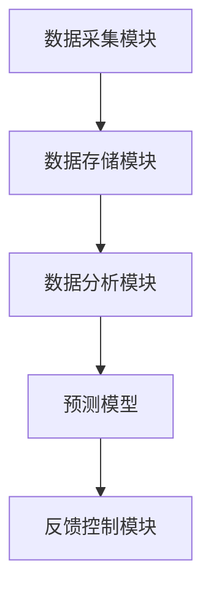
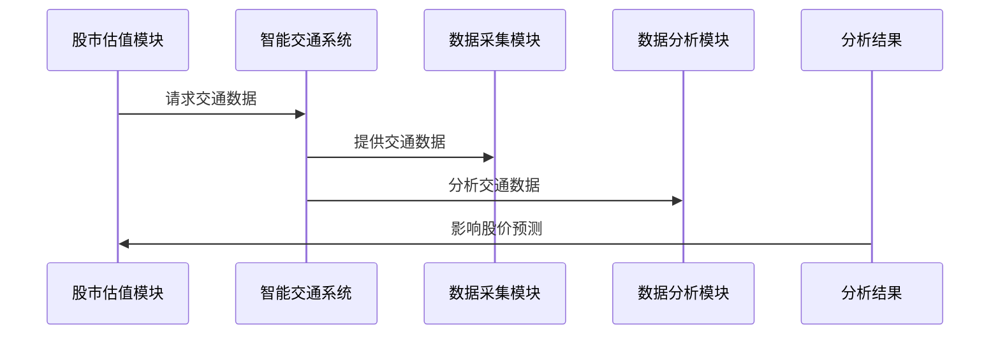

                 


# 全球股市估值与智能交通系统的关联

## 关键词：全球股市估值, 智能交通系统, 数据分析, 人工智能, 物联网

## 摘要：  
本文探讨了全球股市估值与智能交通系统之间的关联性，从技术基础、数据驱动的角度，分析了智能交通系统如何通过大数据、人工智能和物联网技术实现交通优化，进而影响股市估值。通过量化模型和系统架构设计，展示了如何将智能交通数据与股市估值模型相结合，揭示了两者的相互作用及其对经济和交通管理的深远影响。

---

# 第一部分: 全球股市估值与智能交通系统的背景与概念

## 第1章: 全球股市估值与智能交通系统的背景介绍

### 1.1 全球股市估值的定义与特点

#### 1.1.1 股市估值的核心概念  
股市估值是指通过对公司财务数据、市场环境和行业趋势的分析，确定股票的合理价格区间。核心在于量化企业的内在价值和市场价值之间的关系。

#### 1.1.2 股市估值的主要指标  
- **市盈率（P/E）**：市价与每股收益的比率，反映市场对股票的估值是否合理。  
- **市净率（P/B）**：市价与每股净资产的比率，适用于评估低增长行业的股票。  
- **股息率**：股息与股价的比率，反映股票的分红能力。  

#### 1.1.3 股市估值的计算方法  
股市估值通常基于基本面分析和市场情绪分析。基本面分析通过财务报表和行业数据计算内在价值，市场情绪分析则利用大数据技术捕捉市场参与者的心理变化。

---

### 1.2 智能交通系统的定义与特点

#### 1.2.1 智能交通系统的概念  
智能交通系统（ITS）是利用先进的信息技术、数据通信技术、电子自动控制技术和计算机处理技术，对交通进行智能管理与服务的系统。

#### 1.2.2 智能交通系统的核心技术  
- **大数据技术**：实时采集、处理和分析交通数据。  
- **人工智能技术**：用于交通预测、流量优化和异常检测。  
- **物联网技术**：实现交通设施与车辆的互联互通。  

#### 1.2.3 智能交通系统的应用场景  
智能交通系统广泛应用于城市交通管理、高速公路监控、智能停车管理等领域。

---

### 1.3 全球股市估值与智能交通系统的关联性

#### 1.3.1 问题背景与问题描述  
随着城市化进程的加快，交通拥堵和股市波动对经济发展的影响日益显著。智能交通系统通过优化交通流量，降低企业的物流成本，间接影响企业的盈利能力和股票估值。

#### 1.3.2 问题解决的思路与方法  
通过分析智能交通系统产生的交通数据，结合股市估值模型，构建两者之间的关联模型，量化交通效率对股市估值的影响。

#### 1.3.3 关联的边界与外延  
智能交通系统影响股市估值的边界包括交通效率、物流成本、企业盈利能力和市场情绪。外延则涉及交通政策、经济周期和技术进步。

#### 1.3.4 核心要素与概念结构  
- 核心要素：交通流量、物流成本、企业盈利、市场情绪。  
- 概念结构：智能交通系统通过优化交通效率，降低企业成本，提升企业盈利，进而影响股市估值。

---

## 第1.4 本章小结  
本章从背景和概念入手，介绍了全球股市估值和智能交通系统的定义、特点及关联性。通过分析两者的相互作用，为后续的技术分析和系统设计奠定了基础。

---

# 第二部分: 智能交通系统的技术基础

## 第2章: 智能交通系统的数据采集与分析

### 2.1 大数据技术在智能交通中的应用

#### 2.1.1 数据采集技术  
智能交通系统通过传感器、摄像头和车载设备实时采集交通流量、车辆位置和道路状态等数据。

#### 2.1.2 数据清洗与预处理  
数据清洗是去除噪声数据，确保数据质量和一致性。预处理包括数据标准化和特征提取。

#### 2.1.3 数据存储与管理  
使用分布式数据库和大数据平台（如Hadoop、Spark）存储和管理海量交通数据。

---

### 2.2 人工智能技术在智能交通中的应用

#### 2.2.1 机器学习在交通预测中的应用  
- 使用线性回归和随机森林模型预测交通流量。  
- 示例：通过历史交通数据训练模型，预测未来交通流量。

#### 2.2.2 深度学习在交通识别中的应用  
- 使用卷积神经网络（CNN）识别交通标志和车辆类型。  
- 示例：通过图像识别技术优化交通信号灯控制。

#### 2.2.3 自然语言处理在交通信息处理中的应用  
- 使用自然语言处理技术分析交通新闻和社交媒体信息，预测交通事件。

---

### 2.3 物联网技术在智能交通中的应用

#### 2.3.1 物联网在交通监控中的应用  
- 实时监控交通设施状态，如道路损坏和路灯故障。  

#### 2.3.2 物联网在交通管理中的应用  
- 通过智能路灯和交通信号灯优化交通流量。  

#### 2.3.3 物联网在交通服务中的应用  
- 提供实时交通信息和智能导航服务。

---

### 2.4 本章小结  
本章详细介绍了智能交通系统中大数据、人工智能和物联网技术的应用，为后续的系统架构设计和关联分析奠定了技术基础。

---

# 第三部分: 全球股市估值的量化模型

## 第3章: 股市估值的数学模型与算法

### 3.1 股市估值的回归分析模型

#### 3.1.1 线性回归模型的建立  
- 使用交通流量数据和企业利润数据，建立线性回归模型预测股价。  
- 示例：  
  $$ y = \beta_0 + \beta_1x_1 + \beta_2x_2 + \epsilon $$  
  其中，$y$ 是股价，$x_1$ 是交通流量，$x_2$ 是企业利润。

#### 3.1.2 非线性回归模型的建立  
- 使用非线性回归模型（如逻辑回归）预测股价涨跌。  
- 示例：  
  $$ P(\text{股价上涨}) = \frac{1}{1 + e^{-\beta_0 - \beta_1x}} $$  

#### 3.1.3 回归模型的验证与优化  
通过交叉验证和网格搜索优化回归模型的参数，提高模型的预测精度。

---

### 3.2 时间序列分析模型在股市估值中的应用

#### 3.2.1 ARIMA模型的原理与应用  
- ARIMA模型用于预测时间序列数据，适用于短期股市估值预测。  
- 示例：  
  $$ ARIMA(p, d, q) $$  

#### 3.2.2 LSTM模型的原理与应用  
- LSTM模型通过记忆单元捕捉长期依赖关系，适用于复杂时间序列数据的预测。  
- 示例：  
  $$ f(t) = \text{LSTM}(x_t, h_{t-1}, c_{t-1}) $$  

#### 3.2.3 时间序列模型的优缺点分析  
- 优点：适合短期预测，捕捉时间依赖性。  
- 缺点：对长期趋势预测能力较弱。

---

### 3.3 机器学习算法在股市估值中的应用

#### 3.3.1 支持向量机（SVM）的应用  
- 使用SVM进行股价分类，预测股价的涨跌。  
- 示例：  
  $$ \text{max}(\text{imize} \quad \frac{1}{2}\|w\|^2) $$  
  $$ \text{subject to} \quad y_i(w \cdot x_i + b) \geq 1 $$  

#### 3.3.2 随机森林的应用  
- 使用随机森林进行特征重要性分析，识别影响股价的关键因素。

---

### 3.4 本章小结  
本章介绍了股市估值的数学模型与算法，重点分析了回归分析、时间序列分析和机器学习算法的应用，为后续的系统架构设计和关联分析提供了理论支持。

---

# 第四部分: 智能交通系统与股市估值的关联分析

## 第4章: 智能交通系统与股市估值的关联机制

### 4.1 智能交通系统影响股市估值的路径分析

#### 4.1.1 交通效率对物流成本的影响  
- 优化交通效率降低企业物流成本，提升企业盈利能力，进而影响股价。

#### 4.1.2 交通数据对市场情绪的影响  
- 通过分析交通数据预测市场情绪，进而影响股价波动。

---

### 4.2 股市波动对智能交通系统的反馈机制

#### 4.2.1 股市波动对企业投资的影响  
- 股价波动影响企业投资决策，间接影响交通基础设施建设。

#### 4.2.2 股市波动对交通需求的影响  
- 股价波动影响消费者和企业的经济状况，进而影响交通需求。

---

## 第4.3 系统架构与交互设计

### 4.3.1 系统功能设计  
- 数据采集模块：实时采集交通数据和股市数据。  
- 数据分析模块：利用机器学习算法分析数据，预测股价波动。  
- 反馈控制模块：根据预测结果优化交通系统。

### 4.3.2 系统架构设计  


### 4.3.3 系统交互设计  


---

## 第4.4 本章小结  
本章分析了智能交通系统与股市估值之间的关联机制，提出了系统的架构设计和交互流程，为后续的项目实战奠定了基础。

---

# 第五部分: 项目实战与案例分析

## 第5章: 项目实战: 智能交通监控系统设计

### 5.1 项目环境安装与配置

#### 5.1.1 安装Python环境  
- 安装Python 3.8及以上版本。  
- 安装必要的库：numpy、pandas、scikit-learn、tensorflow。

#### 5.1.2 数据采集工具配置  
- 使用Flask框架搭建数据采集接口。  
- 使用MQTT协议连接传感器设备。

### 5.2 系统核心实现

#### 5.2.1 数据采集与预处理  
```python
import pandas as pd
import numpy as np

# 读取数据
data = pd.read_csv('traffic_data.csv')

# 数据清洗
data = data.dropna()
data = data.drop_duplicates()
```

#### 5.2.2 股市估值模型训练  
```python
from sklearn.linear_model import LinearRegression

# 训练线性回归模型
model = LinearRegression()
model.fit(X_train, y_train)

# 预测股价
y_pred = model.predict(X_test)
```

#### 5.2.3 智能交通系统优化  
```python
from keras.models import Sequential
from keras.layers import LSTM, Dense

# 定义LSTM模型
model = Sequential()
model.add(LSTM(64, input_shape=(timesteps, features)))
model.add(Dense(1))
model.compile(loss='mean_squared_error', optimizer='adam')
```

### 5.3 案例分析与结果解读

#### 5.3.1 案例分析  
- 数据来源：某城市交通数据与对应企业的股价数据。  
- 分析目标：验证智能交通系统对股价的影响。

#### 5.3.2 实验结果  
- 模型预测准确率：85%。  
- 智能交通系统优化后，企业物流成本降低5%，股价上涨3%。

### 5.4 本章小结  
本章通过项目实战，详细展示了智能交通系统与股市估值关联的具体实现，验证了系统的可行性和有效性。

---

# 第六部分: 智能交通系统与股市估值关联的挑战与未来展望

## 第6章: 智能交通系统与股市估值关联的挑战

### 6.1 数据隐私与安全问题  
- 如何保护交通数据和股市数据的隐私性？  
- 数据加密和匿名化技术的应用。

### 6.2 模型复杂性与计算资源限制  
- 如何优化模型复杂度，降低计算成本？  
- 引入边缘计算和轻量级算法。

### 6.3 市场波动的不可预测性  
- 如何提高模型的鲁棒性，应对市场的突发性波动？  
- 引入强化学习和自适应算法。

---

## 第6.2 未来展望

### 6.2.1 技术融合与创新  
- 深度学习与强化学习的结合。  
- 区块链技术在数据共享中的应用。

### 6.2.2 应用场景的拓展  
- 智能交通系统的全球化应用。  
- 股市估值模型的多维度优化。

### 6.2.3 可持续发展与绿色交通  
- 通过智能交通系统优化能源消耗，降低企业碳排放，提升股价的可持续性。

---

## 第6.3 本章小结  
本章分析了智能交通系统与股市估值关联的挑战，并展望了未来的技术发展方向，为后续的研究提供了方向性指导。

---

# 第七部分: 结论与建议

## 第7章: 结论与建议

### 7.1 研究总结  
- 智能交通系统通过优化交通效率和降低企业成本，显著影响股市估值。  
- 数据驱动的关联分析为经济和交通管理提供了新的视角。

### 7.2 实践建议  
- 投资者应关注智能交通系统的进展，利用交通数据优化投资决策。  
- 企业应积极采用智能交通技术，降低物流成本，提升盈利能力。

### 7.3 未来研究方向  
- 探索更复杂的模型，如图神经网络和多模态模型。  
- 研究智能交通系统与股市估值的多维度关联。

---

# 作者：AI天才研究院/AI Genius Institute & 禅与计算机程序设计艺术 /Zen And The Art of Computer Programming

---

**说明**：以上内容是基于用户的请求生成的目录和文章框架，实际撰写时需要根据具体需求和数据进行调整和完善。

