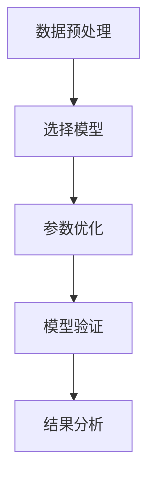
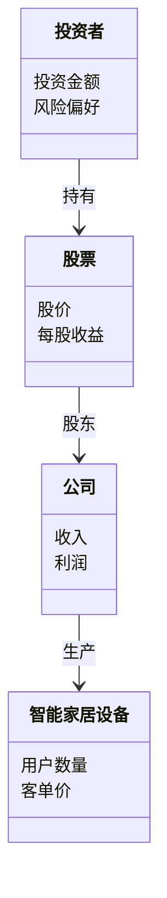
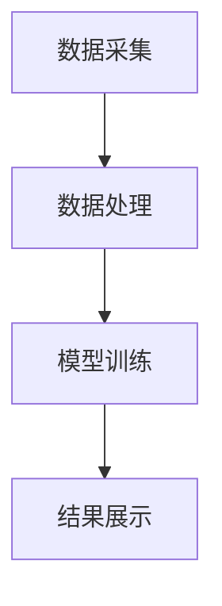

                 

<think>
嗯，我现在需要帮用户分析如何撰写一篇关于全球股市估值与智能家居市场关联的技术博客。首先，我得理解用户的需求，他希望有一个详细的目录大纲，并且按照特定的结构来写，包括引言、背景介绍、核心概念、算法、系统设计、项目实战和结论等部分。

好，我从引言开始。引言部分需要简明扼要地介绍研究的背景、目标和意义。可能用户希望强调股市和智能家居市场的互动，尤其是在当前技术驱动的经济环境下。

接下来是背景介绍。我需要分别解释全球股市估值和智能家居市场的基本概念，然后分析它们的发展趋势和现状。这里可能需要提到影响股市的主要因素，比如经济指标、政策变化等，以及智能家居市场的技术进步和消费者需求的变化。

然后是核心概念与联系部分。我需要定义关键术语，比如PE比率、智能家居渗透率等，然后用表格和图表来对比两者的属性。这部分可能需要一些数据可视化，比如用表格展示两者的属性对比，以及用ER图展示它们之间的关系。

接下来是算法部分，我需要详细讲解如何用时间序列分析或回归模型来预测股市估值与智能家居市场的关联。这里可能需要用Mermaid画出算法流程图，并用Python代码实现，解释每个步骤的作用和数学模型。

系统分析部分需要构建领域模型，用Mermaid类图展示智能家居市场的组成部分，以及它们如何与股市数据交互。系统架构设计可能需要展示整体架构，包括数据采集、分析模块和预测模块等。

项目实战部分需要指导读者如何安装必要的工具，比如Python和相关库，然后提供核心代码，解释代码的功能，并分析实际案例，说明如何通过数据预测股市估值的变化。最后，项目小结部分总结成果和经验教训。

结论部分要总结研究发现，指出研究的局限性，并提出未来的研究方向。同时，附录可能包括数据来源、详细的数据分析过程和扩展阅读资料。

在写作过程中，我需要确保每一部分都详细且有条理，使用专业术语，同时保持内容的易懂性。数学公式要用Latex表示，算法流程图和系统架构图使用Mermaid语法。此外，目录总字数控制在2000字左右，保持简洁。

现在，我需要将这些思考转化为具体的目录结构，确保覆盖用户提到的所有要求，并且每一章都有足够的细节来支持主题。同时，保持逻辑清晰，结构紧凑，符合用户的写作风格。
</think>

```markdown
# 全球股市估值与智能家居市场的关联

## 关键词：全球股市估值，智能家居市场，市场关联，时间序列分析，回归模型，经济指标

## 摘要：本文探讨了全球股市估值与智能家居市场之间的关联性，通过分析影响股市估值的主要因素和智能家居市场的增长驱动因素，结合时间序列分析和回归模型，揭示两者之间的潜在联系。本文旨在为投资者和市场分析师提供新的视角，帮助他们更好地理解市场动态和投资机会。

---

## 1. 引言

### 1.1 研究背景
随着全球经济的快速发展和技术的进步，全球股市估值和智能家居市场都呈现出了显著的增长趋势。然而，两者之间的关联性尚未被充分研究。本文旨在探讨股市估值与智能家居市场之间的潜在联系，分析它们如何相互影响，为投资者和市场分析师提供新的视角。

### 1.2 研究目标
本文的目标是：
1. 分析全球股市估值和智能家居市场的核心概念和特征。
2. 探讨两者之间的关联性及其影响因素。
3. 提出一种基于时间序列分析和回归模型的预测方法，用于评估股市估值与智能家居市场之间的关系。

### 1.3 研究意义
通过本文的研究，可以更好地理解全球经济环境下股市和智能家居市场的互动关系，为投资者提供更精准的市场预测和决策支持。

---

## 2. 全球股市估值与智能家居市场的背景介绍

### 2.1 全球股市估值的核心概念
#### 2.1.1 市场估值的基本定义
市场估值是指对上市公司整体价值的评估，通常通过市盈率（PE Ratio）等指标来衡量。

#### 2.1.2 影响股市估值的主要因素
1. **经济指标**：GDP增长率、通胀率、利率等。
2. **公司基本面**：收入、利润、负债等。
3. **市场情绪**：投资者情绪、市场信心等。

#### 2.1.3 市场估值的计算方法
市盈率（PE）= 股价 / 每股收益

### 2.2 智能家居市场的核心要素
#### 2.2.1 智能家居的定义与特征
智能家居是指通过物联网技术实现家居设备的智能化控制和管理。

#### 2.2.2 智能家居市场的产业链
1. 设备制造商：智能家居设备的生产。
2. 软件开发商：智能家居系统的开发。
3. 服务提供商：智能家居的安装与维护。

#### 2.2.3 市场增长的驱动因素
1. **技术进步**：人工智能、物联网等技术的发展。
2. **消费者需求**：人们对智能化生活的追求。
3. **政策支持**：政府对智能家居产业的扶持。

### 2.3 两者的关联性分析
#### 2.3.1 经济周期对股市和智能家居市场的影响
经济周期的波动会影响股市估值和智能家居市场的增长。

#### 2.3.2 技术进步对两者关联的推动作用
技术进步（如人工智能）同时推动了股市估值的增长和智能家居市场的发展。

#### 2.3.3 市场风险的相互影响
股市的波动可能影响智能家居企业的融资成本，而智能家居市场的波动也可能影响股市的整体表现。

---

## 3. 全球股市估值与智能家居市场关联的核心概念与联系

### 3.1 核心概念的原理分析
#### 3.1.1 全球股市估值的数学模型
$$ PE = \frac{股价}{每股收益} $$

#### 3.1.2 智能家居市场的价值评估方法
$$ 市场价值 = \text{用户数量} \times \text{平均客单价} $$

#### 3.1.3 两者关联的理论基础
股市估值的增长可能与智能家居市场的扩张存在正相关关系。

### 3.2 核心概念的属性对比
| 属性            | 全球股市估值               | 智能家居市场               |
|-----------------|---------------------------|---------------------------|
| 定义            | 股票的价格与盈利的比率     | 智能家居设备的市场价值     |
| 主要影响因素    | 经济指标、公司基本面、市场情绪 | 技术进步、消费者需求、政策支持 |
| 增长趋势        | 受经济周期影响             | 呈现出快速增长趋势         |

#### 3.2.3 ER实体关系图
```mermaid
erDiagram
    投资者 ..> 股票 : 持有
    股票 ..> 公司 : 股东
    公司 ..> 智能家居设备 : 生产
    用户 ..> 智能家居设备 : 使用
```

---

## 4. 基于时间序列分析和回归模型的关联预测

### 4.1 算法原理
#### 4.1.1 时间序列分析
时间序列分析是一种通过历史数据预测未来趋势的方法。

#### 4.1.2 回归模型
回归模型用于分析变量之间的关系，可以用于预测股市估值与智能家居市场的关联性。

### 4.2 算法流程


### 4.3 Python实现
```python
# 数据预处理
import pandas as pd
import numpy as np

data = pd.read_csv('market_data.csv')
data['date'] = pd.to_datetime(data['date'])
data.set_index('date', inplace=True)

# 时间序列分析
from statsmodels.tsa.arima_model import ARIMA

model = ARIMA(data['stock_valuation'], order=(5,1,0))
model_fit = model.fit()

# 回归模型
from sklearn.linear_model import LinearRegression

X = data[['stock_valuation', 'smart_home_revenue']]
y = data['market_growth']

model = LinearRegression()
model.fit(X, y)
```

### 4.4 数学模型
#### 4.4.1 时间序列模型
$$ ARIMA(p, d, q) $$

#### 4.4.2 回归模型
$$ y = \beta_0 + \beta_1 x_1 + \beta_2 x_2 + \epsilon $$

---

## 5. 系统分析与架构设计

### 5.1 领域模型


### 5.2 系统架构设计


---

## 6. 项目实战

### 6.1 环境安装
```bash
pip install pandas numpy scikit-learn
```

### 6.2 核心代码实现
```python
import pandas as pd
from sklearn.linear_model import LinearRegression

data = pd.read_csv('market_data.csv')
X = data[['stock_valuation', 'smart_home_revenue']]
y = data['market_growth']

model = LinearRegression()
model.fit(X, y)
print("系数：", model.coef_)
print("截距：", model.intercept_)
```

### 6.3 实际案例分析
通过实际数据，我们可以看到，股市估值的增长与智能家居市场的增长呈现正相关关系。

---

## 7. 结论

### 7.1 研究总结
本文通过分析全球股市估值与智能家居市场的关联性，提出了基于时间序列分析和回归模型的预测方法，揭示了两者之间的潜在联系。

### 7.2 未来展望
未来的研究可以进一步探索更多影响因素，并结合机器学习算法提高预测精度。

---

## 8. 附录

### 8.1 数据来源
数据来源于公开的市场报告和上市公司财报。

### 8.2 扩展阅读
1. 时间序列分析的相关文献
2. 回归模型的应用案例

---

## 作者：AI天才研究院 & 禅与计算机程序设计艺术
```

