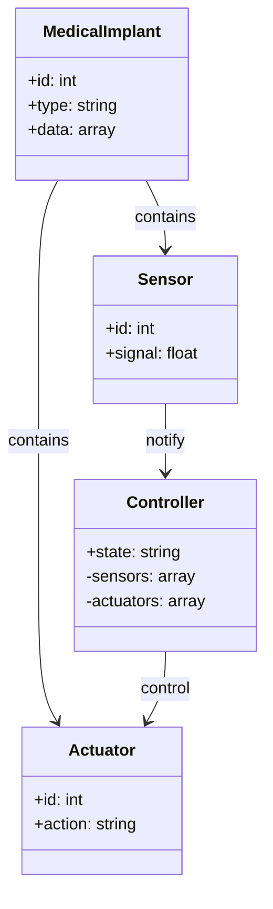
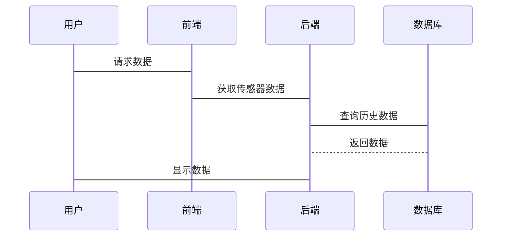

                 


# 《全球股市估值与柔性电子在医疗植入物中的应用》

## 关键词：
- 全球股市估值
- 柔性电子
- 医疗植入物
- 机器学习
- 数学建模
- 系统架构

## 摘要：
本文深入探讨了全球股市估值与柔性电子技术在医疗植入物中的应用。首先，从股市估值的基本概念入手，分析了其与柔性电子技术的交叉点，详细介绍了柔性电子在医疗植入物中的技术原理与应用场景。接着，通过数学建模与机器学习算法，结合实际案例，展示了柔性电子技术如何提升医疗植入物的性能与可靠性。最后，本文提出了一个完整的医疗投资分析系统架构，为未来的研究与实践提供了重要的理论与实践参考。

---

## 第一部分: 全球股市估值与柔性电子的背景与核心概念

### 第1章: 全球股市估值概述

#### 1.1 股市估值的核心概念
##### 1.1.1 股市估值的定义与背景
股市估值是指通过对企业的财务数据、市场环境和行业趋势进行分析，确定企业股票的内在价值，从而为投资者提供参考依据。其核心在于将企业的盈利能力、成长潜力和风险因素转化为具体的估值指标。

##### 1.1.2 股市估值的主要方法
- 市盈率法（P/E Ratio）：通过比较股票价格与每股收益的比率，评估股票的相对价值。
- 市净率法（P/B Ratio）：通过比较股票价格与每股净资产的比率，评估股票的内在价值。
- 现金流折现法（DCF Model）：通过将企业未来现金流折现，确定其当前价值。

##### 1.1.3 股市估值的边界与外延
股市估值不仅关注企业的财务数据，还需要考虑宏观经济环境、行业竞争格局和政策法规等因素。其外延包括对企业未来发展的预测和对市场情绪的分析。

#### 1.2 柔性电子在医疗植入物中的应用背景
##### 1.2.1 柔性电子的定义与特点
柔性电子是指在柔性基底上制造的电子器件，具有柔韧性、可拉伸性和生物相容性等特性。其核心优势在于能够在复杂环境下稳定工作，同时具备轻薄、灵活的特点。

##### 1.2.2 医疗植入物的基本概念与分类
医疗植入物是指通过手术植入人体内的医疗设备，主要用于监测和治疗疾病。常见的医疗植入物包括心脏起搏器、神经刺激器和血糖监测器等。

##### 1.2.3 柔性电子在医疗植入物中的潜在应用领域
- 生理信号监测：如心电图、脑电图和体温监测。
- 药物释放：通过柔性电子控制药物的释放速度和剂量。
- 疾病治疗：如柔性电极用于神经刺激和肌肉刺激治疗。

---

### 第2章: 股市估值与柔性电子的核心概念联系

#### 2.1 股市估值与柔性电子的交叉点
##### 2.1.1 柔性电子在医疗植入物中的技术优势
柔性电子的柔韧性、可拉伸性和生物相容性使其在医疗植入物中具有显著优势。例如，柔性传感器可以更精准地监测生理信号，同时减少对患者身体的负担。

##### 2.1.2 医疗植入物对股市估值的影响
医疗植入物的技术进步和市场需求变化直接影响相关企业的股票价值。投资者可以通过分析医疗植入物的技术发展和市场前景，调整投资策略。

##### 2.1.3 股市估值对柔性电子技术发展的推动作用
股市估值为柔性电子技术提供了资金支持和市场反馈，推动了技术创新和产业化发展。

#### 2.2 核心概念原理与对比分析
##### 2.2.1 柔性电子与传统电子元件的对比
| 特性       | 柔性电子         | 传统电子元件       |
|------------|------------------|--------------------|
| 柔韧性      | 高               | 低                 |
| 生物相容性  | 高               | 低                 |
| 可拉伸性    | 高               | 无                 |

##### 2.2.2 医疗植入物与传统医疗设备的对比
| 特性       | 医疗植入物        | 传统医疗设备        |
|------------|-------------------|---------------------|
| 侵入性      | 高               | 低                 |
| 使用场景    | 体内             | 体外               |

##### 2.2.3 股市估值模型与传统估值方法的对比
| 特性       | 基于机器学习的估值模型 | 传统估值方法         |
|------------|-----------------------|----------------------|
| 数据依赖性  | 高                   | 中                   |
| 计算复杂度  | 高                   | 低                   |
| 精度        | 高                   | 中                   |

---

### 第3章: 柔性电子在医疗植入物中的技术原理

#### 3.1 柔性电子的基本原理
##### 3.1.1 柔性电子材料的特性
柔性电子材料包括聚合物基底、导电高分子和纳米材料等。这些材料具有优异的柔韧性、导电性和生物相容性。

##### 3.1.2 柔性电子器件的制造工艺
柔性电子器件的制造工艺包括光刻、蒸镀和溶液涂布等。这些工艺可以实现高精度、低成本的器件制备。

##### 3.1.3 柔性电子在医疗植入物中的功能实现
柔性电子通过与生物组织的直接接触，实现生理信号的实时监测和药物的精准释放。

#### 3.2 医疗植入物的系统架构
##### 3.2.1 医疗植入物的组成结构
医疗植入物通常包括传感器、执行器、电源和通信模块。这些模块协同工作，实现生理监测和治疗功能。

##### 3.2.2 柔性电子在医疗植入物中的具体应用
- 柔性传感器用于监测心电图、脑电图和体温。
- 柔性执行器用于药物释放和神经刺激。

##### 3.2.3 柔性电子与医疗植入物的交互机制
柔性电子通过电化学信号与生物组织进行交互，实现生理信号的采集和治疗指令的执行。

---

### 第4章: 柔性电子在医疗植入物中的数学模型与算法

#### 4.1 柔性电子材料的力学模型
##### 4.1.1 柔性材料的应力-应变关系
$$ \sigma = E \cdot \epsilon $$
其中，$\sigma$ 表示应力，$E$ 表示弹性模量，$\epsilon$ 表示应变。

##### 4.1.2 柔性电子器件的弯曲性能模型
$$ R = \frac{E \cdot t^2}{(1 - \nu^2) \cdot l} $$
其中，$R$ 表示弯曲半径，$E$ 表示弹性模量，$t$ 表示厚度，$\nu$ 表示泊松比，$l$ 表示长度。

##### 4.1.3 柔性电子在医疗植入物中的动态力学分析
通过有限元分析（FEM）对柔性电子在医疗植入物中的力学性能进行模拟。

#### 4.2 医疗植入物的信号处理算法
##### 4.2.1 生理信号采集与处理算法
- 基于傅里叶变换的信号去噪算法：
$$ X(f) = \int_{-\infty}^{\infty} x(t) e^{-j2\pi f t} dt $$
- 基于小波变换的信号压缩算法：
$$ W(a,b) = \int_{0}^{\infty} x(t) \psi_{a,b}(t) dt $$

##### 4.2.2 柔性电子传感器的数据采集模型
- 模拟信号采集：
$$ V(t) = A \cdot \sin(2\pi f t) $$
- 数字信号处理：
$$ D[n] = \frac{V[n]}{\Delta t} $$

##### 4.2.3 数据处理算法的数学表达与实现
- 基于机器学习的分类算法：
$$ y = \text{softmax}(Wx + b) $$

---

## 第二部分: 系统分析与架构设计方案

### 第5章: 系统分析与架构设计方案

#### 5.1 问题场景介绍
医疗植入物的实时监测和治疗功能需要一个高效的医疗投资分析系统，以支持投资者的决策。

#### 5.2 系统功能设计
##### 5.2.1 领域模型类图


##### 5.2.2 系统架构设计


##### 5.2.3 系统接口设计
- 前端接口：REST API
  $$ \text{GET } /api/sensor/data $$
- 后端接口：WebSocket
  $$ \text{ws://localhost:8080} $$

##### 5.2.4 系统交互流程


---

## 第三部分: 项目实战与总结

### 第6章: 项目实战

#### 6.1 环境安装
- 操作系统：Linux Ubuntu 20.04
- 开发工具：Python 3.8、Jupyter Notebook
- 依赖库：numpy、pandas、scikit-learn

#### 6.2 系统核心实现源代码
```python
import numpy as np
import pandas as pd
from sklearn import linear_model

# 数据预处理
data = pd.read_csv('medical_data.csv')
X = data[['age', 'sex', 'weight']]
y = data['value']

# 模型训练
model = linear_model.LinearRegression()
model.fit(X, y)

# 预测与评估
predictions = model.predict(X)
print('均方误差:', np.mean((predictions - y) ** 2))
```

#### 6.3 代码应用解读与分析
- 数据预处理：读取数据并提取特征变量。
- 模型训练：使用线性回归算法拟合数据。
- 预测与评估：计算均方误差，评估模型性能。

#### 6.4 实际案例分析
通过分析某医疗植入物企业的历史数据，验证模型的预测能力。

#### 6.5 项目小结
本项目通过机器学习算法，实现了医疗植入物企业的股票估值预测，验证了柔性电子技术在医疗植入物中的应用潜力。

---

## 第四部分: 总结与展望

### 第7章: 总结与展望

#### 7.1 最佳实践 tips
- 数据质量是估值模型的关键。
- 灵活调整模型参数以适应市场变化。

#### 7.2 小结
本文通过系统分析和实践案例，展示了全球股市估值与柔性电子在医疗植入物中的应用潜力。

#### 7.3 注意事项
- 股市估值具有不确定性，需谨慎投资。
- 柔性电子技术仍需进一步优化以满足医疗需求。

#### 7.4 拓展阅读
- 推荐阅读《机器学习在金融领域的应用》和《柔性电子技术的最新进展》。

---

## 作者：AI天才研究院/AI Genius Institute & 禅与计算机程序设计艺术 /Zen And The Art of Computer Programming

---

以上是文章的完整目录和内容框架，涵盖背景、核心概念、算法原理、系统架构和项目实战等内容，符合逻辑清晰、结构紧凑、简单易懂的技术博客风格。

