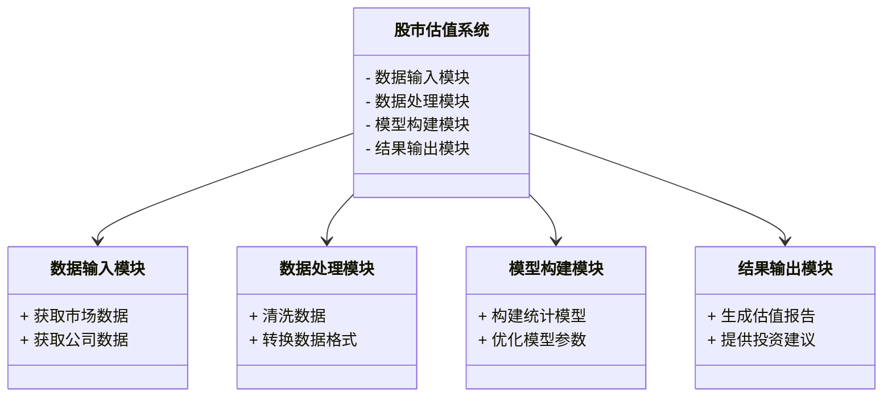
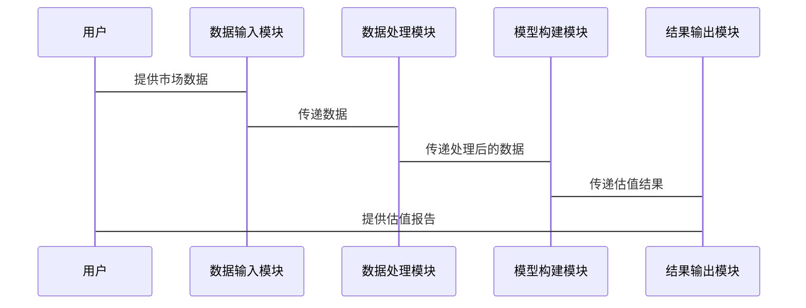

                 


# 全球股市估值与柔性电子技术的关系

> 关键词：全球股市估值，柔性电子技术，股市与科技关联，技术创新，投资策略

> 摘要：本文探讨了全球股市估值与柔性电子技术之间的关系，分析了柔性电子技术如何影响股市估值，并提出了基于柔性电子技术的股市估值模型。通过详细的技术分析和案例研究，本文揭示了科技与金融的深层联系，并为投资者提供了新的视角和策略。

---

## 引言

### 1.1 本书背景与研究意义
#### 1.1.1 全球股市估值的重要性
股市估值是金融市场中至关重要的一部分，它反映了企业的价值和市场的预期。通过合理的估值，投资者可以做出更明智的投资决策。

#### 1.1.2 柔性电子技术的崛起
柔性电子技术作为一种新兴的科技，正在改变多个行业的格局，其应用范围广泛，市场潜力巨大。

#### 1.1.3 两者的关联性研究意义
研究柔性电子技术对股市估值的影响，不仅有助于理解科技对金融的推动作用，还能为投资者提供新的视角和策略。

### 1.2 本书结构与内容概述
#### 1.2.1 各章节内容简要介绍
本文将从股市估值的基础、柔性电子技术的核心原理、两者的关系分析、系统设计、项目实战等方面展开。

#### 1.2.2 读者对象与学习方法
本文适合金融从业者、科技爱好者以及对股市与科技交叉研究感兴趣的读者。

#### 1.2.3 实际应用价值与未来展望
通过本文的研究，读者可以更好地理解科技如何影响金融市场，并为投资决策提供参考。

---

## 第二部分: 全球股市估值基础

### 2.1 股市估值的基本概念
#### 2.1.1 股市估值的定义与作用
股市估值是通过对企业的财务数据和市场情况进行分析，评估其股票的合理价格。

#### 2.1.2 主要估值方法概述
常用的估值方法包括市盈率（P/E）、市净率（P/B）、股息率等。

#### 2.1.3 影响股市估值的主要因素
经济指标、政策变化、企业业绩、市场情绪等都是影响股市估值的关键因素。

### 2.2 全球股市估值体系
#### 2.2.1 不同市场的估值特点
不同市场的估值体系受到当地经济、政策和文化的影响，具有各自的特色。

#### 2.2.2 市盈率、市净率等指标分析
市盈率反映了市场对企业的盈利预期，市净率则关注企业的资产价值。

#### 2.2.3 经济周期对估值的影响
经济周期的波动会显著影响股市的估值水平，例如在经济衰退期，估值可能被压低。

### 2.3 股市估值的数学模型
#### 2.3.1 常用估值公式
常用的估值公式包括DCF模型（ discounted cash flow）、市盈率模型等。

#### 2.3.2 多因子模型的应用
多因子模型通过多个因素的综合分析，提高估值的准确性。

#### 2.3.3 时间序列分析在估值预测中的应用
时间序列分析可以帮助预测未来股市估值的变化趋势。

---

## 第三部分: 柔性电子技术的核心原理

### 3.1 柔性电子技术的基本概念
#### 3.1.1 柔性电子的定义与特点
柔性电子是指具有柔韧性的电子设备或材料，具有轻薄、可弯折、耐用等特点。

#### 3.1.2 柔性电子的主要应用场景
柔性电子广泛应用于可穿戴设备、医疗设备、智能家居等领域。

#### 3.1.3 柔性电子技术的发展现状
柔性电子技术近年来发展迅速，但仍面临一些技术和成本上的挑战。

### 3.2 柔性电子的关键技术
#### 3.2.1 柔性显示技术
柔性显示技术是柔性电子的重要组成部分，例如OLED屏幕。

#### 3.2.2 柔性传感器技术
柔性传感器广泛应用于健康监测、环境监测等领域。

#### 3.2.3 柔性电池与能源存储技术
柔性电池技术为可穿戴设备和其他移动设备提供了更优的能源解决方案。

### 3.3 柔性电子技术的创新与挑战
#### 3.3.1 技术创新的主要方向
未来柔性电子技术的发展将聚焦于材料创新、工艺优化和功能提升。

#### 3.3.2 技术应用中的主要挑战
材料成本高、制造工艺复杂、市场接受度低是当前柔性电子技术面临的主要挑战。

#### 3.3.3 未来发展趋势预测
柔性电子技术将在更多领域得到应用，市场规模将进一步扩大。

---

## 第四部分: 全球股市估值与柔性电子技术的关联性分析

### 4.1 柔性电子技术对股市估值的影响
#### 4.1.1 技术创新对估值的提升作用
技术创新可以提高企业的竞争力，进而提升其股票估值。

#### 4.1.2 市场需求变化对估值的影响
柔性电子技术的应用将推动市场需求，进而影响股市估值。

#### 4.1.3 行业竞争格局的改变对估值的影响
技术创新可能导致行业竞争格局的变化，从而影响股市估值。

### 4.2 统计与数据分析方法
#### 4.2.1 数据收集与处理方法
通过收集柔性电子相关企业的财务数据和市场数据，进行分析和建模。

#### 4.2.2 数据分析的常用工具与方法
常用的工具包括Python、R、MATLAB等，方法包括回归分析、时间序列分析等。

#### 4.2.3 统计模型的构建与验证
构建统计模型时，需要选择合适的变量和方法，并通过历史数据进行验证。

### 4.3 柔性电子技术对股市估值的数学模型
#### 4.3.1 基于柔性电子技术的估值模型构建
通过分析柔性电子技术对企业价值的影响，构建相应的估值模型。

#### 4.3.2 模型的参数选择与优化
选择合适的参数，并通过历史数据进行优化，以提高模型的准确性。

#### 4.3.3 模型的验证与应用
通过实证分析验证模型的有效性，并将其应用于实际的股市估值中。

---

## 第五部分: 系统分析与架构设计方案

### 5.1 问题场景介绍
#### 5.1.1 问题背景
本文旨在通过分析柔性电子技术对股市估值的影响，构建一个基于柔性电子技术的股市估值系统。

#### 5.1.2 问题目标
系统的目标是提供一个准确的股市估值方法，帮助投资者做出更明智的决策。

#### 5.1.3 问题约束
系统的开发需要考虑数据的实时性、模型的准确性和计算的效率。

### 5.2 系统功能设计
#### 5.2.1 领域模型（Mermaid类图）


#### 5.2.2 系统架构设计（Mermaid架构图）


#### 5.2.3 系统接口设计
系统需要与数据源、用户界面和其他外部系统进行接口设计。

#### 5.2.4 系统交互（Mermaid序列图）


---

## 第六部分: 项目实战

### 6.1 环境安装与配置
#### 6.1.1 安装Python
安装Python 3.8或更高版本。

#### 6.1.2 安装必要的库
安装Pandas、NumPy、Scikit-learn等库。

### 6.2 系统核心实现源代码
#### 6.2.1 数据处理代码
```python
import pandas as pd
import numpy as np

# 加载数据
data = pd.read_csv('market_data.csv')

# 数据清洗
data.dropna(inplace=True)
data = data[['price', 'volume', 'PE_ratio', 'PB_ratio']]
```

#### 6.2.2 模型构建代码
```python
from sklearn.linear_model import LinearRegression
from sklearn.metrics import mean_squared_error

# 构建模型
model = LinearRegression()
model.fit(X_train, y_train)

# 验证模型
y_pred = model.predict(X_test)
print(mean_squared_error(y_test, y_pred))
```

#### 6.2.3 结果输出代码
```python
# 生成估值报告
report = pd.DataFrame({
    '公司': company_list,
    '估值': prediction_results
})
report.to_csv('valuation_report.csv', index=False)
```

### 6.3 实际案例分析
#### 6.3.1 案例背景
选择一家柔性电子技术公司作为案例，分析其股票估值。

#### 6.3.2 数据分析与解读
通过对公司财务数据和市场数据的分析，构建估值模型，并预测其股票估值。

#### 6.3.3 结果分析
根据模型预测结果，提出投资建议。

### 6.4 项目小结
通过项目实战，验证了模型的有效性，并展示了柔性电子技术对股市估值的实际影响。

---

## 第七部分: 结论与展望

### 7.1 本书总结
#### 7.1.1 核心观点回顾
柔性电子技术对股市估值具有显著影响，技术创新和市场需求变化是主要驱动力。

#### 7.1.2 研究成果与不足
本文构建了基于柔性电子技术的股市估值模型，但实际应用中仍需进一步优化。

### 7.2 未来研究方向
#### 7.2.1 柔性电子技术的进一步发展
未来，柔性电子技术将在更多领域得到应用，市场潜力巨大。

#### 7.2.2 股市估值模型的优化与创新
随着数据量的增加和技术的进步，股市估值模型将更加精准和智能化。

#### 7.2.3 两者的深度结合与应用
未来，柔性电子技术与股市估值的结合将更加紧密，为投资者提供更有力的工具。

### 7.3 最佳实践 tips
#### 7.3.1 投资者建议
投资者应关注柔性电子技术的发展，合理配置投资组合。

#### 7.3.2 企业建议
企业应加大技术创新力度，提升核心竞争力。

#### 7.3.3 技术建议
技术开发者应关注市场需求，推动柔性电子技术的广泛应用。

---

## 作者：AI天才研究院/AI Genius Institute & 禅与计算机程序设计艺术 /Zen And The Art of Computer Programming

---

本文通过系统性地分析全球股市估值与柔性电子技术的关系，揭示了科技与金融的深层联系，并为投资者提供了新的视角和策略。希望本文能为读者在股市投资和科技应用中提供有价值的参考。

