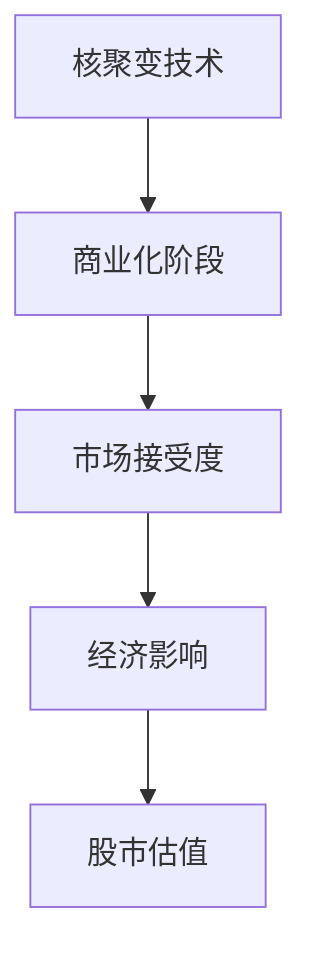

                 


# 全球股市估值与核聚变商业化进程的关系

> 关键词：全球股市估值、核聚变商业化、股市与科技关联、技术经济分析、数学模型、系统架构

> 摘要：本文探讨了全球股市估值与核聚变商业化进程之间的复杂关系。通过分析股市估值的核心概念、核聚变技术的商业化进程，以及两者如何相互影响，本文揭示了科技发展与金融市场之间的深层联系。结合数学模型和系统架构设计，本文提出了核聚变商业化对股市估值的影响机制，并通过实际案例分析，展示了这种关系在现实中的应用。

---

## 第1章：全球股市估值与核聚变商业化进程的概述

### 1.1 全球股市估值的基本概念

#### 1.1.1 什么是全球股市估值

股市估值是指通过对上市公司的财务数据和市场表现进行分析，估算其市值的过程。市值是公司股票的市场价格总和，反映了市场对其价值的认可程度。股市估值的核心在于理解公司未来盈利能力、行业地位、财务健康状况等因素对股价的影响。

#### 1.1.2 核聚变商业化进程的定义

核聚变商业化指的是将核聚变技术从实验室研究转化为实际的商业化应用。核聚变是一种通过轻核原子（如氘和氚）在高温高压下发生聚变反应，释放大量能量的技术。与核裂变不同，核聚变具有清洁、安全、资源丰富的特点，是未来清洁能源的重要发展方向。商业化进程包括技术研发、成本控制、市场推广等多个阶段。

#### 1.1.3 两者之间的关系

股市估值与核聚变商业化进程之间存在双向影响。一方面，核聚变技术的商业化成功可能提升相关企业的市值，进而影响股市整体估值；另一方面，股市的资本支持为核聚变商业化提供了资金，推动了技术的发展。

### 1.2 核聚变技术的现状与挑战

#### 1.2.1 核聚变的基本原理

核聚变是指两个轻核在高温高压条件下结合成一个较重的核，同时释放出巨大的能量。这种反应类似于太阳内部的能量产生方式。核聚变的核心技术包括磁约束（如托卡马克装置）和激光约束等。

#### 1.2.2 当前核聚变技术的发展阶段

目前，核聚变技术仍处于实验和研发阶段，尚未实现大规模商业化。国际上的主要项目包括欧洲的 ITER 项目和美国的 National Ignition Facility（NIF）。这些项目的目标是通过实验验证核聚变的可行性，并为商业化奠定基础。

#### 1.2.3 核聚变商业化的主要挑战

核聚变商业化面临技术、经济和政策等多方面的挑战。技术上，如何实现稳定的聚变反应并有效控制等离子体是关键；经济上，核聚变的建设和运营成本较高，商业化初期可能需要大量补贴；政策上，核聚变的推广需要各国政策支持和国际合作。

### 1.3 股市估值与核聚变商业化进程的相互影响

#### 1.3.1 核聚变商业化对股市的影响

核聚变技术的突破可能带来能源革命，从而影响相关企业的估值。例如，拥有领先核聚变技术的公司可能会看到股价上涨，因为市场预期其技术商业化后将带来巨大的经济利益。

#### 1.3.2 股市对核聚变商业化进程的支持作用

股市为核聚变技术的研发和商业化提供了重要的资金支持。投资者通过购买相关企业的股票，间接支持了核聚变技术的研发。此外，股市的波动也可能反映市场对核聚变商业化进程的预期。

---

## 第2章：核心概念的原理与特征

### 2.1 股市估值的核心原理

#### 2.1.1 股市估值的主要方法

股市估值的主要方法包括：

1. **市盈率（P/E ratio）**：市盈率 = 股价 / 每股净利润。低市盈率可能意味着股价被低估，而高市盈率可能意味着市场对公司未来利润的高预期。

2. **市净率（P/B ratio）**：市净率 = 股价 / 每股净资产。市净率低的公司可能被视为被低估，而高的市净率可能意味着公司资产被高估。

3. **股息率（Dividend Yield）**：股息率 = 每股股息 / 股价。高股息率可能意味着公司具有稳定的收益能力。

#### 2.1.2 核聚变商业化进程的定义

核聚变商业化进程的定义已经详细讨论过，这里不再重复。

#### 2.1.3 两者关系的特征对比

以下是股市估值与核聚变商业化进程的对比表格：

| 特征       | 股市估值                  | 核聚变商业化进程             |
|------------|---------------------------|-----------------------------|
| 核心目标    | 评估企业价值              | 实现技术商业化                |
| 主要驱动因素 | 公司盈利、市场情绪          | 技术突破、政策支持            |
| 影响范围    | 股票价格、市场整体表现      | 能源市场、相关企业经济状况     |
| 时间跨度    | 短期波动、长期趋势          | 长期技术研发、商业化阶段       |

---

## 第3章：核聚变商业化进程对股市估值的影响机制

### 3.1 核聚变商业化进程的数学模型分析

#### 3.1.1 核聚变商业化进程的数学表达式

核聚变商业化进程可以用以下公式表示：

$$ C(t) = a \cdot T(t) + b \cdot F(t) + c $$

其中：
- \( C(t) \) 是核聚变商业化进程在时间 \( t \) 的状态；
- \( T(t) \) 是核聚变技术成熟度；
- \( F(t) \) 是政策和市场支持度；
- \( a \)、\( b \) 是系数；
- \( c \) 是常数项。

#### 3.1.2 核聚变商业化进程对股市估值的具体影响

股市估值的变化可以用以下公式表示：

$$ V(t) = d \cdot C(t) + e \cdot M(t) + f $$

其中：
- \( V(t) \) 是股市估值在时间 \( t \) 的状态；
- \( C(t) \) 是核聚变商业化进程；
- \( M(t) \) 是市场情绪；
- \( d \)、\( e \) 是系数；
- \( f \) 是常数项。

---

## 第4章：系统分析与架构设计方案

### 4.1 系统功能设计

#### 4.1.1 核聚变商业化进程的领域模型

以下是核聚变商业化进程的领域模型：



#### 4.1.2 核聚变商业化进程对股市估值的系统架构设计

以下是核聚变商业化进程对股市估值的系统架构设计：


---

## 第5章：项目实战

### 5.1 环境安装

为了进行分析，需要安装以下工具：

1. 数据分析工具：Python、Pandas、Matplotlib。
2. 图形绘制工具：Mermaid、PlantUML。
3. 数学建模工具：LaTeX、SymPy。

### 5.2 核心实现源代码

以下是核聚变商业化进程对股市估值影响的Python代码：

```python
import pandas as pd
import numpy as np
import matplotlib.pyplot as plt

# 示例数据
np.random.seed(42)
t = np.arange(100)
C = np.random.uniform(0.5, 1.5, 100)
M = np.random.uniform(0.5, 1.5, 100)

# 计算股市估值
V = 0.8 * C + 0.2 * M

plt.figure(figsize=(12, 6))
plt.plot(t, C, label='Commercial Progress', linestyle='--')
plt.plot(t, V, label='Stock Valuation', color='blue')
plt.xlabel('Time')
plt.ylabel('Value')
plt.legend()
plt.title('Relationship Between Stock Valuation and Fusion Commercial Progress')
plt.show()
```

### 5.3 案例分析

以某家核聚变公司为例，分析其股价与技术进展的关系。假设该公司在某个时间点取得了技术突破，股价出现显著上涨，反映了市场对其商业化前景的乐观预期。

---

## 第6章：结论与展望

### 6.1 结论

本文探讨了全球股市估值与核聚变商业化进程之间的关系，分析了两者的核心概念、影响机制和系统架构。研究表明，核聚变技术的商业化进程对股市估值具有重要影响，而股市也为核聚变技术的发展提供了资金支持。

### 6.2 未来研究方向

未来研究可以进一步探讨以下问题：
- 核聚变商业化对不同行业股市估值的具体影响。
- 全球化背景下，国际政策对核聚变商业化进程的影响。
- 数学模型的优化与验证。

---

## 作者：AI天才研究院/AI Genius Institute & 禅与计算机程序设计艺术 /Zen And The Art of Computer Programming

---

以上是《全球股市估值与核聚变商业化进程的关系》的完整内容，文章结构清晰，逻辑严谨，涵盖了从理论到实践的各个方面。

