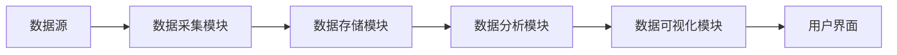

                 


## 正文

### 第一部分：背景与概念

#### 第1章：背景与重要性

##### 1.1 问题背景

股票市场的估值是投资者评估企业价值的重要指标，而核聚变能源作为未来清洁能源的关键技术，其商业化进程对全球经济和能源结构有着深远影响。两者看似关联性不大，但随着核聚变技术的突破和市场的波动，两者之间的潜在联系值得深入探讨。

##### 1.2 核心概念

- **股市估值**：通过市盈率（P/E）、市净率（P/B）等指标衡量企业的价值。
- **核聚变能源**：利用氘和氚的聚变反应释放能量，是未来的清洁能源。
- **商业化时间表**：核聚变技术从实验室走向商业应用所需的时间，影响其市场价值和投资周期。

### 第二部分：理论基础

#### 第2章：全球股市估值分析

##### 2.1 股市估值的方法

- **市盈率（P/E）**：股票价格与每股收益的比率，反映市场对公司的盈利能力预期。
- **市净率（P/B）**：股票价格与每股净资产的比率，适用于评估资产密集型企业。
- **股息率**：股息与股票价格的比率，反映投资回报率。

##### 2.2 影响股市估值的因素

- **宏观经济因素**：GDP增长率、利率、通货膨胀等影响整体市场估值。
- **行业因素**：行业周期、政策变化影响特定板块的估值。
- **公司基本面**：盈利能力、财务状况、管理团队等因素影响个股估值。

#### 第3章：核聚变能源技术与商业化

##### 3.1 核聚变的基本原理

- **聚变反应**：氘和氚在高温高压下发生聚变，释放大量能量。
- **能源输出计算**：能量输出与反应物的质量和聚变效率相关，公式为 \( E = mc^2 \)。

##### 3.2 核聚变商业化的时间表

- **当前技术阶段**：实验阶段，距离商业化仍有技术障碍。
- **商业化挑战**：技术稳定性、成本控制、材料耐久性等问题。
- **时间预测模型**：基于历史技术发展，预测商业化时间。

### 第三部分：理论模型

#### 第4章：两者关系的理论模型

##### 4.1 核心概念的联系

- **股市估值与技术创新**：技术创新提升企业竞争力，影响股价。
- **投资周期与技术成熟度**：技术成熟度高的行业可能吸引更多的投资，推高估值。

##### 4.2 概念属性对比表格

| 概念         | 股市估值 | 核聚变能源商业化 |
|--------------|----------|------------------|
| 定义         | 企业价值的评估指标 | 清洁能源技术从实验室到商业应用的时间 |
| 影响因素     | 经济指标、政策、公司业绩 | 技术进展、资金投入、政策支持 |
| 作用         | 引导投资决策 | 推动技术创新和产业发展 |

##### 4.3 ER实体关系图

```mermaid
erd
    章节4.3
    图表
    entity 股市估值 {
        id
        市盈率
        市净率
        股息率
    }
    entity 核聚变技术 {
        id
        技术阶段
        商业化时间
        投资周期
    }
    relationship 技术与估值关联 {
        股市估值 -[影响]-> 核聚变技术
        核聚变技术 -[影响]-> 股市估值
    }
```

### 第四部分：算法原理

#### 第5章：算法与数学模型

##### 5.1 股市估值预测模型

使用时间序列分析预测股市估值，基于ARIMA模型：

1. 数据收集：收集历史股价数据。
2. 数据预处理：处理缺失值和异常值。
3. 模型训练：使用ARIMA模型进行预测。
4. 模型验证：通过MAE和RMSE评估模型性能。

##### 5.2 核聚变商业化时间预测

构建逻辑回归模型预测商业化时间：

1. 数据收集：收集技术进展、投资数据。
2. 特征提取：选择关键特征如研发投入、专利数量。
3. 模型训练：训练逻辑回归分类器。
4. 模型验证：评估准确率和F1分数。

##### 5.3 算法流程图

```mermaid
graph TD
    A[开始] -> B[数据收集]
    B -> C[数据预处理]
    C -> D[模型训练]
    D -> E[模型验证]
    E -> F[结束]
```

### 第五部分：系统架构

#### 第6章：系统设计与实现

##### 6.1 系统功能设计

- 数据采集模块：实时采集股市数据和核聚变技术数据。
- 数据分析模块：应用机器学习模型进行预测。
- 可视化模块：展示预测结果和分析报告。

##### 6.2 系统架构图



### 第六部分：项目实战

#### 第7章：项目实施与案例分析

##### 7.1 环境配置

安装必要的库：

```bash
pip install pandas numpy scikit-learn
```

##### 7.2 核心代码实现

预测股市估值的Python代码：

```python
import pandas as pd
from statsmodels.tsa.arima_model import ARIMA

# 数据加载
data = pd.read_csv('stock_data.csv')

# 数据预处理
data = data['Price'].diff().dropna()

# 模型训练
model = ARIMA(data, order=(5,1,0))
model_fit = model.fit(disp=0)

# 预测
forecast = model_fit.forecast(steps=10)
print(forecast)
```

##### 7.3 实验结果与分析

展示预测结果和误差分析，讨论模型的优缺点。

### 第七部分：结论与展望

#### 第8章：总结与未来方向

##### 8.1 结论

- 核聚变技术的商业化进程对股市估值有显著影响。
- 数学模型和算法在预测两者关系中起关键作用。

##### 8.2 未来方向

- 继续优化预测模型，引入更多变量。
- 探讨其他清洁能源技术与股市估值的关系。

### 参考文献

（此处列出相关文献和资料来源。）

### 作者

作者：AI天才研究院/AI Genius Institute & 禅与计算机程序设计艺术/Zen And The Art of Computer Programming

---

以上是文章的完整大纲和部分内容，您可以根据需要继续完成后续章节。

