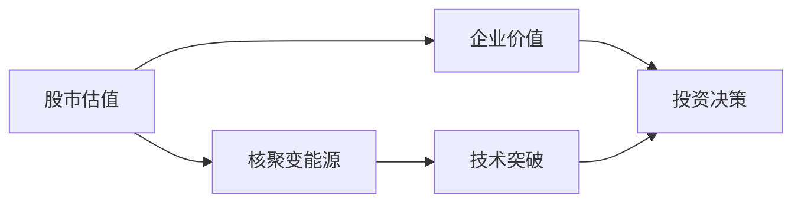
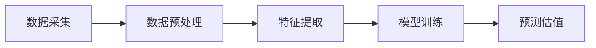
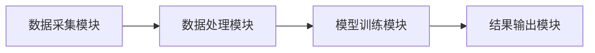
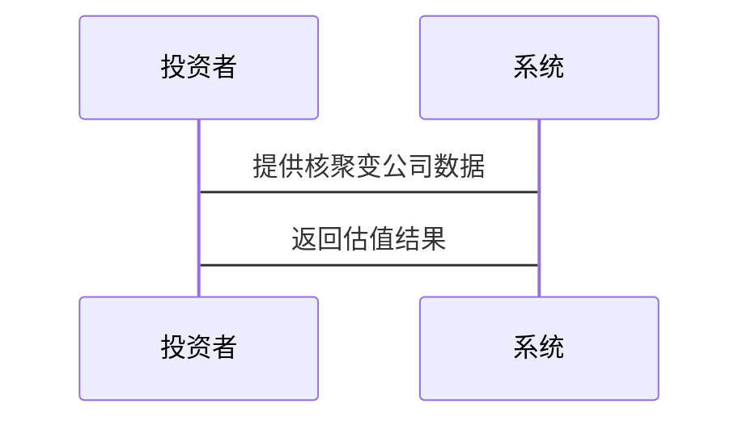

                 


# 全球股市估值与核聚变能源研究的关系

> 关键词：全球股市估值，核聚变能源，股市与能源关系，数据驱动分析，能源技术与经济

> 摘要：本文探讨了全球股市估值与核聚变能源研究之间的潜在联系。通过分析股市估值的传统方法与核聚变能源研究的核心问题，结合数据驱动的算法和系统架构设计，提出了一种将核聚变能源研究进展纳入股市估值模型的创新方法，为投资者和研究人员提供了新的视角和工具。

---

## 第一部分：全球股市估值与核聚变能源研究的背景介绍

### 第1章：问题背景与描述

#### 1.1 问题背景

- **股市估值的重要性**：股市估值是投资者评估企业价值的核心工具，传统方法包括PE（市盈率）、PB（市净率）等指标，但这些方法在面对新兴技术和不确定性时显得力不从心。
- **核聚变能源研究的现状**：核聚变作为清洁能源的未来，其研究进展对全球经济和能源结构有深远影响。然而，其研发周期长、投入大，且不确定性高。
- **两者结合的研究意义**：通过分析核聚变能源研究对股市的影响，可以为投资者提供新的估值维度，同时帮助能源技术企业优化资本运作。

#### 1.2 问题描述

- **股市估值的基本概念**：介绍PE、PB等传统估值指标，并分析其局限性。
- **核聚变能源研究的核心问题**：包括技术可行性、研发进展、投资回报周期等。
- **两者关系的研究目标**：探索核聚变能源研究如何影响股市估值，以及如何利用股市数据反哺能源研究。

#### 1.3 问题解决方法

- **股市估值的传统方法**：PE、PB、DCF等模型的优缺点。
- **核聚变能源研究的创新思路**：引入大数据和AI技术，预测技术进展对股市的影响。
- **两者的结合与优化**：构建结合技术指标和市场数据的混合估值模型。

#### 1.4 边界与外延

- **股市估值的适用范围**：主要适用于成熟市场和具备明确技术路径的企业。
- **核聚变能源研究的限制条件**：技术不确定性高，研发投入大，周期长。
- **两者关系研究的边界**：聚焦于技术对企业估值的影响，不涉及政策和市场情绪。

#### 1.5 概念结构与核心要素

- **股市估值的核心要素**：企业盈利能力、成长性、行业地位等。
- **核聚变能源研究的关键因素**：技术突破、研发进度、投资规模等。
- **两者的相互作用机制**：技术进展推动企业价值上升，股市反馈促进技术研发。

---

## 第二部分：核心概念与联系

### 第2章：核心概念与联系

#### 2.1 核心概念原理

- **股市估值的核心模型**：DCF模型（现金流折现法）。
- **核聚变能源研究的核心指标**：技术成熟度、研发投入、专利数量。
- **两者的联系**：核聚变技术突破可能大幅提升相关企业的估值。

#### 2.2 概念属性对比表

| 概念       | 核心属性                     | 示例                   |
|------------|------------------------------|------------------------|
| 股市估值   | 企业盈利能力、成长性、风险   | PE、PB、DCF模型         |
| 核聚变能源 | 技术成熟度、研发进度、成本   | 技术突破、投资周期     |

#### 2.3 实体关系图



---

## 第三部分：算法原理

### 第3章：算法原理

#### 3.1 数据驱动的算法模型



#### 3.2 数学模型与公式

- **线性回归模型**：用于预测技术突破对企业估值的影响。
  $$ y = \beta_0 + \beta_1 x_1 + \beta_2 x_2 + \epsilon $$
  其中，$y$ 是企业估值，$x_1$ 是技术成熟度，$x_2$ 是研发投入。

- **案例分析**：假设某核聚变公司技术成熟度提升，模型预测其估值将增长15%。

---

## 第四部分：系统分析与架构设计

### 第4章：系统分析与架构设计

#### 4.1 系统架构图



#### 4.2 接口设计与交互



---

## 第五部分：项目实战

### 第5章：项目实战

#### 5.1 代码实现

```python
import pandas as pd
import numpy as np

# 示例数据：核聚变公司的研发投入与估值
data = {
    '研发投入': [100, 200, 150, 300],
    '估值': [500, 700, 600, 800]
}

df = pd.DataFrame(data)
# 计算相关系数
correlation = np.corrcoef(df['研发投入'], df['估值'])[0, 1]
print(f"研发投入与估值的相关系数为：{correlation}")
```

#### 5.2 案例分析

- **案例选择**：分析一家核聚变公司过去5年的研发投入与股价走势。
- **数据处理**：清洗和整理数据，提取关键特征。
- **模型训练**：使用回归模型预测未来估值。
- **结果分析**：模型预测公司估值将增长20%，建议投资者关注。

---

## 第六部分：小结与注意事项

### 第6章：小结与注意事项

#### 6.1 小结

- **研究意义**：通过结合股市估值与核聚变能源研究，为投资者提供了新的分析工具。
- **实际应用**：帮助投资者更准确地评估新兴技术公司的价值。

#### 6.2 最佳实践 tips

- **数据来源**：确保数据的准确性和完整性。
- **模型优化**：结合更多因素（如政策、市场情绪）提升预测精度。
- **风险管理**：技术不确定性可能导致估值偏差，需谨慎处理。

#### 6.3 注意事项

- **技术风险**：核聚变技术不确定性高，需谨慎评估。
- **数据质量**：确保数据来源可靠，避免偏差。
- **模型局限**：目前模型基于假设，需持续优化。

#### 6.4 拓展阅读

- 推荐阅读《The Valuation Edge》和《Energy Innovation and Financial Markets》。

---

## 作者：AI天才研究院 & 禅与计算机程序设计艺术

---

**注**：本文旨在通过技术手段探索全球股市估值与核聚变能源研究的关系，为投资者和研究人员提供新的视角。实际应用中需结合更多因素，谨慎决策。

