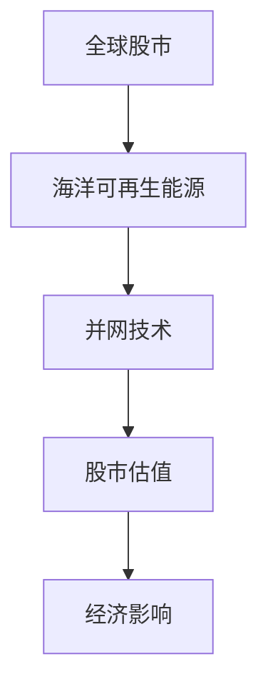
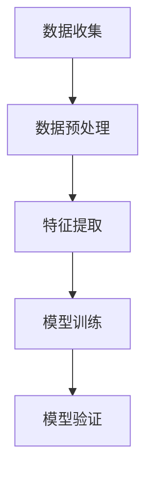
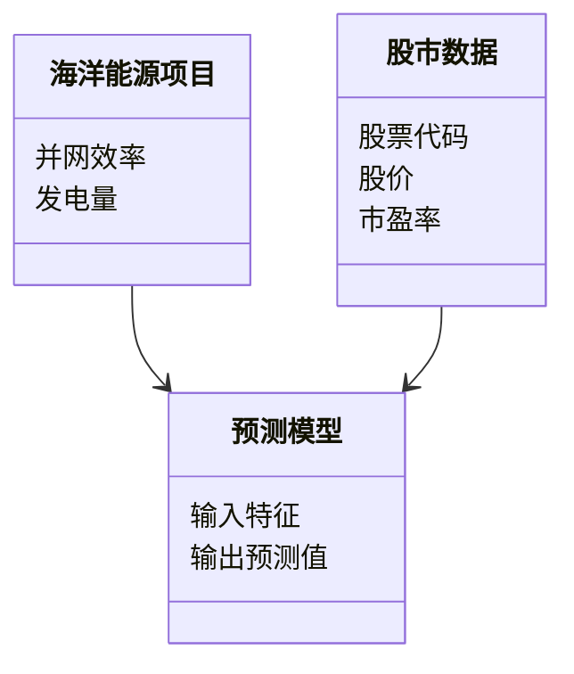
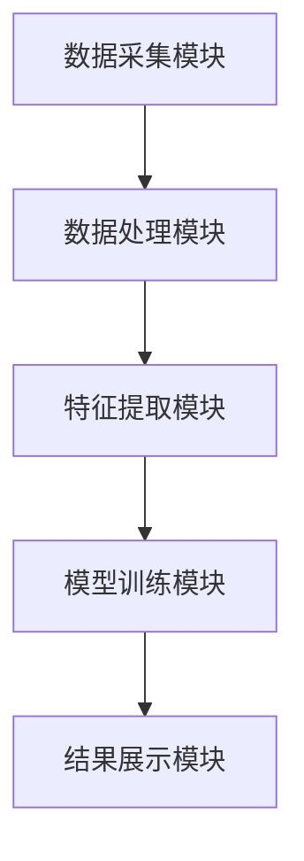

                 


# 全球股市估值与海洋可再生能源并网技术的关系

## 关键词：全球股市估值，海洋可再生能源，并网技术，股市波动，可再生能源经济影响

## 摘要：  
本文探讨了全球股市估值与海洋可再生能源并网技术之间的关系。通过分析海洋可再生能源并网技术对股市估值的影响，构建了数学模型，并提出了基于机器学习的算法。结合系统架构设计和项目实战案例，文章展示了如何利用这些技术手段来量化和预测海洋可再生能源对股市的影响，为投资者和政策制定者提供了新的视角和决策支持工具。

---

## 第一部分: 全球股市估值与海洋可再生能源并网技术的关系概述

## 第1章: 背景介绍

### 1.1 问题背景

#### 1.1.1 全球股市估值的现状与挑战
全球股市估值是衡量市场健康状况的重要指标，但其波动性受到多种因素的影响，包括经济政策、地缘政治、企业盈利能力和技术创新等。近年来，随着全球能源结构的转型，可再生能源的重要性日益凸显，而海洋可再生能源（如潮汐能、波浪能等）作为清洁能源的重要组成部分，其发展对能源市场和股市估值产生了深远影响。

#### 1.1.2 海洋可再生能源并网技术的重要性
海洋可再生能源的开发和利用依赖于先进的并网技术，这些技术能够将不稳定且分散的海洋能源转化为稳定的电力供应。并网技术的成熟度直接影响着海洋能源项目的经济效益和市场接受度，从而影响相关企业的股市估值。

#### 1.1.3 两者关系的研究意义
研究全球股市估值与海洋可再生能源并网技术的关系，有助于理解技术进步对金融市场的影响，为投资者和政策制定者提供科学依据，同时推动海洋可再生能源的广泛应用。

### 1.2 问题描述

#### 1.2.1 海洋可再生能源并网技术对股市估值的影响
海洋可再生能源并网技术的突破性进展可能会提升相关企业的市场竞争力，从而影响其股票价格和市盈率。

#### 1.2.2 全球股市估值波动的复杂性
股市估值受多种因素影响，包括宏观经济指标、市场情绪和政策变化等。海洋可再生能源并网技术作为新兴领域，其影响可能被低估或忽视。

#### 1.2.3 研究的边界与外延
本文主要研究技术进步对股市估值的影响，不涉及其他因素（如政策变化或地缘政治）的影响，但会讨论这些因素如何与技术因素相互作用。

### 1.3 核心概念与联系

#### 1.3.1 核心概念原理
- 全球股市估值：衡量市场整体价值的指标，如标普500指数、沪深指数等。
- 海洋可再生能源并网技术：将海洋能源转化为电网可用电力的技术，包括能量转换器、电网适配器等。

#### 1.3.2 核心概念属性特征对比表格

| 特征               | 全球股市估值                | 海洋可再生能源并网技术          |
|--------------------|----------------------------|-----------------------------|
| 核心影响因素        | 经济指标、政策、企业盈利   | 技术成熟度、成本、政策支持    |
| 衡量指标           | 指数点位、市盈率、市净率    | 并网效率、稳定性、成本效益比   |
| 时间维度           | 短期波动、长期趋势         | 研发周期、项目周期            |

#### 1.3.3 ER实体关系图架构（使用 Mermaid 流程图）



---

## 第2章: 核心概念与联系

### 2.1 核心概念原理

#### 2.1.1 海洋可再生能源并网技术的原理
海洋可再生能源并网技术涉及能量捕获、转换和传输三个环节。例如，潮汐能发电需要通过涡轮机将水能转化为电能，并通过变频器调整频率以匹配电网要求。

#### 2.1.2 全球股市估值的计算方法
股市估值通常通过市盈率（P/E）和市净率（P/B）等指标衡量。市盈率 = 股价 / 每股收益，市净率 = 股价 / 每股净资产。

#### 2.1.3 两者关系的数学模型
我们可以建立一个简单的线性回归模型，将海洋可再生能源技术进步（如并网效率提升）作为自变量，股市估值变化作为因变量。

$$ \text{股市估值变化} = \beta_0 + \beta_1 \times \text{并网效率} + \epsilon $$

其中，$\beta_1$ 表示并网效率对股市估值的影响系数，$\epsilon$ 是误差项。

### 2.2 核心概念属性特征对比

#### 2.2.1 海洋可再生能源并网技术的特征
- 技术复杂性高，涉及多学科交叉。
- 成本较高，但随着技术进步逐渐下降。
- 对环境影响较小，符合绿色能源发展趋势。

#### 2.2.2 全球股市估值的特征
- 易受市场情绪影响，具有波动性。
- 受宏观经济指标驱动，如GDP增速、通胀率等。
- 通过指数反映整体市场表现，如道琼斯指数、纳斯达克指数等。

#### 2.2.3 对比分析
海洋可再生能源并网技术的进步可能短期内增加企业研发投入，影响其盈利能力和股价，但长期来看，技术成熟后会提升企业的市场竞争力和估值。

### 2.3 ER实体关系图架构（使用 Mermaid 流程图）


---

## 第3章: 算法原理讲解

### 3.1 算法原理

#### 3.1.1 海洋可再生能源并网技术对股市估值的影响模型
我们假设并网技术的效率提升会直接影响企业的盈利能力和股票估值。具体来说，技术进步会降低发电成本，提高企业的利润率，从而提升市盈率和市净率。

#### 3.1.2 算法步骤
1. 数据收集：收集海洋可再生能源项目的并网效率数据和相关企业的股市估值数据。
2. 数据预处理：清洗数据，处理缺失值和异常值。
3. 特征提取：提取并网效率、企业利润、市场情绪等特征。
4. 模型训练：使用线性回归或随机森林等机器学习算法训练模型。
5. 模型验证：通过交叉验证评估模型的准确性和稳定性。

#### 3.1.3 算法流程图（使用 Mermaid）



### 3.2 算法实现

#### 3.2.1 数据预处理
```python
import pandas as pd
import numpy as np

# 假设我们有一个包含并网效率和股市估值的数据集
data = pd.DataFrame({
    '并网效率': [0.8, 0.9, 0.75, 0.95, 0.85],
    '股市估值': [100, 120, 90, 130, 110]
})

# 检查数据的完整性
print(data.isnull().sum())
```

#### 3.2.2 特征提取
```python
# 提取并网效率作为特征
X = data[['并网效率']]
# 提取股市估值作为目标变量
y = data['股市估值']
```

#### 3.2.3 模型训练
```python
from sklearn.linear_model import LinearRegression

model = LinearRegression()
model.fit(X, y)
print('模型训练完成，截距:', model.intercept_, '系数:', model.coef_)
```

#### 3.2.4 模型验证
```python
# 预测值
predictions = model.predict(X)
# 计算均方误差
from sklearn.metrics import mean_squared_error
print('均方误差:', mean_squared_error(y, predictions))
```

---

## 第4章: 系统分析与架构设计方案

### 4.1 问题场景介绍
我们希望通过一个系统来实时监测海洋可再生能源项目的并网效率，并预测其对股市估值的影响。

### 4.2 系统功能设计

#### 4.2.1 领域模型设计（使用 Mermaid 类图）



### 4.3 系统架构设计

#### 4.3.1 系统架构图（使用 Mermaid）



### 4.4 系统接口设计
- 数据采集接口：从能源项目获取并网效率数据。
- 模型调用接口：调用机器学习模型进行预测。
- 结果展示接口：将预测结果展示给用户。

### 4.5 系统交互设计（使用 Mermaid 序列图）

```mermaid
sequenceDiagram
    用户 -> 数据采集模块: 请求数据
    数据采集模块 -> 数据处理模块: 传递数据
    数据处理模块 -> 特征提取模块: 提取特征
    特征提取模块 -> 模型训练模块: 训练模型
    模型训练模块 -> 结果展示模块: 返回预测结果
    用户 <- 结果展示模块: 显示预测结果
```

---

## 第5章: 项目实战

### 5.1 环境安装
- 安装Python和必要的库：`pandas`, `numpy`, `scikit-learn`, `mermaid`。

### 5.2 系统核心实现源代码

#### 5.2.1 数据预处理
```python
import pandas as pd
import numpy as np

# 假设数据存储在CSV文件中
data = pd.read_csv('marine_energy_data.csv')
data = data.dropna()
```

#### 5.2.2 特征提取与模型训练
```python
from sklearn.model

