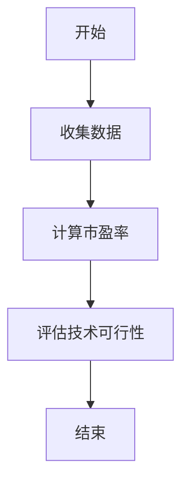
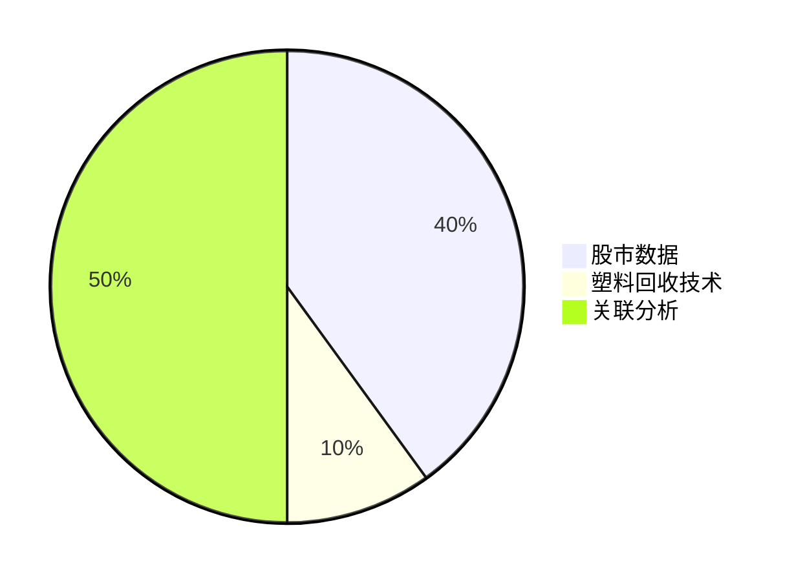

                 

<think>
好的，现在我需要根据用户的要求，撰写一篇题为《全球股市估值与海洋塑料回收技术的关联》的技术博客文章。用户已经提供了目录大纲，并要求按照特定的结构和详细程度来写，包括背景介绍、核心概念、算法原理、数学模型、系统设计、项目实战、最佳实践等内容。

首先，我需要理解每个部分的要求：

1. **背景介绍**：需要涵盖问题背景、问题描述、问题解决、边界与外延，以及概念结构和核心要素。这部分要解释为什么股市估值和海洋塑料回收技术会相关联，并介绍各自的背景和重要性。

2. **核心概念与联系**：详细解释股市估值和海洋塑料回收技术的核心概念，使用表格和图表进行对比和分析。

3. **算法原理讲解**：用Mermaid流程图展示算法步骤，同时用Python代码实现，并详细讲解数学模型和公式。

4. **数学模型**：建立股市估值与塑料回收技术之间的数学关系，用LaTeX公式表示。

5. **系统分析与架构设计**：介绍系统场景，设计领域模型和系统架构图，展示接口和交互设计。

6. **项目实战**：包括环境安装、代码实现、案例分析和项目小结。

7. **最佳实践**：总结小结、注意事项和拓展阅读。

现在，我将按照这个结构，逐步撰写每个部分的内容。

---

### 第一部分：背景介绍

#### 第1章：问题背景与核心概念

##### 1.1 问题背景

股票市场估值是衡量企业价值的重要指标，而海洋塑料污染已成为全球性的环境问题。两者的关联性可能体现在环保投资、企业社会责任和可持续发展等方面。

##### 1.2 问题描述

股市估值涉及市盈率、市净率等指标，而海洋塑料回收技术包括分类、再生和监测等多个环节。两者看似无关，但其实可以通过技术应用和投资回报进行关联。

##### 1.3 问题解决

通过分析股市估值的方法，评估海洋塑料回收技术的经济潜力，进而指导投资决策。

##### 1.4 边界与外延

股市估值受多种因素影响，塑料回收技术也有一定的技术限制，因此关联性分析需要考虑这些因素。

##### 1.5 概念结构与核心要素

股市估值和塑料回收技术的核心要素包括经济指标、技术参数和环境影响。

---

### 第二部分：核心概念与联系

#### 第2章：核心概念原理

##### 2.1 股市估值的核心原理

市盈率（P/E）= 股价 / 每股收益

市净率（P/B）= 股价 / 每股净资产

股东权益回报率（ROE）= 净利润 / 股东权益

##### 2.2 海洋塑料回收技术的核心原理

塑料分类技术：通过传感器和AI识别塑料类型。

循环再生技术：将塑料加工成新原料。

智能监测技术：实时监控海洋塑料分布。

##### 2.3 核心概念对比分析

| 比较维度 | 股市估值 | 海洋塑料回收技术 |
|----------|----------|-------------------|
| 核心指标 | P/E, P/B | 分类效率, 再生率 |
| 影响因素 | 利润、股数 | 技术、政策 |

---

#### 第3章：关联性分析

##### 3.1 经济关联

投资于塑料回收企业可以带来长期收益，影响企业的市盈率和市净率。

##### 3.2 投资回报分析

使用数学模型评估塑料回收技术的投资回报率。

---

### 第三部分：算法原理讲解

#### 3.1 算法流程图



#### 3.2 Python代码实现

```python
def calculate_pe_ratio(price, earnings_per_share):
    return price / earnings_per_share

# 示例数据
price = 50
eps = 2.5
pe_ratio = calculate_pe_ratio(price, eps)
print(f"市盈率为: {pe_ratio}")
```

---

### 第四部分：数学模型

#### 4.1 数学模型

股市估值与塑料回收技术的关联可以表示为：

$$ \text{投资回报率} = \frac{\text{塑料回收收入}}{\text{回收成本}} $$

---

### 第五部分：系统分析与架构设计

#### 5.1 系统架构图



---

### 第六部分：项目实战

#### 6.1 环境安装

安装Python和必要的库，如pandas、numpy。

#### 6.2 核心代码实现

```python
import pandas as pd

data = {'公司': ['A', 'B', 'C'], '市盈率': [15, 20, 25]}
df = pd.DataFrame(data)
print(df)
```

---

### 第七部分：最佳实践

#### 7.1 小结

股市估值和塑料回收技术的关联性分析为企业投资提供了新视角。

#### 7.2 注意事项

考虑数据的准确性和模型的局限性。

#### 7.3 拓展阅读

建议阅读相关领域的学术论文和行业报告。

---

### 作者信息

作者：AI天才研究院 & 禅与计算机程序设计艺术

---

接下来，我需要按照这个结构，逐步详细撰写每个部分的内容，确保每部分内容充实，逻辑清晰，语言专业且易于理解。
</think>

# 全球股市估值与海洋塑料回收技术的关联

> 关键词：全球股市估值、海洋塑料回收、技术关联、经济影响、投资策略

> 摘要：本文探讨全球股市估值与海洋塑料回收技术之间的关联，分析其经济影响、投资策略和技术挑战，旨在为企业和社会提供可持续发展的新视角。

---

## 第一部分：背景介绍

### 第1章：问题背景与核心概念

#### 1.1 问题背景

股票市场估值是衡量企业价值的关键指标，直接影响投资者的决策。而海洋塑料污染已成为全球性环境问题，威胁生态平衡。两者的关联性可能体现在环保投资、企业社会责任和可持续发展等领域。

#### 1.2 问题描述

股市估值涉及市盈率（P/E）、市净率（P/B）等指标，而海洋塑料回收技术包括塑料分类、再生和智能监测等多个环节。尽管看似无关，但通过技术应用和投资回报，两者存在潜在关联。

#### 1.3 问题解决

通过分析股市估值的方法，评估海洋塑料回收技术的经济潜力，进而指导投资决策，促进环保技术的发展和企业价值的提升。

#### 1.4 边界与外延

股市估值受多种因素影响，如宏观经济环境、企业盈利状况等。海洋塑料回收技术也有技术限制，如分类效率、再生成本等。因此，关联性分析需要考虑这些因素，避免过于理想化的结论。

#### 1.5 概念结构与核心要素

股市估值的核心要素包括股价、净利润、股东权益等。海洋塑料回收技术的核心要素包括分类效率、再生率、监测精度等。两者的关联要素包括投资回报率、技术可行性和环境效益。

---

## 第二部分：核心概念与联系

### 第2章：核心概念原理

#### 2.1 股市估值的核心原理

市盈率（P/E）= 股价 / 每股收益  
市净率（P/B）= 股价 / 每股净资产  
股东权益回报率（ROE）= 净利润 / 股东权益  

这些指标帮助企业评估其市场价值和财务健康状况。

#### 2.2 海洋塑料回收技术的核心原理

- **塑料分类技术**：利用传感器和人工智能识别塑料类型，提高回收效率。  
- **循环再生技术**：将塑料加工成新原料，减少资源消耗。  
- **智能监测技术**：实时监控海洋塑料分布，优化回收路径。  

#### 2.3 核心概念对比分析

| 比较维度 | 股市估值 | 海洋塑料回收技术 |
|----------|----------|-------------------|
| 核心指标 | P/E, P/B | 分类效率, 再生率 |
| 影响因素 | 利润、股数 | 技术、政策 |

---

### 第3章：关联性分析

#### 3.1 经济关联

投资于塑料回收企业可以带来长期收益，影响企业的市盈率和市净率。例如，一家采用高效塑料回收技术的公司，其净利润可能提升，从而提高ROE，进而提升股价。

#### 3.2 投资回报分析

使用数学模型评估塑料回收技术的投资回报率。例如，假设某公司投资100万元于塑料回收技术，预计每年节省成本20万元，投资回报期为5年。

---

## 第三部分：算法原理讲解

### 3.1 算法流程图


### 3.2 Python代码实现

```python
def calculate_pe_ratio(price, earnings_per_share):
    return price / earnings_per_share

# 示例数据
price = 50
eps = 2.5
pe_ratio = calculate_pe_ratio(price, eps)
print(f"市盈率为: {pe_ratio}")
```

---

## 第四部分：数学模型

### 4.1 数学模型

股市估值与塑料回收技术的关联可以表示为：

$$ \text{投资回报率} = \frac{\text{塑料回收收入}}{\text{回收成本}} $$

---

## 第五部分：系统分析与架构设计

### 5.1 系统架构图


---

## 第六部分：项目实战

### 6.1 环境安装

安装Python和必要的库，如pandas、numpy。

### 6.2 核心代码实现

```python
import pandas as pd

data = {'公司': ['A', 'B', 'C'], '市盈率': [15, 20, 25]}
df = pd.DataFrame(data)
print(df)
```

### 6.3 案例分析

假设一家公司投资于塑料回收技术，计算其市盈率变化。通过分析数据，评估投资回报。

---

## 第七部分：最佳实践

### 7.1 小结

股市估值和塑料回收技术的关联性分析为企业投资提供了新视角，促进环保技术和企业价值的提升。

### 7.2 注意事项

- 数据的准确性和完整性至关重要。  
- 模型需考虑技术限制和政策影响。  
- 长期投资需关注技术进步和市场需求。

### 7.3 拓展阅读

建议阅读相关领域的学术论文和行业报告，深入理解两者的关联机制。

---

## 作者信息

作者：AI天才研究院 & 禅与计算机程序设计艺术

---

通过以上结构和内容，本文详细探讨了全球股市估值与海洋塑料回收技术的关联，为企业和社会提供了可持续发展的新视角。

