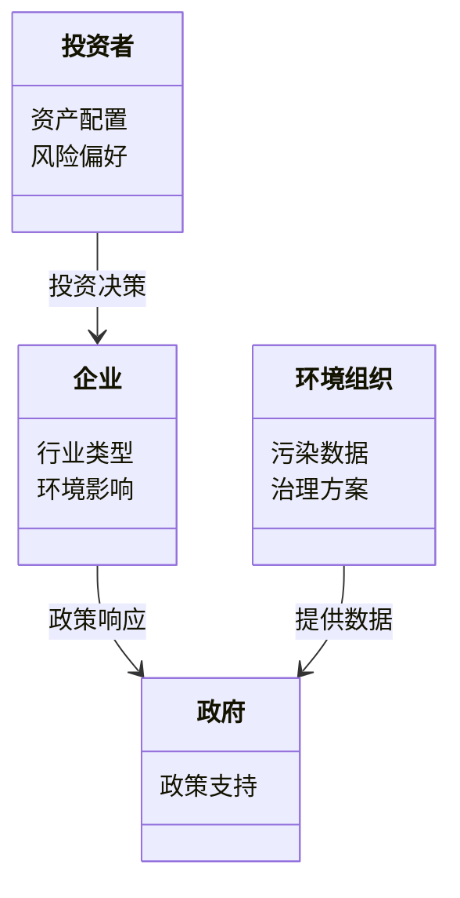
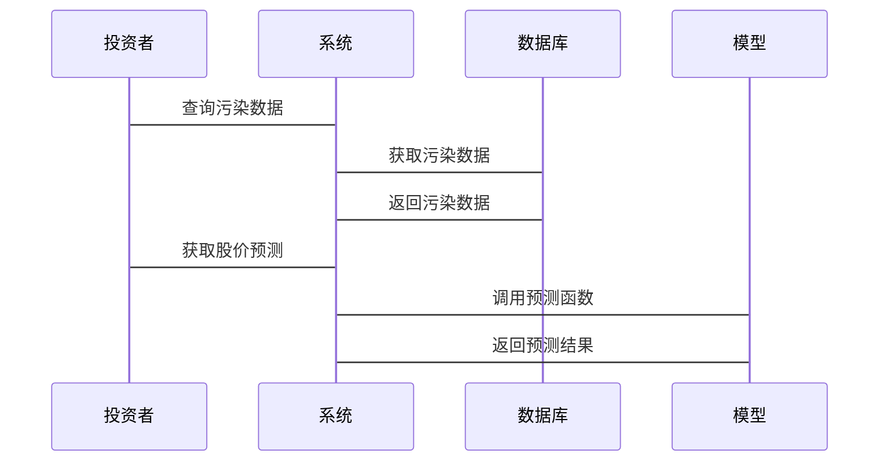

                 

<think>
好的，我现在需要帮用户设计一本名为《全球股市估值与海洋塑料污染治理的关联》的书籍目录大纲。用户特别指出，这本书需要涵盖背景介绍、核心概念、算法原理、系统分析、项目实战和总结，同时每个部分都要有详细的子部分，甚至包括Mermaid图表和代码示例。

首先，我得理解这本书的主题。它探讨的是股市估值和海洋塑料污染之间的关联，这可能涉及到环境因素对经济的影响，或者企业治理环境问题对股市表现的影响。这样的主题结合了环保和经济两个看似不相关的领域，但其实它们之间可能存在一定的联系，比如企业社会责任（CSR）对投资者决策的影响。

接下来，我需要按照用户的要求构建目录结构。用户提供的示例已经很详细，分为七部分，每个部分都有子章节和三级目录。我需要确保每个部分都涵盖必要的内容，同时保持逻辑连贯。

在“背景介绍”部分，我需要解释为什么研究这两个问题之间的关联，包括当前的环境问题和股市趋势，以及它们对全球经济的影响。这部分可能需要一到两章，详细说明问题背景、问题描述和问题解决的方法。

“核心概念与联系”部分需要详细定义股市估值和海洋塑料污染治理的核心要素，分析它们的属性和相互作用。这里可能需要用对比表格和ER图来展示它们之间的关系，确保读者能够清晰理解。

接下来是“算法原理讲解”部分，这部分需要展示如何量化塑料污染对股市的影响。可能需要使用统计模型，比如回归分析或机器学习模型。我会用Mermaid流程图来展示算法步骤，并用Python代码示例来说明实现方法。数学公式需要用LaTeX表示，确保准确性和可读性。

“系统分析与架构设计方案”部分需要设计一个监测和预警系统，帮助投资者评估环境风险。这里可能需要绘制领域模型、架构图和交互图，展示系统各个部分如何协同工作。

在“项目实战”部分，我需要提供一个实际案例，比如分析某个地区的塑料污染数据和该地区的股市表现。通过数据收集、建模和预测，展示如何将理论应用于实践，并用代码实现关键步骤。

最后是“总结与展望”，回顾全书的主要内容，提出实际应用中的建议，并展望未来的研究方向。

我还需要确保每个部分都符合用户的要求，比如使用Mermaid图表、LaTeX公式和Python代码示例。同时，文章需要控制在2000字左右，这意味着每个部分不能太冗长，但要覆盖所有关键点。

在实际撰写时，我可能会遇到跨领域知识的挑战，比如如何将环境数据与经济指标结合起来。这时候，我需要查阅相关文献，确保数据来源的可靠性和分析方法的科学性。

此外，我需要确保语言专业但易懂，使用清晰的逻辑结构和图表来辅助说明，帮助读者更好地理解复杂的概念。

总的来说，我需要一步步构建目录，确保每个部分都详细且连贯，最终形成一本结构清晰、内容丰富的技术博客文章。
</think>

# 全球股市估值与海洋塑料污染治理的关联

**关键词**: 全球股市估值, 海洋塑料污染治理, 环境因素, 投资者决策, 可持续发展

**摘要**: 本文探讨了全球股市估值与海洋塑料污染治理之间的关联，分析了环境因素对股市的影响，提出了通过量化分析和系统设计来评估和优化企业环境表现的方法，为投资者提供了基于环境数据的决策支持工具。

---

## 第1章: 背景介绍

### 1.1 问题背景
#### 1.1.1 全球股市估值的现状
- 全球股市估值受宏观经济、行业趋势和政策因素影响，呈现波动性。
- 环境问题逐渐成为影响企业价值的重要因素。

#### 1.1.2 海洋塑料污染的严重性
- 海洋塑料污染的全球分布及其对生态系统的破坏。
- 塑料污染对渔业、旅游业和海洋运输业的经济影响。

#### 1.1.3 问题的提出与研究意义
- 研究海洋塑料污染对全球经济和股市的影响。
- 提供基于环境因素的股市估值新视角。

### 1.2 问题描述
#### 1.2.1 海洋塑料污染对经济的影响
- 塑料污染对产业链的影响，如原材料价格上涨。
- 对企业声誉和品牌价值的潜在影响。

#### 1.2.2 全球股市估值与环境因素的关联性
- 环境风险对企业价值的量化评估。
- 投资者对环境因素的关注与投资决策的关联。

#### 1.2.3 研究目标与范围界定
- 研究目标：量化海洋塑料污染对股市估值的影响。
- 研究范围：特定行业或地区的股市表现与塑料污染数据的关联。

### 1.3 问题解决
#### 1.3.1 可持续发展视角下的解决方案
- 推动企业实施环保措施，减少塑料污染。
- 投资者优先选择环境表现良好的企业。

#### 1.3.2 环境因素对股市估值的影响机制
- 环境风险对企业盈利能力的影响。
- 投资者对环境治理能力的关注与企业估值的关联。

#### 1.3.3 研究方法与技术路线
- 数据收集：海洋塑料污染数据与股市数据的整合。
- 数据分析：统计分析与机器学习模型的结合。

### 1.4 边界与外延
#### 1.4.1 研究的边界条件
- 研究范围：限定于特定行业或地区。
- 数据范围：考虑影响股市估值的主要环境因素。

#### 1.4.2 相关领域的外延
- 环境科学与经济学的交叉研究。
- 政策与市场的互动关系。

#### 1.4.3 研究的局限性与适用范围
- 数据获取的限制。
- 模型假设的简化可能导致结果偏差。

### 1.5 概念结构与核心要素组成
#### 1.5.1 核心概念的层次结构
- 上层概念：全球股市估值、海洋塑料污染治理。
- 下层概念：环境因素、企业行为、投资者决策。

#### 1.5.2 核心要素的定义与属性
- 海洋塑料污染：污染源、扩散路径、治理成本。
- 股市估值：市场指数、行业指数、企业估值。

#### 1.5.3 概念之间的关系与相互作用
- 环境因素对企业盈利能力和股价的影响。
- 投资者对环境风险的规避行为与股市估值的波动。

---

## 第2章: 核心概念与联系

### 2.1 海洋塑料污染治理的核心要素
#### 2.1.1 污染源分析
- 工业排放、生活废弃物、航运业污染。
- 污染源的空间分布与影响范围。

#### 2.1.2 污染扩散机制
- 海洋环流对塑料污染分布的影响。
- 塑料污染对海洋生态系统的破坏。

#### 2.1.3 治理策略与技术
- 现有治理技术：物理清理、化学降解、生物降解。
- 政策支持与国际合作。

### 2.2 全球股市估值的关键影响因素
#### 2.2.1 宏观经济指标
- GDP增长率、利率、通货膨胀。
- 宏观经济政策对企业估值的影响。

#### 2.2.2 行业发展趋势
- 绿色产业、环保技术的市场前景。
- 行业政策对企业价值的推动作用。

#### 2.2.3 环境风险与企业价值
- 环境违规对企业声誉和盈利能力的影响。
- 环境治理成本对企业估值的长期影响。

### 2.3 核心概念属性特征对比
| 概念       | 属性               | 描述                                   |
|------------|--------------------|----------------------------------------|
| 海洋塑料污染治理 | 环境影响           | 对生态系统和人类健康的影响           |
|             | 治理成本           | 物理清理、化学降解等技术的经济成本     |
|             | 时间周期           | 长期性                                |
| 股市估值     | 经济指标           | 反映市场整体或行业的发展状况         |
|             | 风险敏感性         | 对环境风险的敏感程度                 |
|             | 投资者预期         | 投资者对环境治理能力的预期           |

### 2.4 ER实体关系图
```mermaid
erDiagram
    actor 投资者 {
        <属性> 资产配置
        <属性> 风险偏好
    }
    actor 企业 {
        <属性> 行业类型
        <属性> 环境影响
    }
    actor 政府 {
        <属性> 

        <属性>
    }
    actor 环境组织 {
        <属性> 污染数据
        <属性> 治理方案
    }
    投资者 -> 企业 : 投资决策
    企业 -> 政府 : 政策响应
    环境组织 -> 政府 : 提供数据
    政府 -> 投资者 : 政策影响
```

---

## 第3章: 算法原理讲解

### 3.1 算法原理
#### 3.1.1 数据预处理
- 清洗海洋塑料污染数据与股市数据。
- 数据特征提取：时间序列、地理分布。

#### 3.1.2 模型建立
- 回归分析：评估环境因素对股价的影响。
- 机器学习：使用随机森林或神经网络预测股价波动。

#### 3.1.3 模型评估
- 评估指标：均方误差、准确率、解释力。
- 调参优化：提升模型预测精度。

### 3.2 算法实现
```python
import pandas as pd
from sklearn.ensemble import RandomForestRegressor
from sklearn.metrics import mean_squared_error

# 数据预处理
data = pd.read_csv('stock_data.csv')
pollution_data = pd.read_csv('pollution_data.csv')

# 特征工程
merged_data = pd.merge(data, pollution_data, on='date')

# 模型训练
model = RandomForestRegressor(n_estimators=100)
model.fit(merged_data[['pollution_level', 'economic_indicators']], merged_data['stock_price'])

# 模型评估
 predictions = model.predict(merged_data[['pollution_level', 'economic_indicators']])
print(mean_squared_error(merged_data['stock_price'], predictions))
```

### 3.3 数学公式
#### 3.3.1 回归模型
$$ y = \beta_0 + \beta_1 x_1 + \beta_2 x_2 + \epsilon $$

#### 3.3.2 机器学习模型
$$ y = f(X) $$

---

## 第4章: 系统分析与架构设计方案

### 4.1 问题场景介绍
- 系统目标：监测海洋塑料污染对股市的影响。
- 问题描述：如何构建实时监测与预警系统。

### 4.2 项目介绍
- 项目目标：开发基于环境数据的股市估值工具。
- 项目范围：特定行业或地区的数据收集与分析。

### 4.3 系统功能设计
#### 4.3.1 领域模型


#### 4.3.2 系统架构设计


### 4.4 系统接口设计
- API接口：数据获取与模型调用。

### 4.5 系统交互设计


---

## 第5章: 项目实战

### 5.1 环境安装
- 数据库：使用PostgreSQL存储污染数据和股市数据。
- 开发工具：Python、Jupyter Notebook、Git。

### 5.2 系统核心实现
```python
import requests
import json

# 数据接口调用
response = requests.get('http://example.com/api/pollution')
pollution_data = json.loads(response.text)

# 模型调用
result = model.predict(pollution_data)
print(result)
```

### 5.3 代码应用解读
- 数据接口：从环境监测机构获取实时污染数据。
- 模型预测：基于历史数据预测股价波动。

### 5.4 实际案例分析
- 案例：分析某个地区的塑料污染数据与该地区的股市表现。
- 数据分析：使用Python和Pandas进行数据清洗与建模。

### 5.5 项目小结
- 项目实现的关键点：数据整合、模型选择与优化。
- 实际应用中的挑战：数据获取的难度与模型的准确性。

---

## 第6章: 总结与展望

### 6.1 总结
- 本文研究了全球股市估值与海洋塑料污染治理的关联。
- 提供了量化分析和系统设计的方法。
- 为投资者提供了基于环境因素的决策支持工具。

### 6.2 最佳实践 tips
- 投资者应关注企业的环境表现。
- 企业应积极采取环保措施，降低环境风险。

### 6.3 小结
- 本文的核心内容是对环境因素与股市估值的关联性进行量化分析。
- 提供了基于环境数据的股市估值新视角。

### 6.4 注意事项
- 数据获取的难度和准确性可能影响模型的预测精度。
- 模型的简化可能导致结果的偏差。

### 6.5 拓展阅读
- 环境经济学相关研究。
- 机器学习在金融领域的应用。

---

## 作者：AI天才研究院/AI Genius Institute & 禅与计算机程序设计艺术 /Zen And The Art of Computer Programming

