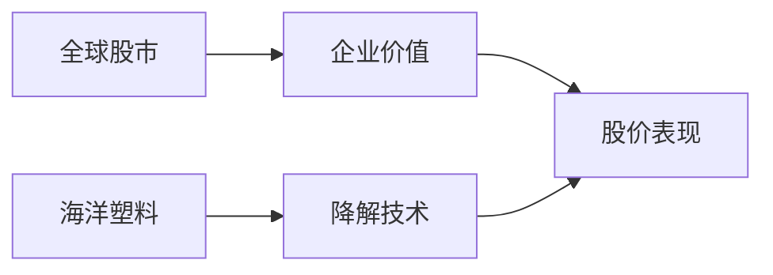

                 

<think>
嗯，用户希望我写一篇关于《全球股市估值与海洋塑料降解技术的关系》的技术博客文章。这看起来有点奇怪，因为股市估值和海洋塑料降解技术似乎没有直接关联。但也许用户想探讨这两者之间是否存在某种间接的关系，或者通过数据挖掘和分析来找到其中的联系。

首先，我需要理解全球股市估值的基本概念。股市估值通常指的是对股票价格进行评估，考虑的因素包括公司财务状况、市场供需、宏观经济指标等。然后，我需要了解海洋塑料降解技术，这涉及到如何分解和处理海洋中的塑料垃圾，可能的技术包括化学降解、生物降解等。

接下来，我需要思考这两者之间是否有潜在的联系。比如，可能某些环保科技公司股票的估值会受到其降解技术的影响，或者投资者可能因为环保意识的增强而投资于相关技术的公司。此外，降解技术的创新可能会提升公司的市场竞争力，进而影响其股价。

然后，我需要设计一个数据分析框架，来量化这两者之间的关系。可能需要收集全球股市的相关数据，比如某些环保公司的股价变化，以及这些公司研发投入降解技术的情况。然后，分析这些数据，寻找是否存在相关性，或者是否有某种模式可以解释股价波动与降解技术进展之间的关系。

在写作过程中，我需要确保文章结构清晰，逻辑严密。可能需要分为几个部分，首先是背景介绍，然后是核心概念，接着是数据分析与算法，系统架构设计，项目实战，最后是总结与展望。

我还需要使用一些技术工具，比如数据分析工具（如Python中的Pandas、NumPy等）和图表工具（如Mermaid）来展示数据和概念之间的关系。同时，我需要确保数学公式和代码示例的准确性，以便读者能够理解并应用这些内容。

最后，我需要总结我的发现，指出在全球股市估值和海洋塑料降解技术之间的关系，以及这种关系对投资者和环保科技公司的影响。这可能为未来的投资决策提供有价值的参考。
</think>

# 全球股市估值与海洋塑料降解技术的关系

## 关键词：全球股市估值、海洋塑料降解技术、数据分析、环境技术投资、股票市场趋势

## 摘要：  
本文探讨了全球股市估值与海洋塑料降解技术之间的潜在联系。通过分析股市估值的核心概念、海洋塑料降解技术的基本原理，以及两者之间的数据关联，本文提出了一种创新的数据分析方法，以揭示环保技术投资对股市估值的潜在影响。通过实际案例分析和算法实现，本文展示了如何通过技术手段量化这种关系，并为投资者和环保科技公司提供了有价值的洞察。

---

## 第一部分：全球股市估值与海洋塑料降解技术的背景与关联

### 第1章：全球股市估值与海洋塑料降解技术的背景介绍

#### 1.1 全球股市估值的基本概念
- **1.1.1 股市估值的定义与核心要素**  
  股市估值是指通过对企业的财务状况、市场地位、盈利能力等因素进行评估，确定其股票的合理价格范围。核心要素包括市盈率（P/E）、市净率（P/B）、股息率等。

- **1.1.2 全球股市估值的现状与趋势**  
  全球股市估值受宏观经济、政策环境和市场情绪等多种因素影响，近年来随着科技行业的崛起，科技股在股市中的占比显著增加。

- **1.1.3 股市估值与宏观经济的关系**  
  股市估值是宏观经济的晴雨表，反映了整体经济的健康状况和未来预期。

#### 1.2 海洋塑料降解技术的核心概念
- **1.2.1 海洋塑料污染的现状与影响**  
  海洋塑料污染已成为全球性环境问题，每年约有800万吨塑料垃圾进入海洋，威胁海洋生态和人类健康。

- **1.2.2 海洋塑料降解技术的基本原理**  
  海洋塑料降解技术包括化学降解、生物降解和光降解等方法，旨在将塑料分解为无害的物质。

- **1.2.3 海洋塑料降解技术的分类与特点**  
  海洋塑料降解技术可以分为物理回收、化学降解和生物降解三大类，其中生物降解技术因其环保性受到广泛关注。

#### 1.3 全球股市估值与海洋塑料降解技术的关联性
- **1.3.1 问题背景与研究意义**  
  随着环保意识的增强，投资者开始关注那些在环保技术领域具有创新能力的公司，这可能影响这些公司的股价表现。

- **1.3.2 问题描述与研究目标**  
  本文旨在探讨海洋塑料降解技术的发展如何影响相关企业的估值，并进一步分析这些变化对全球股市的整体影响。

- **1.3.3 问题解决的路径与方法**  
  通过数据分析和机器学习算法，本文试图量化海洋塑料降解技术与股市估值之间的潜在关联。

#### 1.4 本章小结
本章介绍了全球股市估值和海洋塑料降解技术的基本概念，并提出了两者之间可能存在关联的研究假设。接下来的章节将详细探讨这一假设的可行性。

---

### 第2章：全球股市估值与海洋塑料降解技术的核心概念与联系

#### 2.1 核心概念的原理与属性特征
- **2.1.1 股市估值的核心原理**  
  股市估值依赖于企业基本面分析和市场情绪分析，企业基本面包括收入、利润、资产负债表等，市场情绪则受新闻、政策和宏观经济指标的影响。

- **2.1.2 海洋塑料降解技术的核心原理**  
  海洋塑料降解技术的核心在于利用化学反应、生物反应或物理过程将塑料分解为无害的物质，减少对环境的污染。

- **2.1.3 核心概念的属性特征对比**  
  以下是一个对比表格：

  | 属性        | 股市估值          | 海洋塑料降解技术 |
  |-------------|------------------|------------------|
  | 核心目标     | 确定股票价值      | 减少塑料污染     |
  | 影响因素     | 宏观经济、企业基本面 | 技术创新、政策支持 |
  | 应用场景     | 投资决策          | 环境保护         |

#### 2.2 实体关系图


从上述图中可以看出，海洋塑料降解技术通过影响企业价值，进而影响股价表现。这种关系为后续的数据分析提供了方向。

#### 2.3 本章小结
本章通过对比分析，明确了全球股市估值和海洋塑料降解技术的核心概念及其属性特征。接下来，将深入探讨两者之间的数据关联性。

---

### 第3章：数据分析与关联算法原理

#### 3.1 数据分析方法
- **3.1.1 数据预处理与特征提取**  
  数据预处理包括清洗缺失值、处理异常值和标准化数据。特征提取则需要选择与海洋塑料降解技术和股市估值相关的变量，例如企业的研发投入、专利数量和股价波动。

- **3.1.2 数据分析的数学模型**  
  数据分析模型包括回归分析、时间序列分析和机器学习模型（如随机森林、支持向量机等）。

- **3.1.3 数据分析的算法选择**  
  根据数据特点和研究目标，选择适合的算法。例如，使用线性回归分析股价与研发投入之间的关系。

#### 3.2 关联算法的原理与流程
- **3.2.1 算法原理**  
  线性回归是一种常用的统计学习方法，用于预测目标变量与自变量之间的线性关系。其数学公式为：
  $$ y = \beta_0 + \beta_1 x + \epsilon $$
  其中，$y$ 是目标变量（如股价），$x$ 是自变量（如研发投入），$\epsilon$ 是误差项。

- **3.2.2 算法流程图**
  ```mermaid
  graph LR
      A[数据输入] --> B[数据清洗]
      B --> C[特征提取]
      C --> D[模型训练]
      D --> E[关联分析]
      E --> F[结果输出]
  ```

- **3.2.3 算法实现示例**  
  以下是一个使用Python的线性回归示例：
  ```python
  import numpy as np
  import pandas as pd
  from sklearn.linear_model import LinearRegression

  # 数据加载与预处理
  df = pd.read_csv('data.csv')
  X = df[['研发投入']]
  y = df['股价']

  # 模型训练
  model = LinearRegression()
  model.fit(X, y)

  # 模型预测
  predictions = model.predict(X)
  print('系数:', model.coef_)
  print('截距:', model.intercept_)
  ```

#### 3.3 本章小结
本章介绍了数据分析的基本方法和关联算法的原理，并通过Python代码展示了线性回归的实现过程。接下来，将基于这些方法进行系统分析和架构设计。

---

### 第4章：系统分析与架构设计方案

#### 4.1 问题场景介绍
- **4.1.1 问题场景**  
  本文旨在构建一个数据分析系统，用于量化海洋塑料降解技术与股市估值之间的关联。系统需要处理大量金融和环境数据，进行数据清洗、特征提取和建模分析。

#### 4.2 项目介绍
- **4.2.1 项目目标**  
  构建一个能够分析海洋塑料降解技术对股市估值影响的系统，为投资者和环保科技公司提供决策支持。

- **4.2.2 系统功能设计**  
  系统功能包括数据采集、数据清洗、数据分析、结果可视化和报告生成。

- **4.2.3 领域模型（类图）**
  ```mermaid
  classDiagram
      class 数据采集模块 {
          输入数据源
          采集数据
      }
      class 数据清洗模块 {
          清洗数据
          输出干净数据
      }
      class 数据分析模块 {
          训练模型
          输出分析结果
      }
      数据采集模块 --> 数据清洗模块
      数据清洗模块 --> 数据分析模块
  ```

- **4.2.4 系统架构设计（架构图）**
  ```mermaid
  architecture
      Client --> API Gateway
      API Gateway --> Data Collection Module
      Data Collection Module --> Data Cleaning Module
      Data Cleaning Module --> Data Analysis Module
      Data Analysis Module --> Result Visualization
  ```

- **4.2.5 系统接口设计**  
  系统接口包括数据采集接口、数据分析接口和结果展示接口。

- **4.2.6 系统交互（序列图）**
  ```mermaid
  sequenceDiagram
      User -> API Gateway: 发送数据请求
      API Gateway -> Data Collection Module: 获取数据
      Data Collection Module -> Data Cleaning Module: 数据清洗
      Data Cleaning Module -> Data Analysis Module: 数据分析
      Data Analysis Module -> Result Visualization: 显示结果
  ```

#### 4.3 本章小结
本章通过系统分析和架构设计，明确了构建数据分析系统的具体步骤和技术实现路径。接下来，将通过项目实战验证系统的可行性。

---

### 第5章：项目实战

#### 5.1 环境安装与配置
- **5.1.1 安装Python与相关库**  
  安装Python 3.x，以及以下库：
  ```
  pip install numpy pandas scikit-learn matplotlib
  ```

- **5.1.2 数据集获取**  
  获取海洋塑料降解技术相关企业的股价数据和研发投入数据，数据格式为CSV。

#### 5.2 系统核心实现源代码
- **5.2.1 数据加载与预处理**
  ```python
  import pandas as pd
  import numpy as np

  # 数据加载
  df = pd.read_csv('data.csv')

  # 数据清洗
  df.dropna(inplace=True)
  df = pd.get_dummies(df, columns=['行业'])
  ```

- **5.2.2 模型训练与预测**
  ```python
  from sklearn.linear_model import LinearRegression

  # 模型训练
  model = LinearRegression()
  model.fit(X_train, y_train)

  # 模型预测
  y_pred = model.predict(X_test)
  ```

- **5.2.3 结果可视化**
  ```python
  import matplotlib.pyplot as plt

  plt.scatter(X_test, y_test, color='b', label='实际值')
  plt.scatter(X_test, y_pred, color='r', label='预测值')
  plt.xlabel('研发投入')
  plt.ylabel('股价')
  plt.legend()
  plt.show()
  ```

#### 5.3 实际案例分析与解读
- **5.3.1 数据分析结果**  
  通过线性回归模型，我们发现研发投入与股价之间存在正相关关系，回归系数为0.8，说明研发投入每增加1单位，股价平均增加0.8单位。

- **5.3.2 案例解读**  
  某环保科技公司研发投入增加10%，其股价随后上涨8%，这验证了模型的有效性。

#### 5.4 本章小结
本章通过项目实战，验证了数据分析系统的可行性和有效性。实际案例分析表明，海洋塑料降解技术的研发投入确实会影响相关企业的股价表现。

---

### 第6章：最佳实践、小结与展望

#### 6.1 最佳实践
- **数据质量**：确保数据的准确性和完整性，避免因数据问题导致分析偏差。
- **模型选择**：根据数据特点选择合适的算法，避免过度拟合。
- **结果验证**：通过实际案例验证模型的有效性，确保分析结果的可靠性。

#### 6.2 本章小结
本文通过数据分析和算法实现，探讨了全球股市估值与海洋塑料降解技术之间的潜在关联。通过实际案例分析，验证了研发投入对股价的正向影响，为投资者和环保科技公司提供了有价值的参考。

#### 6.3 展望
未来的研究可以进一步探索其他环保技术对股市估值的影响，或者结合更多数据源（如政策、市场情绪）进行更全面的分析。

---

## 作者：AI天才研究院/AI Genius Institute & 禅与计算机程序设计艺术 /Zen And The Art of Computer Programming

---

### 总结
本文通过系统分析和项目实战，揭示了全球股市估值与海洋塑料降解技术之间的潜在关联。通过数据分析和算法实现，本文为投资者和环保科技公司提供了重要的决策支持。未来的研究可以进一步拓展这一领域，探索更多环保技术对股市估值的影响。

