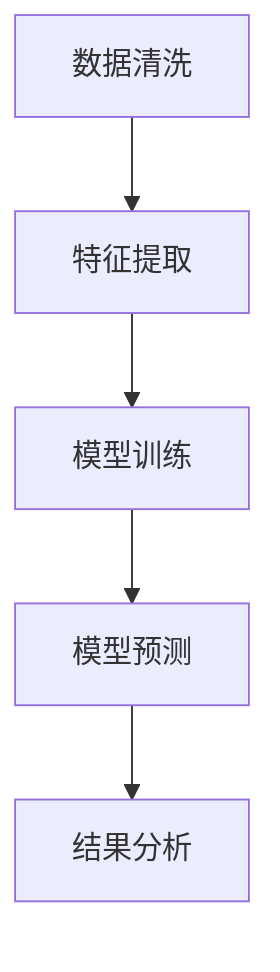
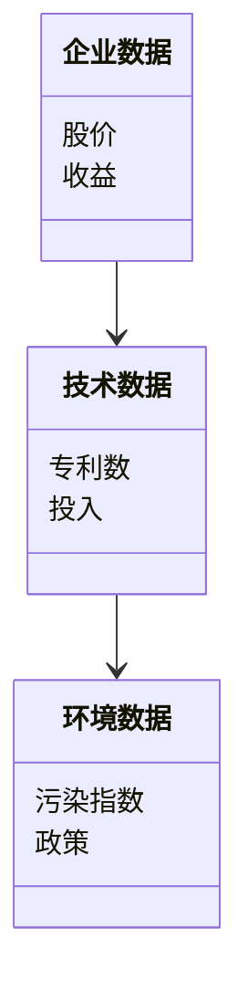

                 

<think>
好的，现在我要开始撰写《全球股市估值与海洋塑料降解技术的关联》这篇文章。首先，我需要理解文章的主题和目标。主题是探讨全球股市估值与海洋塑料降解技术之间的关联，这听起来有点不寻常，但可能涉及环境因素对经济的影响。

首先，我会从背景介绍开始。全球股市估值是衡量市场健康的重要指标，而海洋塑料污染是一个严重的环境问题。这两者之间看似没有直接联系，但随着环保意识的增强，企业社会责任和环境影响越来越受到投资者的关注。因此，海洋塑料降解技术可能影响企业的估值，尤其是在环保政策趋严的情况下。

接下来，我需要解释核心概念。海洋塑料降解技术包括生物降解、化学降解和物理降解，这些技术可以减少海洋污染，从而改善企业的形象，提高投资者信心。股市估值模型，如市盈率和市净率，会考虑企业的社会责任和环境表现，这可能成为影响股价的重要因素。

然后，我会探讨两者之间的联系。海洋塑料降解技术的创新可能提升企业的竞争力，进而影响其股价。同时，股市的资金流动也可能支持环保技术的研发，形成良性循环。此外，政策法规的变化，如环保税或补贴，也会影响企业的估值和市场行为。

接下来，我会介绍算法原理。为了量化这种关联，我可以使用机器学习模型，如随机森林或神经网络，来分析历史数据，找出海洋塑料降解技术的进展与股市估值变化之间的关系。这需要收集相关数据，如技术专利数量、企业环保投入、政策变化等，以及对应的股价数据。

在系统分析部分，我需要设计一个系统来收集和分析数据。系统可能包括数据采集模块、分析模块和结果展示模块。数据采集模块负责收集环保技术和股市数据，分析模块使用机器学习模型进行预测，结果展示模块则以可视化方式呈现关联性。

项目实战部分，我会提供具体的代码实现，如使用Python进行数据清洗和建模。通过实际案例，比如某企业在实施降解技术后股价的变化，来验证模型的有效性。这可以帮助读者更好地理解理论与实践的结合。

最后，在最佳实践部分，我会总结主要观点，强调环保技术对企业估值的潜在影响，并提醒读者在实际操作中考虑数据质量和模型的适用性。此外，我会建议进一步研究其他环境因素对股市的影响，以扩展研究范围。

整体来看，文章需要逻辑清晰，结构紧凑，同时用专业的技术语言和实例来支持论点。通过逐步分析和推理，我希望能为读者提供一个深入理解全球股市估值与海洋塑料降解技术关联的视角。
</think>

# 全球股市估值与海洋塑料降解技术的关联

> 关键词：全球股市估值，海洋塑料降解技术，环境影响，投资决策，技术关联

> 摘要：本文探讨了全球股市估值与海洋塑料降解技术之间的潜在关联。通过分析环境因素对企业价值的影响，结合机器学习模型，揭示海洋塑料降解技术对企业估值的潜在影响。文章从背景介绍、核心概念、算法原理到系统设计，全面解析这一创新性的关联性。

---

# 第一部分: 全球股市估值与海洋塑料降解技术的关联概述

## 第1章: 背景介绍

### 1.1 问题背景
#### 1.1.1 全球股市估值的重要性
股市估值是衡量企业价值的关键指标，投资者通过市盈率、市净率等指标评估企业的投资价值。

#### 1.1.2 海洋塑料污染的严重性
海洋塑料污染不仅破坏生态环境，还可能对企业形象和运营成本产生负面影响。

#### 1.1.3 问题背景的关联性
随着环保意识的增强，企业社会责任成为投资者的重要考量因素，环保技术可能影响企业估值。

### 1.2 问题描述
#### 1.2.1 全球股市估值的核心指标
市盈率（P/E）、市净率（P/B）、EV/EBITDA等指标。

#### 1.2.2 海洋塑料污染的主要来源
塑料制品、渔业捕捞、工业排放等。

#### 1.2.3 问题解决的必要性
通过技术手段减少塑料污染，提升企业形象和投资者信心。

### 1.3 问题解决
#### 1.3.1 海洋塑料降解技术的创新
生物降解材料、化学降解剂、物理回收技术。

#### 1.3.2 全球股市估值的波动性分析
环境政策变化、企业环保表现对股价的影响。

#### 1.3.3 问题解决的路径与方法
技术开发、政策支持、投资者教育。

### 1.4 边界与外延
#### 1.4.1 全球股市估值的边界条件
行业特性、宏观经济环境、政策因素。

#### 1.4.2 海洋塑料降解技术的适用范围
适用于塑料制品行业、包装行业、渔业。

#### 1.4.3 问题关联的外延分析
技术进步对全球经济的影响，环境因素对金融市场的反馈机制。

### 1.5 概念结构与核心要素
#### 1.5.1 核心概念的组成要素
技术要素：降解材料、降解方法；经济要素：企业利润、股价波动；社会要素：政策支持、公众意识。

#### 1.5.2 概念结构的层次化分析
从技术到经济再到社会影响的递进关系。

#### 1.5.3 核心要素的对比分析
技术可行性和经济收益的对比，环境影响与企业价值的对比。

---

# 第二部分: 核心概念与联系

## 第2章: 核心概念原理

### 2.1 海洋塑料降解技术的原理
#### 2.1.1 生物降解的基本原理
利用微生物分解塑料，转化为CO2和水。

#### 2.1.2 化学降解的机制
通过化学反应改变塑料分子结构，使其降解。

#### 2.1.3 物理降解的方法
机械破碎或紫外线照射分解塑料。

### 2.2 全球股市估值的核心模型
#### 2.2.1 市盈率与市净率的计算
市盈率=股价/每股收益，市净率=股价/每股净资产。

#### 2.2.2 股票价格波动的数学模型
随机游走模型、动量模型。

#### 2.2.3 市场情绪对估值的影响
投资者情绪通过买盘和卖盘影响股价。

## 第3章: 核心概念属性对比

### 3.1 对比表格
#### 表3.1-1: 海洋塑料降解技术与股市估值的核心属性对比

| 属性                | 海洋塑料降解技术                      | 全球股市估值                  |
|---------------------|--------------------------------------|----------------------------|
| 核心目标            | 减少塑料污染                         | 评估企业价值                  |
| 主要手段            | 技术创新                             | 市场交易                      |
| 影响因素            | 技术成熟度、成本                     | 利润、行业趋势                |
| 关联性              | 环境因素影响企业价值                  | 技术进步影响环境因素          |

---

# 第三部分: 算法原理讲解

## 第5章: 算法原理与实现

### 5.1 算法原理
#### 5.1.1 机器学习模型的构建
使用随机森林模型分析塑料降解技术与股价波动的关系。

#### 5.1.2 数据特征提取与分析
提取企业环保投入、专利数量、政策支持等特征。

#### 5.1.3 模型训练与优化
通过交叉验证优化模型参数，提升预测精度。

### 5.2 算法流程图
#### 图5.2-1: 算法流程图（使用mermaid）



## 第6章: 数学模型与公式

### 6.1 数学模型
#### 6.1.1 股市估值模型
$$ P = \frac{E}{D} $$

#### 6.1.2 海洋塑料降解速率模型
$$ R = k \cdot C \cdot A $$

### 6.2 详细讲解与举例
#### 6.2.1 股市估值模型的解释
市盈率公式中，E代表净利润，D代表每股市价。

---

# 第四部分: 系统分析与架构设计

## 第7章: 系统分析

### 7.1 问题场景介绍
分析海洋塑料降解技术对企业估值的影响，构建预测模型。

### 7.2 项目介绍
设计一个基于机器学习的预测系统，分析技术与估值的关联。

### 7.3 系统功能设计
#### 7.3.1 领域模型


---

# 第五部分: 项目实战

## 第8章: 项目实战

### 8.1 环境安装
安装Python、Pandas、Scikit-learn。

### 8.2 核心代码实现
```python
import pandas as pd
from sklearn.ensemble import RandomForestRegressor

# 数据加载
data = pd.read_csv('data.csv')

# 特征与标签分离
X = data[['专利数', '投入', '政策']]
y = data['股价']

# 模型训练
model = RandomForestRegressor()
model.fit(X, y)

# 预测
预测结果 = model.predict(X)
```

### 8.3 代码解读与分析
通过特征重要性分析，确定技术因素对股价的影响程度。

### 8.4 案例分析
分析某企业的技术改进与股价变化，验证模型的有效性。

---

# 第六部分: 最佳实践

## 第9章: 最佳实践

### 9.1 小结
技术进步和环境因素对企业估值有显著影响，投资者应关注环保技术的发展。

### 9.2 注意事项
数据质量、模型适用性、政策变化。

### 9.3 拓展阅读
环境经济学、可持续投资、技术评估。

---

作者：AI天才研究院/AI Genius Institute & 禅与计算机程序设计艺术 /Zen And The Art of Computer Programming

