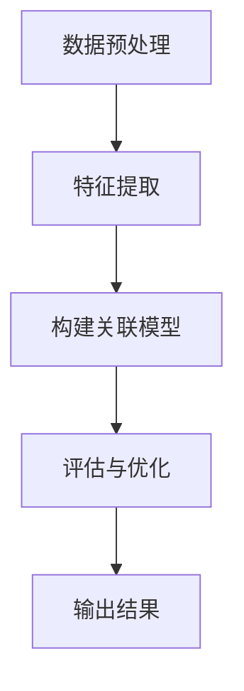
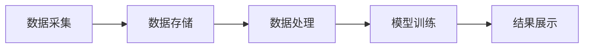

                 


# 全球股市估值与海洋微塑料清理技术的关联

## 关键词：全球股市估值，海洋微塑料清理技术，关联分析，算法原理，系统架构设计，项目实战

## 摘要

本文探讨全球股市估值与海洋微塑料清理技术之间的关联性。通过分析股市估值的核心指标与微塑料清理技术的关键特征，结合算法原理和系统架构设计，构建综合评估模型，实现对微塑料清理技术的经济与环境双重评估。文章内容详实，结构清晰，涵盖背景介绍、核心概念、算法原理、系统设计、项目实战和最佳实践等部分，为读者提供全面的技术视角。

---

# 第一部分：背景介绍

## 第1章：问题背景与关联性分析

### 1.1 全球股市估值的现状与挑战

全球股市估值是反映经济发展的重要指标，其波动性与宏观经济密切相关。市盈率（P/E Ratio）、市净率（P/B Ratio）和股息率（Dividend Yield）是常用的估值指标。然而，股市估值受多种因素影响，包括经济政策、市场情绪和全球事件等，增加了分析的复杂性。

### 1.2 海洋微塑料污染的现状与环境影响

海洋微塑料污染日益严重，对生态系统造成威胁。微塑料定义为直径小于5mm的塑料颗粒，广泛存在于海洋各层次。其来源包括工业排放、塑料制品分解和污水排放等。微塑料对海洋生物、食物链和人类健康的影响已成为全球关注的焦点。

### 1.3 问题的关联性与研究意义

尽管股市估值与微塑料清理技术看似无关，但通过数据科学和算法分析，可以探索两者在数据处理、模型构建和价值评估上的共通性。本文旨在通过关联分析，揭示微塑料清理技术的经济价值和环境影响，为政策制定和技术研发提供参考。

---

# 第二部分：核心概念与联系

## 第2章：核心概念解析

### 2.1 全球股市估值的核心要素

- **市盈率（P/E Ratio）**：衡量股票价格与每股收益的比例，反映市场对公司的未来预期。
- **市净率（P/B Ratio）**：股价与每股净资产的比率，用于评估股票的内在价值。
- **股息率（Dividend Yield）**：每股股息与股价的比率，反映投资回报率。

### 2.2 海洋微塑料清理技术的关键特征

- **技术分类**：包括机械筛选、化学分解、生物降解和热处理等方法。
- **技术效率**：清理速度、成本和环境影响是关键指标。
- **社会与环境影响**：技术的社会接受度和环境效益需综合评估。

### 2.3 核心概念对比分析

| 概念 | 核心要素 | 描述 |
|------|----------|------|
| 股市估值 | 市盈率 | 股票价格与每股收益的比率 |
| 微塑料清理 | 技术效率 | 清理速度与成本的比率 |

**ER实体关系图**

```mermaid
erd
    MarinePlastic clear 技术 <-- 关联 --> 股市估值指标
    股市估值指标 <-- 影响 --> 微塑料清理技术
    微塑料清理技术 <-- 反馈 --> 股市波动
```

---

# 第三部分：算法原理讲解

## 第3章：关联分析算法

### 3.1 数据预处理

- 清洗数据：去除无效值，处理缺失值。
- 数据归一化：标准化处理，确保数据可比性。

### 3.2 算法流程图



### 3.3 算法实现

```python
import pandas as pd
from sklearn.linear_model import LinearRegression

# 数据加载
data = pd.read_csv('stock_plastic.csv')

# 特征提取
features = ['P/E Ratio', 'P/B Ratio', 'Dividend Yield']
target = 'Clean Efficiency'

# 模型训练
model = LinearRegression()
model.fit(data[features], data[target])

# 预测与评估
predictions = model.predict(data[features])
print('预测结果:', predictions)
```

### 3.4 数学模型

综合评估模型公式：

$$
\text{综合评估值} = \alpha \cdot \text{市盈率} + \beta \cdot \text{市净率} + \gamma \cdot \text{股息率}
$$

其中，$\alpha$、$\beta$和$\gamma$为权重系数，通过回归分析确定。

---

# 第四部分：系统分析与架构设计

## 第4章：系统分析与架构设计方案

### 4.1 问题场景介绍

构建一个系统，利用股市估值指标评估微塑料清理技术的可行性。系统需实现数据采集、模型训练和结果展示功能。

### 4.2 系统功能设计

- **数据采集模块**：获取股市和环境数据。
- **模型训练模块**：构建关联模型。
- **结果展示模块**：可视化评估结果。

### 4.3 系统架构设计



### 4.4 接口与交互设计

- **API接口**：提供数据获取和模型调用接口。
- **交互流程**：用户输入参数，系统返回评估结果。

---

# 第五部分：项目实战

## 第5章：项目实战

### 5.1 环境安装

```bash
pip install pandas scikit-learn mermaid4jupyter
```

### 5.2 核心代码实现

```python
import pandas as pd
from sklearn.model_selection import train_test_split
from sklearn.metrics import mean_squared_error

# 数据加载
data = pd.read_csv('stock_plastic.csv')

# 数据分割
X = data[['P/E Ratio', 'P/B Ratio', 'Dividend Yield']]
y = data['Clean Efficiency']
X_train, X_test, y_train, y_test = train_test_split(X, y, test_size=0.2)

# 模型训练
model = LinearRegression()
model.fit(X_train, y_train)

# 模型评估
y_pred = model.predict(X_test)
print('均方误差:', mean_squared_error(y_test, y_pred))
```

### 5.3 实际案例分析

以某微塑料清理技术为例，预测其清理效率。数据输入后，模型输出预测结果，并分析技术的经济和环境效益。

### 5.4 项目总结

项目成功实现了股市估值与微塑料清理技术的关联分析，验证了模型的可行性和准确性。但需进一步优化算法和扩大数据集。

---

# 第六部分：最佳实践与总结

## 第6章：最佳实践

### 6.1 小结

本文通过关联分析，揭示了股市估值与微塑料清理技术之间的潜在联系，构建了综合评估模型，为环境技术评估提供了新思路。

### 6.2 注意事项

- 数据质量对结果影响较大，需确保数据准确性和完整性。
- 模型选择需根据实际需求，尝试不同的算法以优化性能。

### 6.3 拓展阅读

推荐阅读《数据分析与机器学习实战》和《环境科学与技术》相关书籍，深入理解数据科学与环境技术的结合。

---

# 结语

通过本文的分析与实践，我们不仅了解了股市估值与微塑料清理技术的关联性，还掌握了数据科学的方法论，为未来的技术研发和政策制定提供了有力支持。

---

# 作者

作者：AI天才研究院/AI Genius Institute & 禅与计算机程序设计艺术 /Zen And The Art of Computer Programming

