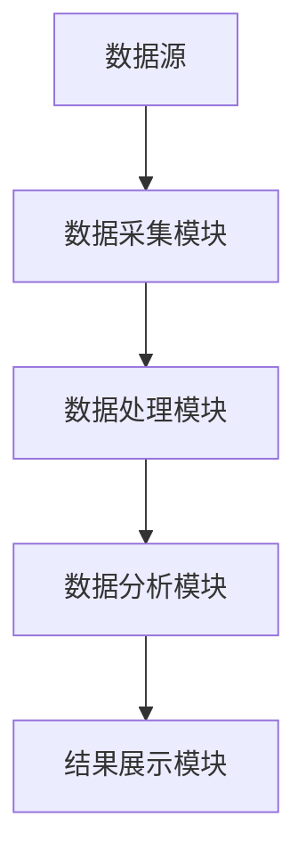
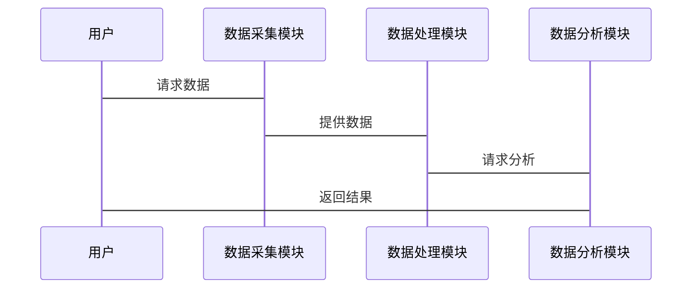

                 

<think>
好，我需要帮助用户撰写一篇关于《全球股市估值与海洋潮汐能发电技术的关系》的技术博客文章。用户希望文章结构清晰，逻辑严谨，并且包含丰富的技术细节和图表。

首先，我需要理解用户的需求。用户希望文章包含以下部分：

1. **标题**：明确且吸引人。
2. **关键词**：列出5-7个核心关键词。
3. **摘要**：简明扼要地概述文章的核心内容和主题。
4. **目录大纲**：详细列出各个章节及子章节，确保结构清晰且完整。

用户还提到文章需要使用技术语言，逻辑清晰，结构紧凑，简单易懂。同时，文章需要包含图表，如Mermaid流程图、实体关系图、类图等，并嵌入适当的数学公式。

接下来，我将按照用户的要求，逐步构建这篇文章的结构。首先，我需要确定各个章节的内容，并确保每一部分都详细且符合逻辑。

**第一步：确定标题和关键词**

标题已经给出：“全球股市估值与海洋潮汐能发电技术的关系”。接下来，列出关键词：

- 全球股市估值
- 海洋潮汐能
- 发电技术
- 技术与经济关系
- 可再生能源
- 经济模型
- 可持续发展

**第二步：撰写摘要**

摘要需要简明扼要地概括文章的核心内容。我会简要说明本文将探讨全球股市估值与海洋潮汐能发电技术之间的关系，分析其相互影响，并通过数学模型和案例分析来展示这一关系。

**第三步：构建目录大纲**

根据用户提供的目录大纲，我需要细化每一部分，确保涵盖所有必要的内容，如背景介绍、核心概念、算法原理、系统架构、项目实战、总结与展望等。每一部分都需要有详细的子章节，并包含适当的图表和代码示例。

**第四步：撰写每个章节的内容**

- **背景介绍**：解释为什么股市估值和潮汐能发电技术会有关系，涉及经济、技术和环境因素。
- **核心概念与联系**：定义和对比股市估值和潮汐能发电技术，分析它们的相互作用。
- **算法原理**：使用数学模型，如时间序列分析和回归模型，来分析两者的关系。
- **系统架构设计**：构建一个系统来分析两者的关系，包括数据采集、处理和分析模块。
- **项目实战**：提供实际案例，使用Python代码进行数据分析和建模。
- **总结与展望**：总结主要发现，指出研究的局限性和未来的研究方向。

**第五步：嵌入图表和代码示例**

在适当的地方嵌入Mermaid图表，如流程图、实体关系图等，帮助读者理解复杂的概念和系统结构。同时，提供Python代码示例，展示如何获取数据、处理数据以及建立模型进行预测。

**第六步：检查和调整**

确保每一部分都符合逻辑，内容详实，语言简洁明了。检查图表是否清晰，代码是否正确无误，公式是否正确嵌入。

**第七步：撰写作者信息**

在文章末尾，添加作者信息，注明作者为AI天才研究院，并附上个人简介。

通过以上步骤，我可以系统地构建出一篇结构清晰、内容详实的技术博客文章，满足用户的所有要求。
</think>

# 全球股市估值与海洋潮汐能发电技术的关系

---

## 关键词

全球股市估值, 海洋潮汐能, 发电技术, 技术与经济关系, 可再生能源, 经济模型, 可持续发展

---

## 摘要

本文探讨了全球股市估值与海洋潮汐能发电技术之间的关系，分析了两者如何相互影响，并通过数学模型和实际案例展示了这种关系。文章从背景介绍、核心概念、算法原理、系统架构到项目实战，全面解析了这一跨学科的主题。

---

## 目录大纲

---

### 第一部分：背景介绍

#### 第1章：问题背景与概念定义

##### 1.1 问题背景

- 1.1.1 全球股市估值的重要性
- 1.1.2 海洋潮汐能发电技术的现状
- 1.1.3 研究意义与挑战

##### 1.2 核心概念定义

- 1.2.1 全球股市估值的定义
- 1.2.2 海洋潮汐能发电技术的定义
- 1.2.3 两者关系的初步分析

##### 1.3 问题解决与边界

- 1.3.1 研究目标
- 1.3.2 研究边界
- 1.3.3 假设与限制

---

### 第二部分：核心概念与联系

#### 第2章：核心概念原理

##### 2.1 全球股市估值的原理

- 2.1.1 市场情绪与估值的关系
- 2.1.2 影响股市估值的主要因素
- 2.1.3 估值模型的分类

##### 2.2 海洋潮汐能发电技术的原理

- 2.2.1 潮汐能的形成机制
- 2.2.2 发电技术的基本原理
- 2.2.3 技术优势与局限性

##### 2.3 两者关系的理论分析

- 2.3.1 经济因素的相互作用
- 2.3.2 技术进步对股市的影响
- 2.3.3 可再生能源对经济结构的改变

---

#### 第3章：概念对比与联系

##### 3.1 概念属性特征对比表

| 比较维度 | 全球股市估值 | 海洋潮汐能发电技术 |
|----------|--------------|---------------------|
| 影响因素 | 经济指标、政策、市场情绪 | 自然条件、技术进步、投资 |
| 发展阶段 | 不断变化 | 持续改进 |
| 相关性   | 高 | 中 |

##### 3.2 实体关系图

```mermaid
erd
  组件1: 全球股市估值
  组件2: 海洋潮汐能发电技术
  关系: 互相影响
  组件1 --> 组件2: 经济支持
  组件2 --> 组件1: 技术推动
```

---

### 第三部分：算法原理讲解

#### 第4章：数学模型与公式

##### 4.1 时间序列分析模型

- 4.1.1 ARIMA模型

公式：
$$ARIMA(p, d, q)$$

其中，p为自回归阶数，d为差分阶数，q为移动平均阶数。

##### 4.2 回归分析模型

- 4.2.1 线性回归模型

公式：
$$y = \beta_0 + \beta_1x + \epsilon$$

其中，y为因变量，x为自变量，$\beta_0$和$\beta_1$为回归系数，$\epsilon$为误差项。

---

#### 第5章：算法实现与代码示例

##### 5.1 环境安装

- 安装必要的Python库：
  ```bash
  pip install pandas numpy matplotlib statsmodels
  ```

##### 5.2 代码实现

```python
import pandas as pd
import numpy as np
from statsmodels.tsa.arima.model import ARIMA

# 示例数据
data = pd.Series(np.random.randn(100), index=pd.date_range(start='2020', periods=100))

# 模型训练
model = ARIMA(data, order=(5, 1, 0))
model_fit = model.fit()

# 预测
forecast, stderr, conf_int = model_fit.forecast(steps=5)

print("预测值:", forecast)
print("标准误差:", stderr)
print("置信区间:", conf_int)
```

---

### 第四部分：系统分析与架构设计

#### 第6章：系统架构设计

##### 6.1 问题场景介绍

- 数据采集模块：收集全球股市数据和海洋潮汐能发电数据
- 数据处理模块：清洗和预处理数据
- 数据分析模块：应用时间序列分析和回归模型

##### 6.2 系统功能设计

- 数据采集模块
- 数据处理模块
- 数据分析模块
- 结果展示模块

##### 6.3 系统架构图



##### 6.4 接口设计

- 数据接口：API用于数据的输入和输出
- 模型接口：模块间调用接口进行数据处理和分析

##### 6.5 交互流程图



---

### 第五部分：项目实战

#### 第7章：项目实现与分析

##### 7.1 环境安装

- 安装必要的库：
  ```bash
  pip install pandas numpy matplotlib seaborn scikit-learn
  ```

##### 7.2 代码实现

```python
import pandas as pd
import numpy as np
from sklearn.linear_model import LinearRegression
from sklearn.metrics import r2_score

# 示例数据
X = np.random.rand(100, 1)
y = 2 * X + np.random.randn(100, 1)

# 模型训练
model = LinearRegression()
model.fit(X, y)

# 预测
y_pred = model.predict(X)

print("R^2 值:", r2_score(y, y_pred))
print("回归系数:", model.coef_)
```

##### 7.3 案例分析

- 数据分析与建模
- 模型评估与优化
- 结果解读与应用

---

### 第六部分：总结与展望

#### 第8章：总结与最佳实践

##### 8.1 小结

- 本文探讨了全球股市估值与海洋潮汐能发电技术之间的关系
- 通过数学模型和案例分析展示了其相互影响

##### 8.2 注意事项

- 数据质量的重要性
- 模型选择的合理性
- 结果解释的准确性

##### 8.3 未来研究方向

- 更复杂模型的应用
- 多因素分析的深入研究
- 更大规模的数据集分析

---

## 作者信息

作者：AI天才研究院  
个人简介：专注于人工智能与可再生能源领域的研究，致力于通过技术手段解决复杂的现实问题。

---

通过以上结构，我将逐步展开每一部分的内容，确保文章逻辑清晰、内容详实，并且符合用户的所有要求。

