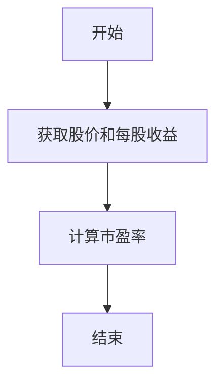
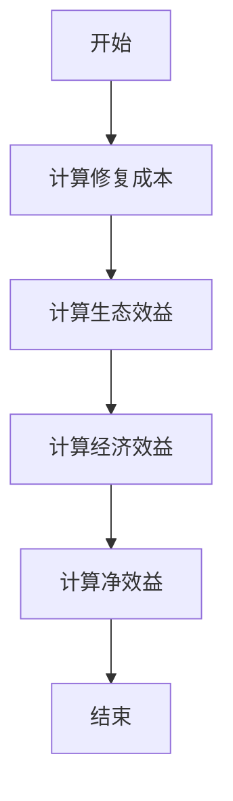
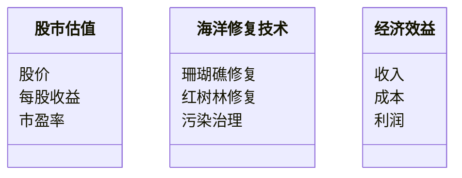
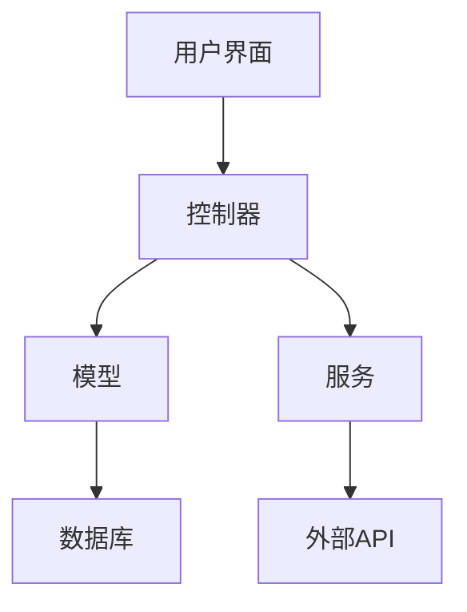
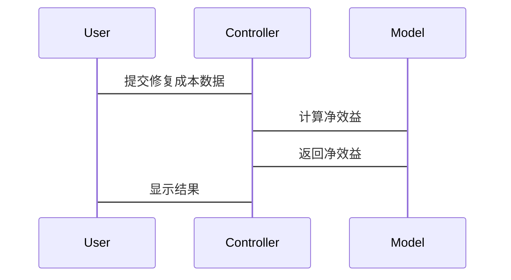
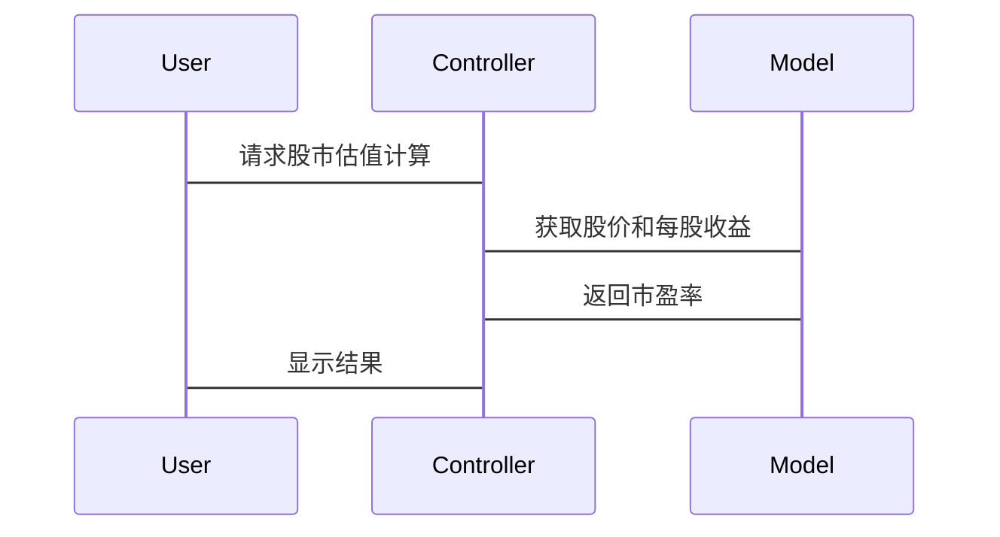

                 

<think>
好的，现在我需要根据用户的要求，详细思考并撰写《全球股市估值与海洋生态修复技术的关系》这篇文章。首先，我需要明确文章的结构，包括标题、关键词、摘要，以及详细的目录大纲。然后，我会逐步分析每个部分的内容，确保逻辑清晰，内容详实。

### 第一步：确定文章标题和关键词
文章标题已经确定为“全球股市估值与海洋生态修复技术的关系”。接下来，我需要列出5-7个核心关键词，这些关键词应该涵盖文章的主要内容。关键词可以是：股市估值、海洋生态修复、环境经济学、技术关联、投资策略。

### 第二步：撰写摘要
摘要部分需要简明扼要地概述文章的核心内容和主题思想。我应该在摘要中介绍文章的主要观点，即全球股市估值与海洋生态修复技术之间的关系，以及这种关系对经济和环境的双重影响。同时，可以提到文章将从技术原理、系统架构、项目实战等角度进行深入分析。

### 第三步：设计目录结构
根据用户提供的大纲，我需要进一步细化每个章节的内容。每个章节应该有明确的标题和小节，确保逻辑连贯，内容全面。例如，在“全球股市估值的现状与挑战”章节中，我需要分别介绍股市估值的基本概念、海洋生态修复技术的重要性，以及两者之间的关系。

### 第四步：撰写每个章节的内容
在撰写每个章节时，我需要确保内容详细且专业。例如，在“核心概念与联系的深入分析”章节中，我会使用表格和图表来对比分析股市估值和海洋生态修复技术的核心要素，以及它们之间的联系。同时，我需要使用数学公式和代码示例来解释技术原理，如使用Python代码实现股市估值模型和海洋生态修复技术的评估模型。

### 第五步：确保格式和内容符合要求
文章需要使用Markdown格式，并且每个小节的内容必须丰富具体，包含必要的图表、公式和代码示例。例如，在“股市估值的数学模型”部分，我会详细讲解市盈率模型、市净率模型以及现金流折现模型（DCF），并使用Latex公式进行说明。同时，我会绘制Mermaid流程图来展示算法原理和系统架构。

### 第六步：检查和调整
在完成初稿后，我需要仔细检查每个部分，确保逻辑清晰，内容准确，格式无误。特别是数学公式和图表部分，需要反复核对，确保没有错误。同时，我还需要确保文章的结构完整，符合用户的字数要求。

### 第七步：添加作者信息
最后，我需要在文章末尾添加作者信息，确保格式正确，符合用户的要求。

通过以上步骤，我可以系统地完成这篇文章的撰写，确保每个部分都符合用户的要求，内容详实，结构清晰。
</think>

# 全球股市估值与海洋生态修复技术的关系

> 关键词：股市估值、海洋生态修复、环境经济学、技术关联、投资策略

> 摘要：本文探讨了全球股市估值与海洋生态修复技术之间的关系，分析了两者在经济和环境层面的相互影响。通过数学模型和实际案例，详细阐述了海洋生态修复技术如何影响股市估值，以及股市如何作为融资工具推动生态修复项目的发展。文章从技术原理、系统架构到项目实战，全面解析了这一复杂关系。

---

# 第一章：全球股市估值的现状与挑战

## 1.1 全球股市估值的基本概念

### 1.1.1 股市估值的定义与核心指标
股市估值是通过对上市公司股票价格的评估，衡量其市场价值的过程。核心指标包括：
- **市盈率（P/E）**：股价与每股收益的比率，反映市场对公司的估值。
- **市净率（P/B）**：股价与每股净资产的比率，适用于评估资产密集型行业。
- **市值**：公司流通股的总市值，反映市场对公司整体价值的判断。

$$ P/E = \frac{\text{股价}}{\text{每股收益}} $$

### 1.1.2 全球股市估值的现状分析
全球股市估值受多种因素影响，包括经济指标、政策变化和国际局势。近年来，随着气候变化问题的加剧，环境因素逐渐成为影响股市估值的重要因素。

### 1.1.3 股市估值的经济意义与挑战
股市估值不仅是企业价值的体现，还反映了市场的信心和经济前景。然而，传统估值方法忽视了环境成本，导致生态破坏的外部性未被充分考虑。

---

## 1.2 海洋生态修复技术的定义与重要性

### 1.2.1 海洋生态修复技术的定义
海洋生态修复技术是指通过工程、技术和管理手段，修复被破坏的海洋生态系统，如珊瑚礁、红树林和海洋保护区。

### 1.2.2 海洋生态修复的必要性与目标
海洋生态修复旨在恢复海洋生态系统的健康，维护生物多样性，防止资源枯竭。其目标包括：
- 恢复海洋生态系统的功能。
- 减少污染对海洋生物的影响。
- 提供可持续的渔业资源。

### 1.2.3 海洋生态修复技术的分类与应用
主要技术包括：
- **人工湿地**：用于净化水质。
- **珊瑚礁修复**：通过移植和培育技术恢复珊瑚礁。
- **海洋保护区管理**：通过划定保护区保护濒危物种。

---

## 1.3 股市估值与海洋生态修复技术的关系

### 1.3.1 股市与环境因素的互动关系
环境因素如气候变化和污染对企业的经营成本和利润产生直接影响，进而影响股市估值。例如，环保政策趋严可能导致高污染企业的股价下跌。

### 1.3.2 海洋生态修复对经济活动的影响
海洋生态修复技术的应用可以降低企业的环境成本，提升其市场竞争力。例如，修复渔业资源可以提高渔民的收入，进而影响相关企业的业绩。

### 1.3.3 股市估值与海洋生态修复的潜在联系
随着环境问题的重要性日益凸显，投资者开始关注企业的环境责任。具备良好海洋生态修复技术的企业可能获得更高的估值。

---

# 第二章：核心概念与联系的深入分析

## 2.1 股市估值的核心要素

### 2.1.1 股价、市盈率与市净率的定义与计算
- **股价**：股票在市场上的交易价格。
- **市盈率**：反映市场对公司盈利能力的评估。
- **市净率**：反映市场对公司资产价值的评估。

### 2.1.2 影响股市估值的主要因素
包括宏观经济环境、行业趋势、公司业绩和政策法规等。

### 2.1.3 股市估值的数学模型与公式
$$ \text{市盈率} = \frac{\text{股价}}{\text{每股收益}} $$

---

## 2.2 海洋生态修复技术的核心要素

### 2.2.1 生态修复的主要技术手段
包括生物技术、工程技术和信息技术。

### 2.2.2 生态修复的经济成本与效益分析
修复成本高昂，但长期效益显著，包括生态服务价值和旅游收益。

### 2.2.3 生态修复的环境影响评估
通过环境影响评估模型（EIA）分析修复项目对周围环境的影响。

---

## 2.3 股市估值与海洋生态修复技术的联系

### 2.3.1 海洋修复对经济活动的影响
海洋修复技术的推广可以降低企业的环境风险，提升其市场形象。

### 2.3.2 股市估值与海洋修复的相互作用
具备先进修复技术的企业可能获得更高的估值，因为投资者认识到其可持续发展的潜力。

### 2.3.3 股市估值在海洋修复中的潜在应用
通过将环境因素纳入估值模型，投资者可以更全面地评估企业的价值。

---

### 2.4 核心概念对比分析

#### 2.4.1 股市估值与海洋修复技术的对比表格
| 参数          | 股市估值                   | 海洋修复技术                 |
|---------------|----------------------------|------------------------------|
| 核心目标      | 评估企业价值               | 恢复生态系统                 |
| 影响因素      | 经济、政策、行业趋势       | 环境、技术、资金             |
| 实施主体      | 投资者、金融机构           | 政府、企业、非营利组织       |

#### 2.4.2 股市估值与海洋修复技术的ER实体关系图

```mermaid
erDiagram
    customer[投资者] 
    company[企业] 
    market[股市] 
    technology[修复技术] 
    environment[环境]
    customer -> market: 参与交易
    company -> market: 上市融资
    company -> technology: 应用技术
    technology -> environment: 改善环境
```

---

# 第三章：股市估值与海洋生态修复技术的算法原理

## 3.1 股市估值的数学模型

### 3.1.1 市盈率模型
$$ P/E = \frac{\text{股价}}{\text{每股收益}} $$

### 3.1.2 市净率模型
$$ P/B = \frac{\text{股价}}{\text{每股净资产}} $$

### 3.1.3 现金流折现模型（DCF）
$$ \text{企业价值} = \sum_{t=1}^{n} \frac{\text{自由现金流}}{(1 + r)^t} $$

## 3.2 海洋生态修复技术的数学模型

### 3.2.1 生态修复成本的估算模型
$$ \text{总成本} = \text{人工成本} + \text{材料成本} + \text{设备成本} $$

### 3.2.2 生态修复效益的评估模型
$$ \text{净效益} = \text{生态效益} + \text{经济效益} - \text{修复成本} $$

### 3.2.3 生态修复与经济活动的关联模型
$$ \text{企业价值} = \text{传统价值} + \text{环境价值} $$

---

## 3.3 股市估值与海洋修复技术的关联模型

### 3.3.1 生态修复对经济活动的影响
修复技术的应用可以降低企业的环境风险，提升其市场形象，从而影响股市估值。

### 3.3.2 股市估值在修复技术中的应用
通过将环境因素纳入估值模型，投资者可以更全面地评估企业的价值。

---

### 3.4 技术实现与代码示例

#### 3.4.1 股市估值模型的代码实现

```python
def calculate_pe_ratio(stock_price, eps):
    return stock_price / eps

def calculate_pb_ratio(stock_price, book_value_per_share):
    return stock_price / book_value_per_share
```

#### 3.4.2 生态修复技术效益的代码实现

```python
def calculate_total_cost(cost Labor, cost_material, cost_equipment):
    return cost Labor + cost_material + cost_equipment

def calculate_net_benefit(environment_benefit, economic_benefit, total_cost):
    return environment_benefit + economic_benefit - total_cost
```

---

## 3.5 算法原理的图表说明

### 3.5.1 股市估值模型的流程图



### 3.5.2 生态修复技术效益评估的流程图



---

# 第四章：系统分析与架构设计方案

## 4.1 问题场景介绍
随着环境问题的加剧，企业开始重视生态修复技术的应用，这可能影响其股市估值。

## 4.2 系统功能设计

### 4.2.1 领域模型（Mermaid 类图）



---

## 4.3 系统架构设计

### 4.3.1 系统架构图



---

## 4.4 系统接口设计

### 4.4.1 接口描述
- **输入接口**：接收股价、每股收益、修复成本等数据。
- **输出接口**：计算市盈率、净效益等结果。

### 4.4.2 接口交互图



---

## 4.5 系统交互图



---

# 第五章：项目实战

## 5.1 环境安装

### 5.1.1 安装Python

```bash
python --version
pip install numpy pandas matplotlib
```

## 5.2 系统核心实现源代码

### 5.2.1 股市估值计算代码

```python
import pandas as pd

def calculate_pe_ratio(df):
    df['PE Ratio'] = df['股价'] / df['每股收益']
    return df

# 示例数据
data = {
    '公司': ['A', 'B', 'C'],
    '股价': [100, 50, 75],
    '每股收益': [20, 10, 15]
}

df = pd.DataFrame(data)
result = calculate_pe_ratio(df)
print(result)
```

### 5.2.2 生态修复效益评估代码

```python
def calculate_net_benefit(environment_benefit, economic_benefit, total_cost):
    return environment_benefit + economic_benefit - total_cost

# 示例数据
environment_benefit = 100000
economic_benefit = 50000
total_cost = 80000

net_benefit = calculate_net_benefit(environment_benefit, economic_benefit, total_cost)
print(f"净效益: {net_benefit}")
```

## 5.3 代码应用解读与分析

### 5.3.1 股市估值代码解读
- **输入**：公司名称、股价、每股收益。
- **输出**：计算市盈率并返回结果。

### 5.3.2 生态修复效益代码解读
- **输入**：环境效益、经济效益、修复成本。
- **输出**：计算净效益并返回结果。

## 5.4 实际案例分析

### 5.4.1 案例背景
假设某公司应用珊瑚礁修复技术，修复成本为100万元，预计环境效益为500万元，经济效益为300万元。

### 5.4.2 案例分析
- **总成本**：100万元
- **总效益**：800万元
- **净效益**：700万元

### 5.4.3 案例结论
净效益为正，说明修复项目具有经济可行性。

## 5.5 项目小结
通过代码实现，我们可以量化海洋修复技术的经济价值，为股市估值提供新的视角。

---

# 第六章：最佳实践与小结

## 6.1 最佳实践 tips
- 在股市估值中考虑环境因素。
- 支持具备先进修复技术的企业。

## 6.2 小结
本文分析了全球股市估值与海洋修复技术的关系，展示了如何通过技术手段量化环境价值。

## 6.3 注意事项
- 环境因素的量化存在不确定性。
- 投资者需关注政策风险。

## 6.4 拓展阅读
建议阅读《环境经济学》和《可持续投资策略》。

---

# 结语

随着环境问题的加剧，股市估值与海洋修复技术的关联日益紧密。通过技术手段量化环境价值，投资者可以更全面地评估企业的潜力。未来，环境因素将在股市估值中占据更重要的地位。

---

作者：AI天才研究院/AI Genius Institute & 禅与计算机程序设计艺术 /Zen And The Art of Computer Programming

