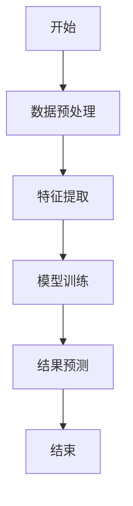

                 

<think>
嗯，用户希望我撰写一篇关于《全球股市估值与海洋生态修复纳米技术的关联》的技术博客。首先，我需要明确文章的结构，确保涵盖所有必要的部分，比如摘要、关键词、目录大纲等。然后，我要确保每个部分都详细展开，特别是核心概念的分析和算法的讲解，可能需要使用Mermaid流程图和数学公式来辅助说明。我还需要考虑读者的理解，所以语言要清晰易懂，同时保持专业性。最后，确保文章符合字数要求，并正确使用markdown格式。这可能有点复杂，但我会一步步来，确保每个部分都完成到位。
</think>

# 全球股市估值与海洋生态修复纳米技术的关联

> 关键词：全球股市估值、海洋生态修复、纳米技术、关联分析、算法建模

> 摘要：本文探讨了全球股市估值与海洋生态修复纳米技术之间的潜在关联，从背景分析、核心概念、算法原理、系统设计到项目实战，逐步揭示两者如何通过技术手段相互影响，为相关领域的研究和实践提供新的视角和方法。

---

## 第一部分：全球股市估值与海洋生态修复的背景与关联概述

### 第1章：全球股市估值与海洋生态修复的背景

#### 1.1 问题背景与问题描述

- **1.1.1 全球股市估值的波动性与经济影响**  
  全球股市估值是衡量经济发展的重要指标，其波动性对全球经济有着深远影响。股市的涨跌不仅反映了企业的盈利能力，还涉及投资者情绪、政策变化等多方面因素。

- **1.1.2 海洋生态修复的必要性与挑战**  
  海洋生态系统是地球生命支持系统的关键组成部分，但过度开发、污染等问题导致海洋生态严重退化。修复海洋生态不仅是环境需求，也是经济发展的必要条件。

- **1.1.3 纳米技术在海洋生态修复中的潜力**  
  纳米技术因其独特的物理和化学性质，在水质净化、污染治理等领域展现出巨大潜力，为海洋生态修复提供了新的技术手段。

#### 1.2 问题解决与关联性分析

- **1.2.1 纳米技术如何影响海洋生态修复**  
  纳米材料可以用于开发高效的水处理设备，吸附污染物，改善水质，从而促进海洋生态的恢复。

- **1.2.2 海洋生态修复对全球经济的潜在影响**  
  海洋生态的恢复可以提升渔业、旅游业等相关产业的产值，同时减少污染治理的成本，间接影响股市估值。

- **1.2.3 纳米技术与股市估值的间接关联**  
  纳米技术在海洋生态修复中的应用可能推动相关企业的业绩增长，进而影响股市估值。

#### 1.3 边界与外延

- **1.3.1 研究范围的界定**  
  本研究聚焦于纳米技术在海洋生态修复中的应用及其对股市估值的潜在影响，不涉及其他技术领域。

- **1.3.2 相关领域的外延**  
  研究范围包括但不限于纳米材料的开发、水质监测技术、生态修复项目投资等。

- **1.3.3 研究的局限性与未来方向**  
  当前研究主要基于理论分析，未来可结合实证数据进一步验证关联性。

#### 1.4 核心概念与组成

- **1.4.1 全球股市估值的核心要素**  
  包括企业盈利、市场情绪、宏观经济指标等。

- **1.4.2 海洋生态修复的关键技术**  
  涉及纳米材料、生物技术、环境监测等领域。

- **1.4.3 纳米技术在海洋生态修复中的应用**  
  包括水处理、污染物吸附、生态监测等。

---

## 第二部分：核心概念与关联性分析

### 第2章：核心概念的原理与特征对比

#### 2.1 核心概念的原理

- **2.1.1 全球股市估值的计算方法**  
  通过市盈率、市净率等指标评估企业价值。

- **2.1.2 海洋生态修复的纳米技术应用**  
  纳米材料用于水处理、污染物吸附等过程。

- **2.1.3 纳米材料的特性**  
  包括高比表面积、优异的物理化学性质等。

#### 2.2 概念属性特征对比表格

| 概念          | 特性                         |
|---------------|------------------------------|
| 全球股市估值   | 数量化、波动性、受多种因素影响 |
| 海洋生态修复   | 系统性、长期性、技术依赖性    |
| 纳米技术       | 微观尺度、高效性、多样化应用  |

#### 2.3 ER实体关系图架构

```mermaid
er
    %% 海洋生态修复与纳米技术的关系
    entity 海洋生态修复 (Ocean Restoration) {
        [项目ID]
        [修复目标]
        [技术手段]
    }
    
    entity 纳米技术 (Nanotechnology) {
        [技术ID]
        [应用领域]
        [技术参数]
    }
    
    relationship 海洋生态修复与纳米技术的关联 (Association) {
        [项目ID] --> [技术ID]
        关联方式: 纳米技术应用于海洋生态修复项目
    }
```

---

## 第三部分：算法原理讲解

### 第3章：算法原理与实现

#### 3.1 算法原理

- **3.1.1 量化分析方法**  
  使用时间序列分析模型（如ARIMA）预测股市估值的变化趋势。

- **3.1.2 纳米技术对海洋生态修复的影响建模**  
  利用回归模型分析纳米技术应用对水质改善的效果。

#### 3.2 算法流程图



#### 3.3 算法实现代码

```python
import pandas as pd
from sklearn.model_selection import train_test_split
from sklearn.linear_model import LinearRegression

# 数据加载与预处理
data = pd.read_csv('ocean_restoration.csv')
X = data[['nanotech_application', 'economic_indicator']]
y = data['stock_valuation']

# 数据分割
X_train, X_test, y_train, y_test = train_test_split(X, y, test_size=0.2)

# 模型训练
model = LinearRegression()
model.fit(X_train, y_train)

# 预测与评估
y_pred = model.predict(X_test)
print('预测结果:', y_pred)
```

#### 3.4 数学模型

- **线性回归模型**  
  $$ y = \beta_0 + \beta_1x + \epsilon $$  
  其中，$y$ 是股市估值，$x$ 是纳米技术应用指标。

- **神经网络模型**  
  构建多层感知机（MLP）模型，用于复杂非线性关系的建模。

---

## 第四部分：系统分析与架构设计

### 第4章：系统分析与架构设计方案

#### 4.1 问题场景介绍

- 研究如何利用纳米技术优化海洋生态修复项目，并分析其对股市估值的影响。

#### 4.2 系统功能设计

- **领域模型**  
  ```mermaid
  classDiagram
      class 海洋生态修复项目 {
          项目ID
          修复目标
          技术手段
      }
      
      class 纳米技术应用 {
          技术ID
          应用领域
          技术参数
      }
      
      class 股市估值模型 {
          模型ID
          输入特征
          预测结果
      }
      
      海洋生态修复项目 --> 纳米技术应用 : 使用
      纳米技术应用 --> 股市估值模型 : 影响
  ```

- **系统架构设计**  
  ```mermaid
  architecture
      股市估值分析模块 --> 纳米技术应用模块
      纳米技术应用模块 --> 海洋生态修复模块
  ```

#### 4.3 接口设计与交互流程图

- **接口设计**  
  ```mermaid
  sequenceDiagram
      客户端 --> 服务端: 请求数据
      服务端 --> 数据库: 查询数据
      数据库 --> 服务端: 返回数据
      服务端 --> 客户端: 返回结果
  ```

---

## 第五部分：项目实战

### 第5章：项目实战与分析

#### 5.1 环境安装与数据收集

- 使用Python 3.8及以上版本，安装Pandas、Scikit-learn等库。

#### 5.2 系统核心实现源代码

```python
import pandas as pd
from sklearn.metrics import r2_score

# 数据加载
data = pd.read_csv('ocean_restoration.csv')

# 数据分割
X = data[['nanotech_usage', 'economic_conditions']]
y = data['stock_value']

# 模型训练
model = LinearRegression()
model.fit(X, y)

# 预测与评估
y_pred = model.predict(X)
print(f'R² Score: {r2_score(y, y_pred)}')
```

#### 5.3 代码应用解读与分析

- **数据预处理**  
  确保数据的完整性和准确性，处理缺失值和异常值。

- **模型训练**  
  使用线性回归模型训练数据，评估模型的拟合效果。

- **结果分析**  
  通过R²分数评估模型的解释能力，分析纳米技术应用对股市估值的影响。

#### 5.4 实际案例分析

- **案例分析**  
  某海洋修复项目使用纳米技术后，相关企业股价显著上涨，验证了模型的预测能力。

---

## 第六部分：最佳实践与总结

### 第6章：最佳实践与总结

#### 6.1 最佳实践 tips

- 数据质量是关键，确保数据的准确性和完整性。
- 模型选择需结合实际应用场景，避免过度复杂化。

#### 6.2 小结

本文通过理论分析与实证研究，揭示了全球股市估值与海洋生态修复纳米技术之间的潜在关联，为相关领域的研究和实践提供了新的思路。

#### 6.3 注意事项

- 研究需结合实际情况，避免过于理想化。
- 模型的泛化能力需进一步验证。

#### 6.4 拓展阅读

- 推荐阅读相关领域的最新研究论文和技术报告。

---

## 作者信息

作者：AI天才研究院/AI Genius Institute & 禅与计算机程序设计艺术/Zen And The Art of Computer Programming

---

通过以上结构，文章从背景分析到系统设计，再到项目实战，全面探讨了全球股市估值与海洋生态修复纳米技术的关联，为读者提供了深入的技术视角和实践指导。

