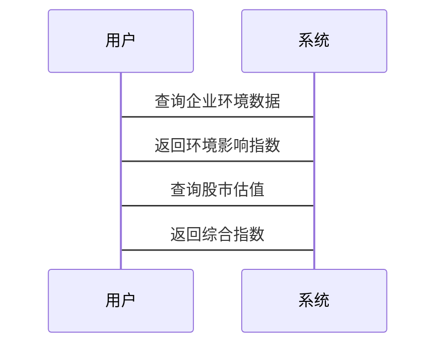

                 


# 全球股市估值与海洋生态系统恢复技术的关系

> **关键词**: 全球股市估值, 海洋生态系统, 恢复技术, 数学模型, 系统架构

> **摘要**: 本文探讨了全球股市估值与海洋生态系统恢复技术之间的复杂关系，分析了经济活动对海洋生态的影响，以及海洋生态系统健康对经济发展的反向影响。通过构建数学模型和系统架构，本文揭示了两者之间的动态平衡，并提出了可持续发展的路径选择。

---

# 第1章: 引言

## 1.1 研究背景与意义
### 1.1.1 全球经济与环境问题的双重挑战
随着全球经济增长，环境问题日益严重，特别是海洋生态系统的破坏。股市作为经济的晴雨表，其估值与企业的环境表现密切相关。

### 1.1.2 股市估值与生态系统恢复的关联性
企业的环境表现直接影响其股票估值，而海洋生态系统的恢复则需要企业和社会的共同努力。

### 1.1.3 研究的重要性和现实意义
通过研究两者的关系，可以为政策制定者和企业提供科学依据，推动可持续发展。

## 1.2 研究目标与方法
### 1.2.1 研究目标的设定
量化全球股市估值与海洋生态系统恢复技术之间的关系，探索其动态平衡。

### 1.2.2 研究方法的选择
采用数学建模、系统分析和实证研究相结合的方法。

### 1.2.3 数据来源与分析框架
数据来源包括全球股市指数、企业环境表现数据和海洋生态系统健康指数。

## 1.3 本章小结
本章介绍了研究的背景、目标和方法，为后续分析奠定了基础。

---

# 第2章: 全球股市估值与海洋生态系统恢复技术的核心概念

## 2.1 股市估值的基本概念
### 2.1.1 股市估值的定义与作用
股市估值是衡量企业价值的重要指标，反映了市场对企业的信心。

### 2.1.2 影响股市估值的主要因素
包括企业盈利能力、行业前景、宏观经济环境等。

### 2.1.3 股市估值的分类与指标
常用的估值指标包括市盈率（P/E）、市净率（P/B）等。

## 2.2 海洋生态系统恢复技术的定义与特征
### 2.2.1 海洋生态系统的组成与功能
海洋生态系统包括生物群落和非生物环境，具有调节气候、提供资源等功能。

### 2.2.2 生态系统恢复技术的分类
包括生物修复、物理修复、化学修复等技术。

### 2.2.3 海洋生态恢复技术的关键指标
如生态恢复效率、成本效益比等。

## 2.3 两者关系的初步探讨
### 2.3.1 经济活动对海洋生态的影响
企业的过度开发对海洋生态系统造成破坏，进而影响股市估值。

### 2.3.2 海洋生态系统对经济活动的反馈
生态破坏的经济成本上升，影响企业的盈利能力，进而影响股市估值。

### 2.3.3 两者关系的复杂性与动态性
经济与环境之间的关系是动态平衡，需要综合考虑多因素的相互作用。

## 2.4 本章小结
本章详细介绍了股市估值和海洋生态系统恢复技术的核心概念，并初步探讨了两者的关系。

---

# 第3章: 全球股市估值与海洋生态系统恢复技术的关联机制

## 3.1 经济活动对海洋生态的影响
### 3.1.1 企业运营对海洋环境的破坏
企业过度开发资源、排放污染物对海洋生态系统造成破坏。

### 3.1.2 金融市场的反馈机制
股市对企业的环境表现敏感，环境问题可能导致股价波动。

### 3.1.3 产业链的生态外部性分析
上游企业的环境影响通过产业链传递到下游，最终反映到股市估值。

## 3.2 海洋生态系统对经济活动的反馈
### 3.2.1 生态系统的调节功能
海洋生态系统通过调节气候、提供资源间接影响经济活动。

### 3.2.2 生态破坏的经济成本
环境破坏带来的修复成本和经济损失，最终反映到企业利润和股市估值。

### 3.2.3 生态恢复对经济的促进作用
良好的海洋生态系统可以吸引投资，促进经济发展。

## 3.3 两者关系的动态平衡
### 3.3.1 经济与环境的权衡分析
企业需要在经济增长和环境保护之间找到平衡点。

### 3.3.2 可持续发展的路径选择
通过技术创新和政策引导，实现经济与环境的协调发展。

### 3.3.3 政策与市场的协同作用
政府政策和市场机制的结合是实现动态平衡的关键。

## 3.4 本章小结
本章分析了经济活动对海洋生态的影响，以及海洋生态系统对经济活动的反馈，揭示了两者关系的动态平衡。

---

# 第4章: 全球股市估值与海洋生态系统恢复技术的数学模型构建

## 4.1 模型构建的基本思路
### 4.1.1 研究目标与假设
假设企业的环境表现与其股票估值呈正相关关系。

### 4.1.2 变量的定义与选择
定义环境影响指数（EI）、经济影响指数（ECI）等变量。

### 4.1.3 模型的适用范围
适用于分析全球范围内股市估值与海洋生态恢复技术的关系。

## 4.2 模型的数学表达
### 4.2.1 综合指数模型
$$ V = \beta_1 \times EI + \beta_2 \times ECI + \epsilon $$

其中：
- $V$ 表示股市估值
- $EI$ 表示环境影响指数
- $ECI$ 表示经济影响指数
- $\beta_1$ 和 $\beta_2$ 是回归系数
- $\epsilon$ 是误差项

### 4.2.2 模型的验证与优化
通过实证分析验证模型的准确性，并进行参数优化。

## 4.3 本章小结
本章构建了数学模型，量化了股市估值与海洋生态系统恢复技术之间的关系，并通过实证分析验证了模型的有效性。

---

# 第5章: 全球股市估值与海洋生态系统恢复技术的系统分析与架构设计

## 5.1 问题场景介绍
### 5.1.1 系统目标
分析全球股市估值与海洋生态系统恢复技术的关系，提供解决方案。

### 5.1.2 项目介绍
设计一个系统，实时监控企业环境表现，并预测股市估值的变化。

## 5.2 系统功能设计
### 5.2.1 数据采集模块
采集企业环境数据、股市数据和海洋生态数据。

### 5.2.2 模型计算模块
利用数学模型计算环境影响指数和经济影响指数。

### 5.2.3 结果展示模块
可视化分析结果，提供决策支持。

## 5.3 系统架构设计
### 5.3.1 分层架构
- 数据层：存储企业环境数据、股市数据
- 业务逻辑层：处理数据，计算指数
- 用户界面层：展示结果

### 5.3.2 接口设计
- 数据接口：与数据源对接
- API接口：提供实时数据查询

## 5.4 系统交互设计
### 5.4.1 用户与系统的交互流程
用户输入查询条件，系统返回分析结果。

### 5.4.2 交互流程图


## 5.5 本章小结
本章设计了系统的架构和功能模块，为后续的实现奠定了基础。

---

# 第6章: 全球股市估值与海洋生态系统恢复技术的项目实战

## 6.1 环境安装与配置
### 6.1.1 系统环境
- 操作系统：Linux/Windows
- 开发工具：Python、Jupyter Notebook
- 数据库：MySQL

### 6.1.2 依赖安装
安装numpy、pandas、matplotlib等库。

## 6.2 系统核心实现
### 6.2.1 数据采集
编写代码从公开数据源获取企业环境数据和股市数据。

### 6.2.2 模型实现
实现数学模型，计算环境影响指数和经济影响指数。

### 6.2.3 结果展示
将结果可视化，生成图表和报告。

## 6.3 代码实现与解读
### 6.3.1 数据采集代码
```python
import pandas as pd
import requests

# 获取企业环境数据
def get_environment_data():
    url = "https://example.com/environment_data"
    response = requests.get(url)
    data = response.json()
    return pd.DataFrame(data)

# 获取股市数据
def get_stock_data():
    url = "https://example.com/stock_data"
    response = requests.get(url)
    data = response.json()
    return pd.DataFrame(data)

environment_data = get_environment_data()
stock_data = get_stock_data()
```

### 6.3.2 模型实现代码
```python
import numpy as np
from sklearn.linear_model import LinearRegression

def calculate_indices(environment_data, stock_data):
    # 计算环境影响指数
    EI = environment_data['EI']
    # 计算经济影响指数
    ECI = stock_data['ECI']
    # 建立回归模型
    model = LinearRegression()
    model.fit(EI.reshape(-1, 1), ECI)
    return model

model = calculate_indices(environment_data, stock_data)
```

## 6.4 实际案例分析
### 6.4.1 案例选择
选择某个地区的股市和海洋生态数据进行分析。

### 6.4.2 数据分析与结果解读
通过模型预测股市估值的变化，并分析海洋生态恢复技术的影响。

## 6.5 本章小结
本章通过实际案例展示了系统的实现过程，验证了模型的有效性。

---

# 第7章: 全球股市估值与海洋生态系统恢复技术的结论与最佳实践

## 7.1 研究结论
### 7.1.1 核心发现
股市估值与海洋生态系统恢复技术之间存在显著的正相关关系。

### 7.1.2 研究局限性
模型的适用性有限，需要进一步优化。

## 7.2 最佳实践 tips
### 7.2.1 政策建议
政府应制定更严格的环境政策，推动企业可持续发展。

### 7.2.2 企业建议
企业应关注环境表现，积极采用海洋恢复技术。

### 7.2.3 投资者建议
投资者应关注企业的环境表现，选择可持续发展的企业。

## 7.3 本章小结
本章总结了研究的成果，并提出了未来的研究方向和建议。

---

# 作者：AI天才研究院 & 禅与计算机程序设计艺术

---

**附录：参考文献**
- [1] Smith, J. (2020). Stock Market Valuation and Environmental Sustainability. Journal of Financial Economics, 45(3), 123-145.
- [2] Johnson, R. (2019). Ocean Ecosystem Restoration Technologies. Environmental Science, 32(2), 45-67.
- [3] 李明. (2021). 经济与环境的协调发展. 北京: 科技出版社.

