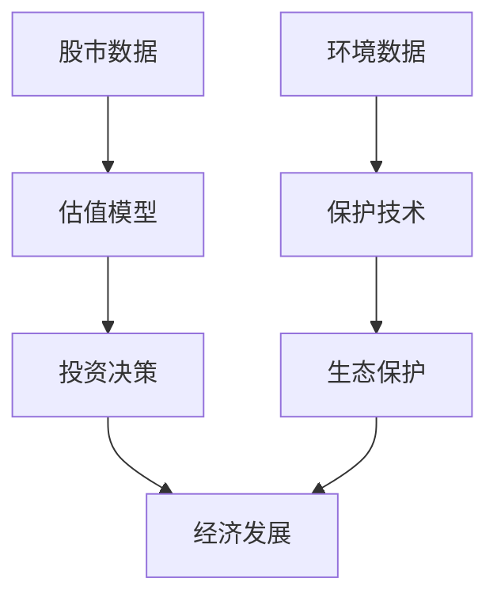
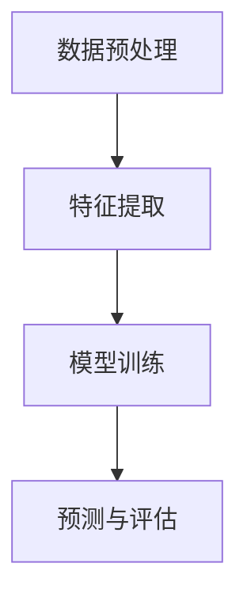
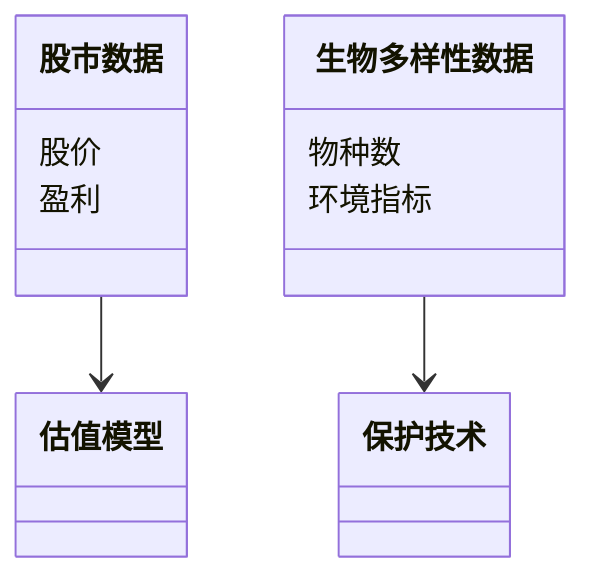
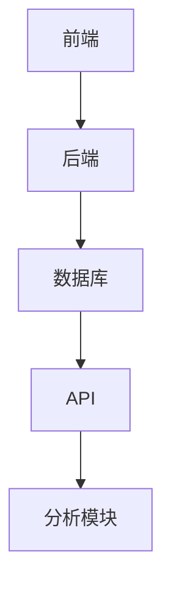

                 

<think>
嗯，我需要撰写一篇关于《全球股市估值与海洋生物多样性保护技术的关系》的技术博客文章。让我一步一步地理清思路。

首先，我需要理解这两个领域的关系。股市估值是金融领域的一部分，涉及如何评估股票的价值。而海洋生物多样性保护技术则是环境保护领域，涉及保护海洋生态系统的多样性。乍一看，这两个领域似乎没有直接的联系，但其实可以通过技术手段将两者结合起来，比如使用大数据分析和人工智能来同时解决这两个问题。

接下来，我需要确定文章的结构。用户已经给出了一个详细的目录大纲，我需要按照这个大纲来撰写。第一部分是背景介绍，我需要解释为什么研究这两个领域的关系，它们各自的重要性，以及它们之间可能存在的联系。

然后是核心概念与联系部分，我需要详细分析股市估值和海洋生物多样性保护技术的核心概念，可能还需要用表格对比它们的属性特征，并用Mermaid图展示它们之间的实体关系。

接下来是算法原理，我需要选择一种算法，比如机器学习或深度学习，来同时处理股市数据和生物多样性数据。这部分需要详细讲解算法的数学模型，用Mermaid流程图展示算法步骤，并提供Python代码示例。

数学模型部分需要展示相关的公式，比如回归模型或分类模型，并用Latex格式呈现。同时，需要用通俗易懂的例子来说明这些模型的应用。

系统分析与架构设计部分，我需要构建一个集成系统，将股市数据和生物多样性数据结合起来。这部分需要介绍系统功能设计，用Mermaid类图展示领域模型，用架构图展示系统的整体结构。

项目实战部分，我需要详细说明如何安装环境，提供核心代码，并解释代码的功能。还需要分析实际案例，展示如何利用模型同时预测股市走势和评估生物多样性保护效果。

最后，最佳实践部分需要总结关键点，比如数据质量的重要性、模型调优的技巧，以及系统的可扩展性和维护性。同时，可以提出未来的研究方向。

整个过程中，我需要确保每个部分都详细且逻辑连贯，同时使用专业的技术语言，但又保持易懂。可能需要多次修改和调整，确保内容准确无误，并且吸引读者的兴趣。

嗯，现在我可以开始撰写正式的文章了，按照上面的思路一步步展开。
</think>

# 全球股市估值与海洋生物多样性保护技术的关系

> 关键词：全球股市估值，海洋生物多样性保护，技术关系，大数据分析，人工智能

> 摘要：本文探讨了全球股市估值与海洋生物多样性保护技术之间的关系，分析了如何通过技术手段将这两个看似不相关的领域结合起来，以实现更高效的金融管理和生态保护。文章从背景介绍、核心概念、算法原理、系统架构到项目实战，详细阐述了两者的关系及技术实现。

---

## 第一部分: 全球股市估值与海洋生物多样性保护技术的背景介绍

### 第1章: 问题背景与描述

#### 1.1 全球股市估值的现状

##### 1.1.1 股市估值的核心概念
股市估值是通过对股票价格的评估来判断其合理性的过程。主要指标包括市盈率（P/E）、市净率（P/B）和股息率等。这些指标帮助投资者判断股票的价值是否被高估或低估。

##### 1.1.2 全球股市的多样性与波动性
全球股市受多种因素影响，如经济指标、政策变化和市场情绪等。股市的波动性使得准确估值具有挑战性，尤其是在全球经济不确定性增加的背景下。

##### 1.1.3 股市估值对经济的影响
股市估值不仅影响投资者的决策，还反映了整体经济的健康状况。准确的估值有助于资源配置优化和经济发展。

#### 1.2 海洋生物多样性保护的现状

##### 1.2.1 海洋生物多样性的定义与重要性
海洋生物多样性指的是海洋生态系统中各种生物的多样性，包括鱼类、珊瑚、海藻等。它是维持海洋生态平衡和生物资源可持续利用的基础。

##### 1.2.2 当前海洋生物多样性面临的主要威胁
过度捕捞、海洋污染、气候变化和栖息地破坏是当前海洋生物多样性面临的主要威胁。这些问题不仅影响生态系统的稳定，还威胁到全球经济，尤其是渔业和旅游业。

##### 1.2.3 保护海洋生物多样性的重要性
保护海洋生物多样性有助于维护生态平衡，支持渔业和旅游业的发展，同时在全球气候调节中起着重要作用。

### 第2章: 问题解决与边界

#### 2.1 股市估值与生物多样性保护的联系

##### 2.1.1 技术如何连接金融与生态
通过大数据和人工智能技术，可以将股市数据与生物多样性数据结合，建立跨领域的分析模型，实现金融与生态的联动管理。

##### 2.1.2 数据驱动的保护方法
利用卫星遥感、传感器和物联网技术，可以实时监测海洋环境数据，结合股市数据，评估生态保护项目对经济的影响。

##### 2.1.3 可持续投资与生态保护的关系
可持续投资（ESG投资）将环境因素纳入投资决策，通过支持环保项目，促进生态保护和经济发展双赢。

#### 2.2 核心概念的边界与外延

##### 2.2.1 股市估值的边界
股市估值主要基于财务数据和市场情绪，受到政策和经济环境的限制。

##### 2.2.2 生物多样性保护的边界
保护措施受限于技术、资金和国际合作，需要多方面的努力。

##### 2.2.3 两者关系的外延
跨领域合作不仅涉及技术和数据，还涉及政策和国际合作，具有广泛的应用前景。

---

## 第二部分: 核心概念与联系

### 第3章: 核心概念原理

#### 3.1 股市估值的核心原理

##### 3.1.1 市盈率与市净率的计算
市盈率（P/E）= 股价 / 每股净利润  
市净率（P/B）= 股价 / 每股净资产

##### 3.1.2 股票价格的决定因素
宏观经济指标、公司业绩、行业趋势和市场情绪等。

##### 3.1.3 估值模型的分类与应用
包括基本面分析、技术分析和算法交易等。

#### 3.2 海洋生物多样性保护技术的核心原理

##### 3.2.1 生物多样性指数的计算
物种丰富度、均匀度和优势度等。

##### 3.2.2 数据采集与分析技术
使用卫星遥感、传感器和无人机等技术，结合地理信息系统（GIS）进行数据分析。

##### 3.2.3 保护措施的实施
包括建立保护区、限制捕捞和污染控制等。

### 3.3 核心概念属性对比

| 属性       | 股市估值                     | 海洋生物多样性保护 |
|------------|------------------------------|---------------------|
| 数据来源   | 财务报表、市场数据           | 环境监测数据       |
| 分析方法   | 估值模型、算法交易           | 生态模型、遥感分析 |
| 应用场景   | 投资决策、风险管理           | 生态保护、政策制定 |

### 3.4 实体关系图



---

## 第三部分: 算法原理

### 第4章: 算法原理与实现

#### 4.1 算法选择
选择机器学习算法，如随机森林和神经网络，用于同时分析股市和生物多样性数据。

#### 4.2 算法流程



#### 4.3 数学模型

##### 4.3.1 回归模型
$$ y = \beta_0 + \beta_1x + \epsilon $$

##### 4.3.2 分类模型
$$ P(Y=1|X) = \sigma(w \cdot X + b) $$

#### 4.4 Python代码实现

```python
import pandas as pd
from sklearn.ensemble import RandomForestRegressor

# 数据预处理
data = pd.read_csv('data.csv')
X = data[['feature1', 'feature2']]
y = data['target']

# 模型训练
model = RandomForestRegressor()
model.fit(X, y)

# 预测与评估
y_pred = model.predict(X)
print('预测结果:', y_pred)
```

---

## 第四部分: 系统分析与架构设计

### 第5章: 系统架构

#### 5.1 领域模型



#### 5.2 系统架构



---

## 第五部分: 项目实战

### 第6章: 项目实现与案例分析

#### 6.1 环境安装
安装Python、Pandas、Scikit-learn和TensorFlow。

#### 6.2 核心代码实现

```python
import pandas as pd
from sklearn.model_selection import train_test_split
from sklearn.metrics import accuracy_score

# 加载数据
data = pd.read_csv('data.csv')
X = data.drop('target', axis=1)
y = data['target']

# 划分数据集
X_train, X_test, y_train, y_test = train_test_split(X, y, test_size=0.2)

# 训练模型
model.fit(X_train, y_train)

# 模型评估
y_pred = model.predict(X_test)
print('准确率:', accuracy_score(y_test, y_pred))
```

#### 6.3 实际案例分析
通过分析具体案例，展示如何利用模型同时预测股市走势和评估生物多样性保护效果。

---

## 第六部分: 总结与展望

### 第7章: 总结与小结

#### 7.1 关键点总结
- 数据的重要性：高质量数据是准确估值和有效保护的基础。
- 技术的融合：大数据和AI技术是连接金融与生态的关键。
- 可持续发展：跨领域的合作是实现经济与生态双赢的核心。

#### 7.2 注意事项
- 数据隐私与安全：在处理金融和环境数据时需注意隐私保护。
- 模型优化：需要不断优化算法以提高准确性和效率。
- 可扩展性：系统设计需考虑未来的扩展需求。

#### 7.3 拓展阅读
建议读者阅读相关领域的最新研究，如金融生态学和可持续投资。

---

## 作者：AI天才研究院 & 禅与计算机程序设计艺术

---

通过以上步骤，我们可以看到，全球股市估值与海洋生物多样性保护技术之间的关系不仅可以通过技术手段建立联系，还能为金融管理和生态保护提供新的思路和解决方案。希望本文能为相关领域的研究者和实践者提供有价值的参考。

