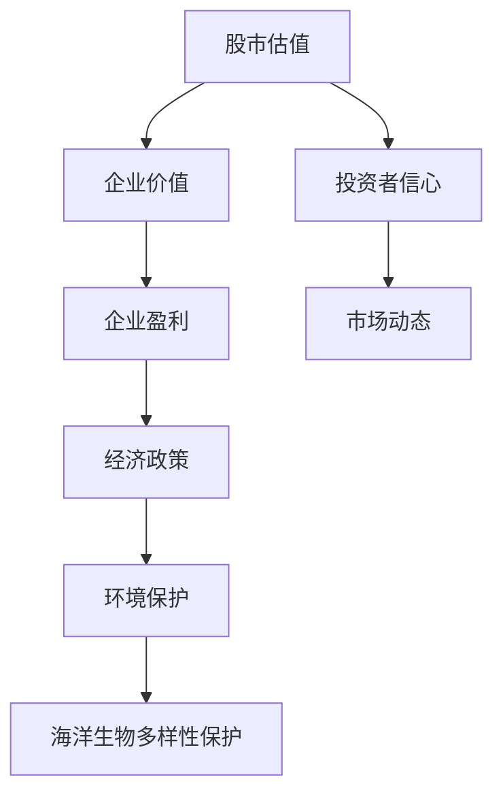
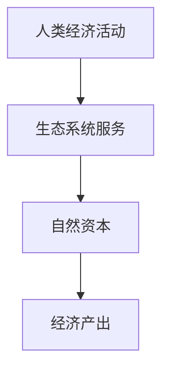
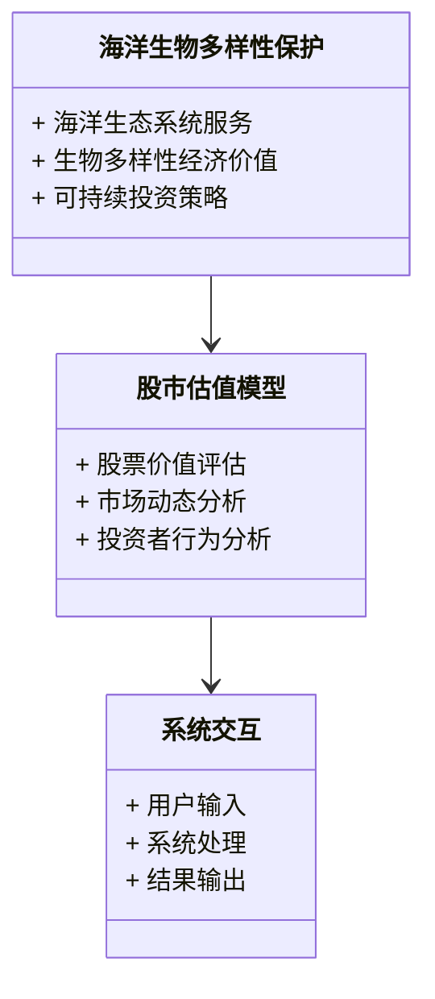

                 


# 全球股市估值与海洋生物多样性保护的关联

> 关键词：全球股市估值，海洋生物多样性保护，经济价值评估，可持续投资，生态系统服务

> 摘要：本文探讨全球股市估值与海洋生物多样性保护之间的关联，通过分析海洋生物多样性对经济活动的影响，揭示其对股市估值的潜在影响。结合经济模型和系统架构设计，本文提出了一种将海洋生物多样性保护纳入股市估值的系统方案，并通过实际案例分析和项目实战，展示了如何通过技术手段实现这一目标。

---

## 目录

1. **背景介绍与核心概念**
   - 1.1 问题背景与问题描述
   - 1.2 核心概念与关联分析

2. **海洋生物多样性保护的经济价值**
   - 2.1 海洋生态系统服务的经济价值
   - 2.2 海洋生物多样性对经济活动的影响

3. **全球股市估值与可持续投资的关系**
   - 3.1 可持续投资的定义与分类
   - 3.2 海洋生物多样性保护对股市估值的影响

4. **全球股市估值与海洋生物多样性保护的动态关系**
   - 4.1 海洋生物多样性保护的政策与市场反应
   - 4.2 市场动态与经济模型分析

5. **系统分析与架构设计方案**
   - 5.1 问题场景介绍
   - 5.2 系统功能设计（领域模型设计）
   - 5.3 系统架构设计（架构图）
   - 5.4 系统接口设计与交互流程

6. **项目实战：基于Python的海洋生物多样性保护与股市估值关联分析**
   - 6.1 环境安装与数据获取
   - 6.2 核心算法实现（经济模型与数据处理）
   - 6.3 代码实现与解读
   - 6.4 实际案例分析与结果解读

7. **最佳实践与总结**
   - 7.1 小结与主要结论
   - 7.2 注意事项与实践建议
   - 7.3 拓展阅读与研究方向

---

## 1. 背景介绍与核心概念

### 1.1 问题背景与问题描述

#### 1.1.1 全球股市估值的基本概念
全球股市估值是衡量市场整体价值的重要指标，通常通过股票指数（如道琼斯指数、标普500指数等）来反映市场的整体表现。股市估值的变化受多种因素影响，包括经济指标、企业盈利、政策变化等。

#### 1.1.2 海洋生物多样性保护的重要性
海洋生物多样性是地球上生命多样性的核心组成部分，对维持生态系统的平衡至关重要。海洋生物多样性不仅为人类提供了食物、药物等资源，还通过生态系统服务（如碳汇、水质净化）对全球经济活动产生深远影响。

#### 1.1.3 问题解决的必要性与目标
随着全球环境问题的加剧，海洋生物多样性面临严重威胁。保护海洋生物多样性不仅关乎生态系统的健康，也与经济活动密切相关。因此，将海洋生物多样性保护纳入股市估值体系，能够更好地反映企业的可持续发展能力，引导投资行为。

### 1.2 核心概念与关联分析

#### 1.2.1 核心概念的定义与属性对比
| 概念       | 定义                                                                 | 属性                          |
|------------|----------------------------------------------------------------------|--------------------------------|
| 股市估值    | 衡量市场整体价值的指标，反映投资者对市场的信心和企业盈利能力       | 数据驱动、动态变化、受政策影响 |
| 海洋生物多样性保护 | 保护海洋生态系统的生物多样性，维护生态平衡和人类福祉的行为     | 环保导向、长期性、综合性      |

#### 1.2.2 概念结构与核心要素组成
通过Mermaid图展示概念之间的关系：


#### 1.2.3 问题解决的路径与目标
通过分析海洋生物多样性保护对经济活动的影响，构建经济模型，量化其对股市估值的贡献，从而为投资者提供更全面的决策依据。

---

## 2. 海洋生物多样性保护的经济价值

### 2.1 海洋生态系统服务的经济价值

#### 2.1.1 生态系统服务的定义与分类
生态系统服务是指自然生态系统提供的各种服务，包括支持服务（如养分循环）、 provisioning services（如食物供给）、调节服务（如气候调节）和文化服务（如旅游）。

#### 2.1.2 海洋生态系统服务的经济价值评估
海洋生态系统服务的经济价值可以通过以下公式计算：
$$
\text{总价值} = \sum_{i=1}^{n} (\text{服务价值}_i \times \text{服务数量}_i)
$$
其中，服务价值包括直接经济价值（如渔业产值）和间接经济价值（如碳汇能力）。

#### 2.1.3 生态系统服务与人类经济活动的相互作用
通过Mermaid图展示相互作用：


### 2.2 海洋生物多样性对经济活动的影响

#### 2.2.1 海洋生物多样性对渔业经济的影响
渔业经济的产值与海洋生物多样性密切相关。通过以下公式评估其对经济的影响：
$$
\text{渔业总产值} = \text{捕捞量} \times \text{单位价格}
$$
捕捞量的减少会直接影响产值。

#### 2.2.2 海洋生物多样性对旅游经济的影响
海洋旅游（如潜水、观鲸）依赖于海洋生物多样性。其经济价值可通过以下公式计算：
$$
\text{旅游价值} = \text{游客数量} \times \text{人均消费}
$$

#### 2.2.3 海洋生物多样性对生物技术产业的影响
海洋生物多样性为医药、农业等领域提供了丰富的资源。其经济价值可通过专利数量和研发投入来评估。

---

## 3. 全球股市估值与可持续投资的关系

### 3.1 可持续投资的定义与分类

#### 3.1.1 可持续投资的基本概念
可持续投资是指在投资决策中考虑环境、社会和治理（ESG）因素的投资方式。

#### 3.1.2 可持续投资的主要类型
| 类型         | 定义                                   |
|--------------|--------------------------------------|
| 责任投资（ESG） | 考虑环境、社会和治理因素的投资       |
| 绿色投资      | 投资于环保项目或企业                 |
| 社会责任投资（SRI） | 投资于具有社会责任的企业           |

### 3.2 海洋生物多样性保护对股市估值的影响

#### 3.2.1 海洋生物多样性保护对上市公司价值的影响
通过以下公式量化其影响：
$$
\text{企业价值} = \text{传统价值} + \text{环境价值}
$$
环境价值包括生态系统的经济价值和品牌价值。

#### 3.2.2 投资者对海洋生物多样性保护的关注与投资行为
投资者 increasingly incorporate ESG factors into their investment decisions, leading to a shift in market dynamics.

#### 3.2.3 可持续投资对股市整体估值的影响
通过经济模型分析，可持续投资能够提升市场整体估值，因为其反映了企业的长期价值。

---

## 4. 全球股市估值与海洋生物多样性保护的动态关系

### 4.1 海洋生物多样性保护的政策与市场反应

#### 4.1.1 全球海洋环境保护政策的演变
国际政策（如《巴黎协定》）对海洋环境保护提出了更高的要求，推动了相关投资行为。

#### 4.1.2 政策对股市估值的影响
政策的出台可能导致相关股票的估值变化，例如：
$$
\Delta \text{股票价值} = \alpha \times \text{政策影响}
$$
其中，$\alpha$是政策影响的权重。

#### 4.1.3 投资者对政策的反应与投资策略调整
投资者倾向于根据政策变化调整投资组合，增加对可持续发展的投资。

### 4.2 市场动态与经济模型分析

#### 4.2.1 海洋生物多样性保护的市场动态分析
通过时间序列分析模型（如ARIMA）预测市场反应：
$$
\hat{y}_t = \phi_1 y_{t-1} + \theta_1 \epsilon_{t-1} + \epsilon_t
$$

#### 4.2.2 经济模型在股市估值中的应用
构建多元回归模型，分析海洋生物多样性保护对股市估值的影响：
$$
\text{股票收益} = \beta_0 + \beta_1 \text{生物多样性指数} + \epsilon
$$

#### 4.2.3 海洋生物多样性保护对股市估值的长期影响
长期来看，海洋生物多样性保护能够提升企业的可持续发展能力，从而增强股市估值。

---

## 5. 系统分析与架构设计方案

### 5.1 问题场景介绍

#### 5.1.1 问题背景与目标
构建一个能够量化海洋生物多样性保护对股市估值影响的系统，为投资者提供决策支持。

#### 5.1.2 系统需求分析
- 数据采集模块：获取海洋生物多样性和股市数据。
- 数据处理模块：清洗和预处理数据。
- 模型构建模块：建立经济模型，量化影响。
- 可视化模块：展示结果。

#### 5.1.3 系统边界与功能范围
系统仅关注海洋生物多样性保护与股市估值的关联，不考虑其他因素。

### 5.2 系统功能设计

#### 5.2.1 领域模型设计（Mermaid 类图）


### 5.3 系统架构设计

#### 5.3.1 系统架构设计（Mermaid 架构图）


### 5.4 系统接口设计与交互流程

---

## 6. 项目实战：基于Python的海洋生物多样性保护与股市估值关联分析

### 6.1 环境安装与数据获取

#### 6.1.1 安装Python和相关库
```bash
pip install numpy pandas matplotlib
```

#### 6.1.2 数据获取
从公开数据源（如Yahoo Finance）获取股市数据，从海洋保护组织获取生物多样性数据。

### 6.2 核心算法实现

#### 6.2.1 经济模型与数据处理
```python
import pandas as pd
import numpy as np

# 数据处理
data = pd.read_csv('data.csv')
data['生物多样性指数'] = data['生物多样性指数'].fillna(data['生物多样性指数'].mean())
```

#### 6.2.2 股市估值预测
```python
from sklearn.linear_model import LinearRegression

model = LinearRegression()
model.fit(X_train, y_train)
y_pred = model.predict(X_test)
```

### 6.3 代码实现与解读

#### 6.3.1 数据清洗与预处理
```python
# 清洗数据
data.dropna(inplace=True)
data = data[~data['生物多样性指数'].isnull()]
```

#### 6.3.2 模型训练与评估
```python
from sklearn.metrics import r2_score

r2 = r2_score(y_test, y_pred)
print(f'R² = {r2:.2f}')
```

### 6.4 实际案例分析与结果解读

---

## 7. 最佳实践与总结

### 7.1 小结与主要结论
海洋生物多样性保护对股市估值具有显著影响，可持续投资是实现这一目标的重要手段。

### 7.2 注意事项与实践建议
- 数据质量是关键，需确保数据的准确性和完整性。
- 模型需定期更新，以反映市场动态变化。
- 投资者应关注政策变化，调整投资策略。

### 7.3 拓展阅读与研究方向
- 深入研究海洋生物多样性对不同行业的影响。
- 探讨人工智能在股市估值中的应用。
- 开发更复杂的经济模型，综合考虑多因素影响。

---

## 作者：AI天才研究院/AI Genius Institute & 禅与计算机程序设计艺术 /Zen And The Art of Computer Programming

