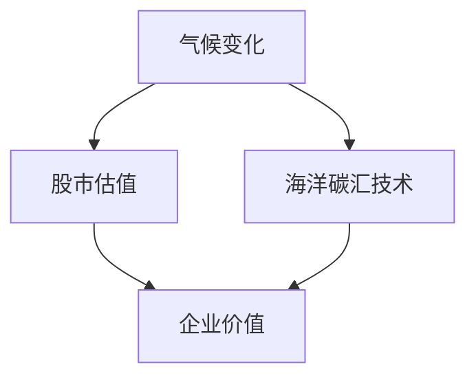
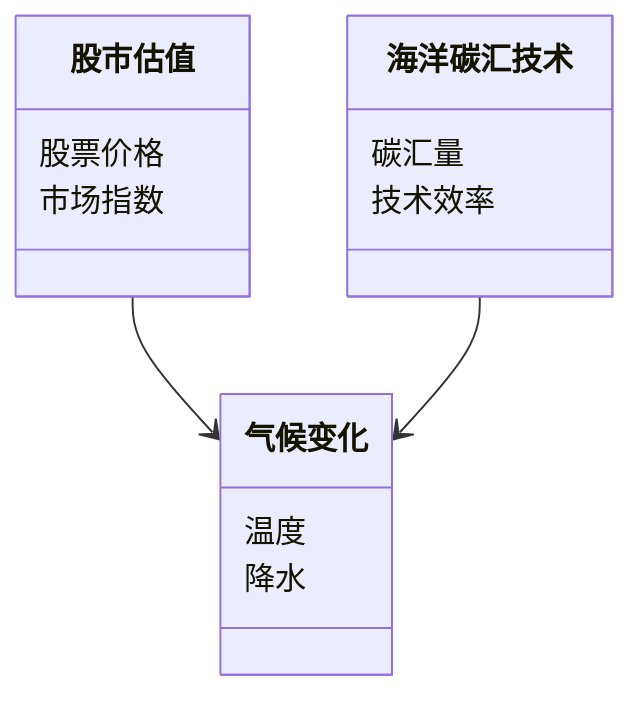
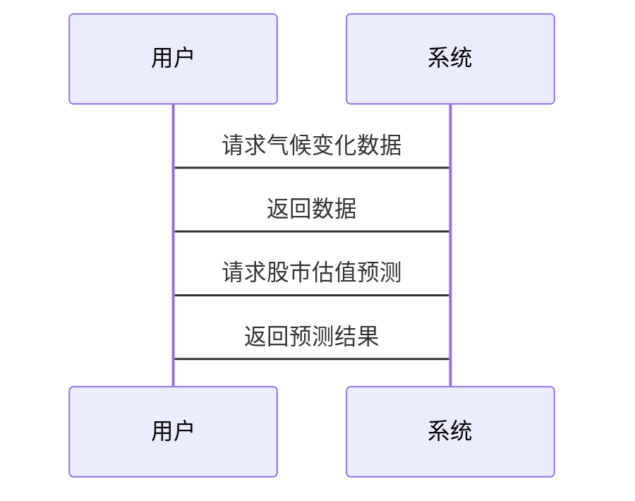

                 


# 全球股市估值与海洋碳汇技术的关系

> 关键词：全球股市估值、海洋碳汇技术、气候变化、可持续发展、技术与经济、算法原理、系统设计

> 摘要：本文探讨全球股市估值与海洋碳汇技术之间的关系，分析两者在气候变化背景下的相互影响，结合技术原理和经济模型，深入探讨其在可持续发展中的潜在应用。

---

# 第一部分: 全球股市估值与海洋碳汇技术的背景介绍

## 第1章: 全球股市估值与海洋碳汇技术的背景介绍

### 1.1 全球股市估值的基本概念
#### 1.1.1 什么是全球股市估值
- 全球股市估值：全球范围内股票市场的整体价值评估，包括上市公司市值、市场指数等。
- 全球股市估值的重要性：反映经济健康状况，指导投资决策，影响货币政策。

#### 1.1.2 全球股市估值的计算方法
- 市值计算：上市公司市值 = 股价 × 总股本。
- 市场指数：如道琼斯指数、标普500、沪深300等，反映整体市场表现。

#### 1.1.3 全球股市估值的重要性
- 经济晴雨表：股市估值反映经济发展状况。
- 投资决策：帮助投资者判断市场趋势和投资机会。
- 宏观调控：政府和央行依据股市估值调整政策。

### 1.2 海洋碳汇技术的核心概念
#### 1.2.1 海洋碳汇的定义
- 海洋碳汇：海洋生物通过光合作用吸收二氧化碳的过程，称为蓝碳机制。
- 海洋碳汇技术：通过工程技术手段增强海洋碳汇能力的技术。

#### 1.2.2 海洋碳汇的主要类型
- 生态系统碳汇：如红树林、海草床、盐沼等自然生态系统。
- 工程化碳汇：如海洋碱化技术、海洋碳封存技术。

#### 1.2.3 海洋碳汇技术的发展现状
- 国际进展：欧盟、美国、中国等在蓝碳技术研究方面取得进展。
- 技术挑战：碳封存的安全性、成本效益、环境影响等。

### 1.3 问题背景与问题描述
#### 1.3.1 全球股市估值与海洋碳汇技术的关联性
- 气候变化对股市的影响：极端天气、政策变化影响企业盈利和股市估值。
- 碳中和目标：海洋碳汇技术成为企业减碳的重要手段，影响企业估值。

#### 1.3.2 当前存在的问题与挑战
- 技术不确定性：海洋碳汇技术的效率和长期稳定性问题。
- 经济可行性：大规模应用的成本与收益平衡问题。
- 政策支持：碳中和政策对企业估值的影响。

#### 1.3.3 研究的必要性与意义
- 理解气候变化与经济的相互作用。
- 为企业投资和政策制定提供参考。
- 推动技术创新和可持续发展。

### 1.4 问题解决与边界外延
#### 1.4.1 解决问题的主要思路
- 研究气候变化对股市的影响。
- 探讨海洋碳汇技术的经济价值。
- 分析两者之间的相互作用。

#### 1.4.2 问题解决的边界与限制
- 数据范围：全球主要股市和典型海洋碳汇项目。
- 时间范围：近十年的气候变化数据和股市数据。
- 技术范围：聚焦海洋碳汇技术的经济影响。

#### 1.4.3 相关概念的外延与扩展
- 气候风险：气候变化对金融市场的系统性风险。
- 碳定价：碳交易市场对企业和股市估值的影响。

### 1.5 核心概念与组成要素
#### 1.5.1 核心概念的结构分析
- 气候变化：驱动因素（温室气体排放、极端天气）。
- 股市估值：市场机制（投资者行为、政策变化）。
- 海洋碳汇技术：技术手段（蓝碳项目、碳封存）。

#### 1.5.2 组成要素的详细说明
- 气候数据：温度、降水、海洋酸化等。
- 股市数据：指数表现、企业盈利、投资者情绪。
- 技术数据：碳汇效率、成本、政策支持。

#### 1.5.3 核心概念之间的关系图


---

# 第二部分: 全球股市估值与海洋碳汇技术的核心概念与联系

## 第2章: 全球股市估值与海洋碳汇技术的核心概念与联系

### 2.1 核心概念原理
#### 2.1.1 全球股市估值的原理
- 市场机制：供需关系决定股价。
- 投资者行为：风险偏好影响投资决策。
- 宏观因素：经济政策、利率、通货膨胀影响股市估值。

#### 2.1.2 海洋碳汇技术的原理
- 生物固碳：海洋植物通过光合作用吸收二氧化碳。
- 化学固碳：通过化学反应将二氧化碳转化为碳酸盐或其他形式。

#### 2.1.3 两者之间的相互作用
- 气候风险：气候变化引发的极端天气影响企业盈利和股市估值。
- 碳中和目标：海洋碳汇技术成为企业减碳的重要手段，影响企业估值。

### 2.2 核心概念属性特征对比
#### 2.2.1 表格对比分析
| 属性 | 全球股市估值 | 海洋碳汇技术 |
|------|-------------|--------------|
| 核心 | 股价、市值 | 碳吸收效率 |
| 影响 | 经济、投资 | 环境、气候 |
| 数据 | 股票价格、交易量 | 海水酸化、碳储量 |

#### 2.2.2 图形化展示


#### 2.2.3 对比结果分析
- 数据驱动：股市估值依赖于金融数据，海洋碳汇依赖于环境数据。
- 影响因素：股市估值受经济政策影响，海洋碳汇受技术进步影响。
- 应用场景：股市估值用于投资决策，海洋碳汇用于减碳行动。

### 2.3 ER实体关系图架构
```mermaid
erd
    企业价值 --> 股市估值
    气候变化 --> 海洋碳汇技术
    海洋碳汇技术 --> 企业价值
```

---

# 第三部分: 全球股市估值与海洋碳汇技术的算法原理

## 第3章: 全球股市估值与海洋碳汇技术的算法原理

### 3.1 算法原理概述
#### 3.1.1 算法的基本思路
- 数据收集：收集全球股市数据和海洋碳汇项目数据。
- 模型构建：建立气候变化对股市的影响模型。
- 预测分析：预测海洋碳汇技术对企业估值的影响。

#### 3.1.2 算法的核心步骤
1. 数据清洗与预处理。
2. 建立回归模型：分析气候变化对股市的影响。
3. 模拟分析：预测海洋碳汇技术的经济价值。

#### 3.1.3 算法的优缺点
- 优点：量化气候变化的经济影响。
- 缺点：模型假设可能简化实际问题。

### 3.2 算法原理的详细讲解
#### 3.2.1 算法的数学模型
- 气候变化对股市的影响模型：
$$ \text{Stock Value} = \beta_0 + \beta_1 \times \text{CO}_2 + \epsilon $$
其中，$\text{CO}_2$为二氧化碳浓度，$\beta_1$为回归系数。

- 海洋碳汇技术的经济价值模型：
$$ \text{Economic Value} = \alpha_0 + \alpha_1 \times \text{Carbon Sequestration} + \delta $$
其中，$\text{Carbon Sequestration}$为碳汇量，$\alpha_1$为回归系数。

#### 3.2.2 算法的实现步骤
1. 数据收集：获取全球股市数据和海洋碳汇项目数据。
2. 数据清洗：处理缺失值和异常值。
3. 模型构建：使用线性回归模型分析气候变化对股市的影响。
4. 模拟分析：预测海洋碳汇技术的经济价值。

#### 3.2.3 算法的代码实现
```python
import pandas as pd
import numpy as np
from sklearn.linear_model import LinearRegression

# 数据加载
df = pd.read_csv('data.csv')

# 数据预处理
X = df[['CO2', 'Climate_Change']]
y = df['Stock_Valuation']

# 模型训练
model = LinearRegression()
model.fit(X, y)

# 预测分析
predicted_valuation = model.predict(X)
```

### 3.3 算法原理的举例说明
#### 3.3.1 典型案例分析
- 案例：假设某企业在实施海洋碳汇技术后，碳汇量增加10%，预测其股票估值将上升5%。

#### 3.3.2 实际应用场景
- 应用：企业利用模型预测碳中和目标对企业估值的影响，制定投资策略。

---

# 第四部分: 全球股市估值与海洋碳汇技术的数学模型

## 第4章: 全球股市估值与海洋碳汇技术的数学模型

### 4.1 数学模型概述
#### 4.1.1 气候变化对股市的影响模型
$$ \text{Stock Value} = \beta_0 + \beta_1 \times \text{CO}_2 + \beta_2 \times \text{Climate_Event} + \epsilon $$

#### 4.1.2 海洋碳汇技术的经济价值模型
$$ \text{Economic Value} = \alpha_0 + \alpha_1 \times \text{Carbon_Sequestration} + \alpha_2 \times \text{Policy_Support} + \delta $$

### 4.2 数学模型的详细推导
#### 4.2.1 气候变化对股市的影响
- 变量定义：
  - $\text{CO}_2$：二氧化碳浓度（单位：ppm）。
  - $\text{Climate_Event}$：极端天气事件的频率（单位：次/年）。
- 回归分析：
$$ \text{Stock Value} = \beta_0 + \beta_1 \times \text{CO}_2 + \beta_2 \times \text{Climate_Event} + \epsilon $$

#### 4.2.2 海洋碳汇技术的经济价值
- 变量定义：
  - $\text{Carbon_Sequestration}$：碳汇量（单位：吨CO2）。
  - $\text{Policy_Support}$：政策支持力度（单位：指数）。
- 回归分析：
$$ \text{Economic Value} = \alpha_0 + \alpha_1 \times \text{Carbon_Sequestration} + \alpha_2 \times \text{Policy_Support} + \delta $$

### 4.3 数学模型的应用与验证
#### 4.3.1 数据验证
- 使用历史数据验证模型的准确性。
- 计算R²值，评估模型的拟合优度。

#### 4.3.2 模拟分析
- 预测不同气候变化情景下的股市估值。
- 分析海洋碳汇技术对企业经济价值的影响。

---

# 第五部分: 全球股市估值与海洋碳汇技术的系统分析与架构设计

## 第5章: 全球股市估值与海洋碳汇技术的系统分析与架构设计

### 5.1 系统分析
#### 5.1.1 问题场景介绍
- 系统目标：分析气候变化对股市的影响，评估海洋碳汇技术的经济价值。
- 问题分析：如何量化气候变化对股市的影响，如何预测海洋碳汇技术的经济价值。

### 5.2 系统架构设计
#### 5.2.1 领域模型


#### 5.2.2 系统架构


### 5.3 接口与交互设计
#### 5.3.1 接口设计
- 数据接口：提供气候变化数据和股市数据的API。
- 模型接口：提供气候变化对股市影响的预测API。

#### 5.3.2 交互设计


---

# 第六部分: 全球股市估值与海洋碳汇技术的项目实战

## 第6章: 全球股市估值与海洋碳汇技术的项目实战

### 6.1 环境安装
#### 6.1.1 安装Python环境
- 安装Python 3.8以上版本。
- 安装必要的库：pandas、numpy、scikit-learn。

#### 6.1.2 数据获取
- 数据来源：公开的气候变化数据和股市数据。

### 6.2 系统核心实现
#### 6.2.1 核心代码实现
```python
import pandas as pd
from sklearn.linear_model import LinearRegression

# 数据加载
df = pd.read_csv('data.csv')

# 数据预处理
X = df[['CO2', 'Climate_Change']]
y = df['Stock_Valuation']

# 模型训练
model = LinearRegression()
model.fit(X, y)

# 预测分析
predicted_valuation = model.predict(X)
```

#### 6.2.2 代码解读与分析
- 数据加载：读取CSV文件中的数据。
- 数据预处理：选择相关特征变量。
- 模型训练：使用线性回归模型训练。
- 预测分析：预测股票估值并进行对比分析。

### 6.3 案例分析
#### 6.3.1 案例介绍
- 案例背景：某企业在实施海洋碳汇技术后，股票估值的变化。

#### 6.3.2 实际分析
- 数据分析：使用模型预测气候变化对企业估值的影响。
- 结果解读：海洋碳汇技术对企业估值的提升作用。

### 6.4 项目小结
#### 6.4.1 项目总结
- 项目目标：量化气候变化对股市的影响，评估海洋碳汇技术的经济价值。
- 项目成果：建立数学模型，验证技术的经济价值。

#### 6.4.2 项目经验
- 数据质量：高质量的数据是模型准确性的关键。
- 模型选择：选择合适的模型对结果影响重大。

---

# 第七部分: 全球股市估值与海洋碳汇技术的总结与展望

## 第7章: 全球股市估值与海洋碳汇技术的总结与展望

### 7.1 总结
#### 7.1.1 核心结论
- 气候变化对股市估值的影响显著。
- 海洋碳汇技术具有潜在的经济价值。

#### 7.1.2 经验与教训
- 数据的重要性：高质量数据是模型准确性的关键。
- 模型的局限性：简化假设可能导致结果偏差。

### 7.2 未来展望
#### 7.2.1 技术发展
- 海洋碳汇技术的进一步研发。
- 更复杂的气候变化模型。

#### 7.2.2 经济影响
- 碳中和目标下的股市变化。
- 可持续投资的趋势。

#### 7.2.3 研究方向
- 气候风险的量化与管理。
- 碳交易市场的经济学研究。

---

# 作者

作者：AI天才研究院/AI Genius Institute & 禅与计算机程序设计艺术 /Zen And The Art of Computer Programming

