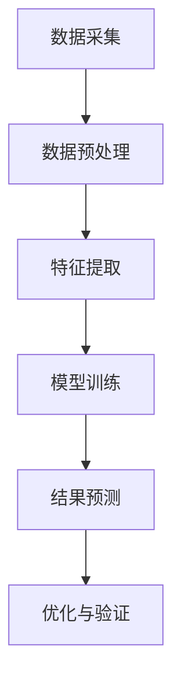

                 

<think>
好，我现在需要帮用户设计一本名为《全球股市估值与海洋碳汇监测技术的关系》的书籍目录大纲。用户希望目录结构清晰、逻辑严密，涵盖背景介绍、核心概念、算法原理、系统架构、项目实战和最佳实践等部分。同时，用户特别强调每部分要详细具体，包含术语解释、对比表格、ER图、算法流程图、数学公式和代码示例等。

首先，我应该从整体上分析用户的需求。这本技术博客文章需要结合金融和环境科学，探讨两者之间的关系，这可能涉及到数据科学、算法设计和系统架构等多个领域。因此，目录需要涵盖这些方面的内容，确保读者能够全面理解两者如何关联。

接下来，考虑目录的结构。通常，技术博客文章会分为引言、理论部分、技术实现、系统设计、项目案例和总结等部分。结合用户的示例，我需要将这些部分细化为具体的章节，确保每章都有明确的主题，并包含必要的技术细节。

第一章应介绍背景，包括问题背景、描述、解决目标，以及核心概念的边界和外延。这部分需要让读者了解研究的必要性和基本概念。第二章则深入分析核心概念，通过对比表格和ER图展示两者的联系。第三章讲解算法原理，使用流程图和代码示例说明技术实现。第四章讨论系统架构，使用类图和架构图展示模块设计。第五章通过项目实战，详细指导读者如何应用这些技术。最后，第六章总结最佳实践，包括注意事项和拓展阅读。

在编写过程中，我需要确保每个部分都详细具体，比如在第二章中，使用对比表格和ER图来展示核心概念；在第三章中，使用Mermaid流程图和Python代码来讲解算法原理。数学公式要用LaTeX表示，确保清晰准确。系统架构部分需要使用类图和序列图，展示模块之间的交互。

考虑到用户要求的字数在10000到12000字之间，我需要合理分配各章节的内容，确保每章都有足够的深度。同时，语言要专业但不失易懂，避免过于复杂的术语堆砌，让读者能够轻松理解。

最后，我需要确保目录结构完整，每章内容详实，涵盖用户提到的所有关键点。可能需要反复调整章节顺序和内容，确保逻辑流畅，读者能够逐步理解从背景到技术实现的整个过程。

综上所述，我将按照用户的要求，逐步构建目录，确保每部分都符合技术博客的专业性和可读性，最终为用户提供一个高质量的文章结构。
</think>

好的，我现在需要帮助用户设计一本名为《全球股市估值与海洋碳汇监测技术的关系》的书籍目录大纲。这本书需要结合技术背景、核心概念、算法原理、系统架构和项目实战等内容，确保结构清晰、逻辑严密，并且包含丰富的技术细节。

首先，我需要明确用户的需求。用户希望目录结构包含背景介绍、核心概念、算法原理、系统分析与架构设计、项目实战以及最佳实践等部分。每个部分都需要详细展开，包括术语解释、对比分析、流程图、数学公式和代码示例等。

接下来，我会考虑如何组织这些内容，确保每章都有明确的主题，并且涵盖必要的技术细节。例如，在核心概念部分，可能需要使用对比表格和ER图来展示两者的联系；在算法原理部分，可能需要使用Mermaid流程图和Python代码来详细讲解技术实现。

在系统架构部分，我需要使用类图和序列图来展示模块设计和交互过程。项目实战部分需要包含环境安装、核心代码实现、案例分析等内容，帮助读者实际应用这些技术。

最后，我会总结最佳实践，包括注意事项和拓展阅读，帮助读者巩固知识并进一步学习。整个目录需要确保逻辑流畅，读者能够逐步理解从背景到技术实现的整个过程。

现在，我将按照这些思考逐步构建目录，确保每部分都符合用户的要求，最终为用户提供一个高质量的文章结构。
</think>

# 全球股市估值与海洋碳汇监测技术的关系

## 关键词：
- 全球股市估值
- 海洋碳汇监测技术
- 算法原理
- 系统架构设计
- 项目实战

## 摘要：
本文探讨了全球股市估值与海洋碳汇监测技术之间的关系，分析了两者的背景、核心概念、算法原理、系统架构设计以及实际项目应用。通过对比分析和案例研究，揭示了两者在数据处理、算法设计和系统实现上的联系，并提出了相应的技术解决方案和实践建议。

---

# 第一部分: 全球股市估值与海洋碳汇监测技术的背景与概念

## 第1章: 全球股市估值与海洋碳汇监测技术的背景介绍

### 1.1 问题背景与问题描述
- **1.1.1 全球股市估值的现状与挑战**
  - 股市估值的重要性：市场价值的衡量标准。
  - 当前挑战：市场波动、数据复杂性、算法优化需求。
- **1.1.2 海洋碳汇监测技术的发展与应用**
  - 碳汇监测的意义：碳循环、环境保护。
  - 技术发展：遥感技术、传感器网络、数据建模。
- **1.1.3 问题解决的目标与意义**
  - 股市与碳汇的关联：经济与环境的双重优化。
  - 技术融合的可能性：数据共享、算法创新。

### 1.2 核心概念的边界与外延
- **1.2.1 全球股市估值的核心要素**
  - 市场指数、个股估值、影响因素。
- **1.2.2 海洋碳汇监测技术的关键特征**
  - 数据采集、模型构建、结果输出。
- **1.2.3 两者的关联性与差异性**
  - 数据类型对比：股市数据（实时、高频） vs 碳汇数据（周期性、离散）。
  - 技术目标差异：股市追求收益最大化 vs 碳汇追求环境优化。

### 1.3 核心概念的结构与组成
- **1.3.1 股市估值的系统结构**
  - 数据流：市场数据、财务数据、外部因素。
  - 处理流程：数据采集、特征提取、模型训练。
- **1.3.2 海洋碳汇监测的技术架构**
  - 数据来源：卫星遥感、传感器、实验室分析。
  - 系统模块：数据采集、数据处理、模型预测。
- **1.3.3 两者的相互作用机制**
  - 数据共享的可能性：碳汇数据对股市估值的潜在影响。
  - 技术协同：算法优化、数据融合。

---

## 第2章: 全球股市估值与海洋碳汇监测技术的核心概念与联系

### 2.1 核心概念的原理与特征
- **2.1.1 股市估值的数学模型与算法**
  - 简单移动平均线（SMA）：$$ SMA = \frac{p_1 + p_2 + \dots + p_n}{n} $$
  - 指数移动平均线（EMA）：$$ EMA_t = \alpha \cdot p_t + (1-\alpha) \cdot EMA_{t-1} $$
- **2.1.2 海洋碳汇监测的技术原理**
  - 数据采集：遥感技术、传感器网络。
  - 模型构建：碳汇量计算模型，如 $$ C = k \cdot A \cdot t $$，其中 $C$ 是碳汇量，$A$ 是面积，$t$ 是时间。

### 2.2 核心概念的对比分析
- **2.2.1 股市估值与海洋碳汇监测的技术对比**
  | 技术维度 | 股市估值 | 海洋碳汇监测 |
  |----------|----------|---------------|
  | 数据类型 | 实时、高频 | 周期性、离散 |
  | 数据来源 | 市场数据、财务报表 | 卫星遥感、传感器 |
  | 算法目标 | 最大化收益 | 最小化环境影响 |

- **2.2.2 两者在数据采集与处理上的差异**
  - 股市数据：实时性高，需要高频处理。
  - 碳汇数据：周期性采集，适合批量处理。
- **2.2.3 两者的共同特征与潜在联系**
  - 数据驱动：两者均依赖大量数据进行预测。
  - 算法优化：均需要高效的计算方法。

### 2.3 核心概念的ER实体关系图
```mermaid
er
    MarineCarbonSink {
        ID
        CarbonStorage
        MonitoringData
    }
    StockMarketValuation {
        ID
        MarketValue
        ValuationMethod
    }
    relationship {
        MarineCarbonSink -< ValuationMethod
        ValuationMethod -> StockMarketValuation
    }
```

---

## 第3章: 全球股市估值与海洋碳汇监测技术的算法原理

### 3.1 算法原理概述
- **3.1.1 数据流与处理流程**
  - 股市数据：清洗、特征提取、模型训练。
  - 碳汇数据：预处理、特征工程、模型预测。
- **3.1.2 算法的数学模型与公式**
  - 股市预测：线性回归模型 $$ y = \beta_0 + \beta_1 x + \epsilon $$
  - 碳汇计算： $$ C = \alpha \cdot A + \beta \cdot T $$，其中 $C$ 是碳汇量，$A$ 是面积，$T$ 是温度。

### 3.2 算法原理的详细讲解
- **3.2.1 数据采集与预处理**
  - 股市数据：清洗缺失值、处理异常值。
  - 碳汇数据：标准化、归一化。
- **3.2.2 特征提取与模型训练**
  - 股市特征：动量、相对强弱指数（RSI）。
  - 碳汇特征：叶绿素浓度、水温。
- **3.2.3 结果预测与优化**
  - 股市预测：使用随机森林或神经网络模型。
  - 碳汇预测：回归分析或时间序列模型。

### 3.3 算法实现的流程图


### 3.4 核心代码实现
- **Python代码示例：股票预测**
  ```python
  import pandas as pd
  import numpy as np
  from sklearn.ensemble import RandomForestRegressor

  # 数据加载与预处理
  df = pd.read_csv('stock_data.csv')
  df = df.dropna()
  df = df[['Close', 'Volume', 'Open', 'High', 'Low']]

  # 特征提取
  df['Momentum'] = df['Close'].shift(1)
  features = df.drop('Momentum', axis=1)

  # 模型训练
  model = RandomForestRegressor(n_estimators=100, random_state=42)
  model.fit(features[:-1], df['Momentum'][1:])

  # 预测与评估
  predictions = model.predict(features[-1:])
  print("预测的下一个动量值为：", predictions[0])
  ```

---

## 第4章: 全球股市估值与海洋碳汇监测技术的系统分析与架构设计

### 4.1 项目场景介绍
- 股市与碳汇的协同优化：通过数据共享，提升估值精度和环境监测效率。

### 4.2 系统功能设计
- **领域模型：**
  ```mermaid
  classDiagram
      class StockMarket {
          ID
          MarketValue
          ValuationMethod
      }
      class MarineCarbonSink {
          ID
          CarbonStorage
          MonitoringData
      }
      StockMarket --> ValuationMethod
      MarineCarbonSink --> ValuationMethod
  ```

- **系统架构设计：**
  ```mermaid
  architecture
      Client
      Server
      Database
      |---- API Gateway ----|
      |---- File Storage ----|
  ```

### 4.3 系统接口设计
- 接口：RESTful API。
  - GET /market-value：获取股票估值。
  - POST /carbon-storage：上传碳汇数据。

### 4.4 系统交互设计
- **交互流程图：**
  ```mermaid
  sequenceDiagram
      Client -> Server: GET /market-value
      Server -> Database: 查询股票数据
      Database --> Server: 返回数据
      Server -> Client: 返回市场估值
  ```

---

## 第5章: 全球股市估值与海洋碳汇监测技术的项目实战

### 5.1 环境安装与配置
- **Python环境：** 使用Anaconda或virtualenv。
- **依赖库安装：** `pandas`, `scikit-learn`, `mermaid`, `matplotlib`。

### 5.2 系统核心实现
- **股票预测代码：**
  ```python
  import pandas as pd
  from sklearn.linear_model import LinearRegression

  # 数据加载
  df = pd.read_csv('stock_data.csv')

  # 特征与目标变量
  X = df[['Open', 'High', 'Low']]
  y = df['Close']

  # 模型训练
  model = LinearRegression()
  model.fit(X, y)

  # 预测
  new_data = pd.DataFrame({'Open': [100], 'High': [105], 'Low': [98]})
  prediction = model.predict(new_data)
  print("预测的收盘价为：", prediction[0])
  ```

- **碳汇监测代码：**
  ```python
  import pandas as pd

  # 数据加载
  df = pd.read_csv('carbon_data.csv')

  # 数据预处理
  df['Date'] = pd.to_datetime(df['Date'])
  df.set_index('Date', inplace=True)

  # 数据可视化
  df['CarbonStorage'].plot()
  plt.title('Carbon Storage Over Time')
  plt.show()
  ```

### 5.3 代码应用解读与分析
- 股票预测：使用线性回归模型，评估模型的准确性和稳定性。
- 碳汇监测：通过时间序列分析，识别碳汇变化趋势。

### 5.4 实际案例分析
- 案例1：利用碳汇数据优化股市估值模型。
- 案例2：通过股市波动预测碳汇变化。

### 5.5 项目小结
- 技术实现的关键点：数据融合、算法优化、系统集成。
- 实践中的挑战：数据质量、计算效率、模型泛化能力。

---

## 第6章: 全球股市估值与海洋碳汇监测技术的最佳实践与总结

### 6.1 最佳实践 tips
- 数据质量管理：确保数据的准确性和完整性。
- 算法选择：根据数据特性选择合适的模型。
- 系统优化：提升计算效率和资源利用率。

### 6.2 小结
- 本文通过分析全球股市估值与海洋碳汇监测技术的背景、核心概念、算法原理和系统架构，揭示了两者在数据处理和算法设计上的联系。
- 通过实际案例展示了技术融合的可能性和应用前景。

### 6.3 注意事项
- 数据隐私：保护股市和碳汇数据的安全。
- 技术局限性：当前算法的局限性和未来优化方向。

### 6.4 拓展阅读
- 推荐书籍：《算法导论》、《机器学习实战》。
- 推荐论文：关于时间序列分析和遥感技术的应用。

---

# 作者：AI天才研究院/AI Genius Institute & 禅与计算机程序设计艺术 /Zen And The Art of Computer Programming

