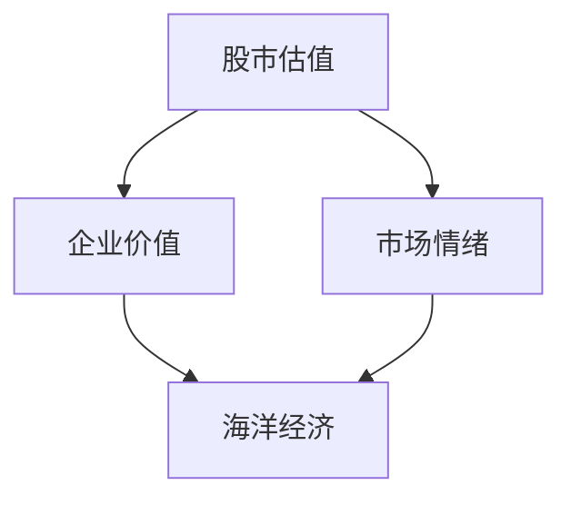
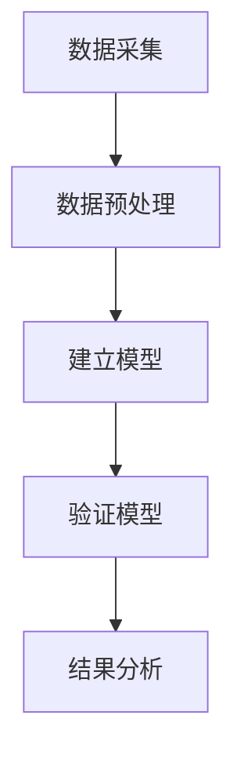
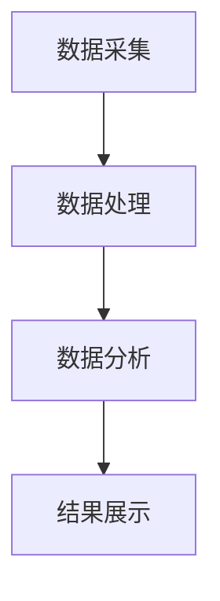

                 


# 全球股市估值与海洋经济开发的关系

**关键词：** 全球股市估值，海洋经济开发，经济关系，算法分析，系统设计，项目实战

**摘要：**  
本文探讨全球股市估值与海洋经济开发之间的关系，从背景介绍、核心概念、算法原理、系统分析到项目实战，详细分析两者如何相互影响，并通过案例展示其实际应用。结合技术方法，本文为读者提供全面的分析框架，帮助理解经济与资源开发的内在联系。

---

## 第一部分：全球股市估值与海洋经济开发的背景与概念

### 第1章：全球股市估值的现状与影响因素

#### 1.1 全球股市估值的定义与现状
- **定义：** 股市估值是衡量企业或市场整体价值的指标，常用P/E比率、市净率等方法。
- **现状：** 全球股市估值受经济政策、市场情绪和技术进步等因素影响，波动较大。
- **影响因素：** 经济指标、企业盈利、政策变化等。

#### 1.2 全球股市估值的现状分析
- **当前趋势：** 疫情后全球经济复苏推动股市估值上升。
- **区域差异：** 发达国家股市估值较高，新兴市场波动较大。

#### 1.3 影响股市估值的主要因素
- **经济指标：** GDP增长率、通胀率等。
- **企业盈利：** 净利润、营业收入等。
- **政策变化：** 货币政策、财政政策等。

### 第2章：海洋经济开发的重要性

#### 2.1 海洋经济的定义与范围
- **定义：** 海洋经济是利用海洋资源进行经济活动的总和，涵盖渔业、能源、交通等领域。
- **范围：** 包括海洋资源开发、海洋运输、海洋旅游等。

#### 2.2 海洋经济与全球经济的关系
- **贡献：** 海洋经济占全球GDP的15%以上，是重要的经济支柱。
- **依赖性：** 海洋经济的发展依赖于技术进步和政策支持。

### 第3章：全球股市估值与海洋经济开发的关系概述

#### 3.1 问题背景与问题描述
- **背景：** 海洋经济的快速发展对股市估值产生重要影响。
- **问题：** 探讨股市估值与海洋经济开发之间的相互作用。

#### 3.2 核心概念与联系
- **核心概念：** 股市估值和海洋经济开发。
- **联系：** 海洋经济的繁荣推动企业盈利增长，进而影响股市估值。

---

## 第二部分：全球股市估值与海洋经济开发的核心概念与联系

### 第4章：核心概念原理

#### 4.1 核心概念原理
- **股市估值计算方法：** P/E比率、市净率。
- **海洋经济评估指标：** 海洋生产总值（GDP）。

#### 4.2 概念属性特征对比表格
| 概念       | 属性           | 特征                               |
|------------|----------------|------------------------------------|
| 股市估值   | 计算方法       | P/E比率、市净率                   |
| 海洋经济   | 开发领域       | 渔业、能源、交通                   |

#### 4.3 ER实体关系图


---

## 第三部分：全球股市估值与海洋经济开发的算法分析

### 第5章：算法原理讲解

#### 5.1 算法选择与原理
- **选择：** 线性回归分析。
- **原理：** 通过数据拟合，建立股市估值与海洋经济开发的关系模型。

#### 5.2 算法流程图


#### 5.3 数学模型与公式
- **线性回归方程：**  
  $$y = a + bx + \epsilon$$  
  其中，y为股市估值，x为海洋经济指标，a为截距，b为回归系数。

#### 5.4 代码实现
```python
import numpy as np
import pandas as pd
from sklearn.linear_model import LinearRegression

# 数据加载
data = pd.read_csv('data.csv')

# 模型训练
model = LinearRegression()
model.fit(data[['海洋经济指标']], data['股市估值'])

# 预测结果
print(model.predict([[200]]))
```

---

## 第四部分：全球股市估值与海洋经济开发的系统分析

### 第6章：系统分析与架构设计

#### 6.1 问题场景介绍
- **目标：** 分析股市估值与海洋经济开发的关系。
- **数据来源：** 全球股市数据与海洋经济数据。

#### 6.2 系统功能设计
- **数据采集模块：** 收集股市估值和海洋经济数据。
- **数据分析模块：** 进行回归分析，建立关系模型。

#### 6.3 系统架构图


---

## 第五部分：全球股市估值与海洋经济开发的项目实战

### 第7章：项目实战与案例分析

#### 7.1 项目环境与数据安装
- **环境：** Python 3.8及以上版本。
- **数据来源：** 全球股市数据与海洋经济数据。

#### 7.2 系统核心实现源代码
```python
import numpy as np
import pandas as pd
from sklearn.linear_model import LinearRegression
import matplotlib.pyplot as plt

# 数据加载
data = pd.read_csv('data.csv')

# 模型训练
model = LinearRegression()
model.fit(data[['海洋经济指标']], data['股市估值'])

# 可视化
plt.scatter(data['海洋经济指标'], data['股市估值'])
plt.plot(data['海洋经济指标'], model.predict(data[['海洋经济指标']]), color='red')
plt.xlabel('海洋经济指标')
plt.ylabel('股市估值')
plt.show()
```

#### 7.3 实际案例分析
- **案例：** 某国家海洋经济指标上升，股市估值随之增长。

---

## 第六部分：全球股市估值与海洋经济开发的总结与展望

### 第8章：总结与展望

#### 8.1 总结
- **核心观点：** 海洋经济开发对股市估值有显著影响。
- **技术方法：** 线性回归分析有效揭示两者关系。

#### 8.2 未来展望
- **研究方向：** 更复杂的模型，如机器学习算法。
- **应用领域：** 政策制定与投资决策。

---

**作者：AI天才研究院（AI Genius Institute） & 禅与计算机程序设计艺术（Zen And The Art of Computer Programming）**

