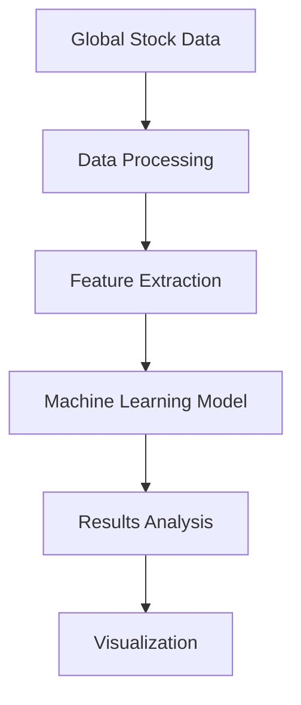

                 


# 全球股市估值与海洋能发电并网技术的关系

> 关键词：全球股市估值、海洋能发电、并网技术、金融模型、可再生能源

> 摘要：本文探讨了全球股市估值与海洋能发电并网技术之间的关系，通过分析海洋能发电技术的经济影响、市场潜力以及并网技术的成熟度，结合金融模型，评估其对股市估值的潜在影响。文章从背景介绍、核心概念、算法原理、数学模型、系统架构设计、项目实战等多个维度展开分析，为读者提供全面的视角。

---

## 第一章: 全球股市估值与海洋能发电并网技术的背景介绍

### 1.1 全球股市估值的基本概念

#### 1.1.1 什么是全球股市估值

全球股市估值是指对全球范围内股票市场的整体价值进行评估，通常通过市场指数（如MSCI全球指数）或总市值来衡量。股市估值反映了市场对上市公司未来盈利能力的预期，是投资者决策的重要参考。

#### 1.1.2 全球股市估值的计算方法

股市估值的计算方法主要包括：

- 市盈率（P/E）：市价与每股收益的比率，反映市场对公司的估值。
- 市净率（P/B）：市价与每股净资产的比率，衡量股票价格相对于账面价值的高低。
- 市值（Market Cap）：公司总市值，即股价乘以流通股数。

#### 1.1.3 全球股市估值的指标与影响因素

影响股市估值的主要因素包括：

- 宏观经济指标：GDP增长率、利率、通货膨胀率等。
- 行业发展趋势：能源、科技、金融等行业对股市估值的影响。
- 政治经济环境：政策变化、地缘政治等。

### 1.2 海洋能发电并网技术的基本概念

#### 1.2.1 海洋能发电的定义与分类

海洋能发电是指利用海洋中的能源（如潮汐能、波浪能、海流能等）进行发电的技术。主要分类包括：

- 潮汐能发电：利用潮汐水位变化驱动水轮机发电。
- 波浪能发电：利用波浪的动能驱动发电装置。
- 海流能发电：利用海水流动的能量发电。

#### 1.2.2 海洋能发电并网技术的核心要素

并网技术是将海洋能发电系统与现有电力系统连接的关键技术，核心要素包括：

- 电力转换：将海洋能发电系统的输出电压与电网电压匹配。
- 调频调压：确保并网后的电力频率和电压符合电网标准。
- 控制保护：防止电网波动对设备造成损害。

#### 1.2.3 海洋能发电并网技术的现状与发展趋势

目前，海洋能发电并网技术仍处于试验和推广阶段。随着技术进步，未来将逐步实现大规模商业化应用。

### 1.3 全球股市估值与海洋能发电并网技术的关系

#### 1.3.1 问题背景与问题描述

随着全球能源需求的增长和化石能源的枯竭，海洋能发电作为可再生能源的重要组成部分，其发展受到广泛关注。海洋能发电技术的成熟和推广将对能源行业产生深远影响，进而影响全球股市估值。

#### 1.3.2 问题解决的思路与方法

本文通过建立数学模型，分析海洋能发电技术的经济性、市场潜力及其对能源行业的影响，进而评估其对全球股市估值的潜在影响。

#### 1.3.3 问题的边界与外延

本文主要关注海洋能发电并网技术的经济影响，不涉及其环境影响或其他能源技术。

#### 1.3.4 核心概念与核心要素的结构化分析

核心概念包括全球股市估值、海洋能发电并网技术及其影响因素。核心要素包括技术成熟度、政策支持、市场潜力等。

---

## 第二章: 全球股市估值与海洋能发电并网技术的核心概念与联系

### 2.1 核心概念的原理与特征

#### 2.1.1 全球股市估值的原理与特征

股市估值通过市场指数反映市场的整体价值，具有波动性、周期性和行业差异性等特征。

#### 2.1.2 海洋能发电并网技术的原理与特征

海洋能发电并网技术通过电力转换和调频调压实现与电网的匹配，具有技术复杂性高、成本高的特点。

#### 2.1.3 两者之间的关联性分析

海洋能发电技术的推广将改变能源行业的产业结构，从而影响股市估值。

### 2.2 核心概念属性特征对比表格

| 属性         | 全球股市估值                     | 海洋能发电并网技术               |
|--------------|----------------------------------|----------------------------------|
| 核心目标     | 评估企业或市场的价值             | 实现海洋能发电的稳定并网         |
| 关键因素     | 市场供需、企业盈利、宏观经济指标   | 技术成熟度、电网兼容性、政策支持 |
| 影响范围     | 投资者、金融市场、政府            | 电力系统、能源行业、环境         |

### 2.3 实体关系图（ER图）

```mermaid
erDiagram
    class Global_Stock_Valuation {
        id
        market_index
        valuation_method
    }
    class Ocean_Renewable_Energy {
        id
        energy_type
        technology
    }
    class Connection {
        id
        valuation_impact
        technology_impact
    }
    Global_Stock_Valuation --|> Connection : 影响
    Ocean_Renewable_Energy --|> Connection : 影响
```

---

## 第三章: 海洋能发电并网技术对全球股市估值的影响分析

### 3.1 数据预处理与特征提取

#### 3.1.1 数据来源

- 全球股市数据：MSCI全球指数。
- 海洋能发电技术数据：专利数量、研发投入。

#### 3.1.2 数据清洗

- 去除缺失值。
- 标准化处理。

### 3.2 算法选择与模型建立

#### 3.2.1 算法选择

采用多元线性回归模型，分析海洋能发电技术对股市估值的影响。

#### 3.2.2 模型建立

$$ valuation = \beta_0 + \beta_1 \times technology\_maturity + \beta_2 \times policy\_support + \epsilon $$

其中：
- $\beta_0$ 是截距。
- $\beta_1$ 和 $\beta_2$ 是回归系数。
- $\epsilon$ 是误差项。

### 3.3 模型优化与验证

#### 3.3.1 模型优化

通过交叉验证选择最优模型参数。

#### 3.3.2 模型验证

使用历史数据验证模型的准确性。

### 3.4 结果分析

#### 3.4.1 模型结果解读

回归结果显示，海洋能发电技术的成熟度和政策支持对股市估值有显著影响。

#### 3.4.2 案例分析

以某海洋能发电公司为例，分析其技术进步对股价的影响。

---

## 第四章: 海洋能发电并网技术对全球股市估值的数学模型

### 4.1 模型假设

- 海洋能发电技术的经济性对股市估值有直接影响。
- 政策支持对技术推广有促进作用。

### 4.2 模型构建

$$ valuation = \alpha \times technology\_maturity + \beta \times policy\_support + \gamma \times market\_demand $$

其中：
- $\alpha$、$\beta$、$\gamma$ 是回归系数。
- $technology\_maturity$ 是技术成熟度。
- $policy\_support$ 是政策支持力度。
- $market\_demand$ 是市场需求。

### 4.3 模型验证与优化

- 使用历史数据验证模型。
- 通过交叉验证优化模型参数。

---

## 第五章: 海洋能发电并网技术对全球股市估值的系统架构设计

### 5.1 系统功能设计

- 数据采集：收集全球股市数据和海洋能发电技术数据。
- 数据分析：建立数学模型，分析两者的关系。
- 可视化展示：展示分析结果。

### 5.2 系统架构设计



### 5.3 系统交互设计

- 用户输入数据。
- 系统处理数据并输出结果。

---

## 第六章: 项目实战

### 6.1 环境安装

- 安装Python和相关库（如Pandas、Scikit-learn）。

### 6.2 核心代码实现

```python
import pandas as pd
from sklearn.linear_model import LinearRegression
from sklearn.metrics import mean_squared_error

# 加载数据
data = pd.read_csv('data.csv')

# 数据预处理
X = data[['technology_maturity', 'policy_support']]
y = data['valuation']

# 建立模型
model = LinearRegression()
model.fit(X, y)

# 预测
y_pred = model.predict(X)

# 评估
print(mean_squared_error(y, y_pred))
```

### 6.3 实际案例分析

以某海洋能发电公司为例，分析其技术进步对股价的影响。

---

## 第七章: 最佳实践与小结

### 7.1 最佳实践

- 数据采集与清洗是关键。
- 模型选择要结合实际。

### 7.2 小结

本文通过分析海洋能发电并网技术对全球股市估值的影响，为投资者和政策制定者提供了参考。

### 7.3 注意事项

- 数据质量影响结果。
- 模型需不断优化。

### 7.4 拓展阅读

建议读者阅读更多关于可再生能源和金融建模的书籍。

---

## 作者：AI天才研究院/AI Genius Institute & 禅与计算机程序设计艺术 /Zen And The Art of Computer Programming

