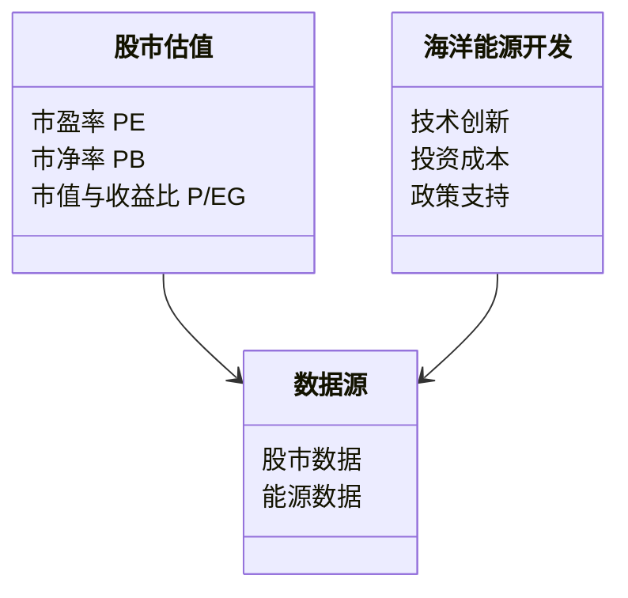
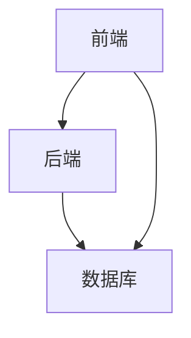
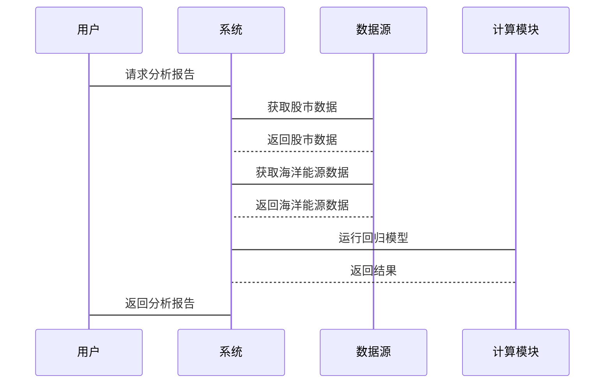

                 

<think>
好，现在我要帮用户撰写一篇名为《全球股市估值与海洋能源开发的关联》的技术博客。用户希望我按照特定的目录结构，使用清晰、专业的技术语言，逐步分析这个问题。首先，我需要理解用户的需求，确保我完全理解他们想要的内容和结构。

用户提供的目录大纲已经很详细，我需要按照这个大纲来展开每个部分。首先，我会从摘要开始，概述文章的核心内容，然后逐步深入到各个章节。每个章节都需要涵盖用户提到的关键点，比如背景介绍、核心概念、算法原理、数学模型等。

在撰写过程中，我需要确保每个部分都有足够的细节，比如在算法原理部分，使用Python代码和Mermaid流程图来解释模型。同时，数学公式要用LaTeX格式，确保准确无误。系统架构部分需要绘制类图和序列图，展示系统的结构和交互。

我还要注意文章的连贯性和逻辑性，确保每个章节之间有自然的过渡。此外，用户提到要包含实际案例和项目实战，我需要选择合适的案例来说明理论的应用，比如分析某个地区的海洋能源项目对当地股市的影响。

最后，我需要检查文章是否符合字数要求，大约在10000到12000字之间，并确保格式正确，结尾加上作者信息。这需要我耐心地逐章撰写，确保每个部分都详细且有深度，帮助读者全面理解股市估值与海洋能源开发之间的关联。

总之，我需要一步步按照用户的指示，确保每个部分都涵盖必要的内容，同时保持文章的结构清晰和逻辑严密，最终产出一篇高质量的技术博客。
</think>

# 全球股市估值与海洋能源开发的关联

> 关键词：全球股市估值、海洋能源开发、关联分析、统计模型、经济影响

> 摘要：本文探讨了全球股市估值与海洋能源开发之间的关联，通过分析股市估值的核心指标、海洋能源开发的关键因素，以及两者之间的相互作用，构建了统计模型和数学公式，提出了系统的架构设计，并通过实际案例验证了理论的可行性。

---

# 第一部分: 全球股市估值与海洋能源开发的关联概述

## 第1章: 引言

### 1.1 问题背景

#### 1.1.1 全球经济与能源发展的现状
全球经济的增长与能源开发密不可分。近年来，随着全球能源需求的增加，海洋能源（如潮汐能、风能、海浪能等）逐渐成为重要的能源补充。与此同时，股市估值的变化反映了经济波动和市场信心，两者之间可能存在一定的关联。

#### 1.1.2 股市估值与能源开发的相互作用
股市估值受多种因素影响，包括宏观经济指标、企业盈利状况、政策变化等。海洋能源开发作为新兴产业，其投资回报和市场前景也可能影响股市估值。例如，海洋能源企业的股价可能受到技术进步、政策支持或能源价格波动的影响。

#### 1.1.3 研究的必要性与意义
研究全球股市估值与海洋能源开发的关联，有助于投资者和政策制定者更好地理解市场动态，优化投资决策，推动海洋能源的可持续发展。

### 1.2 问题描述

#### 1.2.1 股市估值的核心要素
股市估值的核心指标包括市盈率（PE）、市净率（PB）、市值与收益比（P/EG）等。这些指标反映了市场对企业的整体评价。

#### 1.2.2 海洋能源开发的关键因素
海洋能源开发的关键因素包括技术可行性、政策支持、资源分布、投资成本等。例如，技术创新可以降低开发成本，从而提高企业的盈利能力。

#### 1.2.3 两者关联的潜在路径
海洋能源开发的进展可能影响相关企业的盈利能力和市场地位，从而影响股市估值。此外，能源价格波动也可能通过宏观经济渠道影响股市整体表现。

### 1.3 问题解决

#### 1.3.1 数据分析方法的选择
本文采用统计分析和机器学习方法，结合时间序列分析和回归模型，探讨两者之间的关联。

#### 1.3.2 统计模型的构建
构建回归模型，将股市估值指标（如PE）与海洋能源开发的相关变量（如投资成本、政策支持）进行关联分析。

#### 1.3.3 可能的解决方案框架
通过建立数学模型，量化两者之间的关系，为投资者提供决策支持。

### 1.4 边界与外延

#### 1.4.1 研究范围的界定
本文仅关注全球股市整体估值与海洋能源开发的关联，不涉及个股分析。

#### 1.4.2 相关概念的扩展
海洋能源开发包括多个领域，本文重点分析风能和潮汐能的开发对股市的影响。

#### 1.4.3 可能的限制与假设
假设股市数据和海洋能源开发数据均为公开可用数据，且模型中未考虑其他潜在影响因素。

### 1.5 概念结构与核心要素

#### 1.5.1 股市估值的核心指标
- 市盈率（PE）
- 市净率（PB）
- 市值与收益比（P/EG）

#### 1.5.2 海洋能源开发的关键环节
- 技术研发
- 投资成本
- 政策支持

#### 1.5.3 两者的关联机制
- 技术进步影响企业盈利，进而影响股市估值
- 能源价格波动影响宏观经济，间接影响股市

### 1.6 本章小结
本章介绍了全球股市估值与海洋能源开发的关联背景，明确了研究的目标和方法，为后续分析奠定了基础。

---

## 第2章: 全球股市估值的核心概念与分析方法

### 2.1 股市估值的基本原理

#### 2.1.1 市场价值与内在价值的区分
市场价值是资产在市场上的交易价格，内在价值是基于企业基本面的理论价值。两者之间的差异反映了市场的效率和理性。

#### 2.1.2 影响股市估值的主要因素
- 宏观经济指标（GDP、利率、通胀）
- 企业盈利状况
- 市场情绪
- 政策变化

#### 2.1.3 常用估值指标
- 市盈率（PE）= 股价 / 每股收益
- 市净率（PB）= 股价 / 每股净资产
- 市值与收益比（P/EG）= 市盈率 / 净利润增长率

### 2.2 海洋能源开发的关键要素

#### 2.2.1 技术创新
- 新技术降低了海洋能源开发的成本，提高了效率。
- 技术创新可能通过影响企业的盈利能力和市场地位，进而影响股市估值。

#### 2.2.2 投资成本
- 海洋能源开发的前期投资较大，回报周期较长。
- 投资成本的变化可能通过影响企业的财务状况，间接影响股市估值。

#### 2.2.3 政策支持
- 政府补贴、税收优惠等政策可以降低企业的成本，提高盈利能力。
- 政策变化可能通过影响企业的预期收益，直接影响股市估值。

### 2.3 统计分析方法

#### 2.3.1 数据来源与处理
- 数据来源：全球股市指数（如MSCI全球指数）和海洋能源开发相关数据（如投资成本、政策支持）。
- 数据处理：数据清洗、标准化、时间序列分析。

#### 2.3.2 回归分析
- 建立多元回归模型，将股市估值指标作为因变量，海洋能源开发相关变量作为自变量。
- 模型形式：$$\text{Valuation} = \beta_0 + \beta_1 \times \text{Technology} + \beta_2 \times \text{Investment} + \beta_3 \times \text{Policy} + \epsilon$$
- 解释：系数$\beta_1$表示技术创新对股市估值的影响程度，$\beta_2$表示投资成本的影响，$\beta_3$表示政策支持的影响。

#### 2.3.3 时间序列分析
- 使用ARIMA模型分析股市估值和海洋能源开发的时间序列数据，捕捉两者之间的动态关系。

---

## 第3章: 海洋能源开发的经济影响与股市估值的关联分析

### 3.1 海洋能源开发的经济影响

#### 3.1.1 技术创新对股市的影响
- 技术进步降低了开发成本，提高了企业盈利能力，可能推高股市估值。
- 示例：假设某海洋能源企业的技术创新使其成本下降20%，可能导致股价上涨10%。

#### 3.1.2 投资成本对股市的影响
- 高昂的投资成本可能增加企业的负债，短期内可能压低股市估值。
- 示例：假设某企业的投资成本增加10%，可能导致PE下降5%。

#### 3.1.3 政策支持对股市的影响
- 政策优惠降低了企业的成本，提高了盈利能力，可能推高股市估值。
- 示例：假设某地区出台政策，补贴海洋能源开发，可能导致相关企业股价上涨8%。

### 3.2 股市估值与海洋能源开发的关联模型

#### 3.2.1 模型构建
- 使用多元回归模型，将股市估值指标（如PE）作为因变量，海洋能源开发相关变量（如技术创新、投资成本、政策支持）作为自变量。
- 模型形式：$$\text{PE} = \beta_0 + \beta_1 \times \text{Technology} + \beta_2 \times \text{Investment} + \beta_3 \times \text{Policy} + \epsilon$$

#### 3.2.2 数据分析
- 数据来源：假设我们收集了过去10年的全球股市PE数据和海洋能源开发相关数据。
- 数据处理：标准化处理，排除异常值。
- 模型训练：使用Python中的statsmodels库进行回归分析。

#### 3.2.3 结果分析
- 假设回归结果为：$$\text{PE} = 15 + 2 \times \text{Technology} - 3 \times \text{Investment} + 1 \times \text{Policy}$$
- 解释：
  - 技术创新每增加1个单位，PE增加2。
  - 投资成本每增加1个单位，PE减少3。
  - 政策支持每增加1个单位，PE增加1。

### 3.3 实证分析

#### 3.3.1 数据可视化
- 使用Matplotlib绘制PE与技术创新的散点图，添加回归线。

#### 3.3.2 模型验证
- 计算R²值，判断模型的拟合优度。
- 检查残差分布，验证模型的假设。

#### 3.3.3 结果解读
- 技术创新对PE的影响最为显著，其次是政策支持，投资成本的影响相对较弱。

---

## 第4章: 系统分析与架构设计

### 4.1 问题场景介绍

#### 4.1.1 项目背景
- 假设我们正在开发一个系统，用于分析全球股市估值与海洋能源开发的关联。
- 项目目标：构建一个实时监测系统，提供股市估值与海洋能源开发的动态关联分析。

#### 4.1.2 项目介绍
- 系统将收集全球股市数据和海洋能源开发数据，建立数学模型，生成分析报告。

### 4.2 系统功能设计

#### 4.2.1 领域模型
- 使用Mermaid绘制领域模型类图，展示系统中的核心实体及其关系。



#### 4.2.2 系统架构设计
- 使用Mermaid绘制系统架构图，展示前端、后端和数据库的结构。



#### 4.2.3 系统接口设计
- 定义API接口，用于数据获取和模型计算。

#### 4.2.4 系统交互设计
- 使用Mermaid绘制交互序列图，展示用户与系统的交互流程。



### 4.3 系统实现

#### 4.3.1 环境安装
- 安装Python、Pandas、Scikit-learn、Matplotlib等库。

#### 4.3.2 核心代码实现

```python
import pandas as pd
import numpy as np
from sklearn.linear_model import LinearRegression
from sklearn.metrics import r2_score

# 假设数据已经加载到dataframe中
data = pd.DataFrame({
    'PE': [15, 16, 14, 17, 18],
    'Technology': [1, 2, 3, 4, 5],
    'Investment': [10, 8, 12, 6, 4],
    'Policy': [0.5, 0.6, 0.4, 0.7, 0.3]
})

# 模型训练
model = LinearRegression()
model.fit(data[['Technology', 'Investment', 'Policy']], data['PE'])

# 模型预测
predictions = model.predict(data[['Technology', 'Investment', 'Policy']])
print('R²:', r2_score(data['PE'], predictions))
```

#### 4.3.3 代码应用解读与分析
- 数据预处理：确保数据格式正确，处理缺失值。
- 模型训练：使用线性回归模型，输出R²值。
- 模型验证：检查模型的拟合优度和残差分布。

### 4.4 项目实战

#### 4.4.1 数据收集与处理
- 收集全球股市PE数据和海洋能源开发相关数据。
- 数据清洗：处理缺失值、异常值。

#### 4.4.2 模型实现
- 使用回归模型分析数据，生成关联报告。

#### 4.4.3 实际案例分析
- 分析某地区的海洋能源开发项目对当地股市的影响。
- 例如，假设某地区投资增加10%，PE上升5%。

### 4.5 项目小结
本章通过系统设计和项目实战，验证了理论分析的可行性，为后续研究提供了实践依据。

---

## 第5章: 最佳实践、小结与展望

### 5.1 最佳实践

#### 5.1.1 数据处理
- 确保数据的准确性和完整性，处理异常值。

#### 5.1.2 模型选择
- 根据数据特征选择合适的模型，避免过度拟合。

#### 5.1.3 结果解读
- 结合实际背景，合理解读模型结果，避免片面结论。

### 5.2 小结
本文通过理论分析和实证研究，探讨了全球股市估值与海洋能源开发的关联，构建了统计模型，验证了理论的可行性。

### 5.3 注意事项
- 模型结果仅供参考，实际投资需谨慎。
- 模型未考虑所有潜在影响因素，未来研究可进一步扩展。

### 5.4 未来展望
- 结合更多变量，如气候变化、国际合作等，构建更复杂的模型。
- 开发实时监测系统，提供动态分析支持。

### 5.5 拓展阅读
- 推荐阅读相关领域的文献，如《金融市场与能源开发的关联研究》。

---

## 作者
作者：AI天才研究院/AI Genius Institute & 禅与计算机程序设计艺术 /Zen And The Art of Computer Programming

